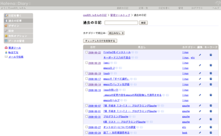

{"title":"firefox3をインストール","date":"2008-06-23T04:23:03+09:00","tags":["linux"]}

<!-- DATE: 2008-06-22T19:23:03+00:00 -->
<!-- OLDURL: http://d.hatena.ne.jp/cou929_la/20080622/ -->

最近インストールしたcentos5のfirefoxが、デフォルトでバージョン1.5だったので、バージョン3をインストールしました。

まず、<a href="http://mozilla.jp/firefox/" target="_blank">http://mozilla.jp/firefox/</a>からfirefoxをダウンロード、展開します。

<pre>
$ tar -xf firefox-3.0.tar.bz2
</pre>

firefoxというディレクトリに展開されるので、それを適切な位置に移動させます。僕の環境では従来のfirefoxが/usr/lib64/下にあったので、そこに移動しました。

<pre>
$ mv /usr/lib64/ ./firefox
</pre>

次に/usr/binの下にシンボリックリンクを作ります。まずもともとあったfirefoxを消します。

<pre>
$ sudo rm /usr/bin/firefox
</pre>

その後シンボリックリンクを作ります。

<pre>
$ sudo ln -s /usr/lib64/firefox/firefox /usr/bin/firefox
</pre>

これで完了です。端末にfirefoxと打つと起動するはずです。

 

ちなみにfirefox3の感想ですが、体感速度はとても早いです。ただはてなダイアリーの設定画面で、サイドバーとメインの部分との間に変なスペースができちゃってます。

まだ使いはじめたばかりなのでわかりませんが、他にもスタイル崩れが起きているサイトがあるかもしれませんね。

あとアドオンに関して、僕の環境ではGreasemonkeyとテキストリンクは特になにもせずにそのまま使えています。Google Toolbarは自動でアップデート情報を検索してくれて、バージョン3用のものをワンクリックでダウンロードできました。そのほかのアドオンは自分で対応する必要があるようです。

<h2>キーボード入力の不具合</h2>

「'」と「"」が印字されているキーと、「~」と「`」が印字されているキーの合計2つのキーについて、何故か2回キーを押さないと入力されないという不具合がありました。キーボードはPFUのhhk lite2 英語配列です。

  
  

    
<a href="http://www.amazon.co.jp/dp/B0000U1DJ2/?tag=hatena_st1-22&ascsubtag=d-1ar3n">PFU Happy Hacking Keyboard Lite2 英語配列 USBキーボード ブラック PD-KB200B/U</a>

    <ul>
      
      <li>出版社/メーカー: <a href="http://d.hatena.ne.jp/keyword/PFU" class="keyword">PFU</a></li>
      
      <li>発売日: 2001/08/01</li>
                                                      <li>メディア: Personal Computers</li>
      <li>購入: 2人 クリック: 185回</li>
      <li><a href="http://d.hatena.ne.jp/asin/B0000U1DJ2" target="_blank">この商品を含むブログ (30件) を見る</a></li>
    </ul>
  

  

キーボードの種類を「英語 (U.S. インターナショナル)」から「英語 (アメリカ合衆国)」に変更すると直りました。原因がよくわかりません。

