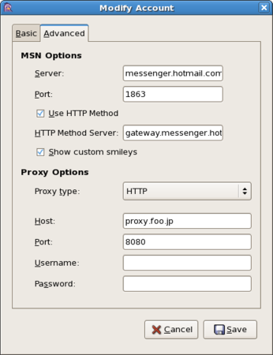

{"title":"pidginいれた。msn messengerをproxy越しにつかう。","date":"2008-10-17T04:50:01+09:00","tags":["linux"]}

<!-- DATE: 2008-10-16T19:50:01+00:00 -->
<!-- OLDURL: http://d.hatena.ne.jp/cou929_la/20081016/ -->

研究室のpcに pidgin を導入しました。

<a href="http://www.pidgin.im/" target="_blank">Home | Pidgin</a>

<a href="http://www.geocities.jp/maple4estry/gaim.html" target="_blank">適当メモ - maple4estry - >> Pidgin for Windows でいろいろなメッセンジャーを便利に使う</a>

pidgin は、インスタントメッセンジャーのクライアントです。msn や yahoo をはじめ、gtalk などたくさんのクライアントに対応していて便利です。

ハトのキャラクターが微妙な感じでいいです。

<h4>インストール</h4>

上記オフィシャルサイトから、 pidgin.repo をダウンロードして、/etc/yum.repos.d/ にいれて、yum install pidgin とかやればおっけーです。

<h4>proxyごしにmsn メッセンジャーを使う</h4>

研究室のpcは、学科のプロクシサーバごしに外のネットに接続しています。なので、普通にID・パスワードなどのアカウント情報を設定した後、

Accounts -> （設定したアカウントを選んで）Modify -> Advanced

の順にすすみ、ここの「Use HTTP Method」にチェックを入れ、そのしたの「Proxy Options」欄で、「Proxy type」を「HTTP」に、「Host」と「Port」をそれぞれ任意のものに設定します。これでつながるはずです。

