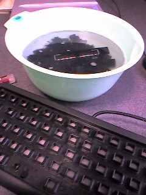

{"title":"hhkを掃除","date":"2009-02-16T08:50:46+09:00","tags":["etc"]}

<!-- DATE: 2009-02-15T23:50:46+00:00 -->
<!-- OLDURL: http://d.hatena.ne.jp/cou929_la/20090215/ -->

hhkに野菜ジュースをこぼしてしまったので、キーを取り外して水洗いしました。

<ol>
<li>キーをはずす。薄い板状のもので、てこの原理ではずれます。</li>
<li>ぬるま湯に洗剤を入れたものを用意し、はずしたキーをいれる。</li>
<li>本体の方を掃除。ぞうきんと綿棒でふきました。</li>
<li>キーをとりだしてキッチンペーパーの上におく。一つ一つ拭く。細かいところは綿棒で。</li>
<li>元に戻す。</li>
</ol>

キーボードは定期的に水洗いするといいですね。

<h4>参考</h4>

<ul>
<li><a href="http://qune.cside.com/archives/000917.html" target="_blank">qune: 今週の週末あれこれ - HHK お掃除写真</a></li>
<li><a href="http://blog.tertes.com/2006/02/hhk.html" target="_blank">HHKを掃除 (TERTES’s Blog)</a></li>
</ul>

