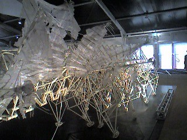

{"title":"テオ・ヤンセン展","date":"2009-02-23T07:05:32+09:00","tags":["etc"]}

<!-- DATE: 2009-02-22T22:05:32+00:00 -->
<!-- OLDURL: http://d.hatena.ne.jp/cou929_la/20090222/ -->

<a href="http://www.hibiya-patio.jp/theo/" target="_blank">-Theo Jansen- テオ・ヤンセン展 公式HP</a>

テオ･ヤンセン展みてきました。ほねほねのやつが風の力で、妙にリアルに歩くやつです。

<object width="425" height="336"><param name="movie" value="http://www.youtube.com/v/WcR7U2tuNoY"></param><param name="wmode" value="transparent"></param><embed src="http://www.youtube.com/v/WcR7U2tuNoY" type="application/x-shockwave-flash" wmode="transparent" width="425" height="336" FlashVars="movie_url=http://d.hatena.ne.jp/video/youtube/WcR7U2tuNoY"></embed></object>

おもしろかったです。関節のうごきのリアルさが売りで、あとはただ風をうけて動いているだけかなと思っていたんですが、じっさいはもっと複雑なこともできるようになっていました。たとえば、最新作であるAnimaris Modularius（アニマリス・モデュラリウス）は、

<ul>
<li>風をペットボトルに貯蔵し、それを使って風のないときでも動作する機能(生物でいうと、たべものを食べて身体にエネルギーとしてためておくことに相当)</li>
<li>感覚器官。水や障害物を感知し、避ける機能。</li>
<li>そのほか、風に飛ばされないようにする機能や、方向転換する機能。</li>
</ul>

といった具合に、ただ生き物っぽく歩くだけではなく、エネルギーをためたり、危険を避けるために知覚するなど、生物としてのいくつかの機能も実装されていて、とても驚きました。

見ているとだんだん生き物っぽく見えてくるのも、興味深い現象でした。動いている作品は生きているみたいにみえるし、こわれて動かなくなった初期の作品は、ほんとに死んでいるみたいに見えてきます。これらの生物はただ単にプラスチックだし、それに風が吹いて動くだけなのですが、その動き・ふるまいが生物っぽいと、ほんとうに生きているみたいに見えてくる。一方で本当の生物も、たんぱく質や電気信号だけでできていることを思うと、生物というのは単純な構造がたくさん組み合わさることによって複雑な出力がなされるものと考えられるかもしれないし、そうするとテオ･ヤンセンのビーチアニマルも生物といえるのかもしれません。

一方で機械系を専攻している知人は、風の力のみであそこまでの動きを実現しているところに面白みを感じていました。風を受けて発生した力は増加することはないので、いかにその力をロスせずに足へ伝えるかが勝負になります。

あと、これから展示会へ行く人への注意点。

<ul>
<li>館内は写真取り放題です！なのでデジカメを持っていくべき。ぼくは携帯しかなくて失敗しました。</li>
<li>入場料は1500円とちょっと高めです。公式サイトに割引券があります。</li>
<li>1時間に一回、Animaris Modulariusというでかいやつのデモンストレーションがあります。ぜひ見るべき。</li>
<li>Animaris Ordisというのを、実際に手で押して動かせます！</li>
</ul>

<object width="425" height="336"><param name="movie" value="http://www.youtube.com/v/xvz5nEI3wdU"></param><param name="wmode" value="transparent"></param><embed src="http://www.youtube.com/v/xvz5nEI3wdU" type="application/x-shockwave-flash" wmode="transparent" width="425" height="336" FlashVars="movie_url=http://d.hatena.ne.jp/video/youtube/xvz5nEI3wdU"></embed></object>

