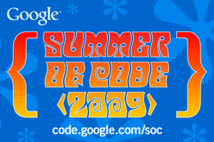

{"title":"Google Summer of Code 2009 に採択されました","date":"2009-04-21T16:14:55+09:00","tags":["gsoc"]}

<!-- DATE: 2009-04-21T07:14:55+00:00 -->
<!-- OLDURL: http://d.hatena.ne.jp/cou929_la/20090421/ -->

<a href="http://code.google.com/soc/" target="_blank">Google Summer of Code - Google Code</a>

Google Summer of Code (GSoC) に採択されました！SWIGというプロジェクトで働きます。

<a href="http://www.swig.org/" target="_blank">Simplified Wrapper and Interface Generator</a>

僕のプロジェクトは、Xapianという検索エンジンライブラリのperlラッパー（従来はXSで実装されていた）を、SWIGを使って実装し直す+拡張を行うというものです。

<ul>
<li><a href="http://socghop.appspot.com/student_project/show/google/gsoc2009/swig/t124025045266" target="_blank">Show Student Project</a></li>
<li><a href="http://xapian.org/" target="_blank">The Xapian Project</a></li>
</ul>

がんばります！

<pre>
Congratulations! Your proposal "Implement Perl binding for Xapian using SWIG" as submitted to "SWIG" has been accepted for Google Summer of Code 2009. Over the next few days, we will add you to the private Google Summer of Code Student Discussion List. Over the next few weeks, we will send instructions to this list regarding turn in proof of enrollment, tax forms, etc.

Now that you've been accepted, please take the opportunity to speak with your mentors about plans for the Community Bonding Period: what documentation should you be reading, what version control system will you need to set up, etc., before start of coding begins on May 23rd.

Welcome to Google Summer of Code 2009! We look forward to having you with us.

With best regards,
The Google Summer of Code Program Administration Team
</pre>

