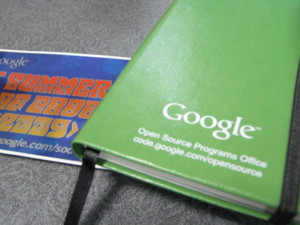

{"title":"2009 Start of Program Gift","date":"2009-05-28T21:31:17+09:00","tags":["gsoc"]}

<!-- DATE: 2009-05-28T12:31:17+00:00 -->
<!-- OLDURL: http://d.hatena.ne.jp/cou929_la/20090528/ -->

GSoCのコーディングフェーズが5/23から始まりました。現在は最初の一周目。僕は今週、主に環境構築を行っています。

コーディングフェーズの開始に先立ち、googleがいくつかプレゼントを贈ってくれました。今年のギフトは、

<ul>
<li> ACMのアカウント（1年分）</li>
<li> googleロゴ入りノート</li>
<li> gsocステッカー</li>
</ul>

でした。下の2点は賞金払い込みの資料とともに、サプライズで送られてきました。

ノートは<a href="http://www.chameleonlike.com/" target="_blank">Chameleon Like, Inc.</a>という会社のもので、なかなかいい作りになっています。他にも、黒や青、赤色のノートだった人もいたようです。

<a href="http://groups.google.com/group/google-summer-of-code-students-list/browse_thread/thread/c17e87c9661adc2e" target="_blank">Little green book? - Google Summer of Code Students List | Google Groups</a>

