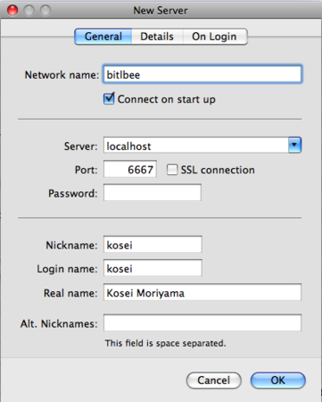
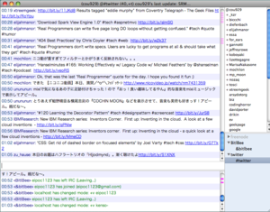
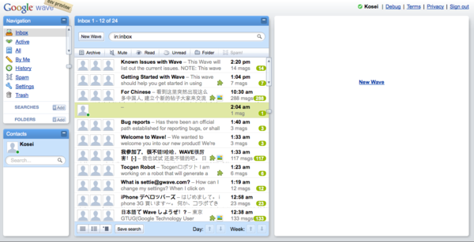

{"title":"IRCにtwitterとIMをまとめる","date":"2009-06-23T10:10:20+09:00","tags":["mac"]}

<!-- DATE: 2009-06-23T01:10:20+00:00 -->
<!-- OLDURL: http://d.hatena.ne.jp/cou929_la/20090623/ -->

IRCクライアントから、msnやgoogle talkなどのIMや、twitterを使う方法を説明します。IMにはbitlbeeで、twitterにはtircdで対応します。環境はmac osxです。

 

<h4>IRCクライアント</h4>

IRCのクライアントは何でもいいのですが、今回は私が普段使っているlimechatを例に説明します。

 

<a href="http://limechat.net/mac/" target="_blank">LimeChat: IRC Client for OSX</a>

 

<h4>bitlbee</h4>

bitlbeeはIMをIRCクライアントから使用するためのgatewayです。

<a href="http://www.bitlbee.org/" target="_blank">BitlBee - Home</a>

対応しているIMは以下のとおりです。主要なものはほぼ網羅しています。

 

<pre>
XMPP/Jabber (including Google Talk), MSN Messenger, Yahoo! Messenger, AIM and ICQ.
</pre>

<h5>インストール</h5>

macの場合、macportsでインストールできます。簡単です。

<pre>
% sudo port install bitlbee
</pre>

<h5>設定</h5>

ふつうに使う場合、特に設定の必要はありません。

設定ファイルは、デフォルトのインストールの場合、/opt/local/etc/bitlbee/bitlbee.confにあります。次のような設定項目があります。

<ul>
<li> RunMode : Daemonに設定すると、バックグラウンドでスタンドアロンで走るデーモンとして起動されるので、便利です。</li>
<li> DaemonPort : デフォルトで6667になっています。別のポートを使いたい場合はここを変更します。</li>
<li> Proxy : プロキシの設定の必要があれば、ここでします。</li>
</ul>

他の項目に関しても、読めばわかるようになっています。

<h5>起動</h5>

デフォルトで、以下のコマンドで起動します。daemonモードの場合、起動しても何もメッセージが出力されないので、少し不安になりますが大丈夫です。

<pre>
% /opt/local/sbin/bitlbee
</pre>

以上でbitlbee側の準備は完了です。

<h5>IRCクライアントの設定</h5>

次はIRCクライアント側の設定を行います。といっても、サーバのホストを"localhost"、ポート番号を"6667"（変更した場合はその番号）に設定し、新しいサーバを追加するだけです。

 

つながると、こんな感じのメッセージが表示されます。

<pre>
21:42 - localhost Message Of The Day -
21:42 - Welcome to the BitlBee server at localhost.
21:42 -
21:42 - This server is running BitlBee version 1.2.3.
21:42 - The newest version can be found on http://www.bitlbee.org/
21:42 -
21:42 - You are getting this message because the server administrator has not
21:42 - yet had the time (or need) to change it.
21:42 -
21:42 - For those who don't know it yet, this is not quite a regular Internet
21:42 - Relay Chat server. Please see the site mentioned above for more
21:42 - information.
21:42 -
21:42 -
21:42 - The developers of the Bee hope you have a buzzing time.
21:42 -
21:42 - * BitlBee development team: wilmer, jelmer, Maurits
21:42 -  
21:42 - ... Buzzing, haha, get it?
</pre>

<h5>使用方法</h5>

操作はすべて"&biblbee"というチャンネルから行います。

まず次のコマンドでregisterする必要があります。これは、自分用の設定ファイルを作るようなイメージです。ここで設定したパスワードで使用者を識別し、使用者ごとに各IMのアカウント設定をひもづけていきます。

<pre>
register <password>
</pre>

今後はidentifyというコマンドと、ここで設定したパスワードを使って、使用者を切り替えます。

<pre>
identify <password>
</pre>

IMのアカウントの追加は、account addコマンドで行います。

<pre>
account add <protocol> <username> <password> [<server>]
</pre>

例えば、google talkならば、

<pre>
account add jabber <foo@gmail.com> <password> talk.google.com:5223:ssl
</pre>

msnメッセンジャーならば、

<pre>
account add msn <foo@hotmail.com> <password>
</pre>

とします。

その後、これらのアカウントをアクティベートし、設定を保存します。

<pre>
account on
save
</pre>

その他のコマンドは、helpやhelp commandsで調べることができます。またhelp quickstartでチュートリアルを見ることができます。基本操作はチュートリアルを見れば網羅できるはずです。

bitlbeeの説明は以上です。

<h5>参考</h5>

<ul>
<li> <a href="http://www.nofuture.tv/index.rb?TwitterBitlBee" target="_blank">nofuture.tv - BitlBeeを使ってXchatでIRCとMSNメッセンジャーとTwitterをひとまとめにする</a></li>
<li> <a href="http://yoosee.net/d/archives/2007/05/13/002.html" target="_blank">BitlBee で AIM や GTalk や Twitter を IRC にまとめる - World Wide Walker</a></li>
</ul>
<h4>tircd</h4>

tircdはIRCクライアントからtwitterのAPIにアクセスする、perlで書かれたサーバです。

<a href="http://code.google.com/p/tircd/" target="_blank">tircd - Google Code</a>

以前はtwitterの公式の機能を使って、google talk (jabber)経由でtwitterにアクセスできたため、bitlbeeのみでIMとtwitterの双方に対応することができたのですが、現在はtwitterのgoogle talk対応がなくなってしまったので、bitlbeeのみではできなくなってしまいました。そこでこのtircdを使います。

<h5>インストール</h5>

まず、以下のモジュールが必要です。

<ul>
<li> POE</li>
<li> POE::FIlter</li>
<li> Net::Twitter</li>
</ul>

cpanからインストールします。

<pre>
% cpan -i POE POE::Filter Net::Twitter
</pre>

Net::Twitterのインストール中に音が鳴るので注意です。

次はtircd本体ですが、これは上記サイトからアーカイブをダウンロードし、展開、任意の場所に設置するだけです。

<h5>設定</h5>

設定ファイルは展開したディレクトリ内のtircd.cfgです。ここで注意すべき点は、ファイル上部のportの項目です。こちらもbitlbeeの時と同じく6667がデフォルトになっています。ここは6668などと、bitlbeeとは違うポート番号に設定する必要があります。残りは特に変更は必要ありませんが、twitterに更新を見に行く頻度なども設定できるので、適宜編集すると良いと思います。

また、proxy設定が必要な環境の場合は、http_proxy環境変数を設定すればokです。

<pre>
% http_proxy=your.proxy.url
% export http_proxy
</pre>

<h5>起動</h5>

起動は以下のコマンドです。

<pre>
./tircd.pl tircd.cfg
</pre>

次のようなメッセージがプリントされるはずです。

<pre>
[Tue Jun 23 21:42:37 2009] tircd 0.7 started, using config from: tircd/tircd.cfg. 
[Tue Jun 23 21:42:37 2009] Listening on: 127.0.0.1:6668.               
</pre>

<h5>IRCクライアントの設定</h5>

サーバをlocalhost、ポート番号を6668(前述のtircd.cfgに設定したもの)、nicknameとpasswordを自分のtwitterアカウントのidとpasswordに設定し、サーバを追加します。そして#twitterチャンネルに入ればokです。

<h5>使用方法</h5>

使い方はほぼ見たままなので、特に説明は必要ないと思います。IRCからfollowやblockなどの操作もできます。詳しくは公式サイトを参照してください。

<a href="http://code.google.com/p/tircd/" target="_blank">tircd - Google Code</a>

ただし、私の環境では自分の日本語でのtweetが文字化けしてしまいます。少しスクリプトを改良すればなおりそうなのですが、今のところそのままにしています。

 

 

 

以上で作業完了です。これでlimechatからIRC, IM, twitterが扱えるようになりました。

<h2>Google Wave sandbox</h2>

waveのアカウントが発行されました。とりあえずスクリーンショット。

