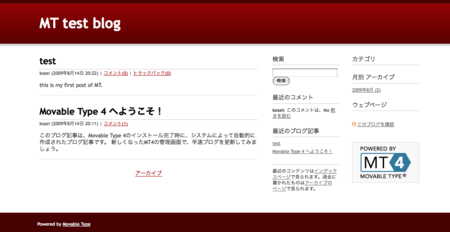

{"title":"mac osxのローカル環境でMTを動かす","date":"2009-08-15T05:44:22+09:00","tags":["etc"]}

<!-- DATE: 2009-08-14T20:44:22+00:00 -->
<!-- OLDURL: http://d.hatena.ne.jp/cou929_la/20090814/ -->

友人のwebサイトを作るのを手伝っています。サーバは<a href="http://www.sakura.ne.jp/" target="_blank">さくらインターネットのライトプラン</a>で借りようとしているのですが、このプランは月額125円と値段が安い一方で、phpやmysqlがつかえないなど機能がかなり限られています。（一方で一つ上位のスタンダードプランでは、sshで入れたりcronを設置できたりなど、かなり充実しています）。

phpが使えないので、cmsをどうしようかと悩みました。wordpressやdrupalなど有名どころはphp製が多いです。python, ruby, perlで動くcmsはないか調べてみたところ、有名なものでpythonのploneがありました。ploneにしようかなと思いつつあったんですが、そういえばMovable Typeを忘れていたことに気づき、調べてみたところperlとSQLiteで動くようだし、さくらのライトプランでMTを運用しているひともたくさんいるようなので、Movable Typeでいくことにしました。

まずはローカルにMTをインストールして、テーマのカスタマイズやプラグインの設置などを行い、完成したらさくら上に構築することにしました。

そこでまずはmacのローカル環境でMTを動かします。macにはMAMPという、XAMPPのmac版のようなソフトがあり、これを使えばローカルでのテスト環境の構築はかなり楽そうです。しかし今回は勉強のために、こうしたオールインワンのパッケージに頼らず、自分でサーバやDBの設定などを行うことにしました。macにはデフォルトでapacheが入っているし、macportsがあるのでソフトのインストールも簡単。よってなんとかなるかなと考えました。

<h4>apache</h4>

まずはローカルでapacheを動かすことから始めます。ここらへんを読みながらやってみました。

<a href="http://gihyo.jp/dev/serial/01/macbook/0002" target="_blank">Start! MacBook：第2回　なぜMacなのか（後編） ～ApacheでCGIを動かすまで｜gihyo.jp … 技術評論社</a>

<a href="http://homepage1.nifty.com/glass/tom_neko/web/web_cgi_osx.html" target="_blank">超簡単 Mac OS XのローカルでCGI (SSIもPHPも)</a>

まずはapacheを起動して、ローカルホストにアクセスしてみます。リンゴマークからSystem preferences -> Sharing -> Web Sharingのチェックをつける。またはコマンドラインで、apachectl start とすればOKです。この状態でブラウザから<a href="http://localhost/" target="_blank">http://localhost/</a>にアクセスし、なにかそれらしいメッセージが出ていればOKです。ついでに、<a href="http://localhost/~USERNAME" target="_blank">http://localhost/~USERNAME</a>（自分のユーザー名）/にもアクセスしてみます。こちらでは~/Sitesの中身が表示されます。

<h4>perl</h4>

次はperlです。/private/etc/apache2/users/kosei.confを次のように編集し、~/Sitesの中にperlのスクリプト（test.cgi）をいれます。なお僕のユーザ名はkoseiなので、各自適宜読み替えてください。

kosei.conf

<pre>
<Directory "/Users/kosei/Sites/">
    AddHandler cgi-script cgi
    Options Indexes MultiViews ExecCGI
    AllowOverride None
    Order allow,deny
    Allow from all
</Directory>
</pre>

test.cgi

<pre class="syntax-highlight">
#!/usr/bin/perl
print "Content-Type: text/plain\n\nHello\n";
</pre>

ブラウザから<a href="http://localhost/~kosei/test.cgi" target="_blank">http://localhost/~kosei/test.cgi</a>にアクセスし、Helloと出ればokです。

余談ですが、test.cgi2行目のコンテントタイプをtext/plainではなくtest/plainとtypoしてしまい、少しはまってしまいました。ブラウザからアクセスしてもスクリプトが実行されず、cgiファイルをダウンロードしてしまうので、なんでだろうと思っていたのですが、このtypoが原因でした。

<h4>SQLite</h4>

SQLiteもなにもせずともインストールされてました。

<pre>
% sqlite3
SQLite version 3.4.0
Enter ".help" for instructions
sqlite>
</pre>

<h4>Movable Type</h4>

日本語版のソフトをダウンロード、解凍します。

<a href="http://www.movabletype.org/download.html" target="_blank">Download Movable Type | MovableType.org - Home of the MT Community</a>

展開したディレクトリの中のreadme.htmlでrequirementsやインストール方法が説明されています。インストールは、

<ol>
<li>展開したファイルを任意の場所に設置。（ここでは~/Sites/mt とします）</li>
<li>*.cgiのパーミッションを変更。+xをつける。</li>
<li>ルートディレクトリにcgiの実行権限を付加。（今回は上記で設定したので必要ありません）</li>
<li>ルートディレクトリに書き込み権限を付加。（chmod a+w）</li>
<li><a href="http://localhost/mt/" target="_blank">http://localhost/mt/</a> にアクセス。</li>
</ol>

あとは説明に従って進めるだけです。途中必要なperlモジュールをチェックしてくれるので、適宜インストールします。

データベースを作成する段階で、ディレクトリのパーミッションを変更する必要がありました。デフォルトでは、~/Sites/mt/db/mt.dbというパスにdbを作ろうとするので、mtの下にdbというディレクトリを作り、chmod a+wで書き込み権限を与えてあげます。

あとはファイルの保存先やそのパーミッションに注意して、おこられたら適宜修正しながらやっていけば大丈夫です。

インストールも簡単だし、デザインも見やすいし、日本語もよくサポートされていて、MTはすばらしいですね。

