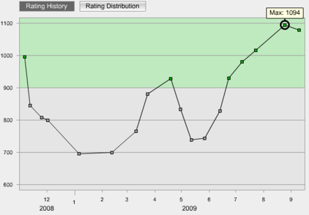

{"title":"TopCoder SRM 448","date":"2009-09-11T08:32:17+09:00","tags":["c/c++"]}

<!-- DATE: 2009-09-10T23:32:17+00:00 -->
<!-- OLDURL: http://d.hatena.ne.jp/cou929_la/20090910/ -->

今日はSRM448でした。詳細はTopCoder日記の方に書いています。

<a href="http://topcoder.g.hatena.ne.jp/cou929/20090910/1252592746" target="_blank">SRM448 div2 - cou929のTopCoder日記 - TopCoder部</a>

Raitingは微減。悔しいなあ。早くDPがすらすらできるようになって、div1へ行きたい。

<a href="http://www.topcoder.com/tc?module=MemberProfile&cr=22740515" target="_blank">TopCoder Member Profile</a>

