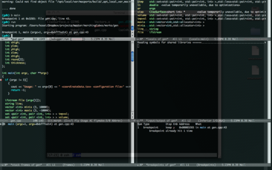

{"title":"memo: emacs の設定を見直し","date":"2009-10-08T05:40:58+09:00","tags":["linux"]}

<!-- DATE: 2009-10-07T20:40:58+00:00 -->
<!-- OLDURL: http://d.hatena.ne.jp/cou929_la/20091007/ -->

emacsをいろいろいじってました。主にc/c++のコーディング向けです。

 

まずはこちらの珠玉のエントリを再読。

<a href="http://at-aka.blogspot.com/2006/12/emacs-c.html" target="_blank">clmemo@aka: Emacs で C 言語プログラミングを始める人へのイントロダクション</a>

<ul>
<li>M-x align でアラインメント</li>
<li>M-; でコメント挿入</li>
<li>flyspell-modeの設定</li>
<li>etagsの設定。

<ul>
<li>makefileに以下のTAGS生成ルールを追加</li>
</ul>
</li>
</ul>
<pre class="syntax-highlight">
tags: $(TARGETS)
     find . | grep -E '\.(cpp|c|cc|cxx|h|hpp)$$' | etags -
</pre>

<ul>

<ul>
<li>あとはM-.でその関数の定義へ飛べる。M-*で戻る。</li>
</ul>
<li>C－c c でコンパイル。C-x ` でエラー行へジャンプ</li>
<li>C-x 4 a でChangeLogを書く</li>
</ul>
 

次はこちらのリンク集を参考にしながら、

<a href="http://d.hatena.ne.jp/niitsuma/20080114/1203335012" target="_blank">emacs C++開発環境 - niitsumaの日記</a>

<a href="http://d.hatena.ne.jp/niitsuma/20080114/1201322325" target="_blank">emacs C++ 開発環境 link集 - niitsumaの日記</a>

こちらのmeadowの人のffapの記事を読む。

<a href="http://www.bookshelf.jp/soft/meadow_23.html#SEC230" target="_blank">Meadow/Emacs memo: ファイルを開く関連</a>

ffapを使うと、ファイル名やurlの上にカーソルを合わせてC-x C-fすると、そのファイルやサイトが開きます。ただデフォルトではc++のヘッダなどは開かなかったので、設定が必要そうです。

 

次はこちらのひげぽんさんの記事でglobalというものを知る。

<a href="http://d.hatena.ne.jp/higepon/20060107/1136628498" target="_blank">Emacs + GLOBALでソース読みを快適に - ひげぽん OSとか作っちゃうかMona-</a>

<ul>
<li>M-t で関数定義へジャンプ</li>
<li>M-r で関数呼び出し元へジャンプ</li>
<li>M-s でシンボル参照先にジャンプ</li>
<li>C-t で元のバッファに戻る</li>
</ul>

これはでかいコードを読むときには必須ですね。てかこれがあればetagsは必要なかった？さっきの設定は無駄か…？というわけでmakefileの設定をgtags -vに変更。

 

次はこちらでgdb-many-windowsというのを試す。

<a href="http://narupon.tdiary.net/20061022.html" target="_blank">gdbの見える化:イントロダクション, 必要なもの, Emacs 22 のインストール方法, 設定, , gdbの見える化?!, , , , 利点, バグ？, おまけ TIPS - 為せばNaruto(2006-10-22)</a>

windowが6つ開いて、gdbの色んなパラメータや状態が見やすくなります。こんな感じになります。これはすごい。

 

次はAnything.elを入れてみる。

<a href="http://d.hatena.ne.jp/tomoya/20090423/1240456834" target="_blank">もう初心者なんて言わせない、Anything で始まる Emacs 道。 - 日々、とんは語る。</a>

これはすごい！ひとつのインタフェースから、様々な操作ができるようになります。まだまだディープなカスタマイズがいろいろできるようなので、ゆっくりやっていきたいです。

