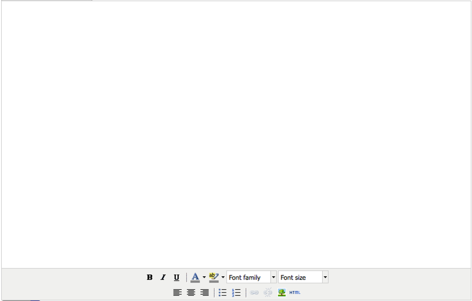

{"title":"memo: gaeにTinyMCE導入","date":"2009-10-28T03:31:46+09:00","tags":["html/css"]}

<!-- DATE: 2009-10-27T18:31:46+00:00 -->
<!-- OLDURL: http://d.hatena.ne.jp/cou929_la/20091027/ -->

最近google app engineをちょこちょこいじって、webアプリなど作っているんですが、コンテンツの入力画面を作るのにTinyMCEを使ったので、その作業メモです。

<h4>TinyMCEとは</h4>

<a href="http://tinymce.moxiecode.com/" target="_blank">TinyMCE - Home</a>

TinyMCEとはjavascriptで動くWysiwygエディタです。ユーザはふつうのワープロソフトのようなインタフェースで文章を書くことができ、TinyMCEはそれを適切なhtmlへ変換します。導入やカスタマイズが簡単で、<a href="http://tinymce.moxiecode.com/using.php" target="_blank">WordpressやJoomlaなどのCMSやオラクル, MS, Apple, SAPのソフトウエアなど、豊富な導入実績があります</a>。見た目は<a href="http://tinymce.moxiecode.com/examples/full.php" target="_blank">こんな感じです</a>。

<h4>インストール</h4>

<a href="http://tinymce.moxiecode.com/download.php" target="_blank">パッケージをダウンロード</a>、解凍後、任意の場所に設置します。あとはhtmlファイルのヘッダに、

<pre class="syntax-highlight">
<script type="text/javascript" src="./js/tiny_mce/tiny_mce.js"></script>

<script type="text/javascript">
tinyMCE.init({
	mode : "textareas"
});
</script>
</head>
</body>

<textarea></textarea>
</pre>

と書くだけで、textareaがtinymceのインタフェースになります。

<h5>GAEの場合</h5>

GAE上で使用する場合は、まずapp.yaml(設定用のyamlファイル)に静的ファイルを定義します。

<pre class="syntax-highlight">
- url: /js
  static_dir: js
</pre>

htmlヘッダでのパスの指定は、先頭にコンマなど入れないよう注意します。

<pre class="syntax-highlight">
<script type="text/javascript" src="/js/tiny_mce/tiny_mce.js"></script>
</pre>

あとは通常と同様です。

<h4>カスタマイズ</h4>

多くのカスタマイズはhtmlヘッダのtinyMCE.init()関数で行います。設定項目の一覧はこちらです。

<a href="http://wiki.moxiecode.com/index.php/TinyMCE:Configuration" target="_blank">TinyMCE:Configuration - Moxiecode Documentation Wiki</a>

以下は、今回僕が使用したものです。

<h5>editor_selector</h5>

tinymceを適用させるclassを指定します。デフォルトでは、上記の例では全てのtextareaに適用ますが、このオプションにより、任意の要素に適用できます。

<h5>width, height</h5>

エディタの縦横の大きさを決めます。単位はpixel。

<h5>theme</h5>

エディタのテーマを変更します。tinymceにはビルトインでsimpleとadvancedの2つのテーマが付属しており、theme属性を指定しない場合はsimpleになります。themeをadvancedにすることで、使える機能も増え、また細かなカスタマイズも可能になります。

<h5>theme_advanced_layout_manager</h5>

advancedテーマのレイアウトの指定方法を決めるオプションです。3種類ありますが、とりあえずSimpleLayoutを指定しておけば、次のtheme_advanced_buttons*でボタンを出したり消したりできます。

<h5>theme_advanced_buttons*</h5>

エディタに、行ごとにどのボタンを表示させるかを決定します。最大3行です。使えるボタンはこちらで一覧できます。

<a href="http://wiki.moxiecode.com/index.php/TinyMCE:Control_reference" target="_blank">TinyMCE:Control reference - Moxiecode Documentation Wiki</a>

<h5>external_image_list_url</h5>

画像挿入ボタンを押した際に、挿入できる画像の一覧を渡すためのオプションです。次のようにして、jsのファイルを渡します。

<pre class="syntax-highlight">
        external_image_list_url: "/externallist.js",
</pre>

externallist.jsの中身は、以下のようなarrayにします。

<pre class="syntax-highlight">
var tinyMCEImageList = new Array(
// Name, URL
["Logo 1", "logo.jpg"],
["Logo 2 Over", "logo_over.jpg"]
);
</pre>

このjsファイルを、サーバ上にアップロードされた画像をリストにするように、サーバサイドで動的に生成してあげると良いです。

<h5>external_image_list_urlをGAEで使う場合</h5>

画像は全てデータストアに格納されており、"/img?id=*"というURIでアクセスできるものとします。(方法はこちらの記事を参考にしてください：<a href="http://www.adamrocker.com/blog/247/strange-way-to-get-images-from-gae-datastore.html" target="_blank">throw Life - Google App Engineのデータストアから気持ちよく画像を取り出すオススメできない方法</a>)。画像データのモデルは、以下のように、imageというblobと、titleというstring、dateという日時を持っているものとします。

<pre class="syntax-highlight">
class ImageModel(db.Model):
    title = db.StringProperty(required=True)
    image = db.BlobProperty(required=True)
    date = db.DateTimeProperty(auto_now_add=True)
</pre>

このImageModelの全画像データを、上記の形式でjsのファイルに出力します。

<pre class="syntax-highlight">
class ExternalList(webapp.RequestHandler):
    def get(self):
        query = ImageModel.all()
        output = ''
        output += 'var tinyMCEImageList = new Array('
        first = 1
        for img in query:
            if first:
                first = 0
            else:
                output += ','
            output += '["' + img.title + '", '
            output += '"/img?id=' + str(img.key().id()) + '"]'
        output += ');'
        self.response.headers['Content-Type'] = 'text/javascript'
        self.response.out.write(output)
</pre>

リストの最後にコンマを入れないようにする処理がちょっとださいですが、見逃してください。このハンドラを適当なURIにマップし、

<pre class="syntax-highlight">
application = webapp.WSGIApplication(
                                     [('/', MainPage),
                                      ('/externallist', ExternalList),
                                      ], debug=True)
</pre>

そしてこのURIをexternal_image_list_urlで指定してあげればOKです。

<pre class="syntax-highlight">
        external_image_list_url: "/externallist",
</pre>

<h5>まとめ</h5>

ここまでをまとめると、こうなります。

<pre class="syntax-highlight">
<script type="text/javascript" src="/js/tiny_mce/tiny_mce.js"></script>

<script type="text/javascript">
tinyMCE.init({
	mode: "textareas",
        editor_selector: "tinymce",
        width: "800",
        height: "500",
        external_image_list_url: "/externallist",
        theme: "advanced",
	theme_advanced_layout_manager: "SimpleLayout",
	theme_advanced_buttons1: "bold, italic, underline, separator, forecolor, backcolor, fontselect, fontsizeselect",
	theme_advanced_buttons2: "justifyleft, justifycenter, justifyright, separator, bullist, numlist, separator, link, unlink, image, code",
	theme_advanced_buttons3: "",
});
</script>
</pre>

見た目はこんなんです。

