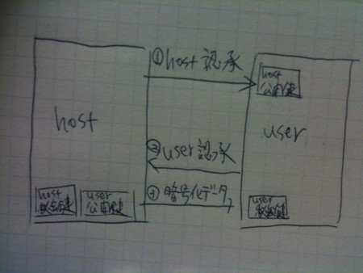

{"title":"sshの基本をざっくりと","date":"2009-12-16T06:34:33+09:00","tags":["etc"]}

<!-- DATE: 2009-12-15T21:34:33+00:00 -->
<!-- OLDURL: http://d.hatena.ne.jp/cou929_la/20091215/ -->

共同開発する際にバージョン管理のレポジトリを用意してもらって, 公開鍵を送ってsshでつなぐというシチュエーションはよくあると思います. 僕もいままで何度かあったのですが, いずれも管理者の人に手順を教えてもらって, それに従って操作しているだけだったので, 何やってるかをいまいち理解せずに使っていました. そこでざっくりでも理解しとこうと思い, 少しだけ調べました.

<h4>sshのプロトコル</h4>

<ul>
<li><a href="http://ja.wikipedia.org/wiki/Secure_Shell" target="_blank">Secure Shell - Wikipedia</a></li>
</ul>

sshとはネットワークを介して安全に通信する方法です. 公開鍵暗号, 主にrsaとdsa, という暗号化方式をつかっています. バージョン1, 2の2種類のプロトコルが存在していて, rfcの規定もあります. OpenSSHというフリーの実装が最も多く使われているそうです.

<ul>
<li><a href="http://d.hatena.ne.jp/japanrock_pg/20080723/1216796588" target="_blank">OpenSSHの概要を知る - プログラマ 福重 伸太朗 ～基本へ帰ろう～</a></li>
</ul>

sshでの接続の際は, 2種類の認証が行われます.

<ol>
<li>接続しようとしているホストが正しいかの認証</li>
<li>接続しようとしているクライアントが正しいかの認証</li>
</ol>

1では ~/.ssh/known_hosts に保存されているホストサーバの公開鍵と, 接続時にサーバから送られる公開鍵を比べて, 正しいホストかを判定します. ある公開鍵を生成するには, あるパスフレーズが必要なので, 確かに公開鍵はそのホストを一意に特定するのに使えます. 秘密鍵はサーバ側に保存しておき, 通信する必要はありません. このプロセスは自動で行われますが, 初回の接続だけはknown_hostsにサーバの情報が記録されてないので, finger print(指紋)をみて"人間"が正しいかどうかを判断します. あの文字列にはこんな意味があったのか.

2ではあらかじめサーバに公開鍵を作って送っておきます. ユーザの認証と送信するデータの暗号化はそれを用いて行います.

<h4>公開鍵暗号</h4>

ここで, 公開鍵暗号について復習しておきます.

<ul>
<li><a href="http://ja.wikipedia.org/wiki/%E5%85%AC%E9%96%8B%E9%8D%B5%E6%9A%97%E5%8F%B7" target="_blank">公開鍵暗号 - Wikipedia</a></li>
</ul>

公開鍵暗号方式では, まずrsaなどの暗号化アルゴリズムを用いて公開鍵と秘密鍵を作ます. これらの鍵は対になっています. 公開鍵は全世界に公開され, 秘密鍵はどこにも漏れないように管理しておきます. データ送信者は公開されている公開鍵を取得し, これを使ってデータを暗号化します. つぎに暗号化されたデータが送信者から受信者へ送信されます. 受信者は秘密鍵を用いてデータを複合します. 公開鍵で暗号化されたデータは, 対になっている秘密鍵じゃないと復号化できないので, 暗号が解読される可能性は極めて低くなります. 

従来の暗号化方式である共通鍵アルゴリズムは, 暗号化・復号化のための鍵を送信者・受信者の間で共有しなければいけませんでした. よって通信開始前に鍵をやり取りしなければならないんですが, もしこの鍵が盗聴されていると暗号化されたデータが悪意の第三者に復号化されてしまいます. 一方, 公開鍵方式では公開鍵が盗聴されても暗号の復号化ができません. よって公開鍵方式は共通鍵方式の鍵の転送問題を解決したアルゴリズムと言えます.

<h4>rsa暗号</h4>

暗号化の方法にはrsa暗号, dsa暗号などがあります.

<ul>
<li><a href="http://ja.wikipedia.org/wiki/RSA%E6%9A%97%E5%8F%B7" target="_blank">RSA暗号 - Wikipedia</a></li>
</ul>

rsa暗号について. 細かいところはわからないのでざっくりと読んだ理解ですが, rsa暗号では素因数分解の非対称性を用いています. まず素数p, qを決め, n = p * q を求めます. これはただの乗算なので非常に簡単に計算できます. しかし逆にnから素数p, qを求めることは, p, qが大きい場合非常に困難です. たとえば一番ナイーブなアプローチを考えてみると, まず素数の出現方法の規則性はまだ見つかっていないので, 小さい方の素数から総当りで探索する必要があります. さらにある整数mが素数かどうかを調べるには, 一番単純な方法では, 2からm-1までの整数でmを割ってみる必要があります. p, qに大きな素数を選ぶことで, nからp, qを求めることが非常に困難なことがわかります. よってnを公開鍵, p, qを秘密鍵とすることで, 公開鍵暗号を実現することができます. たぶんこういうことなんだと思います. 

<h4>sshでの通信手順</h4>

ここからは手順の話. 暗号鍵・公開鍵を作るには ssh-keygen というツールを使います.

<ul>
<li><a href="http://www.atmarkit.co.jp/flinux/rensai/linuxtips/432makesshkey.html" target="_blank">＠IT：Linuxでsshの鍵を作成するには</a></li>
<li><a href="http://www.unixuser.org/~euske/doc/openssh/jman/ssh-keygen.html" target="_blank">404 Not Found</a></li>
<li><a href="http://www.netlab.is.tsukuba.ac.jp/~one/ssh/" target="_blank">500 Internal Server Error</a></li>
</ul>
<pre>
% ssh-keygen -t rsa -c "foo@bar.com"
</pre>

t オプションは rsa, dsa など暗号化方式を指定します. -c オプションではコメントを指定します. 自分のメールアドレスにすることが多いようです. 単なるコメントなので生成ずみの公開鍵を直接編集しても大丈夫です. 

コマンドが実行されると, 例えばrsaの場合, id_rsa, id_rsa.pub という2つのファイルができます. id_rsaが秘密鍵なので流出しないよう管理します. id_rsa.pubが公開鍵です. パーミッションはそれぞれ600(-rw-------)と644(-rw-r--r--)になっています. 

生成された公開鍵は~/.ssh/ 下におきます. 慣例としてauthorized_key というファイルネームを用いることが多いようです. 複数の公開鍵がある場合は, cat でファイル末尾に追加すればokです.

<pre>
% cat id_rsa.pub >> ~/.ssh/authorized_keys
</pre>

~/.ssh にはssh関連の設定ファイルなどが説明されています. ~/.ssh/config は設定ファイル. ~/.ssh/known_host にはsshサーバの公開鍵が保存されています. 

実際にsshで通信する際に, Permission denied(publickey) というエラーが出ることがあります. これはホームディレクトリや鍵のパーミッションが原因です. ホームディレクトリは所有者以外書き込み禁止に(700とか), 鍵は上記のデフォルトのパーミッションに設定しておくようにする必要があります.

