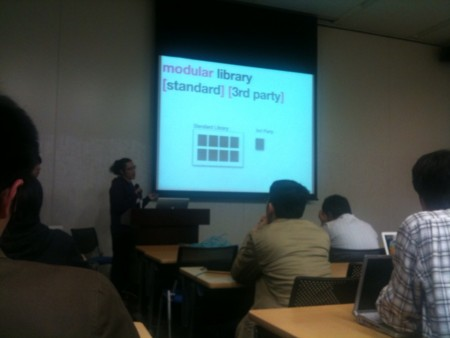

{"title":"Mozilla勉強会@東京 2nd","date":"2010-04-04T05:57:14+09:00","tags":["conference"]}

<!-- DATE: 2010-04-03T20:57:14+00:00 -->
<!-- OLDURL: http://d.hatena.ne.jp/cou929_la/20100403/ -->

Mozilla勉強会@東京 2nd に行ってきました. modestが主催, firefoxやthunderbirdの拡張やjetpackに関する勉強会です.

<a href="https://dev.mozilla.jp/events/workshop03/" target="_blank">Mozilla 勉強会＠東京 2nd | Mozilla Developer Street (modest)</a>

個人的におもしろかったのはjetpackのセッション. jetpack reboot(jetpackのやり方を一回見直して再スタートしましょうというもの)前後でどのような変化があったかと, 新しくでたjetpack sdkの使い方を知ることができました. "jetpack"という拡張の上でjetpack featureをうごかすというアーキテクチャをやめてsdkベースにする点や, ライブラリ(3rd partyも可)という形でapiを提供する点などなど, かなり大幅に方針転換していました. sdkはまだまだ初期段階で, ライブラリがまだまだ少ないです. reboot前のjetpackはapiが豊富で, とても簡単にメニューに項目追加などができてかなりインパクトがあったんですが, sdkはまだその辺のapiが出揃っていないようです. 

以下メモ.

<h4>いま始める拡張機能開発</h4>

dynamisさん

アドオンビルダーの紹介をかねたlive coding

<ul>
<li>extdev.org

<ul>
<li>拡張開発者用にとってくれてる</li>
</ul>
</li>
<li>flex 属性

<ul>
<li>親ボックスにしめる割合で大きさを指定できる</li>
</ul>
</li>
<li>keyset (xul)

<ul>
<li>キーイベント</li>
<li><a href="https://developer.mozilla.org/en/XUL_Tutorial/Keyboard_Shortcuts" target="_blank">https://developer.mozilla.org/en/XUL_Tutorial/Keyboard_Shortcuts</a></li>
</ul>
</li>
<li>modestにいろいろサンプルコード

<ul>
<li><a href="https://dev.mozilla.jp/addons/hacks/debug-interface/" target="_blank">拡張機能デバッグインターフェイス | Mozilla Developer Street (modest)</a></li>
<li><a href="https://dev.mozilla.jp/addons/hacks/prefs-interface/" target="_blank">ユーザ設定インターフェイス | Mozilla Developer Street (modest)</a></li>
</ul>
</li>
</ul>
<h4>Jetpack Reboot & SDK 0.2 開発デモ</h4>

あかつかさん, gomitaさん

<a href="http://www.slideshare.net/gomita5353/jetpack-sdk-02-3633137" target="_blank">404 error. Page Not Found.</a>

<blockquote>

<ul>
<li> Jetpack Ambassadors Program の報告</li>
<li> Jetpack Reboot の概要と旧 Jetpack との違い</li>
<li> Jetpack SDK 0.2 開発デモ</li>
</ul>
</blockquote>
<h5>about:Jetpack Reboot</h5>

<ul>
<li>開発

<ul>
<li>容易, 互換, 拡張性(+)</li>
</ul>
</li>
<li>公開

<ul>
<li>堅牢, 容易</li>
</ul>
</li>
<li>利用</li>
<li>堅牢, 容易</li>
</ul>

<ul>
<li>開発</li>
<li>ウェブ技術(html, js, css)での開発

<ul>
<li>習得かんたん</li>
</ul>
</li>
<li>API

<ul>
<li>互換性</li>
</ul>
</li>
<li>ライブラリ

<ul>
<li>拡張性</li>
</ul>
</li>
</ul>

<ul>
<li>公開</li>
<li>ケーパビリティ

<ul>
<li>レビューを容易に</li>
<li>信頼できるライブラリはレビューなし</li>
<li>速く, 簡単に, 安全に</li>
</ul>
</li>
</ul>

<ul>
<li>利用

<ul>
<li>再起動無しでインストール・アンインストール</li>
</ul>
</li>
</ul>

<ul>
<li>modular library

<ul>
<li>standard</li>
<li>3rd party</li>
</ul>
</li>
</ul>

<ul>
<li>開発手法

<ul>
<li>sdk</li>
<li>flightdeck -> jetpack builder

<ul>
<li>gui</li>
</ul>
</li>
</ul>
</li>
</ul>

<ul>
<li>その他

<ul>
<li>アドオンマネージャ

<ul>
<li>fx3.7から</li>
</ul>
</li>
<li>jetpack gallery -> AMOに統合</li>
<li>jetpack prototypeは廃止</li>
</ul>
</li>
</ul>
<h5>SDK0.2</h5>

<ul>
<li>python必要. 2.5+. 3系は非対応</li>
<li>source bin/activate</li>
<li>bin/cfx docs</li>
<li>cfx run -a firefox</li>
<li>require でライブラリをインポート</li>
</ul>

<ul>
<li>自作ライブラリ

<ul>
<li>simple-dialogライブラリ</li>
<li>window, documentはない</li>
<li>nsIPromptServiceで実装</li>
<li>ドキュメント

<ul>
<li>README.md</li>
<li>マークダウン形式(<a href="http://en.wikipedia.org/wiki/Markdown" target="_blank">Markdown - Wikipedia</a>)</li>
</ul>
</li>
<li>インストーラ

<ul>
<li>cfx xpi</li>
<li>jetpack -> xpi</li>
</ul>
</li>
</ul>
</li>
</ul>
<h4>Thunderbird タブ拡張(WAT)</h4>

teramakoさん

<a href="http://teramako.github.com/doc/modest-20100403/modest-20100403.html#%281%29" target="_blank">Thunderbird タブ拡張(WAT)</a>

<blockquote>

<ul>
<li> Thunderbird 3の新機能であるタブについて</li>
<li> WATという拡張機能について</li>
<li> あと、vimperatorについて(笑)</li>
</ul>
</blockquote>
<h4>LT</h4>
<blockquote>

<ul>
<li> 加速度センサーを使ったバカインターフェイス – by btm</li>
<li> Mozilla コミュニティ入門 – by potappo</li>
<li> audio 要素を使って Mozilla Thunderbird の起動時に音楽を再生する。 – by saneyuki</li>
<li> Flat Bookmarks 1.0 の紹介 – by Gomita</li>
<li> tabbrowser 要素の仕様変更とその対策のまとめ – by Piro</li>
<li> Jäger Monkey (仮) – by dynamis</li>
</ul>
</blockquote>

<ul>
<li>加速度センサ

<ul>
<li><a href="http://github.com/smellman/unko" target="_blank">http://github.com/smellman/unko</a></li>
<li><a href="https://developer.mozilla.org/en/Detecting_device_orientation" target="_blank">Detecting device orientation - Web APIs | MDN</a></li>
<li>apiの存在は知ってたけど発想がすばらしい</li>
</ul>
</li>
</ul>

<ul>
<li>mozillaコミュニティ入門

<ul>
<li><a href="http://www.slideshare.net/potappo/mozila" target="_blank">Mozila コミュニティ入門</a></li>
<li>modest</li>
<li>もじふぉ</li>
<li>seamonkey-ja</li>
<li>bug-ja</li>
<li>MDC-ja</li>
<li>moz-trans-ja</li>
<li>MCNJ</li>
<li>etc</li>
</ul>
</li>
</ul>

<ul>
<li>thunderbird起動時にサンダーバードのオープニングを流す

<ul>
<li><a href="http://www.slideshare.net/saneyuki/play-the-tb-are-go-with-html5-audio-when-mozilla-tb-startup" target="_blank">HTML5 audio 要素を使って Mozilla Thunderbird の起動時に音楽を再生する</a></li>
<li>mp3流したい</li>
</ul>
</li>
</ul>

<ul>
<li>Flat Bookmarks

<ul>
<li><a href="http://www.slideshare.net/gomita5353/flat-bookmarks-10" target="_blank">404 error. Page Not Found.</a></li>
<li>UIがグッド</li>
</ul>
</li>
</ul>

<ul>
<li>tabbrowser 要素の仕様変更とその対策のまとめ

<ul>
<li>図が非常にわかりやすい</li>
<li>LTなのにスライド約300枚</li>
</ul>
</li>
</ul>

<ul>
<li>Jäger Monkey

<ul>
<li><a href="http://r.dynamis.jp/jaegermonkey" target="_blank">404 Not Found - Rebrandly</a></li>
<li>「詳しくはあとでスライドみて!」</li>
</ul>
</li>
</ul>

