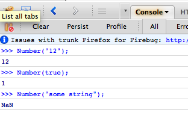

{"title":"避けなければいけない JavaScript の失敗","date":"2011-05-16T08:04:56+09:00","tags":["javascript"]}

<!-- DATE: 2011-05-15T23:04:56+00:00 -->
<!-- OLDURL: http://d.hatena.ne.jp/cou929_la/20110515/ -->

しばらくブログを書いていなかったので, 息抜きに "Javascript Mistakes You Must Avoid" という記事を訳してみました. 

<a href="http://www.ifadey.com/2011/05/javascript-mistakes-you-must-avoid/" target="_blank">Ifadey.com</a>

初心者向けの記事かなと思ったんですが今まであまりきにしたことのないトピックもあったので勉強になりました.

<h4> Intro</h4>

もしあなたが JavaScript 初心者であれば, 生の JavaScript か jQuery などのフレームワークを使うかに関わらず, JavaScript を書く際の失敗は避けたいものです. ここでは私が JavaScript を学んでくる過程で体験したいくつかの失敗について説明します.

<h4> イコール演算子</h4>

知っているかもしれませんが, JavaScript では2つのオペランドが等しいかどうかを調べる演算子が2種類あります. ひとつは "==" です. これは2つのオペランドを比較しますが, その型までは調べません. たとえば以下の条件式は真になり, ブロックの中が実行されます.

<pre class="syntax-highlight">
if( 1 == true ) {
    //this code will run
}
</pre>

ほかにもいろいろな例があります.

<pre class="syntax-highlight">
1 == "1"        //true
"true" == true  //false
1 == true       //true
"0" == 0        //true
"" == 0         //true
" " == 0        //true
"Str" == false  //false
"Str" == true   //false
</pre>

JavaScript の "==" 演算子の挙動に詳しくないひとにとっては驚くような例もあるでしょう. <del datetime="2012-01-02T23:21:24+09:00">"==" 演算子の2つのオペランドは (それがどんなデータ型であるかに関わらず) Number 型に変換されたあとに比較されます.</del> (指摘を受け以下に補足を追記しました)

最初の 1 == "1" という例を考えてみましょう. 左側のオペランドはすでに Number 型なのでなにも起こりません. 右側のオペランドは String 型なので Number へ変換/パースされます. 結果, 右側のオペランドは "1" (String) から 1 (Number) へ変換されます.

2つめの "true" == true という例の結果は false です. なぜなら, String が数字以外の文字を含んでいた場合, それを Number へ変換しようとすると NaN (Not A Number) が返されるからです. NaN はどんなものと比較しても, かならず false を返します.

ある値を Number へ変換した場合どんな値が返されるかを調べるには <a href="https://developer.mozilla.org/en/JavaScript/Reference/Global_Objects/Number" target="_blank">Number</a> コンストラクタが便利です. 以下は Firebug でテストしてみた結果です.

さて, ここまでで "===" 演算子の挙動が気になってきた頃だと思います. "=" が三つの演算子はオペランドの値だけではなく型もチェックします. 値が同じでも型が違えば false を返し, 両方が同じならば true になります.

<pre class="syntax-highlight">
4 === 4         //true
"2" === 2       //false
1 === true       //false
"true" === true //false
</pre>

<h5> [追記] "==" 演算子の型変換について</h5>

fflo さんにコメント欄にて指摘をいただきました. 次の内容が誤解を招きやすいため, "==" 演算子の型変換のアルゴリズムについて補足します.

<blockquote>

演算子の2つのオペランドは (それがどんなデータ型であるかに関わらず) Number 型に変換されたあとに比較されます

(原文)

Actually every operand (no matter what data type it has) is converted to Number data type before comparison.

</blockquote>

これだといかなる時も "==" の被演算子が Number 型に変換されるように読めますが, 実際にはそうではありません. 以下が反例です

<pre class="syntax-highlight">
// null や undefined は Number() をかけると 0 だが, 0 と比較しても false

null == 0       // false
Number(null)  // 0

// Number(文字列) (数値を含まないような文字列の場合) の結果は NaN であるため
// 文字列同士を比較すると必ず false になってしまうことになる
// (実際はもちろんそうではない)

'foo' == 'foo'    // true
Number('foo')   // NaN
Number('foo') == Number('foo')  // false
</pre>

実際には次のようなアルゴリズムで比較されます. "x == y" を考えた時,

<ol>
<li> x と y が同じ型の場合, strict equal ("===" 演算子) と同様の比較を行う</li>
<li> x と y が違う型の場合

<ul>
<li> null と undefined の比較の場合は true</li>
<li> number と string の比較の場合, string を Number に変換してから比較</li>
<li> 一方が boolean の場合, それを Number に変換してから比較.</li>
</ul>
</li>
</ol>
<pre class="syntax-highlight">
Number(true) == 1   // true
</pre>

<ul>

<ul>
<li> 一方が object, もう一方が number が string の場合, object をプリミティブ値に変換してから比較

<ul>
<li> JavaScript のビルトインクラスのうち, Data 以外は valueOf() を試みてから toString() で変換する. Data の場合は逆</li>
<li> そうでない場合は実装依存</li>
</ul>
</li>
<li> 上記に当てはまらないケースは false</li>
</ul>
</ul>

詳しくは <a href="http://people.mozilla.org/~jorendorff/es5.html#sec-11.9.3" target="_blank">ECMA-262 の ”11.9.3 The Abstract Equality Comparison Algorithm”</a> や<a href="http://shop.oreilly.com/product/9780596805531.do" target="_blank">サイ本</a>の "4.9.1 Equality and Inequality Operators" などを参照してください.
			
結論としては, <a href="http://www.oreilly.co.jp/books/9784873113913/" target="_blank">Good Parts</a> でも述べられていますが<a href="/cou929_la/#f1" name="fn1" title=""邪悪な演算子"とまで言われてしまっています">*1</a>, "==" のややこしい挙動を覚えるのは面倒なので, 常に strict equal ("===") を使うのが良いと思います.

<h4> 参照型に null を代入</h4>

よくある失敗ですが, 多くの js developer は参照型 (object や Array) を使い終わったあとにそこに null を代入しません. この例を見てください.

<pre class="syntax-highlight">
var arr = [1, 2, 3];
 
// arr に対して何か操作をする
 
// arr を使い終わったあと null を代入する
arr = null;
</pre>

このように null を代入する利点は GC が自動で変数を回収, メモリを開放してくれることです. これはグローバル変数のようなスコープの広い変数ではより重要です. なぜなら, ローカル変数はそのスコープが切れると GC の対象になるからです (Mark and Sweep GC のエンジンでは特に).

 

<h4> 参照変数の初期化</h4>

複数の参照変数 (object や Array) に対して 1つの文で代入をしてはいけません. この例を見てください.

<pre class="syntax-highlight">
var arr1 = [1, 2, 3]
  , arr2 = ['a', 'b', 'c'];
 
//reset both arrays
arr1 = arr2 = [];
 
//add a single item in arr2 and arr1
arr2.push( 32 );
arr1.push( 10 );
 
//print both arrays and you will see same result
//OUTPUT: 10, 32
alert( arr1.join() );
alert( arr2.join() );
</pre>

1, 2 行目で2つの配列が作られています. その後5行目でから配列で一度に初期化されています. この書き方の問題は arr1, arr2 の両方共がこの時点でメモリ上の同じ配列を指していることです. よって片方への変更はそのままもう片方へも影響します.

例では arr2 へ 32, arr1 へ 10 を push したあと, それぞれを join() して出力しています. 結果, 全く同じ出力になります.

<h4> var キーワードを忘れてはいけない</h4>

JavaScript では変数宣言時 var をつけることも, 逆に付けずに宣言もできます. しかしこれら2つの間には大きな違いがあります. 次の例を考えます.

<pre class="syntax-highlight">
function createVar() {
var myVar = 'local';
};
 
alert( myVar ); //output: undefined
</pre>

このように, var 付きで宣言された変数は, そのスコープの外からはあくせすできません. もし var なしで宣言した場合,

<pre class="syntax-highlight">
function createVar() {
myVar = 'local';
};
 
alert( myVar ); //output: local
</pre>

変数はグローバルスコープからアクセスできるようになります. 言い換えると var をつけると変数をローカルにすることができます. よって変数の扱いには十分に気をつけてください. 常に var を付けて変数宣言をしてください.

<h4> Event delegation</h4>

JavaScript でイベントハンドラを扱うのは簡単です. 次のコードは "myLink" という id 属性を持つアンカータグに click ハンドラを付加する例です.

<pre class="syntax-highlight">
document.getElementById('myLink').addEventListener( 'click', function() {
   //you code goes here...
}, false );
</pre>

ここで, 以下の html のすべての td 要素にクリックハンドラをつけることを考えます. いちいちすべての td にイベントをつけていきますか?

<pre class="syntax-highlight">
<table id="myTable">
   <tbody>
      <tr>
         <td>1, 1</td>
      	 <td>1, 2</td>
      </tr>
 
      <tr>
         <td>2, 1</td>
      	 <td>2, 2</td>
      </tr>
   </tbody>
</table>
</pre>

このような時に役に立つのが event delegate です. 今回のケースではひとつのクリックイベントハンドラを myTable に付け, そのなかで td がクリックされたかどうかをチェックします. こうすればすべての td 要素にイベントを付ける必要はありません. このようなハンドラは event delegate と呼ばれます. 次がコード例です.

<pre class="syntax-highlight">
document.getElementById( 'myTable' ).addEventListener( 'click', function( e ) {
      if( e.target && e.target.nodeName == 'TD' ) {
         console.log( e.target.innerHTML );
 
         //to access id
         //console.log( e.target.id );
 
         //to access className
         //console.log( e.target.className );
      }
   }, false );
</pre>

<h4> innerText vs innerHTML</h4>

新しい js 開発者は innerHTML と innerText を混同しがちです. 両方 element object とともに使うものです. innerHTML は要素の中の html, innerText は要素の中のテキストにアクセスできます.

このような html を考えます.

<pre class="syntax-highlight">
<div id="myDiv">
     This text is in Div.
     <p>A para in div element.</p>
</div>
</pre>

innerHTML では,

<pre class="syntax-highlight">
document.getElementById('myDiv').innerHTML;
</pre>

以下のように, html タグ (この場合は p タグ) を含めて出力されます.

<pre>
This text is in DIV.

A para in div element.

</pre>

innerText の場合は,

<pre class="syntax-highlight">
document.getElementById('myDiv').innerText;
</pre>

html タグを除き, 中のテキストだけを取得します.

<pre>
This text is in DIV. A para in div element.
</pre>

<h4> 大量のノード追加</h4>

JavaScript ではノードのリストを DOM のある要素へ追加するような処理がよくあります. 例えば ajax を用いてサーバから名前のリストを受け取り, それを ul のリストとしてドキュメントに追加するような場合です. コードでは次のようにします.

<pre class="syntax-highlight">
window.onload = function() {
//ul element - <ul id="list"></ul>
var list = document.getElementById( 'list' );
 
var item = null;
 
// この json はサーバから ajax で取得したと仮定
var ajaxResponse = [
    { 'name' : 'Haiku' },
    { 'name' : 'Linux' },
    { 'name' : 'OS X' },
    { 'name' : 'Windows' }
];
 
// 取得したすべての name を list に追加
for( var i in ajaxResponse ) {
    item = document.createElement( 'li' );
    item.appendChild( document.createTextNode( ajaxResponse[ i ].name ) );
    list.appendChild( item );
}
} //end onload
 
/*
..:: OUTPUT ::..
<ul id="list">
<li>Haiku</li>
<li>Linux</li>
<li>OS X</li>
<li>Windows</li>
</ul>
*/
</pre>

この例で問題なのは, "for in" ループの毎回 DOM への追加を行っている点です. DOM 操作は重い処理なのでパフォーマンスが劣化します.

DocumentFragment を使って同様のことを実現できます. DocumentFragment はドキュメントの軽量版で web ページのどこにも表示されないものです. 以下に DocumentFragment を使った例を示します.

<pre class="syntax-highlight">
window.onload = function() {
    // DocumentFragment を作成
    var documentFragment = document.createDocumentFragment();
 
    var list = document.getElementById( 'list' ); //<ul id="list"></ul>
    var item = null;
 
    // この json はサーバから ajax で取得したと仮定
    var ajaxResponse = [
{ 'name' : 'Haiku' },
{ 'name' : 'Linux' },
{ 'name' : 'OS X' },
{ 'name' : 'Windows' }
    ];
 
    // すべての names を documentFragment に追加
    for( var i in ajaxResponse ) {
item = document.createElement( 'li' );
item.appendChild( document.createTextNode( ajaxResponse[ i ].name ) );
documentFragment.appendChild( item );
    }
 
    // documentFragment を list に追加
    list.appendChild( documentFragment );
}
</pre>

<a href="http://ejohn.org/blog/dom-documentfragments/" target="_blank">こちらの John Resig の記事</a> で DocumentFragment とそのパフォーマンスについて述べられています.

<h4> innerHTML を用いた DOM 操作</h4>

"+=" などの演算子を用いて innerHTML に新たなマークアップを追加していってはいけません. innerHTML が変更されるたびに, DOM のアップデート (ブラウザがマークアップを更新する) が起こります. よって += でマークアップを追加することはパフォーマンスの低下を招きます (特にループの中では).

<pre class="syntax-highlight">
var container = document.getElementById( 'container' );
 
for( var i = 1; i <= 10; ++i ) {
    container.innerHTML += 'Item ' + i + ' ';
}
</pre>

この場合は一時変数にマークアップを格納し, 最後に追加すべきです.

<pre class="syntax-highlight">
var container = document.getElementById( 'container' )
  , str = '';
 
for( var i = 1; i <= 10; ++i ) {
    str += 'Item ' + i + ' ';
}
 
container.innerHTML += str;
</pre>

<h4> コメント欄より</h4>
<h5> delete 演算子,  innerHTML</h5>

<a href="http://www.ifadey.com/2011/05/javascript-mistakes-you-must-avoid/comment-page-1/#comment-3194" target="_blank">http://www.ifadey.com/2011/05/javascript-mistakes-you-must-avoid/comment-page-1/#comment-3194</a>

使い終わった配列などに null を代入するよりも delete arr とするほうがベターです. その方が意図が明確になるからです. null の場合静的解析時にパーサの速度を低下させます. ただし使い終わった配列をクリーンアップするというのは全く正しいアイデアです.

またすべてのブラウザに innerHTML があるわけではないことにも注意してください.

<h5> delete への反論</h5>

<a href="http://www.ifadey.com/2011/05/javascript-mistakes-you-must-avoid/comment-page-1/#comment-3206" target="_blank">http://www.ifadey.com/2011/05/javascript-mistakes-you-must-avoid/comment-page-1/#comment-3206</a>

次のようなコードはうまくうごきません.

<pre class="syntax-highlight">
(function(){
  var arr = [1,2,3]
  alert(delete arr); // false
  alert(arr);
}());
</pre>

詳しくは <a href="http://perfectionkills.com/understanding-delete/" target="_blank">kangax の記事</a> を参照してください.

また Array は参照型ではありません. ES3 の定義では "Reference" は base object とプロパティ名から成り立っています. 上の例での arr の base object は ES3 では "Activation Object" と呼ばれているものです.

<h5> おすすめの書籍</h5>

<a href="http://www.ifadey.com/2011/05/javascript-mistakes-you-must-avoid/comment-page-1/#comment-3202" target="_blank">http://www.ifadey.com/2011/05/javascript-mistakes-you-must-avoid/comment-page-1/#comment-3202</a>

無料でオンラインで読めるこの書籍がおすすめです.

<a href="http://eloquentjavascript.net/" target="_blank">Eloquent JavaScript</a>

アマゾンで書籍版を買うこともできます.

<a href="http://www.amazon.com/Eloquent-JavaScript-Modern-Introduction-Programming/dp/1593272820" target="_blank">Eloquent JavaScript: A Modern Introduction to Programming: Marijn Haverbeke: 8601419214532: Amazon.com: Books</a>

 

<h5> for in のパフォーマンス</h5>

<a href="http://www.ifadey.com/2011/05/javascript-mistakes-you-must-avoid/comment-page-1/#comment-3216" target="_blank">http://www.ifadey.com/2011/05/javascript-mistakes-you-must-avoid/comment-page-1/#comment-3216</a>

配列の for in は遅いので使わないほうがいいです. <a href="http://jsperf.com/custom-for-loop-vs-regular-for-loop/6" target="_blank">ベンチマーク</a>

<h5> innerText と textContent</h5>

<a href="http://www.ifadey.com/2011/05/javascript-mistakes-you-must-avoid/comment-page-1/#comment-3234" target="_blank">http://www.ifadey.com/2011/05/javascript-mistakes-you-must-avoid/comment-page-1/#comment-3234</a>

<a href="http://www.ifadey.com/2011/05/javascript-mistakes-you-must-avoid/comment-page-1/#comment-3238" target="_blank">http://www.ifadey.com/2011/05/javascript-mistakes-you-must-avoid/comment-page-1/#comment-3238</a>

innerText は IE の独自機能が元で, サポートされていないブラウザがあります.類似のものに標準の textContent がありますが, innerText とは違うものです.

<a href="http://clubajax.org/plain-text-vs-innertext-vs-textcontent/" target="_blank">http://clubajax.org/plain-text-vs-innertext-vs-textcontent/</a>

<a href="/cou929_la/#fn1" name="f1">*1</a>："邪悪な演算子"とまで言われてしまっています

