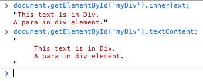

{"title":"DOM の textContent と innerText について","date":"2011-05-17T12:00:00+09:00","tags":["javascript"]}

<!-- DATE: 2011-05-17T23:54:41+00:00 -->
<!-- OLDURL: http://d.hatena.ne.jp/cou929_la/20110517/ -->


一つ前のエントリで JavaScript のトピックスについて紹介しました.

[避けなければいけない JavaScript の失敗 - Please Sleep](http://please-sleep.cou929.nu/20110515.html)

この中でエレメントノードのテキスト部分を取り出す innerText プロパティについて説明していましたが, これは非標準で Firefox ではサポートされていません. 標準になっているものとして textContent というプロパティがあります.

一応エントリ下部のコメント欄紹介ページでこのことについて触れているんですが, もっときちんと取り上げないとフェアじゃない気がしたので, 改めてこの2つのプロパティについて取り急ぎエントリにしました.

## 仕様とブラウザサポート

textContent も innerText もある要素の text 部分にアクセスするためのプロパティです. 例えばこのような html に

```html
<div id="myDiv">
     This text is in Div.
     <p>A para in div element.</p>
</div>
```

こういうふうに js からアクセスすると

```js
document.getElementById('myDiv').innerText;
// または
document.getElementById('myDiv').textContent;
```

このような文字列が返されます.

```
This text is in DIV. A para in div element.
```

Chrome で実行してみた例:



textContent は <a href="http://www.w3.org/TR/DOM-Level-3-Core/core.html#Node3-textContent" target="_blank">W3C で標準化されたプロパティ</a>です. IE 以外のブラウザがサポートしています. 

innerText は IE4 から実装されている IE の独自機能です. Firefox 以外のすべてのブラウザがサポートしています. IE 独自のものなので明文化された仕様はありません.

サイ本6版では次のような, ちょっとクロスブラウザな textContent 関数が紹介されていました. ノードの text が空文字列だった場合, "" は JavaScript では falsy なので, "===" で比較しているのがポイントですね.

```js
/**
 * With one argument, return the textContent or innerText of the element.
 * With two arguments, set the textContent or innerText of element to value.
 */
function textContent(element, value) {
    var content = element.textContent; // Check if textContent is defined
    if (value === undefined) { // No value passed, so return current text
        if (content !== undefined) return content;
        else return element.innerText;
    }
    else { // A value was passed, so set text
        if (content !== undefined) element.textContent = value;
        else element.innerText = value;
    }
}
```

## 両者の違い

両者はだいたい同じような挙動をしますが, いくつかの点では異なっています.

- textContent は script タグの中を返しますが, innerText は返しません
- textContent は空白類の文字 (スペース・タブ・改行など) を html に書いてあるまま返します. innerText はある程度見やすいように変換します

## innerText の挙動の違い

上で述べたように, textContent と innerText の挙動が異なるため, 得られる text も違うものになります. 問題は innerText の挙動もブラウザによって微妙に異なる点です. こちらのブログでは WebKit と IE の innerText で得られるテキストの違いについて触れられています.

<a href="http://clubajax.org/plain-text-vs-innertext-vs-textcontent/" target="_blank">Plain Text vs innerText vs textContent by Mike Wilcox  » Club✩AJAX</a>

またこちらの stackoverflow の回答では, safari 2.x 系での innerText の実装が buggy であると言われています.

<a href="http://stackoverflow.com/questions/1359469/innertext-works-in-ie-but-not-in-firefox" target="_blank">javascript - 'innerText' works in IE, but not in Firefox - Stack Overflow</a>

## 問題への対策

先ほどのブログではブラウザ間の挙動を吸収するような "getPlainText()" という関数が紹介されていました.

<a href="http://clubajax.org/files/lang/plain-text.js" target="_blank">http://clubajax.org/files/lang/plain-text.js</a>

ただ, 個人的には上の StackOverflow での <a href="http://twitter.com/#!/kangax" target="_blank">kangax</a> さんの意見に共感しました.

- innerText や textContent の挙動の差異を吸収するのは大変
- なので, まず要件をもう一度みなおして本当に textContent / innerText が必要か考える. 大抵の場合は innerHTML からタグを取り除くだけで十分.
- 無理ならば DOM Tree を走査して Text ノードを見ていく

## 余談: インラインの script タグ

ちょっと話はそれますが, script タグのちょっと面白い利用法について.

サイ本6版のコラムにもあったのですが, script タグに src 属性を指定せずタグ中に文字列を書くと, ブラウザ上には表示されない文字列になります. 中の文字列は text というプロパティで取得できます. また script 要素の type 属性に "text/javascript" 以外の値を指定すれば JavaScript の処理系もこれを無視してくれます. これを利用すると JavaScript から自由に扱える文字列を script タグの中に書いておくことができます.

現実の利用例としては, <a href="http://ejohn.org/blog/javascript-micro-templating/" target="_blank">John Resig さんがブログで紹介していた小さな関数</a> や <a href="http://icanhazjs.com/" target="_blank">ICanHaz</a> といった js 製のテンプレートエンジンは script タグ (type は text/html) の中にテンプレートを記述するというアプローチをとっています.

## 参考

- <a href="http://www.w3.org/TR/DOM-Level-3-Core/core.html#Node3-textContent" target="_blank">Document Object Model Core</a>
    - W3C の仕様
- <a href="http://clubajax.org/plain-text-vs-innertext-vs-textcontent/" target="_blank">Plain Text vs innerText vs textContent by Mike Wilcox  » Club✩AJAX</a>
    - 両プロパティの違いについて実例が載っていてわかりやすい
- <a href="http://stackoverflow.com/questions/1359469/innertext-works-in-ie-but-not-in-firefox" target="_blank">javascript - 'innerText' works in IE, but not in Firefox - Stack Overflow</a>
    - kangax さんの answer が good
- <a href="http://ejohn.org/blog/javascript-micro-templating/" target="_blank">John Resig -   JavaScript Micro-Templating</a>
    - John Resig さんのテンプレート関数. script タグ内にテンプレート文字列を記述
- <a href="http://icanhazjs.com/" target="_blank">icanhazjs.com - Blog</a>
    - 上と似たアプローチの js 製テンプレートエンジン


<div class="amazlet-box" style="margin-bottom:0px;"><div class="amazlet-image" style="float:left;margin:0px 12px 1px 0px;"><a href="http://www.amazon.co.jp/exec/obidos/ASIN/4873117836/pleasesleep-22/ref=nosim/" name="amazletlink" target="_blank"></a></div><div class="amazlet-info" style="line-height:120%; margin-bottom: 10px"><div class="amazlet-name" style="margin-bottom:10px;line-height:120%"><a href="http://www.amazon.co.jp/exec/obidos/ASIN/4873117836/pleasesleep-22/ref=nosim/" name="amazletlink" target="_blank">初めてのJavaScript 第3版 ―ES2015以降の最新ウェブ開発</a><div class="amazlet-powered-date" style="font-size:80%;margin-top:5px;line-height:120%">posted with <a href="http://www.amazlet.com/" title="amazlet" target="_blank">amazlet</a> at 20.03.08</div></div><div class="amazlet-detail">Ethan Brown <br />オライリージャパン <br />売り上げランキング: 17,881<br /></div><div class="amazlet-sub-info" style="float: left;"><div class="amazlet-link" style="margin-top: 5px"><a href="http://www.amazon.co.jp/exec/obidos/ASIN/4873117836/pleasesleep-22/ref=nosim/" name="amazletlink" target="_blank">Amazon.co.jpで詳細を見る</a></div></div></div><div class="amazlet-footer" style="clear: left"></div></div>
