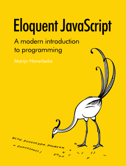

{"title":"プログラミング経験者が JavaScript を学ぶためのリソース","date":"2011-07-21T09:39:44+09:00","tags":["javascript"]}

<!-- DATE: 2011-07-21T00:39:44+00:00 -->
<!-- OLDURL: http://d.hatena.ne.jp/cou929_la/20110721/ -->

久しぶりの更新ですが, お手軽アクセス稼ぎエントリです.

<a href="http://news.ycombinator.com/" target="_blank">Hacker News</a> を見ていたら面白い <a href="http://stackoverflow.com/" target="_blank">StackOverflow</a> の質問を見つけました.

<a href="http://stackoverflow.com/questions/11246/best-resources-to-learn-javascript" target="_blank">Page Not Found - Stack Overflow</a>

プログラミングの経験はあるんだけど, JavaScript を勉強するのに良いリソース (本, ビデオチュートリアル, etc) はない? というもの. リンク集として有用だったので, ここにまとめてみます.

<h4> Douglas Crockford のビデオチュートリアル</h4>

最も支持を集めていたのは Douglas Crockford のビデオシリーズでした. 結構たくさん数があって, 基本を抑えたいなら昔のものが良く, 最近のものも歴史や ES5 のことを扱っていて面白いとのことです.

おそらく一番古いであろう "The JavaScript Programming Language" のシリーズは (全部ではないですが) 見たことがあったんですが, Crockford on JavaScript は知りませんでしたし, 興味を惹かれました.

<h5> The JavaScript Programming Language</h5>

<ul>
<li> <a href="http://yui.zenfs.com/theater/crockford-tjpl-1.m4v" target="_blank">Douglas Crockford: ”The JavaScript Programming Language”/1 of 4</a></li>
<li> <a href="http://yui.zenfs.com/theater/crockford-tjpl-2.m4v" target="_blank">Douglas Crockford: ”The JavaScript Programming Language”/2 of 4</a></li>
<li> <a href="http://yui.zenfs.com/theater/crockford-tjpl-3.m4v" target="_blank">Douglas Crockford: ”The JavaScript Programming Language”/3 of 4</a></li>
<li> <a href="http://yui.zenfs.com/theater/crockford-tjpl-4.m4v" target="_blank">Douglas Crockford: ”The JavaScript Programming Language”/4 of 4</a></li>
</ul>

※m4v ダウンロード注意

<h5> An Inconvenient API: The Theory of the DOM</h5>

<ul>
<li> <a href="http://yui.zenfs.com/theater/crockford-domtheory-1.m4v" target="_blank">Douglas Crockford: ”Theory of the DOM” (1 of 3)</a></li>
<li> <a href="http://yui.zenfs.com/theater/crockford-domtheory-2.m4v" target="_blank">Douglas Crockford: ”Theory of the DOM” (2 of 3)</a></li>
<li> <a href="http://yui.zenfs.com/theater/crockford-domtheory-3.m4v" target="_blank">Douglas Crockford: ”Theory of the DOM” (3 of 3)</a></li>
</ul>

※m4v ダウンロード注意

<h5> Advanced JavaScript</h5>

<ul>
<li> <a href="http://yui.zenfs.com/theater/crockford-advancedjavascript-1.m4v" target="_blank">Douglas Crockford: ”Advanced JavaScript” (1 of 3)</a></li>
<li> <a href="http://yui.zenfs.com/theater/crockford-advancedjavascript-2.m4v" target="_blank">Douglas Crockford: ”Advanced JavaScript” (2 of 3)</a></li>
<li> <a href="http://yui.zenfs.com/theater/crockford-advancedjavascript-3.m4v" target="_blank">Douglas Crockford: ”Advanced JavaScript” (3 of 3)</a></li>
</ul>

※m4v ダウンロード注意

<h5> Crockford on JavaScript</h5>

<a href="http://www.yuiblog.com/crockford/" target="_blank">no title</a>

<ul>
<li> Volume One: The Early Years</li>
<li> Chapter 2: And Then There Was JavaScript </li>
<li> Act III: Function the Ultimate</li>
<li> Episode IV: The Metamorphosis of Ajax</li>
<li> Part 5: The End of All Things</li>
<li> Scene 6: Loopage</li>
</ul>
<h4> JavaScript: The Good Parts</h4>

  
  

    
<a href="http://www.amazon.co.jp/exec/obidos/ASIN/4873113911/pleasesleep-22/ref=nosim/">JavaScript: The Good Parts ―「良いパーツ」によるベストプラクティス</a>

    <ul>
      
      <li>作者: <a href="http://d.hatena.ne.jp/keyword/Douglas%20Crockford" class="keyword">Douglas Crockford</a>,<a href="http://d.hatena.ne.jp/keyword/%BF%E5%CC%EE%B5%AE%CC%C0" class="keyword">水野貴明</a></li>
      
      <li>出版社/メーカー: <a href="http://d.hatena.ne.jp/keyword/%A5%AA%A5%E9%A5%A4%A5%EA%A1%BC%A5%B8%A5%E3%A5%D1%A5%F3" class="keyword">オライリージャパン</a></li>
      
      <li>発売日: 2008/12/22</li>
                                                      <li>メディア: 大型本</li>
      <li>購入: 94人 クリック: 1,643回</li>
      <li><a href="http://d.hatena.ne.jp/asin/4873113911" target="_blank">この商品を含むブログ (191件) を見る</a></li>
    </ul>
  

  

Crockford の著書である本書も同時に薦められていました. この本は 200 ページ程度でコンパクトにまとまっているので, プログラミングの基礎がわかっているが JavaScript は初めてという人には確かに最適だなと思います. 内容はもちろん良いものですし, Crockford 節を楽しみながら読み進めることができます.

<h4> Eloquent JavaScript</h4>

<a href="http://eloquentjavascript.net/" target="_blank">Eloquent JavaScript</a>

各所ですこぶる評判の良い <a href="http://twitter.com/#!/marijnjh" target="_blank">Marijn Haverbeke</a> さんのフリーブックです (<a href="http://www.amazon.com/gp/product/1593272820?ie=UTF8&tag=marijhaver-20&linkCode=as2&camp=1789&creative=9325&creativeASIN=1593272820" target="_blank">print 版</a> もあります). 特徴はなんといっても html でできていてサンプルコードを実行しながら学べる点です. いろんなブログやらなにやらで紹介されていて, もう定番になりつつあると思います. サイトトップには Brendan Eich からの推薦文も載っていてすごいです.

<h4> Mozilla のドキュメント</h4>

<a href="https://developer.mozilla.org/" target="_blank">Mozilla Developer Network</a>

Mozilla Developer Network (旧 MDC) にあるドキュメントです. JavaScript のイントロダクションとしては以下の文章がオススメだそうです (自分は知らなかったです).

<a href="https://developer.mozilla.org/en/A_re-introduction_to_JavaScript" target="_blank">A re-introduction to JavaScript (JS tutorial) - JavaScript | MDN</a>

また MDC (MDN) といえばやはり <a href="https://developer.mozilla.org/en/JavaScript" target="_blank">JavaScript のリファレンス</a> ですね. 関数の使い方などリファレンスをひきたい時は "hogehoge mdc" でググるのはもはや定番です.

<h4> その他</h4>

このへんからはロングテールな意見達です.

<h5> Javascript: The Definitive Guide</h5>

  
  

    
<a href="http://www.amazon.co.jp/exec/obidos/ASIN/0596805527/pleasesleep-22/ref=nosim/">Javascript: The Definitive Guide (Definitive Guides)</a>

    <ul>
      
      <li>作者: <a href="http://d.hatena.ne.jp/keyword/David%20Flanagan" class="keyword">David Flanagan</a></li>
      
      <li>出版社/メーカー: <a href="http://d.hatena.ne.jp/keyword/Oreilly%20%26%20Associates%20Inc" class="keyword">Oreilly & Associates Inc</a></li>
      
      <li>発売日: 2011/05/10</li>
                                                      <li>メディア: ペーパーバック</li>
      <li>購入: 1人 クリック: 151回</li>
      <li><a href="http://d.hatena.ne.jp/asin/0596805527" target="_blank">この商品を含むブログ (3件) を見る</a></li>
    </ul>
  

  

言わずと知れたサイ本です. 全てはここに書いてあるといっても過言ではない, 最強の一冊だと思います. 個人的にはどれか一冊だけ選べと言われたら間違いなくこの本を薦めますが, 網羅的で分厚いので, はじめの一冊として適切かはわかりません.

最近出た第 6 版では HTML5 や ES5, jQuery, Functional な書き方など大幅に加筆修正されていてオススメです.

<h5> YUI Theater</h5>

<a href="http://developer.yahoo.com/yui/theater/" target="_blank">Yahoo Developer Network</a>

おそらく米 Yahoo! での Tech Talk です. JavaScript や HTML 関連の動画が沢山あります. Y 社の中の人の話や YUI の話だけではなく, Ryan Dahl が Node.js について話している動画などもありました.

<h5> DOM scripting</h5>

<a href="http://domscripting.com/book/" target="_blank">DOM Scripting: The book</a>

Jeremy Keith による書籍. 開発者というよりはデザイナ向けだそうです.

<h5> ppk on JavaScript</h5>

<a href="http://www.quirksmode.org/book/" target="_blank">ppk on JavaScript</a>

Peter-Paul Koch 氏による書籍だそうです.

<h5> Koans Projects: JavaScript</h5>

<a href="https://github.com/liammclennan/JavaScript-Koans" target="_blank">GitHub - liammclennan/JavaScript-Koans: javascript koans is an interactive learning environment that uses failing tests to introduce students to aspects of JavaScript in a logical sequence.</a>

qunit のテストケースがたくさんあるんですが, それぞれ expected の値が書かれていません. これらのテストケースを全部通すために書いていくうちに JavaScript が学べるという教材です. コンセプトが面白いです.

<h5> JavaScript Garden</h5>

<a href="http://bonsaiden.github.com/JavaScript-Garden/" target="_blank">JavaScript Garden</a>

JavaScript の tips を集めたようなドキュメントです. 言語の知識を前提にしているので, ひと通り基本を学んだひとが読むと良いかもしれません. サイトのデザインがかっこいいです.

<a href="http://efcl.info/adiary/Javascript/JavaScriptGarden" target="_blank">                Not Found Page | Web Scratch            </a>

日本語の読書メモも.

<h5> John Resig の書籍</h5>

<a href="http://jsninja.com/" target="_blank">Secrets of the JavaScript Ninja: John Resig, Bear Bibeault: 8601400825082: Amazon.com: Books</a>

<a href="http://jspro.org/" target="_blank">DreamHost</a>

jQuery の作者である John Resig の書籍達です. JavaScript Ninja は半分くらい読みましたが, 楽しんで読めるので良いです.

あとは jQuery のソース読めという意見もちらほらありました.

<h5> ECMA-262</h5>

<a href="http://dmitrysoshnikov.com/" target="_blank">ds.laboratory - by Dmitry Soshnikov</a>

ECMA-262 の仕様を深掘りしているブログで面白いです.

<h5> Essential JavaScript Design Patterns For Beginners</h5>

<a href="http://addyosmani.com/resources/essentialjsdesignpatterns/book/" target="_blank">no title</a>

<a href="http://twitter.com/#!/addyosmani" target="_blank">Addy Osmani</a> 氏によるフリーブック. JavaScript のパターンについて.

<h4> まとめと感想</h4>

<a href="http://stackoverflow.com/questions/11246/best-resources-to-learn-javascript" target="_blank">Best resources to learn JavaScript</a> から有益そうなリソースを集めてきました. Crockford 氏の人気がすごかったです.

さてここで唐突に <a href="http://twitter.com/#!/rmurphey" target="_blank">rmurphey</a> さんの記事からの引用ですが, <a href="http://blog.rebeccamurphey.com/getting-better-at-javascript" target="_blank">”The number one thing that will make you better at writing JavaScript is writing JavaScript”</a> という意見に自分は結構同意しています. JavaScript のいいところは人のコードが全部見れるところでもあるので, プログラミングの経験のあるひとならばとにかくコードを読んで作りたいものを作るのが手っ取り早いかもしれませんね.

