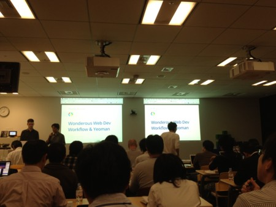

{"title":"Chrome Tech Talk Night #4","date":"2012-10-24T10:05:26+09:00","tags":["conference"]}

<!-- DATE: 2012-10-24T01:05:26+00:00 -->
<!-- OLDURL: http://d.hatena.ne.jp/cou929_la/20121024/ -->

<a href="http://googledevjp.blogspot.jp/2012/10/chrome-tech-talk-night-4.html" target="_blank">Google Developers Japan: Chrome Tech Talk Night #4 を開催します</a>

Paul Irish はじめ Google の Chrome チームがやってくるとのことで, 話を聞きに行って来ました. インターネットで見たことある人がいろいろいてスター軍団という感じがありありです.

<h4> Variations on the Mobile Web (Boris Smus)</h4>

<a href="http://smustalks.appspot.com/japan-12/#1" target="_blank">no title</a>

<a href="https://twitter.com/borismus" target="_blank">Boris Smüs(@borismus)さん | Twitter</a>

モバイルのウェブ開発をするにあたって対処しないといけない問題とその解決方法を紹介するという内容. どういう問題があって, その解決策にどういうアプローチがあって, それぞれにこういう pros, cons があって, というのを丁寧に説明してくれていて非常に面白かったです. トピックは mobile な web dev な方々にはおなじみなのかもしれませんが自分には新鮮でしたし, なにより問題に対処するアプローチを複数出してきてその中でのベストプラクティスを紹介してくれていたのでかなり興味をそそれれました. 遅刻して途中からしか聞けなかったのが悔やまれます.

<ul>
<li> responsive-image

<ul>
<li> client side approach

<ul>
<li> js で src を書き換え

<ul>
<li> look ahead parser 対応がダメ</li>
</ul>
</li>
<li> media query

<ul>
<li> 回線速度を考慮できない</li>
</ul>
</li>
</ul>
</li>
<li> server side apporech

<ul>
<li> ua で反映するしか無い</li>
</ul>
</li>
<li> browser approach

<ul>
<li> image-set

<ul>
<li> <a href="http://www.whatwg.org/specs/web-apps/current-work/multipage/embedded-content-1.html#processing-the-image-candidates" target="_blank">404 Not Found</a></li>
<li> 回線速度も考慮してくれる</li>
<li> まだ chrome, safari だけ</li>
<li> <a href="https://github.com/borismus/srcset-polyfill" target="_blank">GitHub - borismus/srcset-polyfill: [Warning: not for production code]</a></li>
</ul>
</li>
</ul>
</li>
</ul>
</li>
<li> device variation

<ul>
<li> たくさんの端末にどう対応するか</li>
<li> one version to rule them all

<ul>
<li> デバイス間で差異が</li>
</ul>
</li>
<li> a version for each evice

<ul>
<li> デバイス多すぎ</li>
</ul>
</li>
<li> responsive design approach

<ul>
<li> css で条件わけ</li>
<li> 充分でないこともある</li>
<li> form factor に応じて切り替えたい

<ul>
<li> js でやる</li>
</ul>
</li>
</ul>
</li>
<li> multiple versions

<ul>
<li> tablet, phone などで分ける</li>
<li> modernizr の touch サポートチェックなどを使う</li>
</ul>
</li>
<li> <a href="https://github.com/borismus/device.js" target="_blank">GitHub - borismus/device.js: Semantic client-side device detection with Media Queries</a></li>
<li> サーバ上でデバイス判定

<ul>
<li> ua でやる</li>
<li> device db</li>
</ul>
</li>
</ul>
</li>
<li> input variation

<ul>
<li> touch != mouse</li>
<li> dev tool でタッチイベントをエミュレートできる</li>
<li> touch event</li>
<li> mouse & touch 両方をサポートしたい

<ul>
<li> pointer event</li>
<li> mouse / touch event -> pointer event に変換される</li>
<li> <a href="https://github.com/borismus/pointer.js" target="_blank">GitHub - borismus/pointer.js: [deprecated] Pointer.js consolidates pointer-like input models across browsers and devices.</a></li>
</ul>
</li>
<li> ジェスチャーの実装は大変

<ul>
<li> ライブラリがたくさんある</li>
</ul>
</li>
</ul>
</li>
</ul>
<h4> Wonderous Web Dev Workflow & Yeoman (Paul Irish)</h4>

<a href="https://dl.dropbox.com/u/39519/talks/tok-workflow/index.html#2" target="_blank">Google IO 2012</a>

<a href="https://twitter.com/paul_irish" target="_blank">Paul Irish(@paul_irish)さん | Twitter</a>

Yeoman の紹介を中心に, web 開発を楽に楽しくするツールの紹介. とにかく良さ気なツールやサービスが大量に出てきてお腹いっぱいになる発表でした. よさげなツールはあとで消化せねば...

<ul>
<li> bulding web app with very enjoynable way</li>
<li> trivia to valuing tools</li>
<li> your shell

<ul>
<li> <a href="https://github.com/paulirish/dotfiles/blob/master/.bash_prompt" target="_blank">dotfiles/.bash_prompt at master ? paulirish/dotfiles ? GitHub</a></li>
</ul>
</li>
<li> deploy on push

<ul>
<li> github の hook で</li>
</ul>
</li>
<li> yeoman

<ul>
<li> <a href="http://yeoman.io/" target="_blank">The web’s scaffolding tool for modern webapps | Yeoman</a></li>
<li> package management

<ul>
<li> yeoman コマンドでインストールなど</li>
<li> 依存パッケージに新しいバージョンが出たら notify</li>
</ul>
</li>
<li> generators

<ul>
<li> mvc ライブラリと連動していて, yeoman コマンドからコントローラーを足したりできる</li>
</ul>
</li>
<li> Scaffold in a snap</li>
<li> Live-recompile, Live-refresh</li>
<li> Sass, Coffeescript, AMD & ES6 Modules</li>
<li> Run unit tests in headless WebKit via PhantomJS</li>
<li> Robust build script</li>
</ul>
</li>
<li> testing

<ul>
<li> in the browser

<ul>
<li> qunit とか</li>
</ul>
</li>
<li> in headless webkit

<ul>
<li> pahtomjs</li>
<li> yeoman test</li>
</ul>
</li>
<li> in cloud mobile browsers

<ul>
<li> <a href="http://www.browserstack.com/" target="_blank">Cross Browser Testing Tool. 1000+ Browsers, Mobile, Real IE.</a></li>
<li> <a href="https://github.com/ryanseddon/bunyip" target="_blank">GitHub - ryanseddon/bunyip: Automate client-side unit testing in real browsers using the CLI</a></li>
</ul>
</li>
<li> make test more fun

<ul>
<li> nayncat</li>
</ul>
</li>
</ul>
</li>
<li> style iteration & devtools

<ul>
<li> sass + livereload</li>
<li> chrome devtools support for sass</li>
<li> webstorm liveedit</li>
</ul>
</li>
<li> <a href="http://setapp.me/" target="_blank">no title</a>

<ul>
<li> 好きなツールをシェア</li>
</ul>
</li>
<li> continually learn how to develop better</li>
<li> styled console message</li>
<li> questions

<ul>
<li> 環境をどこまでめんどうみてくれるのか (sass だと ruby とか, node とか)

<ul>
<li> 最初に yeoman をインストールするときにチェックして, 必須のものが無ければインストールを促す</li>
<li> インストールを自動化するスクリプトもある</li>
</ul>
</li>
<li> dependency を定義してインストールしてくれるようなものはあるのか

<ul>
<li> まだ無い</li>
<li> いずれ入る</li>
</ul>
</li>
<li> dart や typescript などのサポート

<ul>
<li> まだない</li>
<li> yeoman は grunt.js 上で実装しているから拡張はわりと簡単</li>
<li> 自分で拡張することも可能</li>
</ul>
</li>
<li> grunt から yeoman へのマイグレート

<ul>
<li> yeoman チームでも priority の高い issue</li>
</ul>
</li>
<li> yeoman のパッケージインストール元. github 以外で, 例えば自前リポジトリを使えるようにできるか

<ul>
<li> bower が対応してくれている</li>
</ul>
</li>
</ul>
</li>
</ul>
<h4> LT</h4>

<ul>
<li> opera のダニエルさんの visibility api の話が面白かった

<ul>
<li> <a href="https://developer.mozilla.org/en-US/docs/DOM/Using_the_Page_Visibility_API" target="_blank">Page Visibility API - Web APIs | MDN</a></li>
<li> <a href="http://dvcs.w3.org/hg/webperf/raw-file/tip/specs/PageVisibility/Overview.html" target="_blank">Page Visibility</a></li>
<li> ページが visible かどうかを通知するイベント</li>
<li> タブがインアクティブの時はアニメーションを止めて cpu 負荷を下げたり, などの使い道がある</li>
</ul>
</li>
<li> <a href="https://developers.google.com/live/" target="_blank">  Google Developers - YouTube</a>

<ul>
<li> google の開発関連の生放送チャンネル</li>
<li> その場でコミュニケーションしたり投票したり</li>
</ul>
</li>
</ul>

