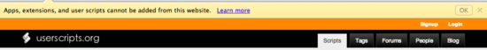

{"title":"ユーザースクリプトを userscripts.org から Chrome にインストールできなくなっていた","date":"2012-11-05T07:42:16+09:00","tags":["javascript"]}

<!-- DATE: 2012-11-04T22:42:16+00:00 -->
<!-- OLDURL: http://d.hatena.ne.jp/cou929_la/20121104/ -->

知らなかったんですが, userscripts.org から Chrome にユーザースクリプトをインストールできなくなっています. こんなアラートがでます.

セキュリティ上の理由より, Chrome 21 からは google のストア以外からのエクステンションやユーザースクリプトのインストールはできないようになっているらしいです.

<a href="http://userscripts.org/topics/113176" target="_blank">no title</a>

インストールしたい場合は,

<ol>
<li> スクリプトをローカルに落として</li>
<li> Chrome のエクステンションの画面を開いて (chrome://extensions/)</li>
<li> ローカルのファイルをドラッグアンドドロップ</li>
</ol>

という手順でないといけなくなってしまいました.

以前の挙動にもどすには,

<ol>
<li> Chrome の起動時に '--enable-easy-off-store-extension-install' というオプションを付ける</li>
<li> ポリシーリストの ExtensionInstallSources に許可する url を追加する

<ul>
<li> <a href="http://www.chromium.org/administrators/policy-list-3#ExtensionInstallSources" target="_blank">Policy List - The Chromium Projects</a></li>
</ul>
</li>
</ol>

試していないのですが, これらの方法でいいけるそうです. chrome://flags には設定項目はないそう.

詳しくないんですがそこまでするほどに悪意を持ったエクステンション / ユーザースクリプトなどが最近増えているのか, はたまたストアのマーケティング的な意図なのか. エクステンションはともかくユーザースクリプトはオフィシャルなマーケットプレイスのような場が無いので, もういまどき流行らないんでしょうかね...

<h4> 参考</h4>

<ul>
<li> <a href="http://support.google.com/chrome_webstore/bin/answer.py?hl=en&answer=2664769&p=crx_warning" target="_blank">Install and manage extensions - Chrome Web Store Help</a></li>
</ul>

