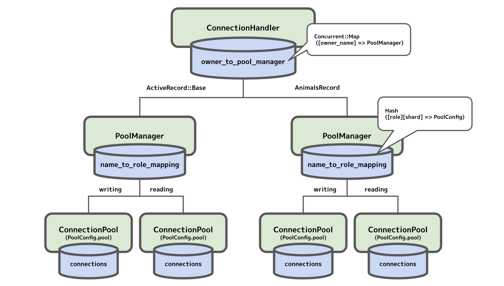
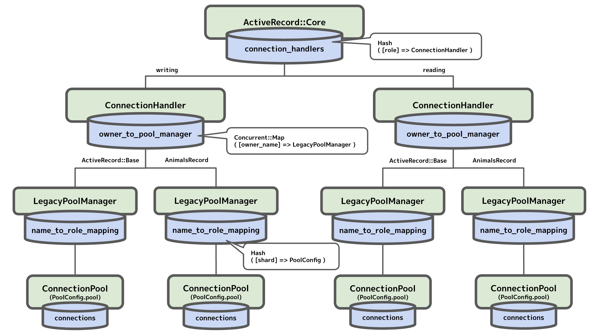
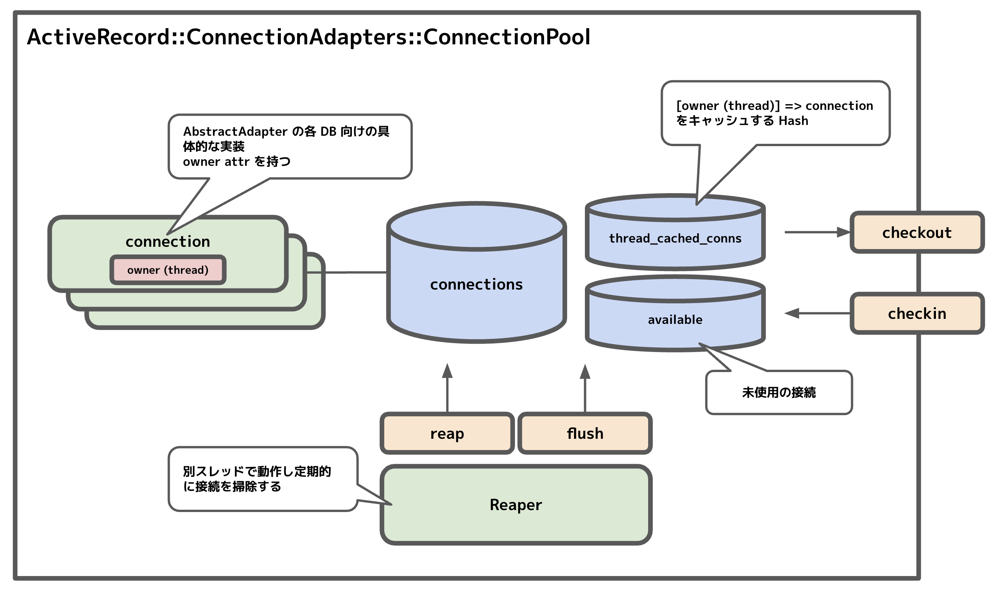
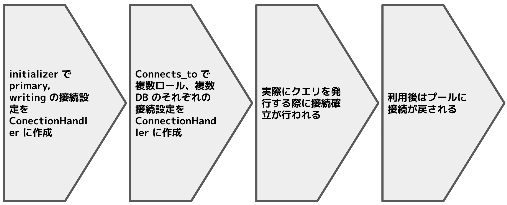

{"title":"ActiveRecord の接続管理の仕組み","date":"2022-02-07T23:30:00+09:00","tags":["rails"]}

ActiveRecord がデータベースとの接続をどう管理しているのかを調べたメモ。主に [active_record/connection_adapters](https://github.com/rails/rails/tree/20846a20dcc05206220e15633b4977fc5b7c7818/activerecord/lib/active_record/connection_adapters) 以下の話。現時点での [main ブランチの HEAD](https://github.com/rails/rails/tree/2b3af27d8232db8def0c6600e89a714287381e18) を参照した。

詰まったときに調べる箇所のあたりを付けられるよう全体観を持ちたいという目的だったので、細かい部分まで把握しきれていはおらず、ご了承ください。

## ActiveRecord の使い方のおさらい

まず最初にユーザーとして、ActiveRecord でデータベースにクエリを発行する際の流れを簡単におさらいする。

まずデータベースの接続情報を `database.yml` に記載する。ここではメインとなる primay DB と animals DB の 2 つがあり、またそれぞれに primary (master) と replica があるとする (この例は [Active Record で複数のデータベース利用 \- Railsガイド](https://railsguides.jp/active_record_multiple_databases.html) から引用)。

```yaml
production:
  primary:
    database: my_primary_database
    username: root
    password: <%= ENV['ROOT_PASSWORD'] %>
    adapter: mysql2
  primary_replica:
    database: my_primary_database
    username: root_readonly
    password: <%= ENV['ROOT_READONLY_PASSWORD'] %>
    adapter: mysql2
    replica: true
  animals:
    database: my_animals_database
    username: animals_root
    password: <%= ENV['ANIMALS_ROOT_PASSWORD'] %>
    adapter: mysql2
    migrations_paths: db/animals_migrate
  animals_replica:
    database: my_animals_database
    username: animals_readonly
    password: <%= ENV['ANIMALS_READONLY_PASSWORD'] %>
    adapter: mysql2
    replica: true
```

これらのデータベースへの接続は抽象クラスで定義する。まずは `ActiveRecord::Base` を継承した `ApplicationRecord` で `connects_to` メソッドを使い `primary` への接続を記載する。それぞれ `writing` `reading` という role 名。なおここでの `ApplicationRecord` や `writing` `reading` といった命名は規約で定められている。

```ruby
class ApplicationRecord < ActiveRecord::Base
  self.abstract_class = true

  connects_to database: { writing: :primary, reading: :primary_replica }
end
```

animals DB への接続は別の抽象クラスを定義する。

```ruby
class AnimalsRecord < ApplicationRecord
  self.abstract_class = true

  connects_to database: { writing: :animals, reading: :animals_replica }
end
```

これらの抽象クラスを継承したモデルクラスにて、それぞれの DB へクエリが発行される。

```ruby
class Person < ApplicationRecord
end

class Dog < AnimalsRecord
end

Person.find(1)  # primary DB へ SELECT
Dog.find(1)  # animals DB へ SELECT

# 抽象クラスで connected_to を使うとモデルごとに接続先 role を切り替えられる。
ApplicationRecord.connected_to(role: :reading) do
  Person.find(1)  # primary DB の reading role を指定して SELECT
  Dog.find(1)  # こちらは animals DB の writing のまま
end

# Base.connected_to はすべての role を一括で切り替える
ActiveRecord::Base.connected_to(role: :reading) do
  Person.find(1)  # primary DB の reading role を指定して SELECT
  Dog.find(1)  # こちらも animals DB の reading role を指定子て SELECT
end
```

## ActiveRecord::ConnectionAdapters::ConnectionHandler

まずは接続がどのように保持されているのかを中心に見ていく。

「おさらい」にあったように ActiveRecord は `ApplicationRecord` や `AnimalsRecord` などの抽象クラスごと、さらにその中の `role` ごとに別のデータベースを参照するようにできている (実際にはさらに `shard` という概念もあるが簡単のため今回は省略)。この `抽象クラス x role` ごとに接続プールが別々に用意されている。`ConnectionHandler` とその周辺のクラスがこれらの接続プールを管理している。

全体像はこんな感じで、ツリー構造で各プールを保持している。



ConnectionHandler クラスは [@owner_to_pool_manager という属性](https://github.com/rails/rails/blob/2b3af27d8232db8def0c6600e89a714287381e18/activerecord/lib/active_record/connection_adapters/abstract/connection_handler.rb#L77) を持ち、`owner` ごとに [PoolManager](https://github.com/rails/rails/blob/2b3af27d8232db8def0c6600e89a714287381e18/activerecord/lib/active_record/connection_adapters/pool_manager.rb#L5) のインスタンスを保持している。

ここでキーとなっている `owner` とは、そのモデルがどの DB に接続するかを定義している抽象クラスの名前で、今回の例だと `ApplicationRecord` や `AnimalsRecord` にあたる。ただし `ApplicationRecord` の場合は `ActiveRecord::Base` が [代わりに](https://github.com/rails/rails/blob/2b3af27d8232db8def0c6600e89a714287381e18/activerecord/lib/active_record/connection_handling.rb#L350) [使われる](https://github.com/rails/rails/blob/2b3af27d8232db8def0c6600e89a714287381e18/activerecord/lib/active_record/connection_handling.rb#L293-L294)。またこの `owner (owner_name)` はコードの各所 ([ConnectionHandling](https://github.com/rails/rails/blob/2b3af27d8232db8def0c6600e89a714287381e18/activerecord/lib/active_record/connection_handling.rb#L286) や [PoolConfig](https://github.com/rails/rails/blob/2b3af27d8232db8def0c6600e89a714287381e18/activerecord/lib/active_record/connection_adapters/pool_config.rb#L30))では `connection_specification_name` という名前の属性でアクセスできるようになっているので、こちらが正式名称かもしれない。

値となっている `pool_manager` とは、[`role` と `shard` ごとに接続プールを保持しているクラス](https://github.com/rails/rails/blob/2b3af27d8232db8def0c6600e89a714287381e18/activerecord/lib/active_record/connection_adapters/pool_manager.rb#L5)。[name_to_role_mapping](https://github.com/rails/rails/blob/2b3af27d8232db8def0c6600e89a714287381e18/activerecord/lib/active_record/connection_adapters/pool_manager.rb#L7) という Hash を属性として持っている。ここで [@name_to_role_mapping[role][shard] = pool_config](https://github.com/rails/rails/blob/2b3af27d8232db8def0c6600e89a714287381e18/activerecord/lib/active_record/connection_adapters/pool_manager.rb#L40) という形で接続プールを保持している。[PoolConfig](https://github.com/rails/rails/blob/2b3af27d8232db8def0c6600e89a714287381e18/activerecord/lib/active_record/connection_adapters/pool_config.rb) は名前の通りその接続プールとその設定を持っているクラスで、[`PoolConfig.pool` 属性に接続プールの実態を保持している](https://github.com/rails/rails/blob/2b3af27d8232db8def0c6600e89a714287381e18/activerecord/lib/active_record/connection_adapters/pool_config.rb#L56)

ちなみにこのような構造になったのはおそらく 6.1 からで、それ以前は次のような構造だった。



`ConnectionHandler` の上に `connection_handlers` というもう 1 階層があり、`role` はここで管理されていた。[Ruby on Rails 6\.1 リリースノート \- Railsガイド](https://railsguides.jp/6_1_release_notes.html#%E3%83%87%E3%83%BC%E3%82%BF%E3%83%99%E3%83%BC%E3%82%B9%E5%8D%98%E4%BD%8D%E3%81%AE%E3%82%B3%E3%83%8D%E3%82%AF%E3%82%B7%E3%83%A7%E3%83%B3%E5%88%87%E3%82%8A%E6%9B%BF%E3%81%88) にあるように、以前は role を切り替えるとすべてのデータベースで (`ApplicationRecord`, `AnimalsRecord` 共に) role が切り替わっていたのが、6.1 以降はデータベースごとに切り替えられるようになったらしい。確かにこのような、最上位の層で role を保持する持ち方だと全体が切り替わるようになってしまうのは納得できる。現時点では `legacy_connection_handling` というフラグで新旧のデータ構造が切り替わるようになっている ([1](https://github.com/rails/rails/blob/2b3af27d8232db8def0c6600e89a714287381e18/activerecord/lib/active_record/railtie.rb#L273), [2](https://github.com/rails/rails/blob/2b3af27d8232db8def0c6600e89a714287381e18/activerecord/lib/active_record/connection_handling.rb#L138) など)。

## ActiveRecord::ConnectionAdapters::ConnectionPool

このクラスが実際にデータベースへの接続を保持して、アプリケーションから接続を要求されるとそれを確保して渡したり、使用後に回収したりする役割を担っている。「コネクションプールを提供するライブラリ」と言われてぱっと想像するのがこのクラスだと思う。自分が過去に読んだところだと [Go の sql.DB](https://please-sleep.cou929.nu/go-sql-db-connection-pool.html) に近い部分。

全体像はこんな感じ。



[@connections](https://github.com/rails/rails/blob/2b3af27d8232db8def0c6600e89a714287381e18/activerecord/lib/active_record/connection_adapters/abstract/connection_pool.rb#L145) という配列にすべての接続を保持している。このデータがこのクラスの中心。このうち利用されていない「フリー」な接続は [@available](https://github.com/rails/rails/blob/2b3af27d8232db8def0c6600e89a714287381e18/activerecord/lib/active_record/connection_adapters/abstract/connection_pool.rb#L155) にも入っている。`@available` は [FIFO +アルファなキューらしい](https://github.com/rails/rails/blob/2b3af27d8232db8def0c6600e89a714287381e18/activerecord/lib/active_record/connection_adapters/abstract/connection_pool/queue.rb#L197) が詳しくは見ていない。

接続プールから接続を取り出すメソッドが [checkout](https://github.com/rails/rails/blob/2b3af27d8232db8def0c6600e89a714287381e18/activerecord/lib/active_record/connection_adapters/abstract/connection_pool.rb#L340)、反対に使い終わった接続を戻すメソッドが [checkin](https://github.com/rails/rails/blob/2b3af27d8232db8def0c6600e89a714287381e18/activerecord/lib/active_record/connection_adapters/abstract/connection_pool.rb#L349)。

`checkout` では [まず available を確認しなければ新規接続を確立する](https://github.com/rails/rails/blob/2b3af27d8232db8def0c6600e89a714287381e18/activerecord/lib/active_record/connection_adapters/abstract/connection_pool.rb#L640)。この時 [database.yml などで指定する pool オプション](https://github.com/rails/rails/blob/2b3af27d8232db8def0c6600e89a714287381e18/activerecord/lib/active_record/connection_adapters/abstract/connection_pool.rb#L86) の [数以上に接続ができないよう制御されている](https://github.com/rails/rails/blob/2b3af27d8232db8def0c6600e89a714287381e18/activerecord/lib/active_record/connection_adapters/abstract/connection_pool.rb#L671-L673) (`pool` のデフォルトは 5)。上限に達して新規接続を確立できない場合は、[lost した接続の解放を試みたうえで、タイムアウトまで待つ](https://github.com/rails/rails/blob/2b3af27d8232db8def0c6600e89a714287381e18/activerecord/lib/active_record/connection_adapters/abstract/connection_pool.rb#L643-L644)。実際の接続確立処理は [各データベース実装に移譲](https://github.com/rails/rails/blob/2b3af27d8232db8def0c6600e89a714287381e18/activerecord/lib/active_record/connection_adapters/abstract/connection_pool.rb#L656) されている。

`checkin` では接続の利用を解放し [`available` に登録する](https://github.com/rails/rails/blob/2b3af27d8232db8def0c6600e89a714287381e18/activerecord/lib/active_record/connection_adapters/abstract/connection_pool.rb#L358)。その際に接続の [未使用時間のカウント @idle_since を更新](https://github.com/rails/rails/blob/2b3af27d8232db8def0c6600e89a714287381e18/activerecord/lib/active_record/connection_adapters/abstract_adapter.rb#L273) し、後述の一定時間利用のない接続を閉じる処理で利用する。

接続の実態を表すクラスは [AbstractAdapter](https://github.com/rails/rails/blob/2b3af27d8232db8def0c6600e89a714287381e18/activerecord/lib/active_record/connection_adapters/abstract_adapter.rb) という抽象クラスを実装している各データベースのクラスで、例えば MySQL なら [Mysql2Adapter](https://github.com/rails/rails/blob/2b3af27d8232db8def0c6600e89a714287381e18/activerecord/lib/active_record/connection_adapters/mysql2_adapter.rb#L32) などとなる。特徴的なのは [`owner` という属性](https://github.com/rails/rails/blob/2b3af27d8232db8def0c6600e89a714287381e18/activerecord/lib/active_record/connection_adapters/abstract_adapter.rb#L42) を持っていることで、ここには [その接続を使用している thread の識別子が入っている](https://github.com/rails/rails/blob/2b3af27d8232db8def0c6600e89a714287381e18/activerecord/lib/active_record/connection_adapters/abstract_adapter.rb#L236) (なお fiber にも対応しているが以降は簡単のため thread のみを考えて記載)。ActiveRecord では接続はスレッドごとに 1 つになるように制御されている。[thread_cached_conns](https://github.com/rails/rails/blob/2b3af27d8232db8def0c6600e89a714287381e18/activerecord/lib/active_record/connection_adapters/abstract/connection_pool.rb#L143) という `[thread (= owner)] => connection` を保持するキャッシュがあり、[接続を取得しようとした際はまずこのキャッシュを見て、なければプールから取得する](https://github.com/rails/rails/blob/2b3af27d8232db8def0c6600e89a714287381e18/activerecord/lib/active_record/connection_adapters/abstract/connection_pool.rb#L181) ようになっている。また接続の状態が `in_use?` かどうかの判定は、この [`owner (= thread)` 属性があるかどうかで行われて](https://github.com/rails/rails/blob/2b3af27d8232db8def0c6600e89a714287381e18/activerecord/lib/active_record/connection_adapters/abstract_adapter.rb#L43) いて、接続を利用する際に [`in_use? = true` だとエラーになるよう制御されている](https://github.com/rails/rails/blob/2b3af27d8232db8def0c6600e89a714287381e18/activerecord/lib/active_record/connection_adapters/abstract_adapter.rb#L225-L233)。

プールのいわゆる「お掃除」処理は [Reaper](https://github.com/rails/rails/blob/2b3af27d8232db8def0c6600e89a714287381e18/activerecord/lib/active_record/connection_adapters/abstract/connection_pool/reaper.rb#L15) というクラスが担当している。[別スレッドて定期的](https://github.com/rails/rails/blob/2b3af27d8232db8def0c6600e89a714287381e18/activerecord/lib/active_record/connection_adapters/abstract/connection_pool/reaper.rb#L39) に [reap と flush メソッドを呼び出している](https://github.com/rails/rails/blob/2b3af27d8232db8def0c6600e89a714287381e18/activerecord/lib/active_record/connection_adapters/abstract/connection_pool/reaper.rb#L53-L54)。[reap](https://github.com/rails/rails/blob/2b3af27d8232db8def0c6600e89a714287381e18/activerecord/lib/active_record/connection_adapters/abstract/connection_pool.rb#L397) は lost した接続、つまり [checkin し忘れてそのスレッドも終了しているもの](https://github.com/rails/rails/blob/2b3af27d8232db8def0c6600e89a714287381e18/activerecord/lib/active_record/connection_adapters/abstract/connection_pool.rb#L401) などを [解放する](https://github.com/rails/rails/blob/2b3af27d8232db8def0c6600e89a714287381e18/activerecord/lib/active_record/connection_adapters/abstract/connection_pool.rb#L408-L413)。[flush](https://github.com/rails/rails/blob/2b3af27d8232db8def0c6600e89a714287381e18/activerecord/lib/active_record/connection_adapters/abstract/connection_pool.rb#L420) は一定時間以上利用されていない接続を切断する。時間は [idle_timeout](https://github.com/rails/rails/blob/2b3af27d8232db8def0c6600e89a714287381e18/activerecord/lib/active_record/connection_adapters/abstract/connection_pool.rb#L87-L89) というオプションで指定でき、デフォルトは 300 秒。reap とは異なり切断した接続は [@connections からも削除される](https://github.com/rails/rails/blob/2b3af27d8232db8def0c6600e89a714287381e18/activerecord/lib/active_record/connection_adapters/abstract/connection_pool.rb#L430-L431)。

## Life of a connection

ここまで CoonectionAdapters 以下で接続がどう保持されているかを中心に見てきたので、ここでは視点を変えて、接続の設定管理 - 接続確立 - 利用がの流れにそって処理を追ってみる。



まず Rails 起動時に [active_record.initialize_database](https://github.com/rails/rails/blob/2b3af27d8232db8def0c6600e89a714287381e18/activerecord/lib/active_record/railtie.rb#L271) が呼ばれる。ここでは [設定ファイル database.yml の読み込み](https://github.com/rails/rails/blob/2b3af27d8232db8def0c6600e89a714287381e18/activerecord/lib/active_record/railtie.rb#L276) をしたあとに引数無しで [establish_connection](https://github.com/rails/rails/blob/2b3af27d8232db8def0c6600e89a714287381e18/activerecord/lib/active_record/railtie.rb#L278) を呼び出している。

[establish_connection](https://github.com/rails/rails/blob/2b3af27d8232db8def0c6600e89a714287381e18/activerecord/lib/active_record/connection_handling.rb#L49) は `ConnectionHandler` 以下の必要なデータを設定していく処理で、その名前とは裏腹に実際の接続確立は行われない。

まず引数または設定ファイルから対応する接続情報を取得する。指定がない場合は [現在の環境](https://github.com/rails/rails/blob/2b3af27d8232db8def0c6600e89a714287381e18/activerecord/lib/active_record/connection_handling.rb#L50) の[設定中の最初のエントリが選択される](https://github.com/rails/rails/blob/2b3af27d8232db8def0c6600e89a714287381e18/activerecord/lib/active_record/database_configurations.rb#L74-L79)。`owner_name` は `ActiveRecord::Base` 、`role` は [:writing](https://github.com/rails/rails/blob/2b3af27d8232db8def0c6600e89a714287381e18/activerecord/lib/active_record/core.rb#L235) が選ばれる。こうして選択された接続情報、`owner`、`role` で [ConnectionHandler.establish_connection](https://github.com/rails/rails/blob/2b3af27d8232db8def0c6600e89a714287381e18/activerecord/lib/active_record/connection_adapters/abstract/connection_handler.rb#L126) を呼び出す。`ConnectionHandler.establish_connection` は前述の構造に沿ってデータを配置していくが、このとき同じ `owner_name (= connection_specification_name)` の接続データがすでにある場合、[先にそれ削除し実接続があればそれも切断する](https://github.com/rails/rails/blob/2b3af27d8232db8def0c6600e89a714287381e18/activerecord/lib/active_record/connection_adapters/abstract/connection_handler.rb#L134-L136)。実際の接続確立はまだ行わない。

Rails アプリを [テンプレート](https://github.com/rails/rails/blob/f95c0b7e96eb36bc3efc0c5beffbb9e84ea664e4/activerecord/lib/rails/generators/active_record/application_record/templates/application_record.rb.tt) から作った直後などのシンプルな状態の場合、ここまでの `active_record.initialize_database` だけで必要な情報が `ConnectionHandler` に揃う。reading role 追加や複数 DB 対応をしている場合は、前述の例のように抽象クラスで [connects_to](https://github.com/rails/rails/blob/2b3af27d8232db8def0c6600e89a714287381e18/activerecord/lib/active_record/connection_handling.rb#L81) で接続先をさらに指定することができる。その場合は `connects_to` が [渡されたデータベースや role について順に establish_connection を呼び出す](https://github.com/rails/rails/blob/2b3af27d8232db8def0c6600e89a714287381e18/activerecord/lib/active_record/connection_handling.rb#L90-L96) ので、ここですべてのデータが `ConnectionHandler` 以下のツリー構造に揃うことになる。

実際の接続確立はデータベースに対して何らかの操作をするときに行われる。例えば適当なモデルから [find](https://github.com/rails/rails/blob/2b3af27d8232db8def0c6600e89a714287381e18/activerecord/lib/active_record/core.rb#L268) などを呼び出すと、[ConnectionHandling.connection](https://github.com/rails/rails/blob/2b3af27d8232db8def0c6600e89a714287381e18/activerecord/lib/active_record/connection_handling.rb#L90-L96) で接続を取得しそれを利用する。このとき `ConnectionHandling.connection` はそのクラスの [connection_specification_name, role で](https://github.com/rails/rails/blob/2b3af27d8232db8def0c6600e89a714287381e18/activerecord/lib/active_record/connection_handling.rb#L313) `ConnectionPool.connection` を [呼び出す](https://github.com/rails/rails/blob/2b3af27d8232db8def0c6600e89a714287381e18/activerecord/lib/active_record/connection_adapters/abstract/connection_handler.rb#L211)。`ConnectionPool.connection` では [@thread_chached_conn にあれば (= 同じスレッドで接続したことがあれば) それを、なければ checkout して接続を返す](https://github.com/rails/rails/blob/2b3af27d8232db8def0c6600e89a714287381e18/activerecord/lib/active_record/connection_adapters/abstract/connection_pool.rb#L181)。つまり、それ以前に接続が無かった場合はこのタイミングで接続確立されることになる。

似たような役割のより便利インタフェースとして、ブロックを渡すとその前後で `connection`, `relase_connection` してくれる [with_connection](https://github.com/rails/rails/blob/2b3af27d8232db8def0c6600e89a714287381e18/activerecord/lib/active_record/connection_adapters/abstract/connection_pool.rb#L210) というメソッドも用意されている。またもちろん、ユーザー側で管理して生の `checkout`, `checkin` を使うこともできる。

ここまで見てきた `ConnectionHandler` のツリー構造を見るとわかるように、どのデータベースにクエリを発行するかは、その処理を度のクラス (モデル) から行うかに依存する。例えば今回の例だと `AnimalsRecord` を継承した `Dog` クラスは `AnimalsRecord` で指定された `animals` DB へクエリを発行するし、`ActiveRecord::Base.connection` は `ApplicationRecord` で指定された `primary` DB へクエリを発行する。仮に `ActiveRecord::Base.establish_connection( animals DB への接続情報 )` などとすると `@owner_to_pool_manager` の `ActiveRecord::Base` のエントリが `animals` DB のものに置き換えられ、`animals` にクエリが飛ぶことになるので、通常はこのような使い方はしないはず。あくまでどの DB にクエリを飛ばすかはモデルで区別する設計になっている。

その中でどの `role` (と `shard`) にクエリを発行するかは [database_selector](https://railsguides.jp/active_record_multiple_databases.html#%E3%83%AD%E3%83%BC%E3%83%AB%E3%81%AE%E8%87%AA%E5%8B%95%E5%88%87%E3%82%8A%E6%9B%BF%E3%81%88%E3%82%92%E6%9C%89%E5%8A%B9%E3%81%AB%E3%81%99%E3%82%8B) という仕組みが自動でやってくれたりはするが、[ActiveRecord::Base.connected_to](https://github.com/rails/rails/blob/2b3af27d8232db8def0c6600e89a714287381e18/activerecord/lib/active_record/connection_handling.rb#L137) でユーザーが手動で指定することもできる。これはあくまで `role` を指定するための仕組みで、前述のように構造上データベースを切り替えることはあまり想定されていないと思われる。

`connected_to` は前述の例のように `ActiveRecord::Base.connected_to` と呼び出すか、抽象クラス `ApplicationRecord.connected_to` と呼び出すかで挙動が変わる。複数のデータベースがあった場合、前者はすべての DB に対して role を指定するが、後者はその抽象クラスの子クラスの role だけを切り替える。これは [ActiveRecord::Core の connected_to_stack という配列](https://github.com/rails/rails/blob/bad8e773350f8241caa8b4cb2a23e3869c725ee4/activerecord/lib/active_record/core.rb#L201) で実現されている。`connected_to` を呼び出すと [connected_to_stack に呼び出したクラスと role を記録する](https://github.com/rails/rails/blob/bad8e773350f8241caa8b4cb2a23e3869c725ee4/activerecord/lib/active_record/connection_handling.rb#L373)。その後接続取得時に current_role を参照する際、[connected_to_stack の中身を見て role を判別している](https://github.com/rails/rails/blob/bad8e773350f8241caa8b4cb2a23e3869c725ee4/activerecord/lib/active_record/core.rb#L152-L153)。Base クラスのエントリがあればそのロールを、そうでなく自分の親の抽象クラスのエントリがあればそれを使うといった具合。

## misc

- Go の [sql.DB で言う SetConnMaxLifetime](https://please-sleep.cou929.nu/go-sql-db-connection-pool.html) のような、接続がプールに入って一定時間経ったら開放される仕組みは無さそうに見えた
  - フォーラムにそのような要望があったので、いまは無いということように見える ([1](https://discuss.rubyonrails.org/t/feature-proposal-active-record-connection-maximum-lifetime/79249), [2](https://discuss.rubyonrails.org/t/feature-proposal-activerecord-connection-lifetime-age/78620))。コード上も見当たらなかった
- 接続プールのパラメータをどう設定するのが良いかは次の記事が参考になりそうだった
  - [Concurrency and Database Connections in Ruby with ActiveRecord \| Heroku Dev Center](https://devcenter.heroku.com/articles/concurrency-and-database-connections)
  - サーバのワーカースレッド数や Sidekiq のワーカースレッド数にあわせる
- テストではデフォルトで 1 トランザクション中でデータベースを読み書きし、ケースの終了後にロールバックすることで高速化する仕組みが導入されている
  - setup 時に [ConnectionHandler 内を直接置き換えて、reading role への接続も writing へ飛ぶようにしている](https://github.com/rails/rails/blob/2b3af27d8232db8def0c6600e89a714287381e18/activerecord/lib/active_record/test_fixtures.rb#L195)
  - かつ [lock_thread](https://github.com/rails/rails/blob/2b3af27d8232db8def0c6600e89a714287381e18/activerecord/lib/active_record/connection_adapters/abstract/connection_pool.rb#L167) という仕組みで、メインスレッドが保有する DB 接続を他のスレッドからも使うよう強制している
  - 並列したトランザクションをテストしたい場合など、この仕組をオフにしたいときは [`use_transactional_tests` というフラグ](https://github.com/rails/rails/blob/9bb2512485d968a0d682e302b9c0831c43174a8f/activerecord/lib/active_record/test_fixtures.rb#L23) を [オフにすればよい](https://github.com/rails/rails/blob/2b3af27d8232db8def0c6600e89a714287381e18/activerecord/lib/active_record/test_fixtures.rb#L101)
    - 以前は [use_transactional_fixtures というフラグ名だったらしい](https://www.bigbinary.com/blog/rails-5-renamed-transactional-fixtures-to-transactional-tests)
- この transactional test の仕組みと、サードパーティのテストフレームワークがどのように協調しているかは、まだあまりよくわかっていない
  - 例えば test-prof には前述の [lock_thread の仕組みを使っている部分があったりする](https://github.com/test-prof/test-prof/blob/936b29f87b36f88a134e064aa6d8ade143ae7a13/lib/test_prof/before_all/adapters/active_record.rb#L47)

## 参考

- [rails/activerecord at main · rails/rails](https://github.com/rails/rails/tree/main/activerecord)
- [Active Record で複数のデータベース利用 \- Railsガイド](https://railsguides.jp/active_record_multiple_databases.html)
- [Rails テスティングガイド \- Railsガイド](https://railsguides.jp/testing.html)
- [Concurrency and Database Connections in Ruby with ActiveRecord \| Heroku Dev Center](https://devcenter.heroku.com/articles/concurrency-and-database-connections)

## PR

<div class="amazlet-box" style="margin-bottom:0px;"><div class="amazlet-image" style="float:left;margin:0px 12px 1px 0px;"><a href="http://www.amazon.co.jp/exec/obidos/ASIN/B08D3DW7LP/pleasesleep-22/ref=nosim/" name="amazletlink" target="_blank"></a></div><div class="amazlet-info" style="line-height:120%; margin-bottom: 10px"><div class="amazlet-name" style="margin-bottom:10px;line-height:120%"><a href="http://www.amazon.co.jp/exec/obidos/ASIN/B08D3DW7LP/pleasesleep-22/ref=nosim/" name="amazletlink" target="_blank">パーフェクト Ruby on Rails　【増補改訂版】</a></div><div class="amazlet-detail">すがわら まさのり  (著), 前島 真一  (著), 橋立 友宏 (著), 五十嵐 邦明  (著), 後藤 優一 (著)  形式: Kindle版<br/></div><div class="amazlet-sub-info" style="float: left;"><div class="amazlet-link" style="margin-top: 5px"><a href="http://www.amazon.co.jp/exec/obidos/ASIN/B08D3DW7LP/pleasesleep-22/ref=nosim/" name="amazletlink" target="_blank">Amazon.co.jpで詳細を見る</a></div></div></div><div class="amazlet-footer" style="clear: left"></div></div>
