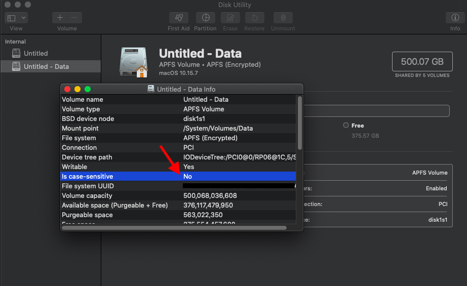
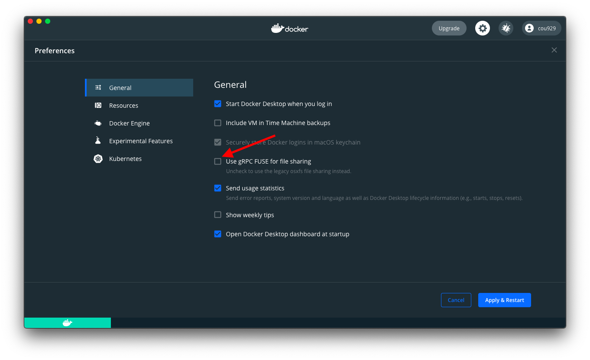

{"title":"Docker Desktop for Mac でホスト側をマウントしたディレクトリはファイル名が case-insensitive","date":"2021-03-29T14:46:00+09:00","tags":["docker"]}

特になにもせずデフォルト設定の場合、Docker Deskopt for Mac で `docker run -v` などでマウントしたディレクトリはファイル名が大文字小文字を区別しない。

たぶんあるあるだけどちょっと驚いたのでメモ。

## そもそも Mac のデフォルトが case-insensitive

そもそも Mac では昔からデフォルトで case-insensitive だったらしい。今までまったく気づいていなかった...

過去の Docker Desktop のドキュメントには、High Sierra からデフォルトになった `APFS` でも、それ以前の `HFS+` でも case-insensitive がデフォルトだったとある。

> On macOS Sierra and lower, the default file system is **HFS+**. On macOS High Sierra, the default file system is **APFS**. Both are case-insensitive by default
> 
> [Remove osxfs topics from Desktop docs · docker/docker\.github\.io@d400d93](https://github.com/docker/docker.github.io/commit/d400d938e6f1fc07a455ff6a9eb3c9216f166c52#diff-124453101199ad6385df8981138b4ede623649e8b8b62ee7782be41830034b3aL14-L29)

Disk Utility をみるとたしかに `Is Case Sensitive: No` となっていた。



適当に実験。`test` と `Test` というファイルを touch すると両方成功。`Test` `tEsT` などと stat してみても、同じ inode が返される。

```sh
$ touch test
$ touch Test

# 最初に作った `test` だけが存在
$ ls -l
total 0
-rw-r--r--  1 cou929  staff  0  3 29 14:12 test

# 12897926547 が inode 番号
$ stat test
16777221 12897926547 -rw-r--r-- 1 cou929 staff 0 0 "Mar 29 14:12:34 2021" "Mar 29 14:12:34 2021" "Mar 29 14:12:34 2021" "Mar 29 14:12:32 2021" 4096 0 0 test
$ stat Test
16777221 12897926547 -rw-r--r-- 1 cou929 staff 0 0 "Mar 29 14:12:34 2021" "Mar 29 14:12:34 2021" "Mar 29 14:12:34 2021" "Mar 29 14:12:32 2021" 4096 0 0 Test
$ stat tEsT
16777221 12897926547 -rw-r--r-- 1 cou929 staff 0 0 "Mar 29 14:12:34 2021" "Mar 29 14:12:34 2021" "Mar 29 14:12:34 2021" "Mar 29 14:12:32 2021" 4096 0 0 tEsT
```

## Docker Desktop for Mac の挙動

ドキュメントによると `-v` でマウントしたディレクトリではホスト OS と同様の挙動になると読める。

> With Docker Desktop for Mac, file systems operate in containers in the same way as they operate in macOS. If a file system on macOS is case-insensitive, that behavior is shared by any bind mount from macOS into a container.
> 
> [Remove osxfs topics from Desktop docs · docker/docker\.github\.io@d400d93](https://github.com/docker/docker.github.io/commit/d400d938e6f1fc07a455ff6a9eb3c9216f166c52#diff-124453101199ad6385df8981138b4ede623649e8b8b62ee7782be41830034b3aL14-L29)

ただこの引用部分は古いもので、現在は次の記載に変わっている。いまいちどういう挙動に変わったのかは読み取れない。

> By default, Mac file systems are case-insensitive while Linux is case-sensitive. On Linux, it is possible to create 2 separate files: test and Test, while on Mac these filenames would actually refer to the same underlying file. This can lead to problems where an app works correctly on a Mac (where the file contents are shared) but fails when run in Linux in production (where the file contents are distinct). To avoid this, Docker Desktop insists that all shared files are accessed as their original case. Therefore, if a file is created called test, it must be opened as test. Attempts to open Test will fail with the error No such file or directory. Similarly, once a file called test is created, attempts to create a second file called Test will fail. For more information, see Volume mounting requires file sharing for any project directories outside of /Users.)
> 
> [Docker Desktop for Mac user manual \| Docker Documentation](https://docs.docker.com/docker-for-mac/#file-sharing)

Docker Desktop for Mac のファイルシステムは 2.4.0.0 から、これまでの `osxfs` から `gRPC-FUSE` にデフォルトが変わったらしい (オプションで切替可能)。ドキュメントの変更もこれに関連しているように見える。web の記事は osxfs に対してのものが多かったが、前提が変わっているかもしれない。

- [Remove osxfs topics from Desktop docs · docker/docker\.github\.io@d400d93](https://github.com/docker/docker.github.io/commit/d400d938e6f1fc07a455ff6a9eb3c9216f166c52#diff-124453101199ad6385df8981138b4ede623649e8b8b62ee7782be41830034b3aL14-L29)
- [Docker for Mac release notes \| Docker Documentation](https://docs.docker.com/docker-for-mac/release-notes/#docker-desktop-community-2400)

ただ次の実験をしたところ、実際上は依然ホスト OS と同じ挙動をしているように見えた。

### 実験

- Docker Desktop for Mac 3.2.2 で実験
- `docker version`

```sh
$ docker version
Client: Docker Engine - Community
 Cloud integration: 1.0.9
 Version:           20.10.5
 API version:       1.41
 Go version:        go1.13.15
 Git commit:        55c4c88
 Built:             Tue Mar  2 20:13:00 2021
 OS/Arch:           darwin/amd64
 Context:           default
 Experimental:      true

Server: Docker Engine - Community
 Engine:
  Version:          20.10.5
  API version:      1.41 (minimum version 1.12)
  Go version:       go1.13.15
  Git commit:       363e9a8
  Built:            Tue Mar  2 20:15:47 2021
  OS/Arch:          linux/amd64
  Experimental:     false
 containerd:
  Version:          1.4.3
  GitCommit:        269548fa27e0089a8b8278fc4fc781d7f65a939b
 runc:
  Version:          1.0.0-rc92
  GitCommit:        ff819c7e9184c13b7c2607fe6c30ae19403a7aff
 docker-init:
  Version:          0.19.0
  GitCommit:        de40ad0
```

#### デフォルトの `gRPC-FUSE` で試す

- `from-osx-host` というディレクトリをマウントし、debian イメージを立ち上げる

```sh
$ docker run -it -v /Users/cou929/Desktop/from-osx-host:/from-osx-host debian:10-slim /bin/sh
```

- from-osx-host は grpcfuse

```sh
$ mount | grep from-osx-host
grpcfuse on /from-osx-host type fuse.grpcfuse (rw,nosuid,nodev,relatime,user_id=0,group_id=0,allow_other,max_read=1048576)
```

- `from-odx-host` は case-insensitive

```sh
$ pwd
/from-osx-host
$ touch test
$ touch Test
$ ls -l
total 0
-rw-r--r-- 1 root root 0 Mar 28 16:27 test
$ ls -l test
-rw-r--r-- 1 root root 0 Mar 28 16:27 test
$ ls -l Test
-rw-r--r-- 1 root root 0 Mar 28 16:28 Test
$ stat test
  File: test
  Size: 0         	Blocks: 0          IO Block: 4096   regular empty file
Device: 6ch/108d	Inode: 315544325   Links: 1
Access: (0644/-rw-r--r--)  Uid: (    0/    root)   Gid: (    0/    root)
Access: 2021-03-28 16:27:59.457744600 +0000
Modify: 2021-03-28 16:27:59.457758900 +0000
Change: 2021-03-28 16:27:59.451446768 +0000
 Birth: -
$ stat Test
  File: Test
  Size: 0         	Blocks: 0          IO Block: 4096   regular empty file
Device: 6ch/108d	Inode: 315544325   Links: 1
Access: (0644/-rw-r--r--)  Uid: (    0/    root)   Gid: (    0/    root)
Access: 2021-03-28 16:28:02.751515100 +0000
Modify: 2021-03-28 16:28:02.751529600 +0000
Change: 2021-03-28 16:28:02.741678320 +0000
 Birth: -
```

- そうでないディレクトリは case-sensitive

```sh
$ pwd
/tmp
$ touch test
$ touch Test
$ ls -l
total 0
-rw-r--r-- 1 root root 0 Mar 28 16:30 Test
-rw-r--r-- 1 root root 0 Mar 28 16:30 test
$ stat test
  File: test
  Size: 0         	Blocks: 0          IO Block: 4096   regular empty file
Device: 7bh/123d	Inode: 2624137     Links: 1
Access: (0644/-rw-r--r--)  Uid: (    0/    root)   Gid: (    0/    root)
Access: 2021-03-28 16:30:56.504603000 +0000
Modify: 2021-03-28 16:30:56.504603000 +0000
Change: 2021-03-28 16:30:56.504603000 +0000
 Birth: -
$ stat Test
  File: Test
  Size: 0         	Blocks: 0          IO Block: 4096   regular empty file
Device: 7bh/123d	Inode: 2624138     Links: 1
Access: (0644/-rw-r--r--)  Uid: (    0/    root)   Gid: (    0/    root)
Access: 2021-03-28 16:30:58.905603000 +0000
Modify: 2021-03-28 16:30:58.905603000 +0000
Change: 2021-03-28 16:30:58.905603000 +0000
 Birth: -
```

#### osxfs に変えて同じことをする

gRPC-FUSE オプションを外してコンテナを起動。



```sh
$ docker run -it -v /Users/cou929/Desktop/from-osx-host:/from-osx-host debian:10-slim /bin/sh
```

- from-osx-host は osxfs

```sh
$ mount | grep from-osx-host
osxfs on /from-osx-host type fuse.osxfs (rw,nosuid,nodev,relatime,user_id=0,group_id=0,allow_other,max_read=1048576)
```

- from-osx-host は case-insensitive

```sh
$ pwd
/from-osx-host
$ touch test
$ touch Test
$ ls -l
total 0
-rw-r--r-- 1 root root 0 Mar 28 16:47 test
$ stat test
  File: test
  Size: 0         	Blocks: 0          IO Block: 4096   regular empty file
Device: 71h/113d	Inode: 315547656   Links: 1
Access: (0644/-rw-r--r--)  Uid: (    0/    root)   Gid: (    0/    root)
Access: 2021-03-28 16:47:11.000000000 +0000
Modify: 2021-03-28 16:47:11.000000000 +0000
Change: 2021-03-28 16:47:11.000000000 +0000
 Birth: -
$ stat Test
  File: Test
  Size: 0         	Blocks: 0          IO Block: 4096   regular empty file
Device: 71h/113d	Inode: 315547656   Links: 1
Access: (0644/-rw-r--r--)  Uid: (    0/    root)   Gid: (    0/    root)
Access: 2021-03-28 16:47:11.000000000 +0000
Modify: 2021-03-28 16:47:11.000000000 +0000
Change: 2021-03-28 16:47:11.000000000 +0000
 Birth: -
$ stat TesT
  File: TesT
  Size: 0         	Blocks: 0          IO Block: 4096   regular empty file
Device: 71h/113d	Inode: 315547656   Links: 1
Access: (0644/-rw-r--r--)  Uid: (    0/    root)   Gid: (    0/    root)
Access: 2021-03-28 16:47:11.000000000 +0000
Modify: 2021-03-28 16:47:11.000000000 +0000
Change: 2021-03-28 16:47:11.000000000 +0000
 Birth: -
```

- そうでないディレクトリは case-sensitive

```sh
$ pwd
/tmp
$ ls -l
total 0
$ touch test
$ touch Test
$ stat test
  File: test
  Size: 0         	Blocks: 0          IO Block: 4096   regular empty file
Device: 6dh/109d	Inode: 2492472     Links: 1
Access: (0644/-rw-r--r--)  Uid: (    0/    root)   Gid: (    0/    root)
Access: 2021-03-28 16:49:19.040956923 +0000
Modify: 2021-03-28 16:49:19.040956923 +0000
Change: 2021-03-28 16:49:19.040956923 +0000
 Birth: -
$ stat Test
  File: Test
  Size: 0         	Blocks: 0          IO Block: 4096   regular empty file
Device: 6dh/109d	Inode: 2493388     Links: 1
Access: (0644/-rw-r--r--)  Uid: (    0/    root)   Gid: (    0/    root)
Access: 2021-03-28 16:49:20.786956917 +0000
Modify: 2021-03-28 16:49:20.786956917 +0000
Change: 2021-03-28 16:49:20.786956917 +0000
 Birth: -
$ stat TesT
stat: cannot stat 'TesT': No such file or directory
```

## 参考

- [Docker Desktop for Mac user manual \| Docker Documentation](https://docs.docker.com/docker-for-mac/#file-sharing)
- [Macのディスクユーティリティで利用できるファイル・システム・フォーマット \- Apple サポート](https://support.apple.com/ja-jp/guide/disk-utility/dsku19ed921c/mac)
- [Remove osxfs topics from Desktop docs · docker/docker\.github\.io@d400d93](https://github.com/docker/docker.github.io/commit/d400d938e6f1fc07a455ff6a9eb3c9216f166c52#diff-124453101199ad6385df8981138b4ede623649e8b8b62ee7782be41830034b3aL14-L29)

## PR

<div class="amazlet-box" style="margin-bottom:0px;"><div class="amazlet-image" style="float:left;margin:0px 12px 1px 0px;"><a href="http://www.amazon.co.jp/exec/obidos/ASIN/B08PNMRXKN/pleasesleep-22/ref=nosim/" name="amazletlink" target="_blank"></a></div><div class="amazlet-info" style="line-height:120%; margin-bottom: 10px"><div class="amazlet-name" style="margin-bottom:10px;line-height:120%"><a href="http://www.amazon.co.jp/exec/obidos/ASIN/B08PNMRXKN/pleasesleep-22/ref=nosim/" name="amazletlink" target="_blank">イラストでわかるDockerとKubernetes Software Design plus</a></div><div class="amazlet-detail">徳永 航平  (著)  形式: Kindle版<br/></div><div class="amazlet-sub-info" style="float: left;"><div class="amazlet-link" style="margin-top: 5px"><a href="http://www.amazon.co.jp/exec/obidos/ASIN/B08PNMRXKN/pleasesleep-22/ref=nosim/" name="amazletlink" target="_blank">Amazon.co.jpで詳細を見る</a></div></div></div><div class="amazlet-footer" style="clear: left"></div></div>
