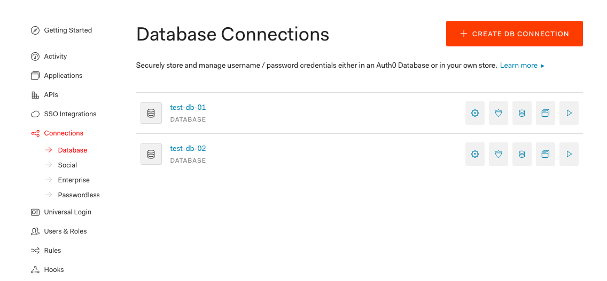
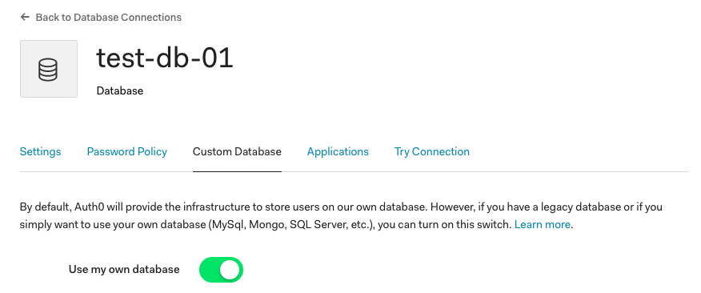
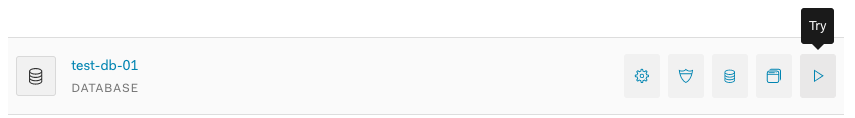
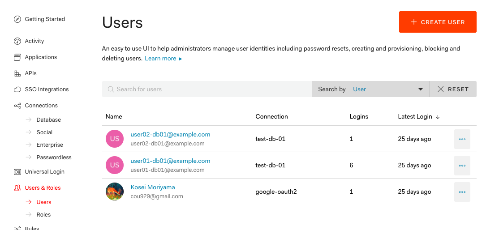
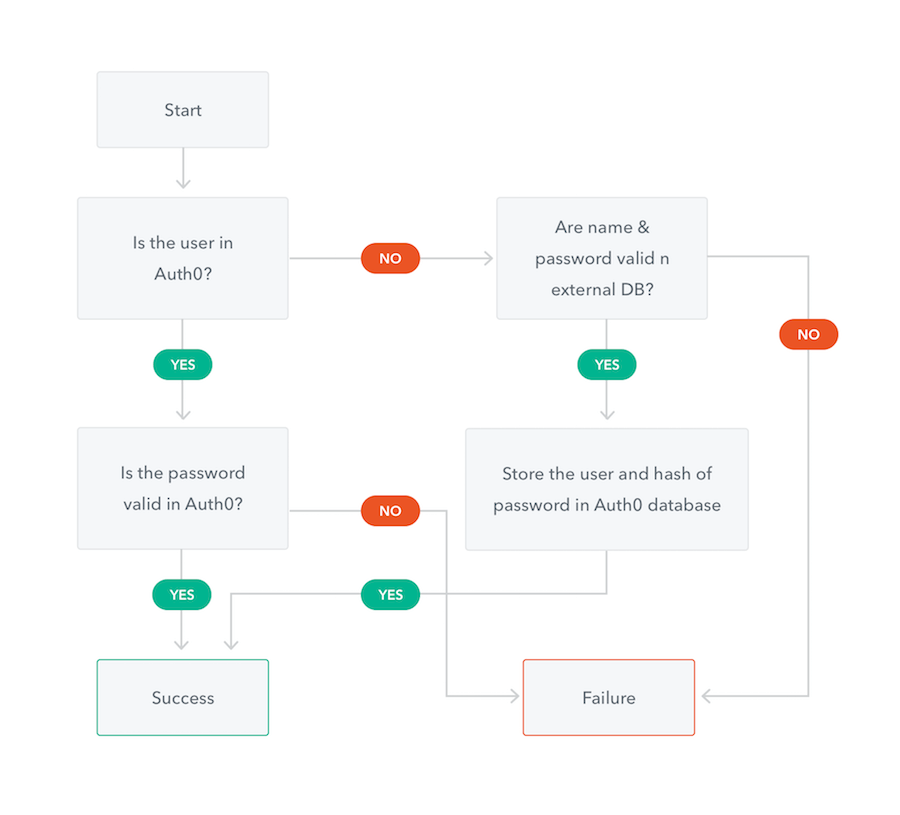
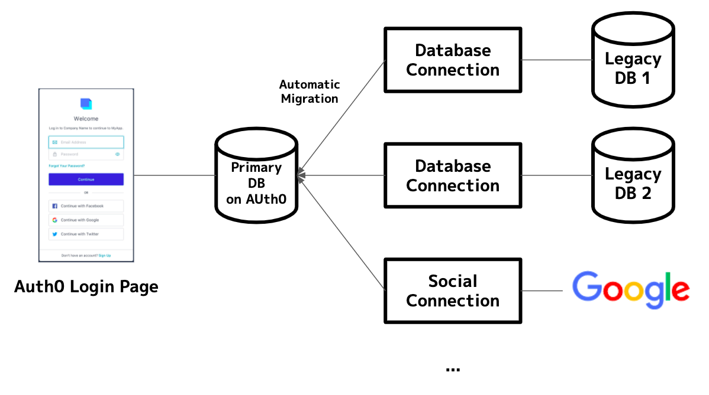
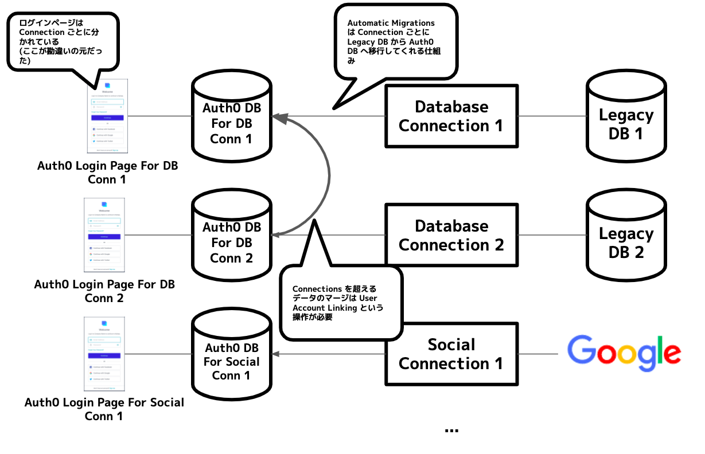
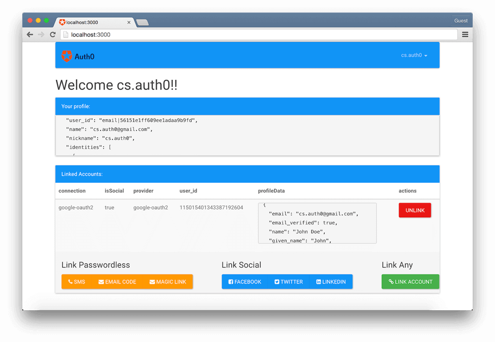

{"title":"Auth0 の Custom Database Connection の Automatic Migrations で勘違いしたこと","date":"2020-04-05T01:38:13+09:00","tags":["auth"]}

複数のデータストアに分かれているユーザーの認証情報を、マージしてひとつに統合したいという要件があり、認証 Saas 大手の Auth0 に Automatic Migrations というそれっぽい機能があったので調査した。特に複数のユーザーデータの名寄せをどうやっているのかが知りたかった。

結論としては、名寄せは当然自動でできるはずもなく、ユーザーからのアクションや自前での実装が必要という当たり前の結果となった。とはいえ全体のフローは参考になった。

## Auth0 とは

[Auth0: Identity is Complex\. Deal with it\.](https://auth0.com/)

- 認証・認可機能を提供する Saas
- AWS の [Cognito](https://aws.amazon.com/cognito/) や GCP の [Firebase Authentication](https://firebase.google.com/docs/auth) が恐らく競合
- 認証・認可はドメイン特有の知識が求められるが、多くのサービスにとって差別化できる部分ではないので、Saas を使うのは妥当なケースが多い

## Custom Database Connections

[Custom Database Connections](https://auth0.com/docs/connections/database/custom-db)

- Auth0 には一般的な email / password 認証のほか、Google アカウントや SNS アカウントでの認証など、多様な認証方式に対応している
- これらは `Connection` と呼ばれている
- Connection のなかには「任意のデータベースとの接続」ができるものもあり、これを `Custom Database Connections` と呼んでいる
    - 認証時に任意のデータベースに格納されている認証情報を参照する
- 当初は自前で認証を行っており、あとから Auth0 に乗り換える。Auth0 の各認証機能を使いたいが、認証情報は自前の DB に保存したい。といったユースケースが想定される
- Custom Database Connection はおおよそ次のような仕組み
    - 「サインアップ時のデータ保存」や「ログイン時のデータ検証」といったイベントごとに発火するグルーコードを Auth0 に登録する
        - グルーコードは任意の接続先に接続し、必要なデータストアの操作を行うもの
    - ユーザーが実際にサインアップやログインをしようとすると、対応するグルーコードが実行される
        - 実装された内容に応じて、接続先の DB に情報が保存されたり参照されたりする

## Custom Database Connection を試してみる

簡単な動作検証は、次のようにするのが簡単だと思う。
ローカルの mac & mysql 環境に既存 DB 相当の環境をつくり、Auth0 上では Node でグルーコードを実装するシナリオとする。

- まず、手元に既存 DB 相当の環境を作る
    - ローカルで mysql インスタンスを立ち上げる
        - homebrew を使う場合は `brew install mysql` し `brew services start mysql` でよい
    - [ngrok](https://ngrok.com/) で外から接続できる一時的なエンドポイントをたてる
        - `ngrok tcp 3306`
        - `mysql -uroot --port <払い出されたポート番号> -h <払い出されたホスト名>` で接続確認ができる
    - mysql に適当なデータベースとテーブル、テストデータを入れておく

<pre><code data-language="sql">-- 適当なデータベースを作成。
CREATE DATABASE userdb01;

USE userdb01;

-- 適当なテーブルを作成。
-- カラムの定義は Auth0 のサンプルコードに揃えてある。
CREATE TABLE `users` (
  `id` INT UNSIGNED NOT NULL AUTO_INCREMENT,
  `email` VARCHAR(255) BINARY NOT NULL,
  `email_verified` BOOL NOT NULL DEFAULT false,
  `password` VARCHAR(255) BINARY NOT NULL, -- bcrypt https://www.npmjs.com/package/bcrypt
  `nickname` VARCHAR(255) NOT NULL DEFAULT '',
  `created_at` datetime NOT NULL,
  `updated_at` datetime NOT NULL,
  PRIMARY KEY (`id`)
) ENGINE=InnoDB DEFAULT CHARSET=utf8mb4;

-- 適当な検証用データ。
INSERT INTO users (email, password, created_at, updated_at) VALUES
('user01-db01@example.com', '$2b$10$Oos6u3GaLZIlI5Q8/4b5J.uskuRMeTQm5PNLah6J29tCHuH.1.Ym.', NOW(), NOW()),
('user02-db01@example.com', '$2b$10$U.oQuPgg8DaakLebEds.3.OPXTc6qB08tkDlmFOgWuMhgCZFJgCri', NOW(), NOW())
;
</code></pre>

- Auth0 のアカウントを作る
    - 自分が試していた当時はトライアルで二週間程度無料で有料機能が使えた
    - [Pricing \- Auth0](https://auth0.com/pricing/)
- Auth0 管理画面から Database Connection を作成する
    - 
- Connection の設定画面で `Custom Database > Use my own database` を有効化する
    - 
- グルーコード (`Database Action Scripts`) を実装する
    - Connection 設定画面の `Custom Database` タブから `Login` と `Get User` の 2 アクション分のコードを記載する
    - それぞれテンプレートから `MySQL` を選択し、接続部分だけを書き換えるのが簡単
    - 入力後は `TRY` ボタン押下で疎通確認が可能

<pre><code data-language="javascript">// 接続情報を ngrok の接続先にする
const connection = mysql.createConnection({
  host: 'your.host.ngrok.io',
  user: 'root',
  password: '',
  database: 'userdb01',
  port: 'your ip',
});

connection.connect();

// 接続後のクエリなども適宜確認しておくとよい
</code></pre>

ここまで準備ができたら、次のように動作確認ができる。

- Database Connections の `Try` アイコンからログインページを表示
    - 
    - ここからサインアップやログインをしてみる
- Auth0 上に作られるユーザーデータは `Users & Roles > Users` から確認できる
    - 
- 手元のデータベースの内容も一緒に眺めるとわかりやすい

この環境を作っておくと、後述の Migration や Account Linking の動作がわかりやすく検証できる。

### ちょっとしたコツ

- mysql の [General Log](https://dev.mysql.com/doc/refman/8.0/en/query-log.html) を有効化しておくと検証がしやすい
    - 特に後述の Migration の動作確認の際は、手元の DB への参照が来ること・来なくなったことを見たくなるので、General Log をみるのがよい
    - 手っ取り早くは `SET GLOBAL general_log = 'ON';` で、常時有効化したい場合は、homebrew 経由の mysql の場合は `/usr/local/etc/my.cnf` の `[mysqld]` ディレクティブに `general-log=1` と設定しておく

<pre><code data-language="sql">-- とりあえず以下のクエリで有効化できる。
SET GLOBAL general_log = 'ON';

-- 現状やログの出力先は次のように確認。
show variables like '%general%';
+------------------+---------------------------------------------+
| Variable_name    | Value                                       |
+------------------+---------------------------------------------+
| general_log      | OFF                                         |
| general_log_file | /usr/local/var/mysql/Koseis-MacBook-Air.log |
+------------------+---------------------------------------------+

-- 設定ファイルの場合
[mysqld]
general-log=1
general-log-file="/path/to/your/general-query.log"
</code></pre>

- homebrew でインストールされる mysql 8 系の認証方式に、Auth0 の Node 環境で使われている mysql ドライバが未対応のため、手元の mysql の設定を調整してあげる必要がある
    - 詳しくはこちらを参照
    - [mysql8 系からデフォルトになった caching\_sha2\_password に mysqljs/mysql はまだ対応していない \- Please Sleep](http://please-sleep.cou929.nu/caching_sha2_password-and-mysqljs.html)
- Auth0 のグルーコードのサンプルはパスワードが [bcrypt](https://www.npmjs.com/package/bcrypt) でハッシュ化されていることを想定しているので、手元の既存 DB に入れる検証データもそれに合わせた方がスムーズ
    - [bcrypt モジュール](https://www.npmjs.com/package/bcrypt) にパスが通っている環境で次のような適当なワンライナーでハッシュ化するのが簡単かもしれない

<pre><code data-language="javascript">// npm install --save bcrypt などしてから実行する
node -e 'require("bcrypt").hash("your password", 10, function(err, hash) { console.log(hash); })'`
</code></pre>

## 既存 DB からの Automatic Migration

[Import and Export Users](https://auth0.com/docs/users/concepts/overview-user-migration#automatic-migrations)
[Configure Automatic Migration from Your Database](https://auth0.com/docs/users/guides/configure-automatic-migration)

- Custom Database Connection で接続した既存 DB からデータをマイグレーションする機能も提供されている
    - ユーザーがログインしようとする
    - まず Auth0 側のテーブルを確認
    - そこになければ 既存 DB を参照
    - 既存 DB にあれば同じ内容を Auth0 側に保存
    - 移行の認証時には Auth0 側だけを参照する
- 
    - このフローチャートがわかりやすい ([公式ドキュメント](https://auth0.com/docs/users/concepts/overview-user-migration) より引用)
- このほかにもバッチで流し込む方法も当然提供されているが、実際のユースケースではこのように逐次移すのが現実的だと思われる

## Automatic Migrations で勘違いしていたこと

- Auth0 は Connection を複数作成できる
- そのため、Migration 機能は複数ある既存 DB から一つの Auth0 テーブルへ認証情報を統合できるのかと勘違いした
    - そして、できるとしてどうデータを名寄せするのかに興味があった
    - 今回の調査はこの部分が主な関心事だった
- 実際にはそんなことは（簡単には）できなかった
    - Auth0 上には Connection ごとに、別々のテーブルに認証情報を保持している
    - Migration は Connection ごとにしかできない
    - ログイン画面も Connection ごとに分かれている
        - [/authorize API](https://auth0.com/docs/api/authentication#database-ad-ldap-passive-) の `connection` パラメータがそれにあたる
            - 指定がなければ `using the first database connection.`
- Connection を跨いだデータの統合は後述の User Account Linking を使わなければならない

図にするとこんな感じで、ログインページは全 Connection を跨いでひとつで、Automatic Migrations はすべてのコネクションをまたいだデータの統合を行うものとイメージしていた。（そしてこの「データの統合」をどうやっているのかが気になっていた）

実際には次のように Connection ごとに別々の箇所にデータが保持されており、ログインページも Connection ごとだった。

複数の Custom Database Connection がある場合のマイグレーションのシナリオは（自分が見た範囲では）ドキュメントに明示的に書かれていなかったので、動作検証をしないとこれがよくわからなかった。

## User Account Linking

[User Account Linking](https://auth0.com/docs/users/concepts/overview-user-account-linking)

- Auth0 上の複数の Connection に分かれている認証情報をマージするための仕組み
- 複数のユーザーが同一であると言う名寄せをどうやるかを自分で定義する必要がある
- 名寄せが機械的にできる場合は [Rule](https://auth0.com/docs/rules) という仕組みで名寄せ処理を定義しておける
    - たとえば email が同じだったら同一ユーザーとみなしマージする、といったことができる
    - サンプル実装
        - [rules/link\-users\-by\-email\.js at master · auth0/rules](https://github.com/auth0/rules/blob/master/src/rules/link-users-by-email.js)
        - [rules/link\-users\-by\-email\-with\-metadata\.js at master · auth0/rules](https://github.com/auth0/rules/blob/master/src/rules/link-users-by-email-with-metadata.js)
- ただ実際には名寄せが機械的に出来ないことも多い
- その場合はユーザーにアクションしてもらい名寄せをする必要がある
    - [User-initiated account linking](https://auth0.com/docs/users/concepts/overview-user-account-linking#user-initiated-account-linking) と説明されているフロー
    - あるアカウントでログイン後、設定画面等に別のログインボタンを設置し、そこからログインするとリンクされる、という流れ
    - 
        - 図は [公式ドキュメント](https://auth0.com/docs/users/concepts/overview-user-account-linking#user-initiated-account-linking) より引用
    - 内部的には [/users/{id}/identities](https://auth0.com/docs/api/management/v2#!/Users/post_identities) という API を呼び出している
        - `link_with` というリクエストパラメータでマージしたいアカウントの jwt を送信している
- 複数の既存 DB に分かれている認証情報を一箇所に統合するにはこれを使う必要があると思われる

<a href="http://www.amazon.co.jp/exec/obidos/ASIN/B07GRPD4ND/pleasesleep-22/ref=nosim/" name="amazletlink" target="_blank">「Auth0」で作る！認証付きシングルページアプリケーション (技術の泉シリーズ（NextPublishing）)</a>
posted with <a href="http://www.amazlet.com/" title="amazlet" target="_blank">amazlet</a> at 20.03.08

インプレスR&D (2018-08-31) 売り上げランキング: 80,200 

<a href="http://www.amazon.co.jp/exec/obidos/ASIN/B07GRPD4ND/pleasesleep-22/ref=nosim/" name="amazletlink" target="_blank">Amazon.co.jpで詳細を見る</a>

