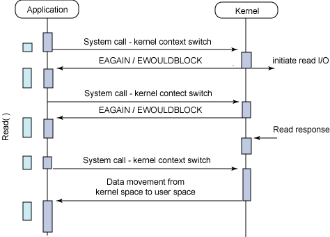
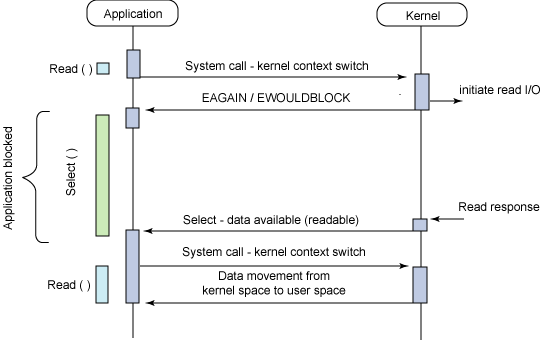

{"title":"c10k problem memo","date":"2013-01-19T21:10:03+09:00","tags":["memo"]}

C10K とか, Web サーバ (あるいは Node.js みたいなフレームワーク) とか, Web システムのパフォーマンスとかを議論するときには, いかに並列処理するか (スレッドとか) と いかに IO をうまくハンドリングするか (multiplexing とかノンブロッキング・非同期とか) の知識が共通で必要になる気がするのでここを抑えておきたい.
ここからイベントドリブン (libev とか) -> 実際のサーバやフレームワーク・ライブラリの実装 という風に進んでいけばいい気がする

### 結論

これを読むのが一番近道感がある.

<iframe style="width:120px;height:240px;" marginwidth="0" marginheight="0" scrolling="no" frameborder="0" src="//rcm-fe.amazon-adsystem.com/e/cm?lt1=_blank&bc1=000000&IS2=1&bg1=FFFFFF&fc1=000000&lc1=0000FF&t=pleasesleep-22&language=ja_JP&o=9&p=8&l=as4&m=amazon&f=ifr&ref=as_ss_li_til&asins=4894712059&linkId=f69799724df8997527ca1e57a70432a8"></iframe>

<a href="http://www.amazon.co.jp/gp/product/4894712059/ref=as_li_tf_tl?ie=UTF8&camp=247&creative=1211&creativeASIN=4894712059&linkCode=as2&tag=pleasesleep-22">UNIXネットワークプログラミング〈Vol.1〉ネットワークAPI:ソケットとXTI - W.Richard Stevens</a>

### Process & Thread
どちらも処理の並行実施の単位

#### プロセスを復習すると

- 処理の実行単位
- メモリを個別に持つ
- 1 つ以上のスレッドからなる
- 切替時にコンテキストスイッチ (割と重い)

#### スレッドとは

- cpu の実行単位
  - <-> プロセスはメモリの単位
- スレッド ⊆ プロセス
- メモリは共有
  - なので切り替えは早い
  - プロセスしかない場合に 1) 単一プロセエス内でシステムコールとか 2) 複数プロセスでプロセス間通信とか で頑張っていたような処理はスレッドを使うとシンプルになる.  ただし排他制御とかスレッドセーフとかそういう厄介ごとがでてくる

3 つの軸があるらしい ([http://subtech.g.hatena.ne.jp/mala/20090920/1253447692](http://subtech.g.hatena.ne.jp/mala/20090920/1253447692))

- ユーザレベル / カーネルレベル
- グリーンスレッド / ネイティブスレッド
- プリエンプティブ / ノンプリエンプティブ

##### ユーザレベル / カーネルレベル

- ユーザレベル (many-to-one)
  - ユーザランドで実装. ライブラリが切り替える
  - OS から見たら 1 プロセスなので切り替えは早い
  - OS から見たら 1 プロセスなので性能は 1 プロセスの速度以上にはならない. (どちらかと言うとプログラミングテクニック)
- カーネルレベル (one-to-one)
  - カーネルで実装. カーネルが切り替える
  - 本当にマルチコアで動くので性能が良くなる可能性がある
  - OS からみたらふつうのプロセスとほぼ変わらないので, 切り替えコストが大きい. また数の制限がユーザレベルよりきつい

あとは 2 level (many-to-many) というものもあるらしい. ユーザレベルとカーネルレベルを組み合わせたもの

\*-to-\* というのは左がユーザからみたタスクの数, 右がカーネルから見た数かな

軽量プロセス -> 2 level ?

この表がわかりやすい

<!--
> 		利点				欠点
>
> ユーザレベル	* スレッド切り替えが高速	* あるスレッドがブロックすると
> 	        * ライブラリが OS に依存しない    スレッド全体がブロックされる
> 	        ため移植性が良い		* マルチプロセッサを利用できない
>
> カーネルレベル	* スレッドがブロックされても他	* スレッドの切り替えが重くなる
> 	        スレッドもブロックされない	* スケーリングが悪い
> 	        * マルチプロセッサに対応	* ライブラリが OS に依存する
> 2 レベル
> 	        * スレッドがブロックされても他  * ユーザが直接的な制御が難しくなる
> 	          スレッドもブロックされない	* 実装が複雑
> 	        * マルチプロセッサ対応		* ライブラリが OS に依存する
> 	        * スケーラビリティが比較的良い  * スレッドの切り替えが少し重くなる
> 	        * ユーザレベル・カーネルレベルを組み合わせられる
-->

[Linux + スレッド のススメ](http://gotom.jp/~gotom/pub/thread/thread.txt)

##### グリーンスレッド / ネイティブスレッド

- vm が実装するか, OS の機能か
- よくわからない

##### プリエンプティブ / ノンプリエンプティブ

- よくわからない

##### pthread

pthread はカーネルレベルのスレッドらしい

他の言語はどうやって実装しているんだろうか

### IO

#### Blocking / Non Blocking

"ブロックする" とは, あるファイルディスクリプタの準備ができるまで処理が止まること. O_NONBLOCK フラグを指定すると, 即座に処理が戻ってくる. O_NONBLOCK で対象のファイルの準備ができていないときは read は -1 を返すし, errno には 11 (APUE 曰く. Mac でやってみたら 35 が返ってきてた) がセットされる.

[サンプルコード](https://gist.github.com/1696826)

こいつは stdin から 100,000 バイト読み込んで, stdout に同じだけ書きだす. stderr に読み書きしたバイト数と書き込み時の errno を出力する. ただし stdout には O_NONBLOCK を指定する.

ファイルから読み, ファイルに書き出す場合は一回読んで一回書くだけ.

    $ gcc -Wall -O2 -o nonblock_test 12_1_NONBLOCK.c
    $ ./nonblock_test < ./bigfile.txt > res.log
    read 100000 byts
    nwrite = 100000, errno = 0, err_message = 'Success'

stdout を端末にしてエラー出力をファイルに落とすと, 端末にはファイルの中身が表示されるが, エラーが出ていることがわかる

    $ ./nonblock_test < ./bigfile.txt 2> res.log
    ... (略) ...
    $ cat ./res.log
    read 100000 byts
    nwrite = 4009, errno = 0, err_message = 'Success'
    nwrite = 4017, errno = 0, err_message = 'Success'
    nwrite = -1, errno = 11, err_message = 'Resource temporarily unavailable'
    nwrite = -1, errno = 11, err_message = 'Resource temporarily unavailable'
    nwrite = -1, errno = 11, err_message = 'Resource temporarily unavailable'

端末が一度に受け取ることができるバイト数は決まっているので, 端末のバッファがいっぱいになった時点からそれを書きだしてフラッシュするまでの間, errno = 35 が read に返されている (と思う). また stdout が ready になるまで for ループで何度もチェックしているので, ポーリングしていることになる.

stdout へ O_NONBLOCK の指定をしなければこんなエラーは出ず, 一度に書き出される.

    $ emacs 12_1_NONBLOCK.c
    (set_fl(STDOUT_FILENO, O_NONBLOCK) のところをコメントアウトしてコンパイルしなおす)
      //  set_fl(STDOUT_FILENO, O_NONBLOCK);

    $ gcc -Wall -O2 -o nonblock_test 12_1_NONBLOCK.c
    $ ./nonblock_test < ./bigfile.txt 2> res.log
    ... (略) ...
    $ cat res.log
    read 100000 byts
    nwrite = 100000, errno = 0, err_message = 'Success'

このようにエラーはなく一回で書き出している. ただし main はブロックされている.

また O_NONBLOCK はファイルディスクリプタが ready かどうかのところがノンブロックになるだけで, ディスクへの実際の読み書きは当たり前だがそのまま待つ. よって例えばディスクやネットワークが低速な場合はそのまま待っている. ファイルの IO が "ブロック" であるというのは, 何かの要因で処理が *永遠に* ブロックされるかどうか, という定義らしい. ディスクへの実際の読み書きは遅くてもいつか必ず終わる.

#### IO multiplexing

一つのプロセスで複数のファイルディスクリプタを扱いたい. Web サーバなどこのようなケースは多い. 例えばリクエストを受けて DB にアクセスするようなケースでは, リクエストの読み書き, DB との読み書きで 4 つのファイルディスクリプタの読み書きを行わなければならない. どれか一つの読み書きをブロックしていると, 他が全く使えなくなってしまい破綻する.

解決策は,

- fork して各プロセスは読み書き 1 つずつのファイルのみを扱うようにすること. ただしプロセス間通信が厄介.
- 全部のディスクリプタに対して O_NONBLOCK を指定する. ポーリングが必要なので無駄が多い
- 非同期 IO を用いる. 使えないシステムがある, 通常シグナルで完了を通知するがその場合プロセスで一つのシグナルなので, 受け取ったあとにどのディスクリプタが ready になったかを調べないといけない. (現在では違うかも)
- IO multiplexing を使う

IO multiplexing はそのプロセスが扱うファイルディスクリプタを一括して持っておいて, どれかが ready になるまでブロックする関数. select と poll というシステムコールがある

##### select(2)

ファイルディスクリプタの集合を与えて, 指定した時間待つ (無限に待つことも, 待たないこともできる). いずれかのファイルディスクリプタの準備ができるか, タイムアウトしたら処理が戻る. SIGINT などで割り込むことができる.
第一引数には select に渡したファイルディスクリプタの最大値 + 1 を指定する.
select の動作イメージ. select が呼ばれると karnel はファイルディスクリプタのテーブルをコピーする. イベント (ディスクリプタが ready になったり, タイムアウトしたり) が発生するとディスクリプタのテーブルのプロセス側 (ユーザ側) を更新する. ユーザはディスクリプタのテーブルを走査し ready なディスクリプタの読み書きを行う.
問題点は, 普通に線形探索するので select するごとに O(n) (n == 最大ファイルディスクリプタ + 1) の計算量が発生すること. また扱えるファイルディスクリプタ数にも制限があるらしい.

##### poll(2)

select とインタフェースが違うが内容は同様. 扱えるディスクリプタ数が select より多いらしい.

##### epoll(2)

modern select/epoll で, ディスクリプタを O(1) で取り出せる. Linux kernel 2.6 かららしい. BSD だと kqueue, Solaris だと /dev/poll という仕組みが同等のものらしい. (Mac OSX だと man 2 kqueue してみてください)
select と違い扱えるディスクリプタ数の制限無し.

[ベンチ](http://osdn.jp/event/kernel2003/pdf/C06.pdf)

#### Sync / Async IO

- fd の ready だけでなく, 読み書きが完了した時点でメインプロセスに通知される.
- select との対比だと, select で待っている間のブロックすらない.
- POSIX AIO, libaio など
- 読み込んだデータをカーネル空間からユーザ空間に移動した時点でユーザプロセスに通知される
- 通知方法はシグナルとスレッドベースのコールバックの二種類
- multipulexing よりいいのはいちいちアプリ側でチェックしなくてよくて, 完了したものが届けられる点
- linux では `aiocb` 構造体 (AIO I/O Control Block) という概念で各々の IO が区別されるらしい

        struct aiocb {
          int aio_fildes;               // File Descriptor
          int aio_lio_opcode;           // Valid only for lio_listio (r/w/nop)
          volatile void *aio_buf;       // Data Buffer
          size_t aio_nbytes;            // Number of Bytes in Data Buffer
          struct sigevent aio_sigevent; // Notification Structure

          /* Internal fields */
          ...
        };

- `sigevent aio_sigevent` は io 完了時の動作を司る構造体らしい
- `aio_read` / `aio_write` はリクエストがキューされた時点で即座に返される
- aio_read するときに aiocb にファイルオフセットを指定する. 通常の read(2) だとオフセットはカーネルが読みこむたびにアップデートしてくれるけど, 非同期読み込みの場合は同時にいくつもリードリクエストしたり順番が入れ替わることもあるので, aio_read を呼ぶたびにオフセットとバッファサイズを指定する必要がある. 毎回このファイルのここからこれだけ読みますと指定してあげるイメージ.
- `aio_error` に aiocb を渡すとその io の状況を調べられる. 継続中なら `EINPROGRESS` だし, アプリがキャンセルした場合は `EINPROGRESS` が, エラーがあったら -1 (+ errno) が返される
- read(2) とかだと結果がすぐにもらえるけど, aio の場合は `aio_error` で完了を確認したのち `aio_return` で結果を得る. `aio_return` のインタフェースは read(2) とほぼ同じようだ.
- `aio_suspend` は aio の完了をメインプロセスをサスペンドさせて待つ, wait のような関数.

以上を踏まえ,  notification のハンドリングを加えると async らしくなってくる.

#### notified by signal

まずはシグナルでの通知例

    void setup_io( ... ) {
      int fd;
      struct sigaction sig_act;
      struct aiocb my_aiocb;
    
      ...
    
      /* Set up the signal handler */
      sigemptyset(&sig_act.sa_mask);
      sig_act.sa_flags = SA_SIGINFO;
      sig_act.sa_sigaction = aio_completion_handler;
    
      /* Set up the AIO request */
      bzero( (char *)&my_aiocb, sizeof(struct aiocb) );
      my_aiocb.aio_fildes = fd;
      my_aiocb.aio_buf = malloc(BUF_SIZE+1);
      my_aiocb.aio_nbytes = BUF_SIZE;
      my_aiocb.aio_offset = next_offset;
    
      /* Link the AIO request with the Signal Handler */
      my_aiocb.aio_sigevent.sigev_notify = SIGEV_SIGNAL;
      my_aiocb.aio_sigevent.sigev_signo = SIGIO;
      my_aiocb.aio_sigevent.sigev_value.sival_ptr = &my_aiocb;
    
      /* Map the Signal to the Signal Handler */
      ret = sigaction( SIGIO, &sig_act, NULL );
    
      ...
    
      ret = aio_read( &my_aiocb );
    }
    
    void aio_completion_handler( int signo, siginfo_t *info, void *context ) {
      struct aiocb *req;
    
      /* Ensure it's our signal */
      if (info->si_signo == SIGIO) {
    
        req = (struct aiocb *)info->si_value.sival_ptr;
    
        /* Did the request complete? */
        if (aio_error( req ) == 0) {
    
          /* Request completed successfully, get the return status */
          ret = aio_return( req );
        }
      }
    
      return;
    }

- sigaction という構造体で通知の設定をする. シグナルで通知してくれってことと, シグナルハンドラの関数のポインあをあげる
- io 完了時には SIGIO が発火
- sigaction は aaiocb にセットするのではなく, 直接 SIGIO のハンドラとして登録するようだ
- aiocb.aio_sigevent には通知時に SIGIO をとばすよう設定している
- コールバック関数の中ではシグナルが SIGIO かどうかをチェックし, aio_error で完了を確認し aio_read している
  - ふつうのシグナルのあ使いとと同じ感じのインタフェース
- ハンドラの引数として aiocb が渡されるので, どの io なのかは判別できる
- 印象だけどアプリ側のハンドラでシグナルをチェックするのは, 生っぽいインタフェースだしパフォーマンスも良くなさそう

#### notified by thread (function)

スレッドのインタフェースは関数渡してそれが完了時呼び出されるという, 自分たちにとっては慣れたインタフェース

    void setup_io( ... ) {
      int fd;
      struct aiocb my_aiocb;
    
      ...
    
      /* Set up the AIO request */
      bzero( (char *)&my_aiocb, sizeof(struct aiocb) );
      my_aiocb.aio_fildes = fd;
      my_aiocb.aio_buf = malloc(BUF_SIZE+1);
      my_aiocb.aio_nbytes = BUF_SIZE;
      my_aiocb.aio_offset = next_offset;
    
      /* Link the AIO request with a thread callback */
      my_aiocb.aio_sigevent.sigev_notify = SIGEV_THREAD;
      my_aiocb.aio_sigevent.notify_function = aio_completion_handler;
      my_aiocb.aio_sigevent.notify_attributes = NULL;
      my_aiocb.aio_sigevent.sigev_value.sival_ptr = &my_aiocb;
    
      ...
    
      ret = aio_read( &my_aiocb );
    }
    
    void aio_completion_handler( sigval_t sigval ) {
      struct aiocb *req;
    
      req = (struct aiocb *)sigval.sival_ptr;
    
      /* Did the request complete? */
      if (aio_error( req ) == 0) {
    
        /* Request completed successfully, get the return status */
        ret = aio_return( req );
      }
    
      return;
    }

スレッドサポートがある環境ではこちらを使わない理由はない気がする

#### procfs

- `/proc/sys/fs/aio-nr` にはシステム全体の現在の非同期 io リクエスト数が記録されている
- `/proc/sys/fs/aio-max-nr` には非同期 io リクエストの最大値が入っている. 通常 64K らしい

#### aio の実装を追うためのリソース

- [13.10 Perform I/O Operations in Parallel](http://www.gnu.org/software/libc/manual/html_node/Asynchronous-I_002fO.html)
  - posix での実装に関する記述
- [Design Notes on Asynchronous I/O (aio) for Linux](http://lse.sourceforge.net/io/aionotes.txt)
  - linux aio のデザインに関する文章らしい

[図はすべて Boost application performance using asynchronous I/O を引用](http://www.ibm.com/developerworks/linux/library/l-async/)

### その他

#### 用語整理

- parallel (並列)
-- 複数のタスクがとにかく同時に処理されている
- concurrent (並行)
-- 複数のタスクが人間から見て同時並行して処理されている. タスク間で通信しながら整合性を保って実行されるというニュアンスが入るらしい.

[parallel と concurrent 、並列と並行の覚え方](http://d.hatena.ne.jp/ku-ma-me/20100916/p1)

#### 継続, コルーチンがなんとかなんとか

プログラミングスタイルの問題?

- [http://subtech.g.hatena.ne.jp/mala/20090915/1253016552](http://subtech.g.hatena.ne.jp/mala/20090915/1253016552)

### 次回予告

- async io を深堀り
- select(2) を読んでみる
- epoll(2) を読んでみる
  - [http://d.hatena.ne.jp/moriyoshi/20090519/1242764245](http://d.hatena.ne.jp/moriyoshi/20090519/1242764245)
- 非同期・イベントなライブラリ
  - libev
  - libeio
  - libuv
- フレームワーク・ミドルウエア
  - Node
  - nginx
  - lighthttpd
