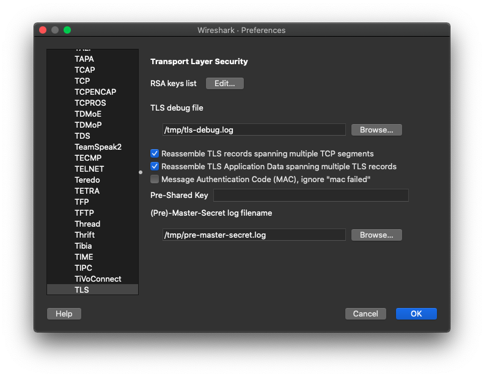
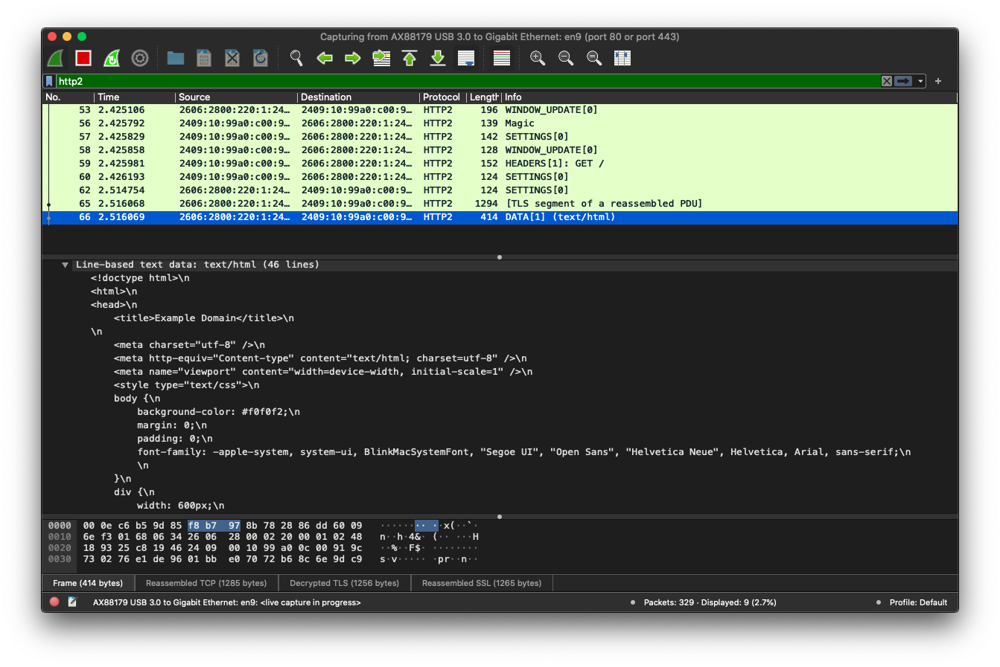
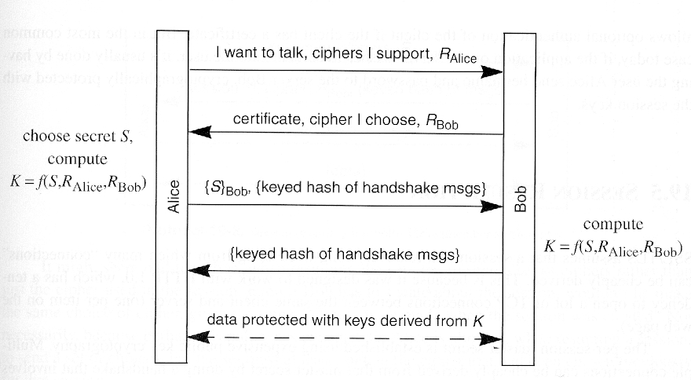
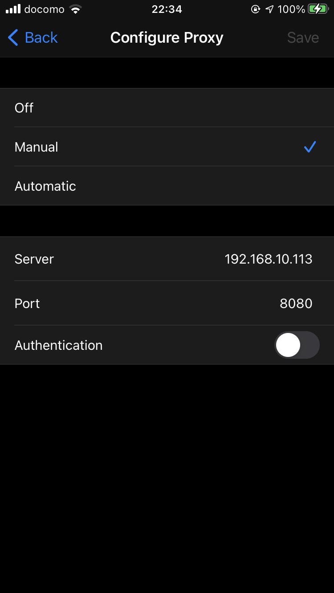
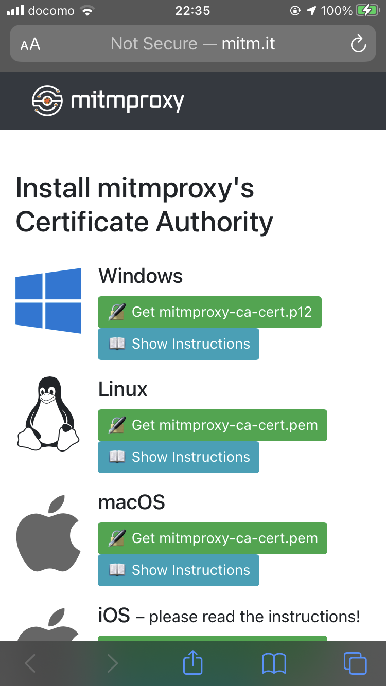
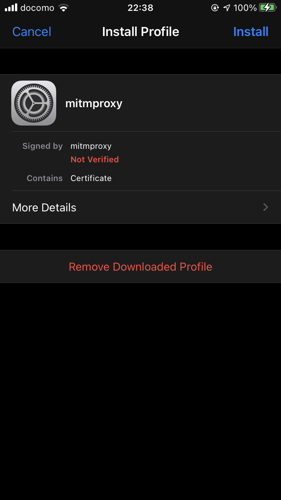
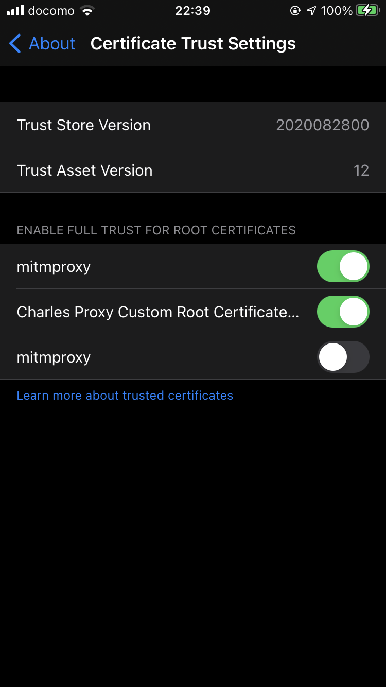
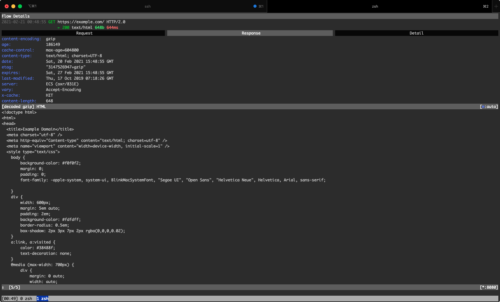

{"title":"TLS 通信のパケットキャプチャ","date":"2021-02-21T00:40:00+09:00","tags":["nix"]}

デバッグや学習用途でパケットキャプチャする際、https をはじめ SSL/TLS で暗号化されている通信を復号化する方法のメモ。

## クライアントが PC 上のブラウザや curl の場合

pre-master-secret (または key log file ?。用語の使い分けは理解怪しい) を使った方法がデファクトっぽく見えた。

pre-master-secret とはざっくり言うと TLS 通信時に使用した鍵情報らしい。これを使ってこんな感じでパケットキャプチャを行う。

- クライアントに pre-master-secret のログを出力するよう設定する
    - `SSLKEYLOGFILE` という環境変数を使うのが標準的な方法
        - 主要ブラウザや curl は対応している
- Wireshark/tshark などのパケットキャプチャツールで pre-master-secret のログを読み込む

この状態で通信するとパケットキャプチャツールが TLS を復号化してくれる。

### `SSLKEYLOGFILE` 環境変数を設定し pre-master-secret のログを出力する

環境変数 `SSLKEYLOGFILE` にログ出力先を指定すると、対応しているクライアントはそこに pre-master-secret のログを出力してくれる。

```sh
# MacOS で Chrome の場合の例
$ SSLKEYLOGFILE=/tmp/pre-master-secret.log "/Applications/Google Chrome.app/Contents/MacOS/Google Chrome"

# curl の場合の例
$ SSLKEYLOGFILE=/tmp/pre-master-secret.log curl https://example.com/
```

[TLS \- The Wireshark Wiki](https://wiki.wireshark.org/TLS) によると、NSS, OpenSSL, boringssl などのライブラリのレイヤーがこの仕様に対応しているらしい。

> The key log file is a text file generated by applications such as Firefox, Chrome and curl when the SSLKEYLOGFILE environment variable is set. To be precise, their underlying library (NSS, OpenSSL or boringssl) writes the required per-session secrets to a file. This file can subsequently be configured in Wireshark (#Using_the_.28Pre.29-Master-Secret).

### 出力した pre-master-secret を使ってパケットキャプチャする

#### Wireshark の場合

`Preferences > Protocols > TLS` に `(Pre)-Master-Secret log filename` という項目があり、ここにログのパスを指定すれば良い。

ついでに `TLS debug file` に適当なパスを指定しておくと、デバッグログが出力されるので、トラブルシューティングのためとりあえず設定しておくとよいかも。



この状態で通信をすると pre-master-secret を使って Wireshark がよしなに復号化してくれる。http/2 などのアプリケーション層の通信もきちんと表示されている。

<figure>

<figcaption>https://example.com/ へのリクエスト例。Display Filter に http2 を指定。実際にレスポンスされた html まで見えている。</figcaption>
</figure>

#### tshark の場合

`-o` フラグで `tls.keylog_file`、`tls.debug_file` というオプションを指定すれば上記と同様になる。

```sh
# keylog_file とネットワークインタフェースを指定しキャプチャ。表示は http2 に絞り込み
$ sudo tshark -i en9 \
    -o "tls.keylog_file:/tmp/pre-master-secret.log" \
    -o "tls.debug_file:/tmp/tls-debug.log" \
    -Y "http2"

# curl で SSLKEYLOGFILE を指定しつつリクエスト
$ SSLKEYLOGFILE=/tmp/pre-master-secret.log curl -v https://example.com

# tshark の出力例
  123   2.894499 2606:28...(snip) → 2409:10...(snip) HTTP2 196 WINDOW_UPDATE[0]
  126   2.894768 2409:10...(snip) → 2606:28...(snip) HTTP2 139 Magic
  127   2.894770 2409:10...(snip) → 2606:28...(snip) HTTP2 142 SETTINGS[0]
  128   2.894780 2409:10...(snip) → 2606:28...(snip) HTTP2 128 WINDOW_UPDATE[0]
  129   2.894829 2409:10...(snip) → 2606:28...(snip) HTTP2 152 HEADERS[1]: GET /
  130   2.894937 2409:10...(snip) → 2606:28...(snip) HTTP2 124 SETTINGS[0]
  145   3.014397 2606:28...(snip) → 2409:10...(snip) HTTP2 124 SETTINGS[0]
  148   3.015336 2606:28...(snip) → 2409:10...(snip) TLSv1.2 1294 [TLS segment of a reassembled PDU]
  149   3.015338 2606:28...(snip) → 2409:10...(snip) HTTP2 413 DATA[1] (text/html)
```

#### tcpdump でとったキャプチャファイルを復号して読む

今までの例はリアルタイムでキャプチャしているが、一度ダンプしたファイルを読み取る場合でも同じ考え方でよい。当然 pre-master-secret さえとっておけば、tcpdump など他のツールでキャプチャしたファイルでもよい。

```sh
# tcpdump でキャプチャしファイルに落とす
$ sudo tcpdump -i en9 -n port 443 -w /tmp/tmp.pcap

# curl で SSLKEYLOGFILE を指定しつつリクエスト
$ SSLKEYLOGFILE=/tmp/pre-master-secret.log curl -v https://example.com

# keylog_file を指定すれば、tcpdump でとったファイルでも復号できている
$ sudo tshark -r /tmp/tmp.pcap \
    -o "tls.keylog_file:/tmp/pre-master-secret.log" \
    -o "tls.debug_file:/tmp/tls-debug.log" \
    -Y "http2"
 1462   3.152672 2606:28...(snip) → 2409:10...(snip) HTTP2 196 WINDOW_UPDATE[0]
 1465   3.152970 2409:10...(snip) → 2606:28...(snip) HTTP2 139 Magic
 1466   3.152980 2409:10...(snip) → 2606:28...(snip) HTTP2 142 SETTINGS[0]
 1467   3.152992 2409:10...(snip) → 2606:28...(snip) HTTP2 128 WINDOW_UPDATE[0]
 1468   3.153039 2409:10...(snip) → 2606:28...(snip) HTTP2 152 HEADERS[1]: GET /
 1469   3.153106 2409:10...(snip) → 2606:28...(snip) HTTP2 124 SETTINGS[0]
 1471   3.243603 2606:28...(snip) → 2409:10...(snip) HTTP2 124 SETTINGS[0]
 1474   3.244215 2606:28...(snip) → 2409:10...(snip) TLSv1.2 1294 [TLS segment of a reassembled PDU]
 1475   3.244216 2606:28...(snip) → 2409:10...(snip) HTTP2 414 DATA[1] (text/html)
```

### pre-master-secret をもう少し知る

pre-master-secret とは何で何のためにあるのかもうちょっと知りたい。

次の質問の回答でちょっとわかった気になったので簡単にまとめる。

[tls \- Differences between the terms "pre\-master secret", "master secret", "private key", and "shared secret"? \- Cryptography Stack Exchange](https://crypto.stackexchange.com/questions/27131/differences-between-the-terms-pre-master-secret-master-secret-private-key)

<figure>

<figcaption>SSLv3/TLS の簡略化したシーケンス。自分は読んでないが<a href="http://www.amazon.co.jp/exec/obidos/ASIN/B001ADIWNI/pleasesleep-22/ref=nosim/">この本</a>からの引用らしい。</figcaption>
</figure>

- この例では `Alice` がクライアント、`Bob` がサーバの役割
- 記号の説明
    - `R_(Alice|Bob)` はそれぞれのピアが選んだランダムの nonce
    - `{S}_Bob` は Bob の公開鍵で暗号化されている
- 最終的に共通鍵 `K` でメッセージを暗号化し送り合うのが目標
- `K` は secret `S` と各ピアが選んだそれぞれの `R` の 3 つを入力とする関数で生成する
    - 前述のように `R` はそれぞれのピアが決めた nonce
- secret `S` はクライアントである Alice が選んでサーバである Bob へ送る
    - この際 Bob の公開鍵で暗号化し送信する
- Bob は Alice から受け取った `S` を使い、共通鍵 `K` を生成できる

このシーケンスの `S` が pre-master-secret に相当するらしい。クライアントが生成しているという点、またこれ (と 2 つの `R`) があれば共通鍵 `K` を生成できる点から、これがあれば復号できることが納得できる。

ちなみに master-secret が `K` なので、その `pre` ということのようだ。

また [tls \- What's the point of the pre\-master key? \- Information Security Stack Exchange](https://security.stackexchange.com/questions/54399/whats-the-point-of-the-pre-master-key) に以下のコメントがあった。

> The point of the pre-master key is to have a uniform format for the master key

pre-master-key は暗号化方式によらず、統一したフォーマットを提供するためのものらしい。

## iOS などのモバイルアプリの場合

モバイルデバイスなど pre-master-key を取得できない状況では、mitm 型のプロキシを使う方法が簡単だと思われる。おそらくこっちのほうが昔からある手法。

Burp proxy を使って iPhone アプリのパケットキャプチャをする方法は以前以下にまとめた。

[Burp Proxy で iPhone の通信をパケットキャプチャ \- Please Sleep](https://please-sleep.cou929.nu/capture-packet-of-iphone-app-with-burp-proxy.html)

原理としてはこんな感じ。

- クライアント (iPhone 端末など) にプロキシ設定とそのプロキシの証明書をインストール
- クライアントからのリクエストはプロキシを通る
    - ここで復号できる

上記記事は相当古いので、今回は mitmproxy を使って同じことをやってみる。細部は異なるが基本的な原理は同じ。

### mitmproxy でキャプチャ

[Intercept iOS/Android Network Calls using mitmproxy \| by Gaurav Sharma \| TestVagrant \| Medium](https://medium.com/testvagrant/intercept-ios-android-network-calls-using-mitmproxy-4d3c94831f62) の手順がわかりやすかったので参考にした。iPhone でのケース。

- まず iPhone 側にプロキシと証明書の設定をする
    - `Settings > Wifi > 詳細ページ > Configure Proxy` にて、`Manual` をタップ
        - mitmproxy を動かしているホストの ip と port 8080 (デフォルト) を入力し Save
        - 
    - Safari で `mitm.it` にアクセスし証明書をダウンロード
        - 
    - `Settings > General > Profiles` mitmproxy を選択しインストール
        - 
    - `Settings > General > About > Certificate Trust Settings` より mitmproxy のトグルを有効化
        - 
- ホストの PC で mitmproxy を起動する

```sh
$ mitmproxy
```

- 適当な通信を行うと内容が表示される
    - 

### pre-master-secret 方式が必要なケース

[Stealing TLS Session Keys from iOS Apps](https://hugotunius.se/2020/08/07/stealing-tls-sessions-keys-from-ios-apps.html) によると、Apple の `NSURLSession` を使わずに通信を実装しているアプリの場合、システムのプロキシ設定などが使われないのでキャプチャできないらしい。実体験としても、mitmproxy をデフォルトで立ち上げただけだと通信ができていないアプリもあり、深追いしていないがプロキシが対応していない通信方式などがあるのかもしれない。

[Capturing and Decrypting HTTPS Traffic From iOS Apps Using Frida](https://andydavies.me/blog/2019/12/12/capturing-and-decrypting-https-traffic-from-ios-apps/) では [Frida](https://frida.re/) というツールを使い、pre-master-secret を取得する方法を解説していた。詳しくみていないが、こういうオプションもあるということで。

### iOS の Remote Virtual Interface

iOS には、USB などで接続した MacOS 上にバーチャルなネットワークインターフェース (Remote Virtual Interface, rvi) を作り、通信をそちらにミラーする機能があるらしい。上記の記事では、pre-master-secret は Frida で取得し、それを設定した wireshark は rvi をキャプチャする方針が解説されていた。

[Recording a Packet Trace \| Apple Developer Documentation](https://developer.apple.com/documentation/network/recording_a_packet_trace)

復号はしないにしても、この方法も覚えておくと役に立ちそうなので一応試してみる。

- xcode のコマンドラインツールのインストール

```sh
$ xcode-select --install
```

- USB などで iPhone を Mac に接続する
    - iPhone のペアリングができていないとだめなので、xcode の `Devices and Simulators` からやっておく必要
- iOS デバイスの UDID を調べる
    - `system_profiler SPUSBDataType` の出力のうち、`iPhone` などのセクションの `Serial Number` の項目を調べればよい
    - xcode の `Devices and Simulators` でもよい

```sh
$ system_profiler SPUSBDataType
```

- rvi インタフェースを起動する
    - xcode の `Devices and Simulators`

```sh
$ rvictl -s <UDID>

# 成功するとこのようなメッセージが出る
Starting device ... [SUCCEEDED] with interface rvi0
```

- tcpdump なり wireshark なりで `rvi0` を見ると良い
- 起動中のインタフェースの確認や停止

```sh
$ rvictl -l

Current Active Devices:

        [1] ... with interface rvi0

$ rvictl -x UDID

Stopping device .... [SUCCEEDED]
```

## 感想

- ただ使う分にはこれくらいの理解で良いが、TLS 自体の理解が追いついていない
    - もともと苦手意識があったが、[いい本](http://www.amazon.co.jp/exec/obidos/ASIN/4908686009/pleasesleep-22/ref=nosim/) も出ているのでキャッチアップしたい
- TLS 必須のジレンマ
    - pre-master-secret などお膳立ては進んでいるものの、TLS 通信を復号化して見るのは手間がかかる
    - とはいえ、今後の Web のプロトコルが TLS 上に作られていくモチベーションも理解している
        - [簡単なサーバを実装しながら WebSocket のキャッチアップ \- Please Sleep](https://please-sleep.cou929.nu/websocket-protocol.html) でその一端を見た
    - js が難読化され始めたころもこういう感じだったんだろうかとふと思った

### refs

- [Wireshark で HTTP/2 over TLS の通信をダンプする方法](https://gist.github.com/summerwind/a482dd1f8e9887d26199)
- [TLS \- The Wireshark Wiki](https://wiki.wireshark.org/TLS)
- [tls \- Differences between the terms "pre\-master secret", "master secret", "private key", and "shared secret"? \- Cryptography Stack Exchange](https://crypto.stackexchange.com/questions/27131/differences-between-the-terms-pre-master-secret-master-secret-private-key)
- [tls \- What's the point of the pre\-master key? \- Information Security Stack Exchange](https://security.stackexchange.com/questions/54399/whats-the-point-of-the-pre-master-key)
- [NSS Key Log Format \- Mozilla \| MDN](https://developer.mozilla.org/en-US/docs/Mozilla/Projects/NSS/Key_Log_Format)
- [Burp Proxy で iPhone の通信をパケットキャプチャ \- Please Sleep](https://please-sleep.cou929.nu/capture-packet-of-iphone-app-with-burp-proxy.html)
- [Intercept iOS/Android Network Calls using mitmproxy \| by Gaurav Sharma \| TestVagrant \| Medium](https://medium.com/testvagrant/intercept-ios-android-network-calls-using-mitmproxy-4d3c94831f62)
- [Stealing TLS Session Keys from iOS Apps](https://hugotunius.se/2020/08/07/stealing-tls-sessions-keys-from-ios-apps.html)
- [Capturing and Decrypting HTTPS Traffic From iOS Apps Using Frida](https://andydavies.me/blog/2019/12/12/capturing-and-decrypting-https-traffic-from-ios-apps/)
- [Recording a Packet Trace \| Apple Developer Documentation](https://developer.apple.com/documentation/network/recording_a_packet_trace)

## PR

<div class="amazlet-box" style="margin-bottom:0px;"><div class="amazlet-image" style="float:left;margin:0px 12px 1px 0px;"><a href="http://www.amazon.co.jp/exec/obidos/ASIN/4908686009/pleasesleep-22/ref=nosim/" name="amazletlink" target="_blank"></a></div><div class="amazlet-info" style="line-height:120%; margin-bottom: 10px"><div class="amazlet-name" style="margin-bottom:10px;line-height:120%"><a href="http://www.amazon.co.jp/exec/obidos/ASIN/4908686009/pleasesleep-22/ref=nosim/" name="amazletlink" target="_blank">プロフェッショナルSSL/TLS</a></div><div class="amazlet-detail">Ivan Ristić (著), 齋藤 孝道 (監修)<br/></div><div class="amazlet-sub-info" style="float: left;"><div class="amazlet-link" style="margin-top: 5px"><a href="http://www.amazon.co.jp/exec/obidos/ASIN/4908686009/pleasesleep-22/ref=nosim/" name="amazletlink" target="_blank">Amazon.co.jpで詳細を見る</a></div></div></div><div class="amazlet-footer" style="clear: left"></div></div>
