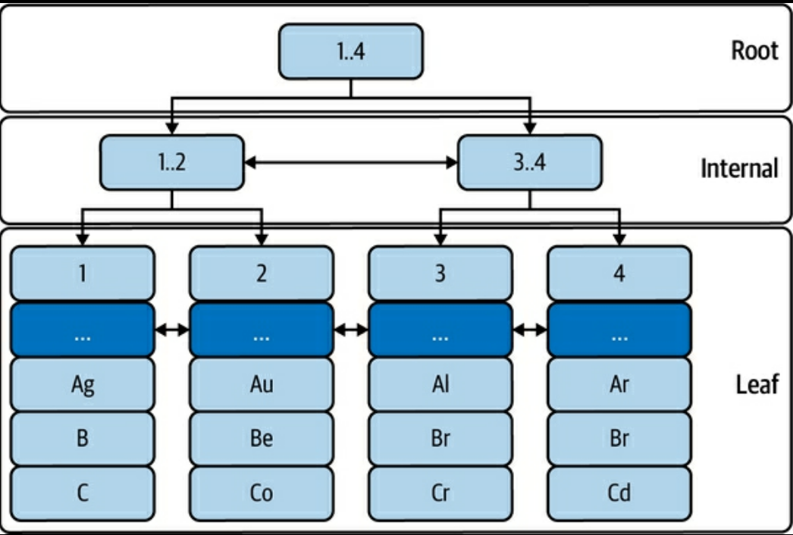
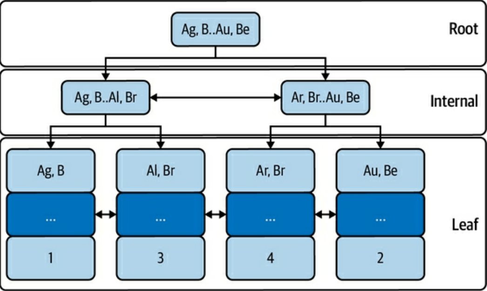
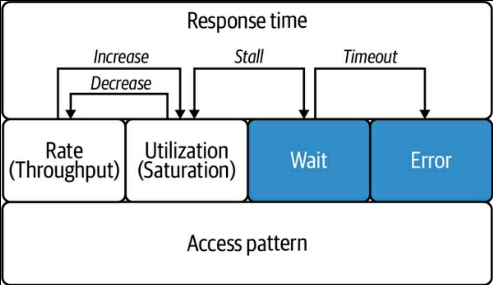
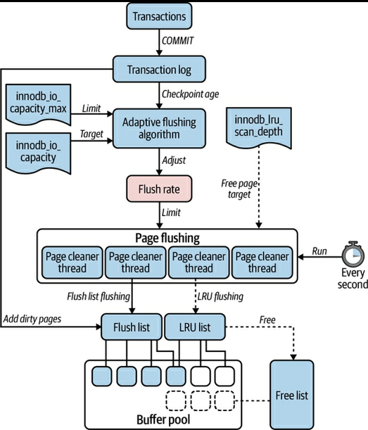
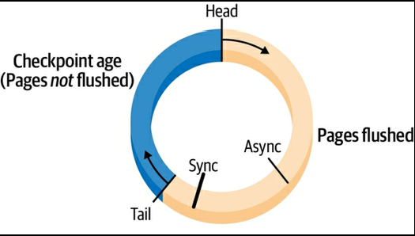
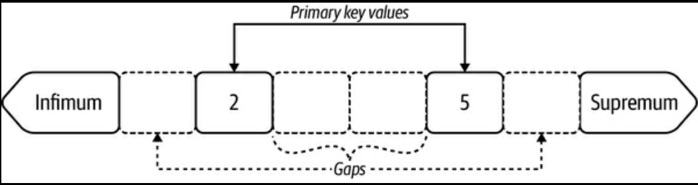

{"title":"Efficient MySQL Performance を読んだ","date":"2022-11-15T20:30:00+09:00","tags":["book", "mysql"]}

<div class="amazlet-box" style="margin-bottom:0px;"><div class="amazlet-image" style="float:left;margin:0px 12px 1px 0px;"><a href="http://www.amazon.co.jp/exec/obidos/ASIN/B09N5NWKR1/pleasesleep-22/ref=nosim/" name="amazletlink" target="_blank"></a></div><div class="amazlet-info" style="line-height:120%; margin-bottom: 10px"><div class="amazlet-name" style="margin-bottom:10px;line-height:120%"><a href="http://www.amazon.co.jp/exec/obidos/ASIN/B09N5NWKR1/pleasesleep-22/ref=nosim/" name="amazletlink" target="_blank">Efficient MySQL Performance (English Edition)</a></div><div class="amazlet-detail">英語版  Daniel Nichter  (著)  形式: Kindle版<br/></div><div class="amazlet-sub-info" style="float: left;"><div class="amazlet-link" style="margin-top: 5px"><a href="http://www.amazon.co.jp/exec/obidos/ASIN/B09N5NWKR1/pleasesleep-22/ref=nosim/" name="amazletlink" target="_blank">Amazon.co.jpで詳細を見る</a></div></div></div><div class="amazlet-footer" style="clear: left"></div></div>

とても良い本だった。

MySQL の初級・上級の本は既刊であるが、その間を埋めるものがないので書かれたというもので、難易度を 1 ~ 5 で表すと 4 くらい、難易度 5 は [実践ハイパフォーマンスMySQL](http://www.amazon.co.jp/exec/obidos/ASIN/4873116384/pleasesleep-22/ref=nosim/) とのことだった。

あくまで深堀りしたいアプリケーションエンジニア向けの本で、DBA 向けではないと明記されていた。実際 MySQL (InnoDB) の実装詳細の説明が適度に打ち切られていて、ただし必要十分なトピックはカバーされていて、学習効率が良い。

筆者は [Hack MySQL](https://hackmysql.com/) を運営していたり、過去に [Percona で数々のツールを作ってきた実績](https://docs.percona.com/percona-toolkit/authors.html) もあり、信頼が置ける。

## 1. Query Response Time

まず North Star Metrics としてクエリのレスポンスタイムを定義し、その改善に必要な項目を体系立てて説明している。この構成がかなり良くて、明確な指標があることで対応がぶれないし、この本の内容の簡潔さにもつながっている。

- レスポンスタイム以外の指標はユーザー体験と遠かったり actionable でなかったりなどするので、ここに絞っている
- データソースは Slow query log (閾値を 0 にする) か Performance Schema のいずれか
    - 後述のメトリクスが全て取得できるのは Performance Schema なのでそちらがおすすめ
    - 取得したクエリは digest を計算して集約して集計する
        - ref. [pt\-query\-digest — Percona Toolkit Documentation](https://docs.percona.com/percona-toolkit/pt-query-digest.html)
    - レポーティングツールによってはここから統計値や実行計画もとってまとめてくれるので使えるなら使ったほうがよい
        - p999 がおすすめらしい
            - 異常を見逃すリスクと特異値に振り回されないバランス
- クエリメトリクスとして取得すべきなのは次の 9 つ
    - Query time
        - Performance Schema にはよりトランザクションごと、ステージごとなど詳細な数値があるが、まずはシンプルにステートメントごとの数値で良い
    - Lock time
        - ロック取得にかかった時間で、Query time の 50% を超えないことがひとつの目安
        - ロックにはおおまかに Talbe lock, Row lock, Metadata lock の 3 種類がある
        - ここでひとつ細かい Gotcha
            - Performance Schema が記録する Lock time には Row lock が含まれない (これが一番重要にもかかわらず)
            - Slow query log には含まれる
        - 通常の SELECT でも Metadata lock はとるので、Lock time は 0 にはならない。
            - このときの Metadata lock は共有ロックなので、他の SELECT とは競合しない
            - 例外は ALTER TABLE でこれは排他の Metadata lock をとる
            - `ALGORITHM=INPLACE, LOCK=NONE` でもこのブロックは発生する
            - gh-ost などのツールを使っても、最後のテーブルスワップの時点でこのブロックが発生する
    - Rows examined, Row sent
        - examined = sent となるのが理想で、走査行数の割合が多すぎるのは index の selectivity が悪いことになる
        - レスポンスが不必要に大きいケースは bytes sent を見た方が良い
    - Rows affected
        - 大きすぎないか気にする
    - Select scan
        - フルテーブルスキャンの発生回数で、0 であるべき
    - Select full join
        - テーブル結合がフルスキャンで行われた回数で、 0 であるべきかつ、Select scan よりも深刻度が高い
        - 8.0.18 から hash joinが導入されたが、それでも避けるべき
    - Created tmp disk tables
        - クエリの top tableがメモリに収まらなくなった時に計上される
    - Query count
        - クエリの実行回数。実行時間 x 回数が大きい方がインパクトが大きい
- 見つかったクエリの最適化は Direct Query Optimization => Indirect Query Optimization の順で行う
    - Direct
        - 実行計画をみてクエリやインデックスを最適化
    - Indirect
        - Dataと Access pattern を最適化する
    - パラメータチューニングやハードウェアのスケールアップなどはこの後にくる
- 最適化するタイミング
    - ユーザー影響が出た時、機能リリース後、毎月などの定期チェック

## 2. Indexes and Indexing

2 章は Direct Query Optimization の文脈でクエリとインデックスについて扱う。

- Index の種類
    - Clustered Index
        - InnoDB のデータは PK をキーにした B-tree インデックスとして保存されている
        - 
        - `(p. 42) Figure 2-4. Table elem: InnoDB B-tree index` より
    - Secondary Index
        - PK 以外のキーを使ったすべてのインデックス
        - Leaf に PK を保持している。つまり Secondary Index を使った検索はまず Secondary Index を走査し取得した PK の値で Clustered Index を走査する
        - 
        - `(pp. 43-44) Figure 2-5. Secondary index on columns a, b` より
- Table アクセス方法
    - Index lookup
        - Index から特定の行や範囲を取得する。最も高速
    - Index scan
        - インデックスを走査してから更に絞り込みが必要なケース
        - full index scan
            - Secondary Index で候補を絞り込んでから Clustered Index でデータを読み込んでフィルタする
            - Secondary Index 上ではシーケンシャルに並んでいるデータも、Clustered Index ではそうでなくランダムアクセスになる可能性がある (ランダムな読み込みはシーケンシャルなそれよりも時間がかかる)
        - index only scan
            - Secondary Index 上にある情報だけでフィルタができるケース。Clustered Index へのアクセスが無い分 full index scan より高速
    - Table scan
        - 基本的には避けるべきだが、オプティマイザがフルスキャンを選ぶケースも少しだけある
            - テーブルが小さく頻繁にアクセスされる場合と、Table の Selectivity が非常に小さい場合
- Leftmost prefix
    - クエリがインデックスを使うには、キーを左から順に使わなければいけない
        - `(a, b, c)` のインデックスで a, c 両方を使った検索はできない (`a` だけでインデックスを走査し、その後 c の条件でのフィルタが行われる)
    - Secondary index はリーフに PK を持っているので、`(a, b, c, id)` のように右端に `id` キーが入っているとイメージするとよい
- EXPLAIN
    - 読み方 (一部)
        - table
            - JOIN する順に並んでいる
        - type
            - 前述の Table アクセス方法のいずれか (`ALL`: フルテーブルスキャン、`index`: Index scan, `const`, `ref`, `range`: Index lookup)
                - `const`: PK またはユニークな Secondary index で絞り込める場合
                - `range`: 範囲での取得
                - `ref`: `const` とにているがユニークなインデックスでない場合。Row examined が小さければほぼ `const` と同等に考えておけば良い
            - `eq_ref`: JOIN 時に PK または non-null かつユニークな Secondary index との結合だった場合。JOIN 時の `const` のようなもので高速
        - possible_keys, key
            - 使われるインデックスの候補と選ばれたもの
        - ref
            - 単一テーブルのクエリまたは JOIN の最初のテーブルの場合、`type` と同じ絞り込みの種別が表示される
            - JOIN の 2 テーブル目以降の場合、次のテーブルとの JOIN に使われるカラムが表示される
        - rows
            - 取得する行数の推定値
        - Extra
            - MySQL が行った最適化が表示される
            - `Using where`: インデックスの走査中に、マッチするレコードのデータを取得して、他の条件の絞り込みを行った
            - `Using index`: インデックスにある情報だけでクエリが完結した (Clustered index へのアクセスが不要だった)
            - `Index condition pushdown`: インデックスにある情報だけで WHERE 句の絞り込みが完結した
            - `Using filesort`: tmp buffer にてソートの必要があった
    - Covering index
        - クエリの条件 (WHERE, GROUP BY, etc) と SELECT で取得するカラムのすべてがインデックスの情報だけで完結する場合、そのインデックスをそのクエリのカバリングインデックスと呼ぶ
- ある時点では最適なインデックスも、時間経過でそうではなくなることがある
    - クエリが変わる
    - キーが過剰、重複、未使用
        - ref. [pt\-duplicate\-key\-checker — Percona Toolkit Documentation](https://docs.percona.com/percona-toolkit/pt-duplicate-key-checker.html)
        - インデックスを Drop する時、8.0 以降は [Invisible Indexes](https://dev.mysql.com/doc/refman/8.0/en/invisible-indexes.html) で実際に削除せずに検証できる。それ以前のバージョンは注意してやるしかない
    - Selectivity が極端 (極端になった)
        - `selectivity = row num / cardinality` で 0 から 1 の範囲
        - selectivity が小さすぎる場合、より適切なキーがありそう
        - selectivity が (ユニークインデックスでもないのに) 大きすぎる場合、含まれるキーが過剰、または本来ユニークインデックスであるべきかもしれない
        - selectivity が大きいインデックスが複数ある場合、そのテーブルのユースケースが多岐に渡るので、用途別にテーブルを分割することを検討してもいいかもしれない
- MySQL がインデックスの統計を更新するタイミング
    - テーブルが最初に開かれた時
    - ANALYZE TABLE が実行された時
        - なので本番で安易に実行するのは危険
    - 前回からテーブルの `1/16` 以上が更新された場合
    - `innodb_stats_on_metadata` が有効で特定の操作が行われた場合
- Table Join Algorithm
    - Nested loop join (NLJ)
    - Block nested-loop
        - マッチ結果をメモリ (join buffer) に読み込んで処理する
    - Hash join
        - 8.0.20 で導入。こちらが使われたかは EXPLAIN の Extra でわかる

## 3. Data

次は Indirect Query Optimization の一環としてデータについて扱う。

- どれだけ効率的なインデックスを作成しても、例えばデータサイズがかさむとパフォーマンスは悪化する
    - Less Data Is Better, Less QPS Is Bettar
- 効率的なデータアクセスのためのチェックリスト
    - Return only needed columns
        - `SELECT *` を避ける
    - Reduce query complexity
        - 複雑なクエリは人間によるメンテナンスがしづらく、結果として非効率なクエリが放置されることにつながる
    - Limit row access
        - 必要最低限の行にだけアクセスする
        - 通常 `LIMIT` は結果セットから N 件を取り出すのでデータアクセスの効率化にはならないが、ORDER BY と組み合わせたときは例外となる
            - インデックス順の ORDER で走査している場合、LIMIT で指定した数だけ結果を取得した時点で走査を打ち切る最適化がある
    - Limit the result set
        - 例えば行全体を取得してアプリケーション側でソートや集約をするのは避ける
    - Avoid sorting rows
        - データストアよりアプリケーションサーバの方がスケールアウトしやすいのでソートをアプリ側に任せるのは選択肢としてありえる
        - クエリ時間が悪いときに検討してもよいというニュアンスで、これを含め必ずやるべきという論調ではない
- 効率的なデータ保管のためのチェックリスト
    - Only needed rows are stored
        - 不要な行を挿入しない
    - Every column is used
        - 使わなくなった列は削除する
    - Every column is compact and practical
        - 適切な型を選択する
        - BLOB なんかは S3 のようなオブジェクトストレージに置いたほうが良い
    - Every value is compact and practical
        - 例えばクリーニング済みのデータを入れるなど
        - ip アドレスや uuid は文字列型ではなく、`INET_ATON` や `UUID_TO_BIN` などで変換して効率的に保管できる
        - データ正規化で空間効率をよくする (一方で JOIN の効率化悪化しないようにバランス)
    - Every secondary index is used and not a duplicate
        - tips として `mysql.innodb_index_stats` でテーブルのインデックスごとのサイズが確認できる
    - Only needed rows are kept
        - 使わなくなった行は削除する
- データの削除・アーカイブ
    - バッチサイズ指定とスロットリング (delay) を必ず入れる
    - バッチサイズ 1000、delay 200ms くらいからはじめて、レプリケーションラグが出ない範囲で調整していくのがよい
    - write heavy なワークロードでは、ロック競合 (による通常のクエリがブロックされて遅延すること) にも注意する
    - 単に DELETE しただけではディスク使用量は減らず、テーブルの再作成が必要になる
        - 必要な場合は `ALTER TABLE ... ENGINE=INNODB` または gh-ost のようなツールを使う
    - データの DELETE はデータは減るが、反してバイナリログは肥大化する (The binary log paradox)
        - つまりデータを削除するためにストレージの空き容量がより多く必要
        - 必要に応じて [binlog_row_image](https://dev.mysql.com/doc/refman/8.0/en/replication-options-binary-log.html#sysvar_binlog_row_image) を調整することも検討できる

## 4. Access Patterns

引き続き Indirect Query Optimization の一環としてアクセスパターンを取り上げる。ここでのアクセスパターンとは、個々のクエリではなくてアプリケーション全体からのデータストアの利用方法のようなもののようだ。

- 前提としてデータストアは、キャパシティに達するまで、アプリケーションのロードに比例してずっとパフォーマンスが上がるのではなく、キャパシティ以内でも一定のロードでパフォーマンスが頭打ちになる (いわゆるサチる状態)。そのためデータストアがどのような使われ方をしているかを把握し、それに応じた対策が必要
    - ref. [Guerrilla Capacity Planning \\ \\Large A Tactical Approach to Planning for Highly Scalable Applications and Services](http://www.perfdynamics.com/iBook/gcap.html)
- アクセスパターンの評価軸
    - Read/Write
        - 簡単に SELECT は Read、それ以外は Write として換算すると良い
        - 例えば Read heavy だと Replica へのオフロードやキャッシュなどが選択肢に入る
    - Throughput
        - どの程度の QPS が、どのようなパターン (周期性、スパイクなど) であるか
    - Data Age
        - 実際に利用するデータ (ワーキングセット) はどのくらいか
    - Data Model
        - key-value、document、分析、グラフなどの場合は、それに特化したデータストアのほうが効率的かもしれない
    - Transaction Isolation
        - アプリケーションが要求する分離レベルはどのくらいか
    - Read Consistency
        - 強い整合性が必要か、結果整合性があればよいのか
    - Concurrency
        - どの程度の同時実行がされるか
    - Row Access
        - Point access、Range access、Random access
    - Result Set
        - group, sort, limit などがされているか
- 対策のパターン
    - Audit the Code
        - まずは計測
    - Offload Reads
        - レプリカまたはキャッシュを導入する
    - Enqueue Writes
    - Partition Data
        - ワーキングセットを小さく保つ (separating hot and cold data)
    - Don't use MySQL
        - Data Model に合わせた専用のデータストアに乗り換える
- ハードウェアのスケールアップはここまでをやり尽くしてから検討したほうがよい

## 5. Sharding

ざっくりとは Write をスケールさせるためには一定以上の規模ではシャーディングが必要になる。一定規模以上では Schema Change も大変になる (pt-online-schema-change や gh-ost をつかっても時間がかかりすぎ実質無理になる)。バックアップ・リストア、アップグレード、クラッシュリカバリと行った運用面を考えても、大きな一つのインスタンスより、小さな複数のインスタンスのほうが何倍も扱いやすい。

この章ではシャーディングの詳細には立ち入らないが、基本的な考え方の整理とツールの紹介を行っている。

- シャーディングの概念
    - Four-year fit
        - データサイズのこの先 4 年の見積もりをして、いつシャーディングを行うか判断する
            - シャーディングの導入は年単位のプロジェクトになるので、2 年以下では足りず、4 年なら安全
    - Shard Key
        - 理想的な Shard Key は次の性質を持つ
            - High cardinality
            - Reference application entities
                - アプリケーションの要件的にもクロスシャードのアクセスが発生しない
            - Small
        - できるだけ良い Shard Key を選択し、適切な Strategy を使うことで、後述する Challenges を避けたり緩和できる
    - Strategies
        - 一般的には hash, range, lookup (directory) の 3 種類
        - それぞれ Rebalancing や Range アクセスなどに関連する
    - Challenges
        - Transactions
            - shard を超えたトランザクションはかけられない
            - 本質的にはアプリケーション側で 2PC を実装するしかなく、できるだけ発生しないように Shard Key, Stragegy を選ぶことに集中したほうがよい
        - Joins
            - shard を超えた JOIN はできない
            - 実装の複雑さなどを置いておくと、本質的に問題になるのはデータの一貫性となる
        - Cross-shard queries
            - 複数 shard へのクエリはレスポンスタイムを悪化させるので、多くなるとシャーディングしたメリットが減少する
            - 完全に無くすのは難しいという心持ちでいたほうがよい
            - cross-shard query のうち大規模なもの (全 shard または大多数の shard にアクセスするもの) は scatter queries (scatter-gather queries) と呼ばれる
                - ある程度の cross-shard query は避けようが無いが、scatter query は避けるべき
        - Resharding
            - ある shard を 2 つ以上に分割することで、data growth にあわせて必ず必要になるオペレーション
                - つまりシャーディングはより多くのシャーディングを生み出す
            - チャレンジは新しい shard にどうデータをマイグレーションするかで、要件としては以下になる
                - 最初に old shard から new shard へ bulk でデータコピーする
                - old shard への変更を news shard に sync する
                - new shard に切り替える
        - Rebalancing
            - データアクセスの偏り (hot shard) 解消のためデータを再配置するオペレーションで、strategy に依存する
            - hash
                - 基本的には不可能で relocate 用の lookup table を用意すると行ったワークアラウンドが必要
            - range
                - より小さな範囲に割り振り直すことで可能だが簡単ではない
            - lookup
                - 他の戦略に比べて比較的簡単で、lookup table を更新して remap する流れになる
            - Resharding と同様のマイグレーションのチャレンジがある
        - Online schema changes
            - 複数の shard にスキーマ変更を適用する仕組みの構築は複雑で、現在のところ OSS のソリューションは無い
- 代替手段
    - NewSQL
        - TiDB, CockroachDB
    - Middleware
        - Vitess, ProxySQL (これ自体がソリューションと言うよりはこれを利用して構築できるというもの)
    - Microservices
        - アプリケーションをどう分割するかという問題がつきまとうことが多い
    - Don't use MySQL
        - より適したデータストアがあるならそれを使う

## 6. Server Metrics

MySQL サーバの各指標と見方の説明。辞書的に網羅するのではなく、全体を分類して重要なポイントを説明してくれていてわかりやすい。個人的に一番学びがあった。特に InnoDB のセクションが本番という感じがする。

Key Performance Indicators

- Normal かつ Stable な状態が問題のない目指すべき状態
- それを測るための最低限の (高抽象度の) 指標が以下で、まずはここを見つつ深堀りをするとよい
    - Response time
        - 一定の小さな値に安定していれば良い
    - Errors
        - 率。0 に近いほどよい
    - QPS
        - 安定していればよく、突然の高騰などは問題
    - Threads running
        - 1 スレッドが 1 リクエストを処理する。QPS と連動している。小さいほど良い

Field of metrics

- すべての MySQL の Metrics は以下の 7 つに分類できる。またそれぞれ相互作用がある
- 
- `(p. 182) Figure 6-4. Field of metrics` より
- Response Time
    - その他の指標の相互作用が最終的にレスポンスタイムに影響する。すべての指標のトップレベルに置いておく
- Rate
    - QPS などあるタスクをどれだけ早く MySQL が処理しているか
    - Rate が上がると Utilization が下がる反比例の関係にある
- Utilization
    - CPU, memory 使用率など、ある有限のリソースをどれだけ使っているか
    - 例えば Disk IO 使用率が 100% になると QPS が下がるといった関係がある
    - 使用率が 100% に近づくと、リソースの空きを待つ Wait が発生する。この関係のことを Stall と呼ぶ
- Wait
    - クエリ実行の待ち (idle 状態の) 時間
    - 0 にするのではなく小さな値で安定させることを目指す
    - 一定のしきい値を超えるとタイムアウトが発生する
    - 設定できるタイムアウトには以下がある。ただ依存するのではなく未然に防ぐべき
        - [MAX_EXECUTION_TIME (optimizer hint)](https://dev.mysql.com/doc/refman/8.0/en/optimizer-hints.html#optimizer-hints-execution-time)
        - [max_execution_time](https://dev.mysql.com/doc/refman/8.0/en/server-system-variables.html#sysvar_max_execution_time)
        - [lock_wait_timeout](https://dev.mysql.com/doc/refman/8.0/en/server-system-variables.html#sysvar_lock_wait_timeout)
        - [innodb_lock_wait_timeout](https://dev.mysql.com/doc/refman/8.0/en/innodb-parameters.html#sysvar_innodb_lock_wait_timeout)
        - [connect_timeout](https://dev.mysql.com/doc/refman/8.0/en/server-system-variables.html#sysvar_connect_timeout)
        - [wait_timeout](https://dev.mysql.com/doc/refman/8.0/en/server-system-variables.html#sysvar_wait_timeout)
- Error
    - エラーの数。タイムアウトのエラーの一種
- Access Pattern
    - 例えば Com_select, Com_insert などのアクセスパターンを表す指標
- Internal
    - その他のより詳細な内部指標

実際の指標

- Query Response Time
    - 8.0.1 以降は次のようなクエリで 95 パーセンタイル値を取得できる。5.7 以前ではクエリごとの値しか取れないので自分で集約する必要がある

        ```sql
        SELECT
            ROUND(bucket_quantile * 100, 1) AS p,
            ROUND(BUCKET_TIMER_HIGH / 1000000000, 3) AS ms
        FROM
            performance_schema.events_statements_histogram_global
        WHERE
            bucket_quantile >= 0.95
        ORDER BY bucket_quantile LIMIT 1;
        -- Nichter, Daniel. Efficient MySQL Performance (p. 188). O'Reilly Media. Kindle Edition.
        ```

- Errors
    - 次のようなクエリで取得できる

        ```sql
        SELECT
            SUM(SUM_ERROR_RAISED) AS global_errors
        FROM
            performance_schema.events_errors_summary_global_by_error
        WHERE
            ERROR_NUMBER NOT IN (1287);  -- 1287 は deprecation warning なので無視している

        -- 5.7 以前
        SELECT
            SUM(sum_errors) AS query_errors
        FROM
            performance_schema.events_statements_summary_global_by_event_name
        WHERE
            event_name LIKE 'statement/sql/%';

        -- Nichter, Daniel. Efficient MySQL Performance (p. 190). O'Reilly Media. Kindle Edition.
        ```

    - 加えて次のクライアント側の接続エラーも見ておくと良い
        - Aborted_clients, Aborted_connects, Connection_errors_%
- Queries
    - QPS
        - Queries という実行されたクエリ数のカウンタがある。定期的に取得して `QPS = (Queries at T1 - Queries at T0) / (T1 - T0)` を計算する
    - TPS (Transactions per second)
        - Com_begin, Com_commit, Com_rollback で集計できる
            - ほとんどのケースでは Com_begin = Com_commit になるので、その割合も見ておくと良い
        - 現時点でアクティブなトランザクションの一覧は innodb.trx_active_transactions.
    - Read/Write
        - Com_select, Com_delete, Com_delete_multi, Com_insert, Com_insert_select, Com_replace, Com_replace_select, Com_update, Com_update_multi がある
        - 例えば Read の割合は `Com_select / Queries` のように算出できる
    - Admin
        - 管理用の操作は Com_flush, Com_kill, Com_purge, Com_admin_commands で集計できる
    - SHOW
        - よく使われるものは Com_show_databases, Com_show_engine_status, Com_show_errors, Com_show_processlist, Com_show_slave_status, Com_show_status, Com_show_table_status, Com_show_tables, Com_show_variables, Com_show_warnings
- Threads and Connections
    - 1 つの接続を 1 スレッドで処理するので、スレッド数と接続数は関連がある
    - Connections, Max_used_connections, Threads_connected, Threads_running
    - QPS が大きく、running threads が小さいのが、効率的に処理できている理想的な状態
- Temporary Objects
    - ソートや大きな JOIN のために作られる tmp 領域の指標
    - Created_tmp_disk_tables, Created_tmp_tables, Created_tmp_files
    - Created_tmp_disk_tables が突如大きくなっていたりすると、メモリ不足の疑いがある
- Prepared Statements
    - Com_stmt_prepare, Com_stmt_execute
    - 通常は Com_stmt_execute が Com_stmt_prepare よりも圧倒的に大きくなっているべきで、そうでないなら無駄な Prepare をしている恐れがある
        - アプリケーション側のライブラリの作りによっては気づかずにそうなっていることもあり得る
    - Prepared_stmt_count が var.max_prepared_stmt_count に達しないように注意する
- Bad SELECT
    - Select_scan, Select_full_join, Select_full_range_join, Select_range_check はフルスキャンなどが行われていると増える指標で、基本的には 0 にするべき
- Network Throughput
    - Bytes_sent, Bytes_received を見ておくとネットワークがサチるケースを捕捉できる
    - MySQL をキューとして使うなどでスループットが非常に高くなったり、大きな BLOB の値ができたりなど、突然転送量が大きくなるケースはあり得る
- Replication
    - 7 章で確認する
- Data Size
    - データベースごと、テーブルごとそれぞれこのクエリで参照できる

        ```sql
        -- database ごと
        SELECT
            table_schema AS db,
            ROUND(SUM(data_length + index_length) / 1073741824 , 2) AS 'size_GB'
        FROM
            information_schema.tables
        GROUP BY table_schema;

        -- テーブルごと
        SELECT
            table_schema AS db,
            table_name as tbl,
            ROUND((data_length + index_length) / 1073741824 , 2) AS 'size_GB'
        FROM
            information_schema.tables
        WHERE
            table_type = 'BASE TABLE'
            AND table_schema != 'performance_schema';

        --Nichter, Daniel. Efficient MySQL Performance (p. 204). O'Reilly Media. Kindle Edition.
        ```

InnoDB

- History list length (HLL)
    - innodb.trx_rseg_history_len
    - 詳しくは 8 章で
    - 1,000 以下だと安定で、100,000 を超えると問題
- Deadlock
    - innodb.lock_deadlocks
- Row lock
    - innodb.lock_row_lock_time
        - 行ロック取得にかかった時間 (ms)。2 時点の比較をみる。安定していれば OK
    - innodb.lock_row_lock_current_waits, innodb.lock_row_lock_waits
        - 行ロック取得待ちの現状値と累積値
    - innodb.lock_timeouts
        - ロック取得待ちでタイムアウトした数
        - タイムアウトは [innodb_lock_wait_timeout](https://dev.mysql.com/doc/refman/8.0/en/innodb-parameters.html#sysvar_innodb_lock_wait_timeout) で設定されている
- Data throughput
    - Innodb_data_read, Innodb_data_written
    - 問題になることは少ないが見ておくに越したことはない
- IOPS
    - innodb.os_data_reads, innodb.os_data_writes
    - InnoDB は IO が少なくなるように様々な最適化をしている
    - インフラの IOPS 上限を超えないようにする
    - IO にはバックグランドのもの (ページフラッシュ、バッファのマージなど) とフォアグラウンドのものがある
        - 前者は [innodb_io_capacity](https://dev.mysql.com/doc/refman/8.0/en/innodb-parameters.html#sysvar_innodb_io_capacity) と [innodb_io_capacity_max](https://dev.mysql.com/doc/refman/8.0/en/innodb-parameters.html#sysvar_innodb_io_capacity_max) で調整できる
    - ref.
        - [MySQL :: MySQL 8\.0 Reference Manual :: 15\.8\.7 Configuring InnoDB I/O Capacity](https://dev.mysql.com/doc/refman/8.0/en/innodb-configuring-io-capacity.html)
        - [Give Love to Your SSDs \- Reduce innodb\_io\_capacity\_max\! \- Percona Database Performance Blog](https://www.percona.com/blog/2019/12/18/give-love-to-your-ssds-reduce-innodb_io_capacity_max/)
        - [Tuning MySQL/InnoDB Flushing for a Write\-Intensive Workload \- Percona Database Performance Blog](https://www.percona.com/blog/2020/05/14/tuning-mysql-innodb-flushing-for-a-write-intensive-workload/)
- Buffer pool efficiency
    - Innodb_buffer_pool_read_request, Innodb_buffer_pool_reads
        - buffer pool からの読み込み試行回数が前者で、そのうちディスクまで読みに行った回数が後者
    - `(Innodb_buffer_pool_read_request / Innodb_buffer_pool_reads) × 100`
        - (原文ままだが、`(1 - read/request) * 100` が正しい?)
        - 十分に暖気されている状態で 99% 以上あるのが理想的。ただ実際のパフォーマンス問題がない状態で最適化する必要はない
    - データサイズがメモリサイズよりも小さければ、全てのデータがバッファプールに乗る
        - バッファプールのサイズは [innodb_buffer_pool_size](https://dev.mysql.com/doc/refman/8.0/en/innodb-parameters.html#sysvar_innodb_buffer_pool_size) か [innodb_dedicated_server](https://dev.mysql.com/doc/refman/8.0/en/innodb-parameters.html#sysvar_innodb_dedicated_server) で決まる
    - ただそうでないケースのほうが多い
        - Data age, Page flushing, Availabe memory に関連する。例えば可能ならデータのワーキングセットがメモリに乗るようにして、無理ならメモリの増強など
    - なおここで言う read は単純な SELECT のことではなく、書き込みの際に発生するデータの読み込みも含めたもの
- Page flushing
    - まず用語の整理
        - page
            - free pages
                - 空いていて利用可能なページ
            - data pages
                - 利用中かつ変更がないページで clean pages とも呼ばれる
            - dirty pages
                - 変更がまだディスクに永続化されていないページ
            - misc pages
                - その他の内部利用用途
    - パフォーマンス観点では free と dirty を見ておくのが良い
        - innodb.buffer_pool_pages_total
            - バッファプールにあるページの総数
            - [innodb_buffer_pool_size](https://dev.mysql.com/doc/refman/8.0/en/innodb-parameters.html#sysvar_innodb_buffer_pool_size) によって決まる
        - innodb.buffer_pool_pages_dirty, innodb.buffer_pool_pages_free
            - dirty, free ページの数
            - buffer_pool_pages_total を分母にして割合を確認できる
            - dirty page の割合が 10% から 90% くらいは正常でも十分にありえる
                - dirty page 割合単体ではなく、ほかの指標と合わせて確認する
        - innodb.buffer_pool_wait_free
            - まず InnoDB は free page が常に一定量あるように調整している (ここでは free page target と呼ぶ)
                - free page target は [innodb_lru_scan_depth](https://dev.mysql.com/doc/refman/8.0/en/innodb-parameters.html#sysvar_innodb_lru_scan_depth) * [innodb_buffer_pool_instances](https://dev.mysql.com/doc/refman/8.0/en/innodb-parameters.html#sysvar_innodb_buffer_pool_instances) で求められる
                    - 前者は名前がミスリーディングだが buffer pool 1 インスタンスあたりの目標フリーページ数
                    - 後者は buffer pool 内部のインスタンス数 (buffer pool は実は内部的に複数のインスタンスに分かれている。IO の競合を避けるため)
            - buffer_pool_wait_free はフリーページを要求したが待たされたとき (free page wait) に加算される指標
                - 通常は InnoDB が free page target を目指して調整しているのであまり起こらない
            - wait が発生した場合の対処
                - free page target を増やす
                - ストレージの IOPS を上げる
                - メモリを増やす
            - もし free page が target よりも常に大きく減ることもない場合、メモリが多すぎる可能性がある
    - page flushing
        - ページをフラッシュして clean にすると、そのページは evict してよくなる
            - free page にデータが読み込まれると clean page (data page) になる
            - データが更新されると dirty page になる
            - データがフラッシュされると dirty page が clean page に戻る
            - free page が必要になった際に clean page は evict される
        - 
            - `(p. 216) Figure 6-6. InnoDB page flushing` より
            - dirty page は内部的に次の 2 つのリストに保存される
                - Flush list
                    - transaction log にコミットされた write による dirty page
                - LRU list
                    - data age でソートされた buffer pool 内の clean page と dirty page
            - 定期的にバックグラウンドの page cleaner thread が dirty page をフラッシュする
                - スレッド数は [innodb_page_cleaners](https://dev.mysql.com/doc/refman/8.0/en/innodb-parameters.html#sysvar_innodb_page_cleaners) で決まる
            - その際 2 つのアルゴリズムでフラッシュしている
                - Adaptive flushing
                    - transaction log の書き込みペースに応じて page flushing のペースも変化させる
                    - 最大値は IOPS のキャパシティに依存する
                    - 主に checkpointing (後述) のためのアルゴリズム
                - LRU flushing
                    - LRU から古いものをフラッシュする
                    - バックグラウンドとフォアグラウンドのものがある
                    - フォアグラウンド
                        - ユーザースレッド (クエリを実行しているスレッド) がフリーページを要求した時
                        - free page wait が発生しているということなのでパフォーマンスに影響がある
                        - 発生すると前述の buffer_pool_wait_free が加算される
                    - バックグラウンド
                        - page clener が free page target にあわせてフラッシュする
                    - 主に eviction のためのアルゴリズム
        - これらを踏まえて次の指標を追うとよい
            - innodb.buffer_flush_batch_total_pages
                - 全アルゴリズムでのフラッシュの合計
                - 安定していれば良い
            - innodb.buffer_flush_adaptive_total_pages, innodb.buffer_LRU_batch_flush_total_pages
                - それぞれアルゴリズムごとのフラッシュ回数
            - innodb.buffer_flush_background_total_pages
                - 上記 2 つのアルゴリズム以外でのフラッシュ回数
- Transaction log (Redo log、あるいは単に The log)
    - データに変更があった際にログに書き込みディスクに永続化する
        - データの耐久性のため
        - page flushing とは別の概念
        - transaction log への書き込みはすぐに (buffer pool とは別に) フラッシュされ永続化される。それとは別に buffer pool の dirty page のフラッシュがされているという考え方になる。例えば transaction log は永続化されているが、buffer pool への適用はまだ disk にフラッシュされていないという状態も起こる
    - 固定長のリングバッファ
        - 
        - `(p. 220) Figure 6-7. InnoDB transaction log` より
        - 大きさは [innodb_log_file_size](https://dev.mysql.com/doc/refman/8.0/en/innodb-parameters.html#sysvar_innodb_log_file_size) または [innodb_dedicated_server](https://dev.mysql.com/doc/refman/8.0/en/innodb-parameters.html#sysvar_innodb_dedicated_server) で決まる
        - transaction log にはデータの変更が入っている
            - dirty page ではないが、dirty page にリンクしている
            - トランザクションがコミットされると、そのデータ変更は transaction log の先頭に追加され disk に sync され、対応する dirty page が flush list に追加される
        - checkpoint age は transaction log の head と tail との距離
            - dirty page を buffer pool からフラシュすると tail が進む (余裕が増える)
            - adaptive flushing はこの checkpoint age を一定に保つようにするためのもの
        - もし head が tail に追いついたら
            - それを防ぐための 2 つのポイントがある
            - Async ポイント
                - head がここに到達するとバックグラウンドでのフラッシュが行われる
                - 追加の Write は許可されるが、裏でフラッシュが全力で行われるので、IO 性能は下がる
            - Sync ポイント
                - head がここに到達すると、すべての Write はストップしフラッシュが行われる
    - innodb.log_lsn_checkpoint_age, innodb.log_max_modified_age_async で transaction log の利用率 (どれだけ Async ポイントに head が迫っているか) を観測できる
        - `transaction log utilization = (innodb.log_lsn_checkpoint_age / innodb.log_max_modified_age_async) × 100`
        - これは少し保守的な計算になっていて、この式が 100% になっても Async の開始まで少し余裕がある。ただ実際に始まると著しくパフォーマンスが悪化するので注意が必要
        - Sync のポイントは innodb.log_max_modified_age_sync
    - transaction log の disk への書き込みは、まず先に in-memory のバッファにためてから disk への書き込みが行われる
        - このバッファが小さくクエリが待たされたときは innodb.log_waits が加算される
        - log_waits は 0 であるべき
        - バッファサイズは [innodb_log_buffer_size](https://dev.mysql.com/doc/refman/8.0/en/innodb-parameters.html#sysvar_innodb_log_buffer_size) で規定される。通常はデフォルトの 16MB で十分
    - transaction log は実態としては 2 つの実ファイルから成り立っていて、それらの書き込み時の wait は次の指標でわかる
        - innodb.os_log_pending_writes, innodb.os_log_pending_fsyncs
        - これらが 0 でないなら調査すべき
    - transaction log に書き込まれたバイト数 innodb.os_log_bytes_written も見ておくとよい
        - hourly でどのくらい書き込みがあったかを見て、log_file_size が適切かを判断する
        - log_file_size はデフォルト 96MB (= `48 MB * 2`)
- ref. [MySQL :: MySQL 8\.0 Reference Manual :: 15 The InnoDB Storage Engine](https://dev.mysql.com/doc/refman/8.0/en/innodb-storage-engine.html)

## 7. Replication Lag

レプリケーションとそのラグの仕組と対策を説明している。

- 基本
    - Source to replica (通常の) レプリケーションと Group Replication (各インスタンスをクラスタとして扱い合意形成プロトコルでやりとりする) があるが、今回は Source to replica だけを扱っている
    - 
        - `(p. 235) Figure 7-1. Foundation of MySQL source to replica replication` より
        - Source でトランザクションがコミットされるとデータの変更が Binarly Log (binlog) に書き出される
        - Replica の IO Thread が Source の binary log events を取得する
        - Replica の IO Thread が取得した binary log events を Relay Log に書き出して永続化する
        - Replica の SQL Thread (applier と呼ばれることもある) が Relay Log から binary log events を読み込む
        - Replica の SQL Thread が読み込んだ binary log events をデータに反映させる
        - Replica は適用された変更を Replica の binlog に書き出す
            - 冗長性のため (Source にプロモートするときに備えて) 書き出している
    - Binary log events
        - 以下 [binlog_format](https://dev.mysql.com/doc/refman/8.0/en/replication-options-binary-log.html#sysvar_binlog_format) が row-based replication (RBR) のケースの説明をしている
        - レプリケーションは個々の Write ではなく、イベントという単位でデータ変更を扱っている。binlog はイベントのストリーム
        - イベントには row image という、その行の変更前後のバイナリ形式のスナップショットが含まれている
            - クエリによる変更適用後の状態が転送されているというイメージ
            - またこのような形式のため、1 つのシンプルなクエリでもデータの変更が大きい場合は binlog が大きくなる (= ラグにつながる) という特性がある
    - レプリケーションラグ
        - SQL Thread で遅延することが多い
            - ネットワークの遅延は相対的に少なく、IO Thread はイベント単位にまとめられた情報をシーケンシャルにログファイルに書き出すだけなので、それを解釈して適用する SQL Thread に比べてスループットが出る
        - Source が Replica の ack を待ったりしない限り、仕組み上レプリケーションにラグは不可避だが、以下の理由で通常は Source よりも高速に動作する
            - Replica は Source よりも少ないワークロードしか扱わないので。特に Read しか発生しないので
            - binary log events (変更適用済みの row image) を元に作業するので。Source はクエリを解釈し対象行を探しそこに変更を加えるが、Replica は変更の適用の作業だけをしている
- ラグの原因
    - Transaction throughput
        - Source のスループットが Replica の SQL Thread のスループットよりも大きくなると遅延する
        - 基本的には Replica 側の改善をするべき
        - 大きなトランザクションは Source よりも Replica に影響が大きいことが多い
            - デフォルトでは SQL Thread は 1 スレッドだし、マルチスレッドにしても Source 程は並行数を増やしにくいし、一つのスレッドを大きなトランザクションが専有し続けることになるので
        - 原則としてトランザクションを小さくとどめることは良いプラクティス
            - 単純なアプリケーションのワークロードだけでなく、バックアップやデータ削除・アーカイブで引き起こされることもある。後者はバッチサイズの調整が重要
    - その他インスタンスダウン後のリビルドやネットワークの問題によりラグが起こることもある
- ラグのリスク: データロス
    - レプリケーションラグには本質的にデータロストの危険性がある
    - デフォルトではレプリケーションは非同期で行われている (Asyncronous replication)
        - Source でコミットされたトランザクションは非同期で Replica から取得され、特に Replica 側でのコミットを待ったりしない
        - そのため Source がクラッシュすると、Replica に未反映のトランザクションがロストする
    - 準同期レプリケーション (Semisynchronous replication) はこの問題を緩和する
        - Replica は Relay log に書き込みが完了したら Source に ack を返す。Source は 1 つ以上の ack を受け取った時点でコミットする
            - よって未コミットのトランザクション以外はクラッシュしても失われない
        - SQL Thread による適用まで待つのではなく、Relay log まで待つので "準" 同期と呼ばれている
        - 特別なチューニング (Source, Replica やネットワークのキャパシティ) や Source のスループットの一部低下はありえるが、データロストという致命的な問題の対策になっている
    - 非同期レプリケーションの採用例・実績は多いが、今後は準同期レプリケーションのほうがベストプラクティス
        - GitHub は準同期レプリケーションを本番運用している実績がある
        - 非同期レプリケーションを使う場合は適切なモニタリングと、大きなラグを放置しない運用体制が必要
- ラグへの対策
    - SQL Thread をマルチスレッドにする
        - トランザクションをランダムに適用すると当然データ不整合が起きる。トランザクションの依存関係を解釈し安全なものだけを並行処理する必要がある
        - チューニングが難しいので、よくマニュアルを読んで注意して行ったほうがよい
            - ref. [MySQL Parallel Replication \(LOGICAL\_CLOCK\): all the 5\.7 \(and some of the 8\.0\) details \- YouTube](https://www.youtube.com/watch?v=cPsULwEnCio)
        - まずは以下の保守的な設定からはじめるのをおすすめする
            - [replica_parallel_workers](https://dev.mysql.com/doc/refman/8.0/en/replication-options-replica.html#sysvar_replica_parallel_workers): 4
                - SQL Thread の数
            - [replica_parallel_type](https://dev.mysql.com/doc/refman/8.0/en/replication-options-replica.html#sysvar_replica_parallel_type): LOGICAL_CLOCK
            - [replica_preserve_commit_order](https://dev.mysql.com/doc/refman/8.0/en/replication-options-replica.html#sysvar_replica_preserve_commit_order): 1
                - スループットは稼げないがコミット順序を保証してデータ不整合を防ぐ
    - binlog への書き込みを都度ではなくバッファする
        - [binlog_group_commit_sync_delay](https://dev.mysql.com/doc/refman/8.0/en/replication-options-binary-log.html#sysvar_binlog_group_commit_sync_delay) を調整する
        - ref. [A Metric for Tuning Parallel Replication in MySQL 5\.7 \| J\-F Gagné's MySQL Blog](https://jfg-mysql.blogspot.com/2017/02/metric-for-tuning-parallel-replication-mysql-5-7.html)
- モニタリング
    - 前提適切なモニタリングツールを使うことを推奨
    - Seconds_behind_source は Replica が適用したトランザクションと Source の最後のトランザクションのタイムスタンプの差分
        - シンプルだが以下の問題がある
            - もしネットワーク遅延があり binlog の到着が遅れていても Seconds_behind_source は増えない
            - 状況によっては値が 0 と大きな数値の間で乱高下する
            - 単にその時点での Replica が適用しているトランザクションが Source でいつ発行されたかの数値なので、おおざっぱな把握にはよいが、この値をもいいて精緻な推測は難しい
    - 専用のツールは定期的にタイムスタンプを Source に書き込んで計測することでこれらの問題を解消している
        - ref. [pt\-heartbeat — Percona Toolkit Documentation](https://docs.percona.com/percona-toolkit/pt-heartbeat.html)
    - それでも、ラグが発生したときに、リカバリにどれくらいかかるかを見積もりするのは難しい

## 8. Transactions

ロックと分離レベルについて扱っている。

- 行ロック
    - 用語の整理
        - 
        - `(p. 260) Figure 8-1. Index record gaps` より
        - Infimum, Supremum
            - 無限小・無限大の疑似レコード
        - Gap
            - 各キーの間の部分
    - InnoDB の基本的なロックの種類
        - Record lock (REC_NOT_GAP)
            - 一つのレコードをロックする
        - Gap lock (GAP)
            - 一つの gap をロックする
            - 例えば上図で 2 と 5 の間の gap をロックする場合 `Gap lock 5` のような記載をする
                - 指定されたキー未満の一つの gap を指し示す
        - Next-key lock (表示なしの場合はこのロック)
            - 一つのレコードとその前の一つの gap をロックする
        - Insert intention lock (INSERT_INTENTION)
            - gap の中への INSERT を許容するロック
    - ロックの状況は `performance_schema.data_locks` で可視化できるので、これを使って実験すると理解が深まる
        - `lock_mode` に "共有か排他か" と種類が記載されている
            - 例えば 3 行目は X (排他) の supremum の Next-key lock
        - 1 行目のテーブルロックは一旦無視して良い

        ```sql
        BEGIN;
        UPDATE elem SET c = '' WHERE id BETWEEN 2 AND 5;

        -- performance_schema.data_locks より
        +------------+-----------+---------------+-------------+-----------------------+
        | index_name | lock_type | lock_mode     | lock_status | lock_data             |
        +------------+-----------+---------------+-------------+-----------------------+
        | NULL       | TABLE     | IX            | GRANTED     | NULL                  |
        | PRIMARY    | RECORD    | X,REC_NOT_GAP | GRANTED     | 2                     |
        | PRIMARY    | RECORD    | X             | GRANTED     | supremum pseudo-record|
        | PRIMARY    | RECORD    | X             | GRANTED     | 5                     |
        +------------+-----------+---------------+-------------+-----------------------+

        -- Nichter, Daniel. Efficient MySQL Performance (p. 263). O'Reilly Media. Kindle Edition.
        ```

    - Gap lock は [phatom read](https://dev.mysql.com/doc/refman/8.0/en/innodb-next-key-locking.html) (別トランザクションのコミットがトランザクション中に見えてしまう) を防ぐためにとられている。分離レベルを READ COMMITED にするとそうはならず、この例だと 2 と 5 のキーだけを Record lock する動きになる
    - selectivity の小さい secondary index のロックが必要になった場合、より広い範囲のロックがされ、競合がおこりやすくなる
    - Insert intention lock は Gap lock の特別なバージョン
        - これからレコードを挿入するときに使われる
        - Insert intention lock がとられている gap に他のトランザクションは insert ができる
        - Gap lock がすでに取られている場合、Insert intention lock の取得はブロックされる
- MVCC と Undo logs
    - InnoDB は MVCC (レコードの複数のバージョンを持っておき特定のトランザクションでは特定のバージョンだけを参照できるようにする) と Undo logs (最新の状態から前のバージョンに戻るための操作履歴) の仕組みを提供している
        - あるレコードのある時点のスナップショットを v1 とし、トランザクション A が v1 を参照しているとする
            - REPEATABLE READ ではトランザクション開始時点で v1 のスナップショットが作られる
            - READ COMMITTED の場合は Read ごとにスナップショットが作られる (= Read した時点での最新状態を単純に読んでいる)
        - 別のトランザクションがそのレコードを変更し v2 ができ、Undo logs には v2 から v1 に戻すための操作履歴が入っている
            - ロールバックする際は Undo logs を元に v1 に戻す
        - トランザクション A が終わった時点で Undo logs は破棄される
            - つまり長時間つづくトランザクションが残り続けると、Undo logs が肥大化しパフォーマンスに悪影響がある
        - MVCC はあくまで SELECT の一貫性を保つだけなので、Read には別トランザクションの変更が反映されていないが、Write してみたら別トランザクションの反映が影響するということもありえる
    - Undo logs は buffer pool の `Misc pages` に保存される
- History list length
    - 歴史的経緯もあり複雑だが、おおざっぱには破棄されていない Redo logs の長さ
    - 目安としてこの数値が 100,000 を超えると対応が必要
        - Redo logs が多くなりすぎると、SELECT で参照する Redo logs の量が増えるので、一般的にクエリレスポンスタイムに悪影響が出得る
    - 次のようなトランザクションが問題になる
        - Large transaction
            - 変更するレコードが多いトランザクション
        - Long-running transaction
        - Stalled transaction
            - Long-running transaction のうち、待ち時間が長いもの
            - 例えば一つのトランザクションで DB から取得した値を長時間かかるアプリケーション側の処理にかけ、そのご書き込むようなケース
        - Abandoned transaction
            - コネクションのリークなどで閉じられないまま残り続けているトランザクション
- レポーティング
    - 現時点で良いツールが無いらしいが、performance_schema を参照して情報を集計できる
    - 実際のクエリが記載されているので書籍を参照

## 9. Other Challenges

これまでの章に入らなかった問題・話題のまとめ。

例えば Split-Brain (複数のインスタンスの書き込みが発生してしまい、データ不整合が起こる) や Data Drift (source と replica でデータが食い違う。発見が難しい。[pt\-table\-sync](https://docs.percona.com/percona-toolkit/pt-table-sync.html) といったツールもある) は、マネージドサービスだと起こりづらいが一度発生すると致命的なもの。マルチテナントの環境で、同居する他のプロセスの影響をうける Noisy neighbor 問題も原因特定が難しい。

詳細のメモは割愛。

## 10. MySQL in the Cloud

クラウド環境で MySQL を運用する際の考慮点など。本家とクラウドベンダーが提供するものとの差分を確認すること、どの部分の運用が基板側でどの部分がユーザー側なのかの棲み分けなどをざっと説明している。

詳細のメモは割愛。

<div class="amazlet-box" style="margin-bottom:0px;"><div class="amazlet-image" style="float:left;margin:0px 12px 1px 0px;"><a href="http://www.amazon.co.jp/exec/obidos/ASIN/B09N5NWKR1/pleasesleep-22/ref=nosim/" name="amazletlink" target="_blank"></a></div><div class="amazlet-info" style="line-height:120%; margin-bottom: 10px"><div class="amazlet-name" style="margin-bottom:10px;line-height:120%"><a href="http://www.amazon.co.jp/exec/obidos/ASIN/B09N5NWKR1/pleasesleep-22/ref=nosim/" name="amazletlink" target="_blank">Efficient MySQL Performance (English Edition)</a></div><div class="amazlet-detail">英語版  Daniel Nichter  (著)  形式: Kindle版<br/></div><div class="amazlet-sub-info" style="float: left;"><div class="amazlet-link" style="margin-top: 5px"><a href="http://www.amazon.co.jp/exec/obidos/ASIN/B09N5NWKR1/pleasesleep-22/ref=nosim/" name="amazletlink" target="_blank">Amazon.co.jpで詳細を見る</a></div></div></div><div class="amazlet-footer" style="clear: left"></div></div>
