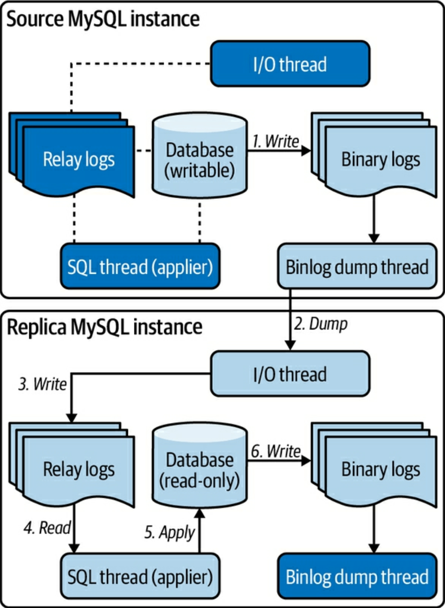

{"title":"GCP CloudSQL MySQL での Replication Lag と innodb_flush_log_at_trx_commit","date":"2023-07-27T20:30:00+09:00","tags":["mysql"]}

Primary (Source) - Replica 構成の MySQL クラスタを GCP の CloudSQL で構築し本番運用している。このうち一台の Replica の Replication Lag が急増したことがあった。同僚のアドバイスで `innodb_flush_log_at_trx_commit` を調整し Lag は解消した。

これは後日 `innodb_flush_log_at_trx_commit` の意味を調べた際のメモ。

## レプリケーションの仕組みのおさらい

[以前読んだ Efficient MySQL Performance](https://please-sleep.cou929.nu/efficient_mysql_performance.html) の図と説明がわかりやすいのでそちらから引用する。

<figure>

<figcaption>Efficient MySQL Performance (p. 235) Figure 7-1. Foundation of MySQL source to replica replication より</figcaption>
</figure>

- Source でトランザクションがコミットされるとデータの変更が Binarly Log (binlog) に書き出される
- Replica の IO Thread が Source の binary log events を取得する
- Replica の IO Thread が取得した binary log events を Relay Log に書き出して永続化する
- Replica の SQL Thread (applier と呼ばれることもある) が Relay Log から binary log events を読み込む
- Replica の SQL Thread が読み込んだ binary log events をデータに反映させる
- Replica は適用された変更を Replica の binlog に書き出す
    - 冗長性のため (Source にプロモートするときに備えて) 書き出している。後述するが CloudSQL ではデフォルトオフのようだった

Source にトランザクションがコミットされてから、それが Replica に反映されるまでの遅延が Replication Lag と呼ばれる。

- SQL Thread で遅延することが多い
    - ネットワークの遅延は相対的に少なく、IO Thread はイベント単位にまとめられた情報をシーケンシャルにログファイルに書き出すだけなので、それを解釈して適用する SQL Thread に比べてスループットが出る
- Source が Replica の ack を待ったりしない限り、仕組み上レプリケーションにラグは不可避だが、以下の理由で通常は Source よりも高速に動作する
    - Replica は Source よりも少ないワークロードしか扱わないので。特に Read しか発生しないので
    - binary log events (変更適用済みの row image) を元に作業するので。Source はクエリを解釈し対象行を探しそこに変更を加えるが、Replica は変更の適用の作業だけをしている

### Binary Log

補足として、バイナリログについて MySQL のドキュメントから引用しておく。

[MySQL :: MySQL 8\.0 Reference Manual :: 5\.4\.4 The Binary Log](https://dev.mysql.com/doc/refman/8.0/en/binary-log.html)

バイナリログはデータベースへの変更を "イベント" として記録したもの。主に以下の用途がある。

- レプリケーション。バイナリログが Source から Replica に転送され、レプリカはそれを順に適用することで Source と同じ状態に追従して言っている
- リカバリ。ある時点のバックアップを空のデータベースにリストアした後、バイナリログから残りの差分を適用することで Source と同じ状態にすることができる

今回の主旨とは関係ないが、バイナリログの [フォーマット](https://dev.mysql.com/doc/refman/8.0/en/replication-options-binary-log.html#sysvar_binlog_format) には Row-based, Statement-based, Mixed-base がある。

- Row-based はあるデータがどう変更されたかが記録されている。デフォルト
- Statement-based は発行されたクエリが記録されている。クエリによっては結果が非決定的なリスクがある
- Mixed-base は statement-based と row-based を適切に使い分ける

またレプリケーション時にトランザクションごとにグローバルな ID (GTID) が割り振られている。この ID を使うことで binlog のどこから反映すればよいかの特定などが容易になる。

- [MySQL :: MySQL 8\.0 Reference Manual :: 17\.1\.3 Replication with Global Transaction Identifiers](https://dev.mysql.com/doc/refman/8.0/en/replication-gtids.html)

CloudSQL では [デフォルトで Row-based フォーマット、GTID 有効](https://cloud.google.com/sql/docs/mysql/replication/replication-lag#high_performance_flushing) となっている。

## 遅延箇所の切り分け

前述のように Replication Lag は SQL Thread で起こることが多いとのことだが、実環境で遅延がどこで起こっているかを切り分ける方法が CloudSQL のドキュメントに簡潔にまとまっていた。

[Replication lag  \|  Cloud SQL for MySQL  \|  Google Cloud](https://cloud.google.com/sql/docs/mysql/replication/replication-lag#verify_replication)

GCP では `Replication lag (cloudsql.googleapis.com/database/replication/replica_lag)` と `Network lag (cloudsql.googleapis.com/database/replication/network_lag)` というモニタリング指標が提供されている。

- `Replication lag` はいわゆる [`SHOW REPLICA STATUS` の `Seconds_Behind_Master`](https://dev.mysql.com/doc/refman/8.0/en/replication-administration-status.html) で Source からの遅れを秒単位で記録している
- `Network lag` は Source の Binlog が Replica の IO Thread に到着するまでの時間

`Replication lag` が大きい状況で `Network lag` が小さければ、遅延は SQL Thread で起こっていると判断することができる。

より一般的には `SHOW REPLICA STATUS` の結果を解釈する。

```sql
-- 出力例。
-- https://cloud.google.com/sql/docs/mysql/replication/replication-lag#verify_replication より引用。
mysql> SHOW SLAVE STATUS\G;
*************************** 1. row ***************************
               Slave_IO_State: Queueing master event to the relay log
                  Master_Host: xx.xxx.xxx.xxx
                  Master_User: cloudsqlreplica
                  Master_Port: 3306
                Connect_Retry: 60
              Master_Log_File: mysql-bin.199927
          Read_Master_Log_Pos: 83711956
               Relay_Log_File: relay-log.000025
                Relay_Log_Pos: 24214376
        Relay_Master_Log_File: mysql-bin.199898
             Slave_IO_Running: Yes
            Slave_SQL_Running: Yes
              Replicate_Do_DB:
          Replicate_Ignore_DB:
           Replicate_Do_Table:
       Replicate_Ignore_Table:
      Replicate_Wild_Do_Table:
  Replicate_Wild_Ignore_Table:
                   Last_Errno: 0
                   Last_Error:
                 Skip_Counter: 0
          Exec_Master_Log_Pos: 24214163
              Relay_Log_Space: 3128686571
              Until_Condition: None
               Until_Log_File:
                Until_Log_Pos: 0
           Master_SSL_Allowed: Yes
           Master_SSL_CA_File: master_server_ca.pem
           Master_SSL_CA_Path: /mysql/datadir
              Master_SSL_Cert: replica_cert.pem
            Master_SSL_Cipher:
               Master_SSL_Key: replica_pkey.pem
        Seconds_Behind_Master: 2627
Master_SSL_Verify_Server_Cert: No
                Last_IO_Errno: 0
                Last_IO_Error:
               Last_SQL_Errno: 0
               Last_SQL_Error:
  Replicate_Ignore_Server_Ids:
             Master_Server_Id: 321071839
                  Master_UUID: 437d04e9-8456-11e8-b13d-42010a80027b
             Master_Info_File: mysql.slave_master_info
                    SQL_Delay: 0
          SQL_Remaining_Delay: NULL
      Slave_SQL_Running_State: System lock
           Master_Retry_Count: 86400
                  Master_Bind:
      Last_IO_Error_Timestamp:
     Last_SQL_Error_Timestamp:
               Master_SSL_Crl:
           Master_SSL_Crlpath:
           Retrieved_Gtid_Set: 437d04e9-8456-11e8-b13d-42010a80027b:52111095710-52120776390
            Executed_Gtid_Set: 437d04e9-8456-11e8-b13d-42010a80027b:1-52113039508
                Auto_Position: 1
         Replicate_Rewrite_DB:
                 Channel_Name:
           Master_TLS_Version:
1 row in set (0.00 sec)
```

`Master_Log_File` (IO Thread が読み込んだ最新の Binary log ファイル名) と `Relay_Master_Log_File` (SQL Thread が適用した最新の Relay log ファイル名) を比較し、ここが大きく離れていれば SQL Thread で遅延しているとみなすことができる。また `Network lag` 相当の情報は Source の `SHOW MASTER STATUS` での binlog 位置と Replica のそれとを比べることで判断することができる。

なお Binary log, Relay log は [ファイル名に通し番号がついている](https://dev.mysql.com/doc/refman/8.0/en/binary-log.html) ので、そこを見比べで比較できるようになっている。上記の例では `mysql-bin.199898` のようなフォーマットになっている。

> mysqld appends a numeric extension to the binary log base name to generate binary log file names. The number increases each time the server creates a new log file, thus creating an ordered series of files.

この他にも IO Thread、SQL Thread のエラーも確認することができる。また同じ情報は GCP のモニタリング指標として `Last I/O thread error number (cloudsql.googleapis.com/database/mysql/replication/last_io_errno)`、`Last SQL thread error number (cloudsql.googleapis.com/database/mysql/replication/last_sql_errno)` が提供されている。

## innodb_flush_log_at_trx_commit

SQL Thread で遅延している場合、解決策のひとつとして `innodb_flush_log_at_trx_commit` の調整が挙げられる。[GCP のドキュメントにも記載がある](https://cloud.google.com/sql/docs/mysql/replication/replication-lag#high_performance_flushing) とおり、前提としてこれは durability を犠牲にしてパフォーマンスを向上させるというトレードオフを伴う。

[MySQL :: MySQL 8\.0 Reference Manual :: 15\.14 InnoDB Startup Options and System Variables](https://dev.mysql.com/doc/refman/8.0/en/innodb-parameters.html#sysvar_innodb_flush_log_at_trx_commit)

`innodb_flush_log_at_trx_commit` は Redo log を Disk に flush する頻度を管理しているフラグ。デフォルトは `1` でこれはトランザクションのコミットごとに flush する。そのため意図しない DB インスタンスのクラッシュなどがあった場合も、確実にトランザクションが永続化されていることを保証できる。

`0` は 1 秒ごとに Redo log への書き込みと flush を行う。`2` はトランザクションのコミットごとに Redo log への書き込みは行うが、flush は 1 秒おきになる。いずれも意図しないクラッシュが起こるとコミットされたトランザクションの変更が失われる可能性があるが、相対的に時間がかかる Disk への sync を非同期にすることでパフォーマンスは向上する。

一般的に Replica においては `innodb_flush_log_at_trx_commit` を `1` 以外にする余地がある。Replica インスタンスがクラッシュし一部のトランザクションが欠けるとたいていは Replication でエラーが出て開発者が検出可能だと思われる。またクラッシュが起こった時点でその Replica を作り直すという運用方針も考えられる。

### Redo Log

Redo Log について補足しておく。こちらも [以前読んだ Efficient MySQL Performance](https://please-sleep.cou929.nu/efficient_mysql_performance.html) から引用する。

- Transaction log、あるいは単に The log と呼ばれることもある
- データに変更があった際にログに書き込みディスクに永続化する
    - データの耐久性のため
    - buffer pool の page flushing とは別の概念
    - transaction log への書き込みはすぐに (buffer pool とは別に) フラッシュされ永続化される。それとは別に buffer pool の dirty page のフラッシュがされているという考え方になる。例えば transaction log は永続化されているが、buffer pool への適用はまだ disk にフラッシュされていないという状態も起こる

### sync_binlog

`sync_binlog` オプションについても補足しておく。Cloud SQL ドキュメントの以下のセクションには、`innodb_flush_log_at_trx_commit` と共に `sync_binlog` オプションも調整するよう記載されている。

[Configure database flags  \|  Cloud SQL for MySQL  \|  Google Cloud](https://cloud.google.com/sql/docs/mysql/flags#tips-flush-log)

[sync_binlog](https://dev.mysql.com/doc/refman/8.0/en/replication-options-binary-log.html#sysvar_sync_binlog) は、Binary log のディスクへの flush を管理するフラグ。Redo log に対する `innodb_flush_log_at_trx_commit` と似ている。`1` はトランザクションのコミットごとで、`0` は明示的な sync はしない (OS の挙動に任せる)、`N (2 以上)` は binary log commit group が N 以上溜まったら sync するという設定になる。デフォルトは `1` で、意図しないクラッシュ時でもトランザクションがレプリカに反映されない状況を防いでいる。

その DB インスタンスで Binary log を有効化している場合、デフォルトではトランザクションのコミットごとに、(1) Redo log への書き込みと sync、(2) Binary log への書き込みと sync が同期的に行われていることになる。`innodb_flush_log_at_trx_commit` を `1` 以外の値に変更した場合、`(1)` の sync は非同期化されるが `(2)` は同期のままなので、あわせて `sync_binlog` も `1` 外の値に調整しておいたほうが、よりパフォーマンス向上効果が発揮されることになる。Redo log の durability を一部犠牲にできるのなら、binlog だけコミット都度 sync にするメリットはあまりないので、合わせて調整しておくのは妥当だと思われる。

なお CloudSQL の場合、Replica インスタンスではデフォルトで Binary log は無効化されているようだった。その場合 `sync_binlog` の調整は必要ない。

[About replication in Cloud SQL  \|  Cloud SQL for MySQL  \|  Google Cloud](https://cloud.google.com/sql/docs/mysql/replication#bin-log-replica)

> Binary logging is supported on read replica instances (MySQL 5.7 and 8.0 only).

## CloudSQL MySQL の挙動

[Replication lag  \|  Cloud SQL for MySQL  \|  Google Cloud](https://cloud.google.com/sql/docs/mysql/replication/replication-lag#high_performance_flushing) の以下の記載によると、CloudSQL MySQL では Replica で `innodb_flush_log_at_trx_commit` が変更されていて、かつクラッシュが検出された場合、自動でその Replica を作り直してれるらしい。実際に遭遇したことは無いが、運用の手間が減り助かる機能だと思う。

> When the innodb_flush_log_at_trx_commit flag is set on the read replica and Cloud SQL detects that a crash might have occurred, Cloud SQL automatically recreates the replica.

CloudSQL MySQL では `innodb_flush_log_at_trx_commit` として `0` は指定できない。また `2` が指定されている Replica を Primary にプロモートした際には、自動で `1` に書き換えられる。

[Configure database flags  \|  Cloud SQL for MySQL  \|  Google Cloud](https://cloud.google.com/sql/docs/mysql/flags#mysql-i)

## 参考

- [Efficient MySQL Performance を読んだ \- Please Sleep](https://please-sleep.cou929.nu/efficient_mysql_performance.html)
- [MySQL :: MySQL 8\.0 Reference Manual :: 15\.14 InnoDB Startup Options and System Variables](https://dev.mysql.com/doc/refman/8.0/en/innodb-parameters.html#sysvar_innodb_flush_log_at_trx_commit)
- [MySQL :: MySQL 8\.0 Reference Manual :: 5\.4\.4 The Binary Log](https://dev.mysql.com/doc/refman/8.0/en/binary-log.html)
- [MySQL :: MySQL 8\.0 Reference Manual :: 17\.1\.6\.4 Binary Logging Options and Variables](https://dev.mysql.com/doc/refman/8.0/en/replication-options-binary-log.html#sysvar_binlog_format)
- [MySQL :: MySQL 8\.0 Reference Manual :: 17\.1\.7\.1 Checking Replication Status](https://dev.mysql.com/doc/refman/8.0/en/replication-administration-status.html)
- [Replication lag  \|  Cloud SQL for MySQL  \|  Google Cloud](https://cloud.google.com/sql/docs/mysql/replication/replication-lag)
- [Configure database flags  \|  Cloud SQL for MySQL  \|  Google Cloud](https://cloud.google.com/sql/docs/mysql/flags#tips-flush-log)
- [About replication in Cloud SQL  \|  Cloud SQL for MySQL  \|  Google Cloud](https://cloud.google.com/sql/docs/mysql/replication)

## PR

<div class="amazlet-box" style="margin-bottom:0px;"><div class="amazlet-image" style="float:left;margin:0px 12px 1px 0px;"><a href="http://www.amazon.co.jp/exec/obidos/ASIN/B09N5NWKR1/pleasesleep-22/ref=nosim/" name="amazletlink" target="_blank"></a></div><div class="amazlet-info" style="line-height:120%; margin-bottom: 10px"><div class="amazlet-name" style="margin-bottom:10px;line-height:120%"><a href="http://www.amazon.co.jp/exec/obidos/ASIN/B09N5NWKR1/pleasesleep-22/ref=nosim/" name="amazletlink" target="_blank">Efficient MySQL Performance (English Edition)</a></div><div class="amazlet-detail">英語版  Daniel Nichter  (著)  形式: Kindle版<br/></div><div class="amazlet-sub-info" style="float: left;"><div class="amazlet-link" style="margin-top: 5px"><a href="http://www.amazon.co.jp/exec/obidos/ASIN/B09N5NWKR1/pleasesleep-22/ref=nosim/" name="amazletlink" target="_blank">Amazon.co.jpで詳細を見る</a></div></div></div><div class="amazlet-footer" style="clear: left"></div></div>
