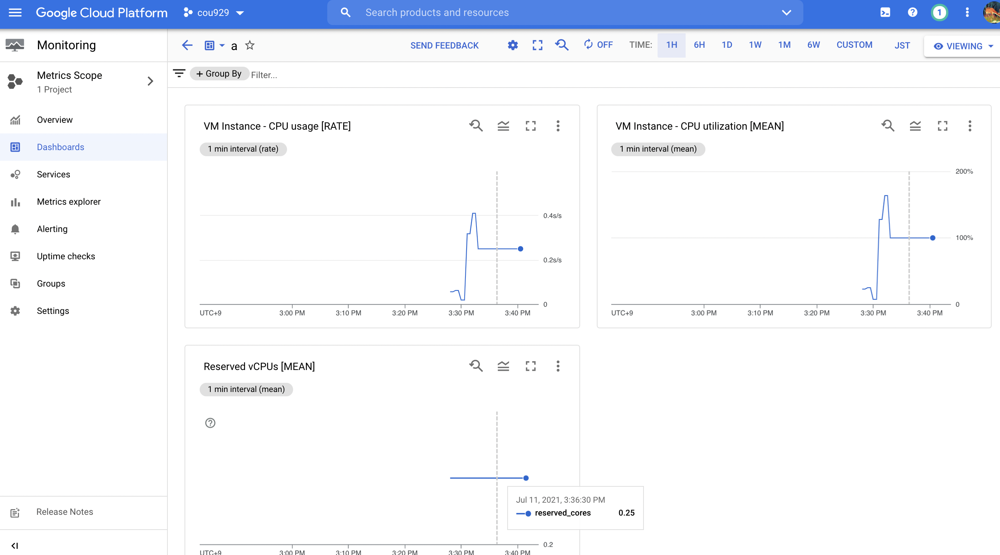

{"title":"GCP の CPU usage と CPU utilization 指標の整理","date":"2021-07-11T23:00:00+09:00","tags":["infra"]}

GCP の CPU usage と CPU utilization 指標についてちょっとハマったので、かんたんに調べたことを整理した。

以下正確ではないが、こういうイメージで理解しているというメモ。また各例は GCE インスタンスの指標をとりあげているが、他も同じだと思う。

## CPU usage (`xxx/cpu/usage_time`)

usage_time は 1 秒あたりの cpu が利用中だった秒数。すべての vCPU について、60 秒のウィンドウで計測し集計。単位は `s/s` で、分子は利用中の秒数、分母は秒だと思う。

例えば 4 vCPU のインスタンスで、ある 60 秒間について、それぞれ 30 秒、0 秒、15 秒、0 秒利用中だった場合、usage_time は `0.75 s/s` となる。

```
(30 + 0 + 15 + 0) / 60 = 0.25 (s/s)
```

当然数値は 1 s/s を超えうる。例えば 4 vCPU のインスタンスで、ある 60 秒間について、それぞれ 30 秒、60 秒、60 秒、0 秒利用中だった場合、usage_time は `2.5 s/s` となる。

```
(30 + 60 + 60 + 0) / 60 = 2.5 (s/s)
```

[Google Cloud metrics  \|  Cloud Monitoring](https://cloud.google.com/monitoring/api/metrics_gcp#gcp-compute) より、例えば GCE の `instance/cpu/usage_time` は、以下のように説明されている。

> Delta vCPU usage for all vCPUs, in vCPU-seconds. To compute the per-vCPU utilization fraction, divide this value by (end-start)*N, where end and start define this value's time interval and N is `compute.googleapis.com/instance/cpu/reserved_cores` at the end of the interval. This value is reported by the hypervisor for the VM and can differ from `agent.googleapis.com/cpu/usage_time`, which is reported from inside the VM. Sampled every 60 seconds. After sampling, data is not visible for up to 240 seconds.

## CPU utilization (`xxx/cpu/utilization`)

usage_time と同じものを割合で表現したもの。

先程の例を使うと、例えば 4 vCPU のインスタンスで、ある 60 秒間について、それぞれ 30 秒、0 秒、15 秒、0 秒利用中だった場合、utilization は約 `19 %` となる。

```
(30 + 0 + 15 + 0) / (60 * 4) = 0.1875 ≒ 19 (%)
```

例えば 4 vCPU のインスタンスで、ある 60 秒間について、それぞれ 30 秒、60 秒、60 秒、0 秒利用中だった場合、utilization は約 `60 %` となる。

```
(30 + 60 + 60 + 0) / (60 * 4) = 0.625 ≒ 60 (%)
```

[Google Cloud metrics  \|  Cloud Monitoring](https://cloud.google.com/monitoring/api/metrics_gcp#gcp-compute) より、例えば GCE の `instance/cpu/utilization` は、以下のように説明されている。

> Fractional utilization of allocated CPU on this instance. Values are typically numbers between 0.0 and 1.0 (but some machine types allow bursting above 1.0). Charts display the values as a percentage between 0% and 100% (or more). This metric is reported by the hypervisor for the VM and can differ from `agent.googleapis.com/cpu/utilization`, which is reported from inside the VM. Sampled every 60 seconds. After sampling, data is not visible for up to 240 seconds.

## usage_time と utilization の変換

usage_time を utilization に変換するには vCPU 数を考慮して 0 ~ 1 (0% ~ 100%) の範囲の割合にする必要がある。具体的には usage_time を vCPU 数で割ると utilization になる。

例えば 4 vCPU で usage_time `2.5 s/s` の場合、utilization は約 `60 %` となる。

```
2.5 / 4 = 0.625
```

### Shared-core VMs

今回ハマったのはここ。

[Shared-core VMs](https://cloud.google.com/compute/docs/general-purpose-machines#sharedcore) というマシンファミリーがあり、これらはどうも普段は少ない vCPU で動作しており、バースト時により多くの vCPU リソースを使う挙動をしているようだ。

例えば `e2-micro` は [平常時は 0.25 vCPU で動作し、バースト時には最大 2 vCPU まで消費する](https://cloud.google.com/compute/vm-instance-pricing#e2_sharedcore_machine_types) らしい。

マシンファミリーの一覧の比較表だけみると、`e2-micro は 2 vCPU` と一見して見えてしまう。そうなると usega_time の解釈に齟齬が起こる。

[`Reserved vCPUs` (`instance/cpu/reserved_cores`)](https://cloud.google.com/monitoring/api/metrics_gcp#gcp-compute) という指標があり、その時点で確保されている vCPU の数がわかる。実際に割り当てられている vCPU 数は、マシンファミリーの比較表ではなくこちらを参照すべきだった。

### 実例

- `e2-micro` の GCE インスタンスをたて、適当な処理を走らせて cpu を消費させる
- cpu usage_time, utilization, reserved_cores のメトリクスを表示する
  - それぞれの MQL は以下

<div></div>

```
fetch gce_instance
| metric 'compute.googleapis.com/instance/cpu/usage_time'
| align rate(1m)
| every 1m
```
```
fetch gce_instance
| metric 'compute.googleapis.com/instance/cpu/utilization'
| group_by 1m, [value_utilization_mean: mean(value.utilization)]
| every 1m
```
```
fetch gce_instance
| metric 'compute.googleapis.com/instance/cpu/reserved_cores'
| group_by 1m, [value_reserved_cores_mean: mean(value.reserved_cores)]
| every 1m
```

このとき、`cpu_time 0.25 s/s` と集計されたとする。

- vCPU が 2 つだと勘違いしていると、`0.25 s/s` は割合にして `12%` 程度なのでまだまだ cpu リソースに余裕があるように見える
- 実際には vCPU 0.25 のため、`0.25 s/s` は 100% cpu リソースを使い切っていることになる

```
0.25 (s/s) / 0.25 (vCPU) = 1 ≒ 100 (%)
```

<figure>

<figcaption>e2-micro での例。usage_time が 0.25 s/s で utilization が 100% になっている。よく見ると reserved cores は 0.25 となっている。</figcaption>
</figure>

## PR

<div class="amazlet-box" style="margin-bottom:0px;"><div class="amazlet-image" style="float:left;margin:0px 12px 1px 0px;"><a href="http://www.amazon.co.jp/exec/obidos/ASIN/B07BBTSX65/pleasesleep-22/ref=nosim/" name="amazletlink" target="_blank"></a></div><div class="amazlet-info" style="line-height:120%; margin-bottom: 10px"><div class="amazlet-name" style="margin-bottom:10px;line-height:120%"><a href="http://www.amazon.co.jp/exec/obidos/ASIN/B07BBTSX65/pleasesleep-22/ref=nosim/" name="amazletlink" target="_blank">クラウドエンジニア養成読本［クラウドを武器にするための知識＆実例満載！］ Software Design plus</a></div><div class="amazlet-detail">佐々木 拓郎  (著), 西谷 圭介  (著), 福井 厚 (著), 寳野 雄太  (著), 金子 亨 (著), & 7 その他  形式: Kindle版<br/></div><div class="amazlet-sub-info" style="float: left;"><div class="amazlet-link" style="margin-top: 5px"><a href="http://www.amazon.co.jp/exec/obidos/ASIN/B07BBTSX65/pleasesleep-22/ref=nosim/" name="amazletlink" target="_blank">Amazon.co.jpで詳細を見る</a></div></div></div><div class="amazlet-footer" style="clear: left"></div></div>
