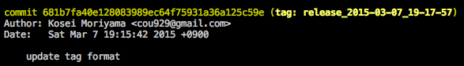
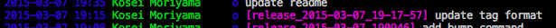

{"title":"git tag のメモ","date":"2015-03-07T20:10:37+09:00","tags":["git"]}

tag はコミットにつけることができる。コミットの human friendly な別名

- `git tag <tag name>` で HEAD にタグ付け
- `git tag` ですべてのタグを参照
- `git log —decorate` でタグを含めたログをだす

- `git tag -d <tag name>` でタグの削除
- `git tag -a` でタグにメッセージを付与できる
  - コミットメッセージと同様に `git tag -am ‘message’` でエディタを開かずに追加もできる
- `git push origin master —tags` などとするとタグをリモートに反映させる
- tig はデフォルトでダグも表示してくれるので便利

<a href="http://www.amazon.co.jp/exec/obidos/ASIN/4274068641/pleasesleep-22/ref=nosim/" name="amazletlink" target="_blank">Gitによるバージョン管理</a>
posted with <a href="http://www.amazlet.com/" title="amazlet" target="_blank">amazlet</a> at 15.03.07

岩松 信洋 上川 純一 まえだこうへい 小川 伸一郎  オーム社  売り上げランキング: 226,062 

<a href="http://www.amazon.co.jp/exec/obidos/ASIN/4274068641/pleasesleep-22/ref=nosim/" name="amazletlink" target="_blank">Amazon.co.jpで詳細を見る</a>

