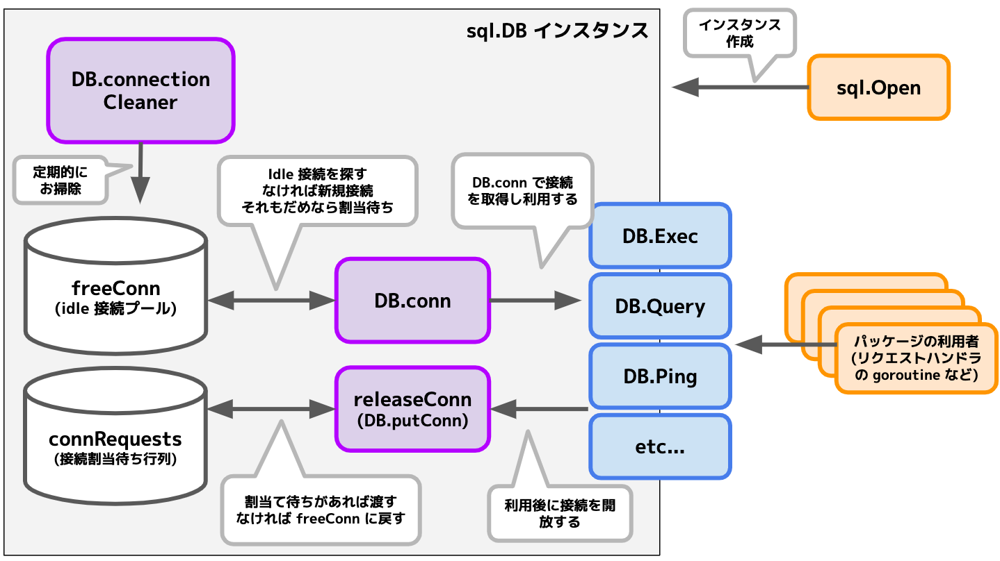
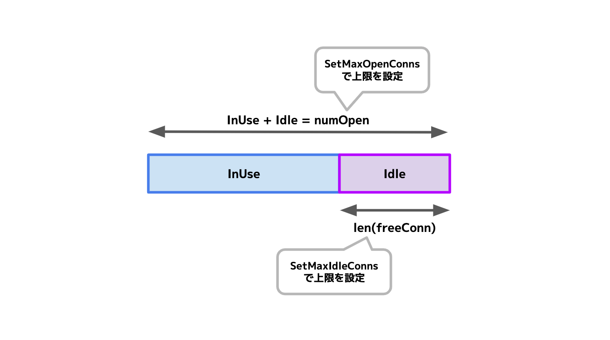
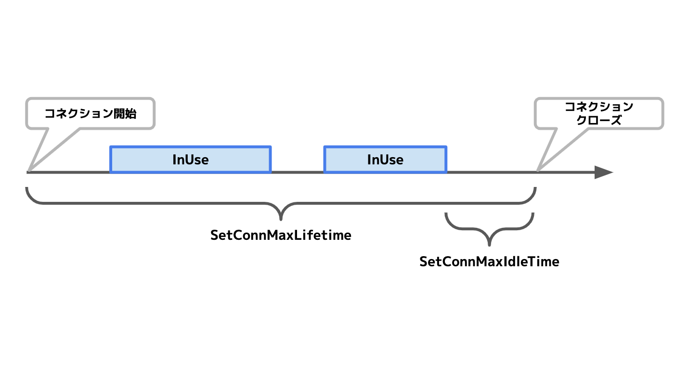

{"title":"Go の sql.DB がコネクションプールを管理する仕組み","date":"2020-06-30T01:13:00+09:00","tags":["go"]}

Go の [database/sql パッケージ](https://pkg.go.dev/database/sql?tab=doc) の [DB 構造体](https://pkg.go.dev/database/sql?tab=doc#DB) は、データベースへのコネクションプールを管理し、かつスレッドセーフ (goroutine セーフと言ったほうが良いのだろうか...?) にそれらの接続を使用できることを保証している。

[ドキュメント](https://pkg.go.dev/database/sql?tab=doc#DB) にも次のように書かれている。

> DB is a database handle representing a pool of zero or more underlying connections. It's safe for concurrent use by multiple goroutines.

こちらの基本的な実装内容と、動作を制御するパラメータについて調べてみた。

## 基礎知識のおさらい

`database/sql` パッケージはデータストアの実装によらない一般的な SQL のインタフェースを提供している。具体的なデータストアへの接続やクエリの発行、そのデータストア特有の機能などは [SQL Database Driver](https://github.com/golang/go/wiki/SQLDrivers) として分離されている。

その中の `sql.DB` 構造体はスレッドセーフなコネクションプールの管理を担当している。[sql と sql/driver パッケージの設計上の目的を書いた文章](https://golang.org/src/database/sql/doc.txt) にも、`sql` パッケージの責務として、複数の goroutine から簡単・安全にプールを利用できることが記載されていた。

> Handle concurrency well.  Users shouldn't need to care about the database's per-connection thread safety issues (or lack thereof), and shouldn't have to maintain their own free pools of connections. The 'sql' package should deal with that bookkeeping as needed.  Given an *sql.DB, it should be possible to share that instance between multiple goroutines, without any extra synchronization.

ユーザーは [sql.Open](https://pkg.go.dev/database/sql?tab=doc#Open) で DB 構造体のインスタンスを取得し、あとはそれを通じてクエリの発行メソッドを呼ぶだけで、プールの詳細やレースコンディションなどを気にしなくてよい。使う側からは非常に簡単な作りになっている。(その分 sql パッケージ自身はそこそこ複雑化している印象もあるが...)

```go
db, err = sql.Open("driver-name", *dsn)  // db が connection pool
...

rows, err := db.QueryContext(ctx, "SELECT ...")  // これを goroutine 内から呼んでも安全
...
```

スレッドセーフが大事なのは、一般的な Web アプリケーションでそのようなケースが頻出するから。例えば [net/http パッケージ](https://pkg.go.dev/net/http?tab=doc) の [Server](https://pkg.go.dev/net/http?tab=doc#Server) は、クライアントからのリクエストをうけるごとに goroutine を起動して処理する設計になっている。

- サーバに到着したリクエストを [accept で受け取り](https://github.com/golang/go/blob/152ffca82fa53008bd2872f7163c7a1885da880e/src/net/http/server.go#L2908)、それをハンドリングする処理を [goroutine で起動している](https://github.com/golang/go/blob/152ffca82fa53008bd2872f7163c7a1885da880e/src/net/http/server.go#L2940)
- イメージとしては [net.Listener の example](https://pkg.go.dev/net?tab=doc#example-Listener) に近い
    - こっちは http サーバではないが、リクエストを受けるごとに goroutine で処理しているという骨格は近い

よって、リクエストごとにデータベースを操作するようなふつうの Web アプリケーションでは、並行した goroutine がデータベースへのコネクションプールを操作することになるため、レースコンディションへの対策が必須となる。

(例えば、リクエストを処理するのが goroutine ではなくプロセスやスレッドでも、あるいはリクエストごとに起動するのではなく pre-fork だったとしても、データベースのコネクションプールがスレッドセーフであるという要件は満たす必要があるはずだと思われる)

## sql.DB の実装の概要

データベースへの接続は [driverConn という構造体](https://github.com/golang/go/blob/152ffca82fa53008bd2872f7163c7a1885da880e/src/database/sql/sql.go#L456) で表現されている。接続は利用中 ([inUse](https://github.com/golang/go/blob/152ffca82fa53008bd2872f7163c7a1885da880e/src/database/sql/sql.go#L468))・未使用 (idle) いずれかの状態になる。この接続を sql.DB が保持・管理している。

ある操作を実行しようとすると、sql.DB はまず idle な接続が使おうとし、そうでなければ新しく接続を確立する (初期化時に必要数だけコネクションを確立しておいて、それを使い回す形ではない)。また idle な接続を使い回すかどうか、何本までなら新規接続をするかといった挙動を制御するパラメータもある。



sql.DB は次のようなデータを保持している。

- [freeConn](https://github.com/golang/go/blob/152ffca82fa53008bd2872f7163c7a1885da880e/src/database/sql/sql.go#L414)
    - 型は `[]*driverConn` で、idle 状態の接続を保持している
    - 空き接続があればここから使い、使い終わったらここに返す
- [connRequests](https://github.com/golang/go/blob/152ffca82fa53008bd2872f7163c7a1885da880e/src/database/sql/sql.go#L414) と [nextRequest](https://github.com/golang/go/blob/152ffca82fa53008bd2872f7163c7a1885da880e/src/database/sql/sql.go#L416)
    - 接続の割り当て待ちを表す map で、いわゆる待ち行列
    - `connRequests` は `map[uint64]chan connRequest` 型で、これが待ち行列の本体
    - `nextRequest` は `uint64` 型で待ち行列のエントリを識別する通し番号の採番用
    - クエリを実行する際、接続がすべて inUse で、かつ上限に達していて新規接続が作れない場合、この待ち行列に入り接続が空くのをブロックして待つ
- [numOpen](https://github.com/golang/go/blob/152ffca82fa53008bd2872f7163c7a1885da880e/src/database/sql/sql.go#L417)
    - 型は `int` で、現在の総接続数
    - 接続数の上限を確認する際などに使う
    - freeConn とは違い総数のカウントだけを持っている。inUse な接続の実態を sql.DB は直接保持していない

これらのデータを、[sync.Mutex](https://pkg.go.dev/sync?tab=doc#Mutex) をつかって地道に保護している。データの操作前にロックを取り、操作後に開放するというのを逐次やっている。

それを操作する主要なメソッドには以下がある。

- [DB.conn](https://github.com/golang/go/blob/152ffca82fa53008bd2872f7163c7a1885da880e/src/database/sql/sql.go#L1189)
    - プールからよしなに接続を取得する処理。begin, prepare, query, exec といった一連のクエリ系メソッドは、内部で必ずこの処理を通じて接続を取得している
    - [可能なら freeConn から idle な接続を探してそれを使う](https://github.com/golang/go/blob/152ffca82fa53008bd2872f7163c7a1885da880e/src/database/sql/sql.go#L1205-L1226)
        - idle 接続がなかったり、あっても一定時間経過している場合は使われない (後者は SetConnMaxLifetime が設定されている場合)
    - idle 接続がない場合は [新規接続を試みる](https://github.com/golang/go/blob/152ffca82fa53008bd2872f7163c7a1885da880e/src/database/sql/sql.go#L1292-L1294)
    - [接続数の上限に達していて新規接続ができない場合](https://github.com/golang/go/blob/152ffca82fa53008bd2872f7163c7a1885da880e/src/database/sql/sql.go#L1230) は、[接続割当の待ち行列 connRequest に並ぶ](https://github.com/golang/go/blob/152ffca82fa53008bd2872f7163c7a1885da880e/src/database/sql/sql.go#L1233-L1236)
        - 接続に空きが出るまで [ブロックして待っている](https://github.com/golang/go/blob/152ffca82fa53008bd2872f7163c7a1885da880e/src/database/sql/sql.go#L1260)
        - [context でタイムアウト](https://github.com/golang/go/blob/152ffca82fa53008bd2872f7163c7a1885da880e/src/database/sql/sql.go#L1243) もするので、無限にブロックするわけではない
- [driverConn.releaseConn](https://github.com/golang/go/blob/152ffca82fa53008bd2872f7163c7a1885da880e/src/database/sql/sql.go#L474) ([DB.putConn](https://github.com/golang/go/blob/152ffca82fa53008bd2872f7163c7a1885da880e/src/database/sql/sql.go#L1344))
    - 使い終わった接続をプールに返す処理。各クエリ系のメソッドで利用後にこれが呼ばれる
    - [inUse フラグを偽にし idle 状態とマークし](https://github.com/golang/go/blob/152ffca82fa53008bd2872f7163c7a1885da880e/src/database/sql/sql.go#L1366)、[freeConn に接続を戻す](https://github.com/golang/go/blob/152ffca82fa53008bd2872f7163c7a1885da880e/src/database/sql/sql.go#L1429)
        - このときに、connRequests に待ちがあればそちらに先に回したり、`SetMaxIdleConns` で idle 接続数の上限が設定されていればそのチェックをしたりしている
- connRequests への追加と受け取り
    - 識別用の番号を [取得](https://github.com/golang/go/blob/152ffca82fa53008bd2872f7163c7a1885da880e/src/database/sql/sql.go#L1182) し、それをキーにして [connRequests に登録する](https://github.com/golang/go/blob/152ffca82fa53008bd2872f7163c7a1885da880e/src/database/sql/sql.go#L1235)
    - 登録するのは [connRequest 型のチャネル](https://github.com/golang/go/blob/152ffca82fa53008bd2872f7163c7a1885da880e/src/database/sql/sql.go#L1233) で、接続に空きができたらここに通知が来る
        - 上記の releaseConn メソッドがここに [通知している](https://github.com/golang/go/blob/152ffca82fa53008bd2872f7163c7a1885da880e/src/database/sql/sql.go#L1422)
- [DB.connectionCleaner](https://github.com/golang/go/blob/152ffca82fa53008bd2872f7163c7a1885da880e/src/database/sql/sql.go#L989)
    - idle 接続プールのお掃除処理
    - [別 goroutine](https://github.com/golang/go/blob/152ffca82fa53008bd2872f7163c7a1885da880e/src/database/sql/sql.go#L985) で [定期起動](https://github.com/golang/go/blob/152ffca82fa53008bd2872f7163c7a1885da880e/src/database/sql/sql.go#L999) し、[使えなくなった idle 接続を close していく](https://github.com/golang/go/blob/152ffca82fa53008bd2872f7163c7a1885da880e/src/database/sql/sql.go#L1012-L1016)
    - 具体的には [SetConnMaxLifetime や SetConnMaxIdleTime が設定されている場合はその条件をチェック](https://github.com/golang/go/blob/152ffca82fa53008bd2872f7163c7a1885da880e/src/database/sql/sql.go#L1025) している
    - 定期実行時だけでなく、[cleanerCh チャネルに通知](https://github.com/golang/go/blob/152ffca82fa53008bd2872f7163c7a1885da880e/src/database/sql/sql.go#L1000) すると、そのタイミングでも掃除をしてくれる

その他のトピック。

- 当然だが、sql.DB のインスタンスごとにコネクションプールを保持しているし、ロックをとっている
    - 別のインスタンスを作れば、当然別の接続がされるし、インスタンス間でロックをとったりはしない
    - そのため Web サーバで使う場合は、初期化時に [sql.Open](https://pkg.go.dev/database/sql?tab=doc#Open) などで sql.DB インスタンスを作り、各リクエストハンドラの中でそのインスタンスをつかってクエリを実行するとよい
        - これを安全に行うために sync.Mutex で頑張ってデータをレースから保護している
- 接続は sql.DB の初期化時ではなく、利用時に必要になってから確立される
    - よって [sql.Open](https://pkg.go.dev/database/sql?tab=doc#Open) をした時点では接続ははられておらず、[DB.PingContext](https://pkg.go.dev/database/sql?tab=doc#DB.PingContext) などで接続チェックをしたほうがよい
- freeConn で idle 接続は保持しているが、inUse 接続を直接持っていない
	- そのため [DB.Close](https://pkg.go.dev/database/sql?tab=doc#DB.Close) した際に、DB が inUse の接続を直接閉じることはない
        - DB.Close は [freeConn](https://github.com/golang/go/blob/152ffca82fa53008bd2872f7163c7a1885da880e/src/database/sql/sql.go#L837-L841) と [connRequests](https://github.com/golang/go/blob/152ffca82fa53008bd2872f7163c7a1885da880e/src/database/sql/sql.go#L842) を閉じる
        - DB.Close を呼ぶと [新しいクエリは発行できなくなる](https://github.com/golang/go/blob/152ffca82fa53008bd2872f7163c7a1885da880e/src/database/sql/sql.go#L1191-L1195) が、すでに実行中のクエリには sql.DB は関与しない
    - inUse な接続はそのクエリが終わるなり、context でタイムアウトするなりして止まる
        - 各メソッドには [XXContext](https://pkg.go.dev/database/sql?tab=doc#DB.ExecContext) という context を渡せるインタフェースがあるので、ユーザー側でしっかりとタイムアウトを設定したほうが安全そう
- [DB.Stats](https://pkg.go.dev/database/sql?tab=doc#DB.Stats) で各種統計情報を取得できる
    - 接続の総数と inUse / idle の内訳
    - 割当待ちの累計数・累計待ち時間や、`SetConnMaxLifetime` でクローズされた累計など

## sql.DB の挙動を制御するパラメータ

接続の挙動を制御するパラメータが 4 つある。



- [SetMaxOpenConns](https://pkg.go.dev/database/sql?tab=doc#DB.SetMaxOpenConns)
	- 最大何本の接続をできるかの上限
	- デフォルトは 0 で、無限に接続できる
- [SetMaxIdleConns](https://pkg.go.dev/database/sql?tab=doc#DB.SetMaxIdleConns)
	- idle 接続を最大何本保持できるかの上限
    - つまり freeConn の長さの上限とも言える
	- 必ず MaxOpenConns 以下の数値になる ([それより大きい値を設定すると切り詰める](https://github.com/golang/go/blob/152ffca82fa53008bd2872f7163c7a1885da880e/src/database/sql/sql.go#L898-L900))



- [SetConnMaxLifetime](https://pkg.go.dev/database/sql?tab=doc#DB.SetConnMaxLifetime)
	- ある接続を利用できる期間
        - 接続が [確立された時点](https://github.com/golang/go/blob/152ffca82fa53008bd2872f7163c7a1885da880e/src/database/sql/sql.go#L488) から lifetime 時間経過すると、その接続は expire とみなされ使えなくなる
	- 一般的にデータベースへの接続を長期間使い回すのは危険なので、適宜切って再接続するのがよい
        - 例えば [MySQL の wait_timeout](https://dev.mysql.com/doc/refman/5.7/en/server-system-variables.html#sysvar_wait_timeout) はデフォルトで 8 時間経過した接続を 　MySQL サーバ側から切断する
        - それ以外にも長い TCP 接続が OS レベルで切られることもあるかもしれない
        - こうしたケースが起こると、アプリケーションはクエリの送信を試みてから使えないことに気づき再接続をすることになるので、オーバーヘッドが大きくなる
	- デフォルトは無制限に利用可能
    - 以下の記事に詳しい
        - [Configuring sql\.DB for Better Performance \- Alex Edwards](https://www.alexedwards.net/blog/configuring-sqldb)
        - [DSAS開発者の部屋:Re: Configuring sql\.DB for Better Performance](http://dsas.blog.klab.org/archives/2018-02/configure-sql-db.html)
	- もし接続が [lifetime を expire していたら、driver.ErrBadConn を返す](https://github.com/golang/go/blob/152ffca82fa53008bd2872f7163c7a1885da880e/src/database/sql/sql.go#L1211-L1216)
        - 呼び出し側は [ErrBadConn の場合は二回までリトライする](https://github.com/golang/go/blob/152ffca82fa53008bd2872f7163c7a1885da880e/src/database/sql/sql.go#L1527-L1532) 作りになっている
- [SetConnMaxIdleTime](https://pkg.go.dev/database/sql@go1.15beta1?tab=doc#DB.SetConnMaxIdleTime)
	- 接続が idle になってから一定期間経つと expire とみなされ使えなくなる
        - SetConnMaxLifetime は接続確立時点からのトータルの経過時間だが、こちらは idle になってからの経過時間
	- [Go 1.15](https://github.com/golang/go/issues/37419) で入る予定
	- SetConnMaxLifetime よりも細かく動作制御できるが、ほとんどのケースでは SetConnMaxLifetime で十分そうで、使い所がちょっとわからなかった
        - idle にならずに定期的に使われている接続を再接続せずにずっと使い回せるようにはなるが、SetConnMaxLifetime で一定時間で切ってしまうのがシンプルで必要十分だと思う
        - issue で [そのようなコメントがされている](https://github.com/golang/go/issues/25232#issuecomment-479359857) が、特に議論はなくマージされているようだ

これらのパラメータをどう設定すればよいのか。

- 一般論として、より多くの接続をプールしより長期間使いまわしたほうがスループットは向上するが、あまりに増やしすぎるとメモリ使用量が増加したり、一部セッションのレスポンスタイムが極端に劣化したりする恐れがある
- アプリケーションとデータストアの性質によるので、基本は負荷試験をしながら適正値を探るしかなさそう
    - [こちらの記事](https://www.alexedwards.net/blog/configuring-sqldb) では MaxOpenConn 25, MaxIdleConn 25, MaxLifetime 5 分という仮値からチューニングを始めると書かれていた
- MaxOpenConns は必ず設定したほうがよい
	- MySQL の [max_connections](https://dev.mysql.com/doc/refman/5.7/en/server-system-variables.html#sysvar_max_connections) など、データベース側の接続数上限もあるので、少なくともこれよりは少なくしないといけない
- [こちらの記事](http://dsas.blog.klab.org/archives/2018-02/configure-sql-db.html) によると、idle 接続の管理に SetMaxIdleConns は利用せず (= MaxOpenConn よりも大きい値にしておき)、SetConnMaxLifetime にまかせてしまうのが良い
    - 確かにそのほうが理解しやすい

## 参考

- [src/database/sql/doc\.txt \- The Go Programming Language](https://golang.org/src/database/sql/doc.txt)
    - `database/sql` パッケージの設計上のゴール
- [Configuring sql\.DB for Better Performance \- Alex Edwards](https://www.alexedwards.net/blog/configuring-sqldb)
    - 各制御パラメータの概要のわかりやすい整理
- [DSAS開発者の部屋:Re: Configuring sql\.DB for Better Performance](http://dsas.blog.klab.org/archives/2018-02/configure-sql-db.html)
    - `SetConnMaxLifetime` の意義と推奨設定について
- [database/sql: add \`lastUseTime\` or similar to driverConn, add SetConnMaxIdleLefttime to DB · Issue \#25232 · golang/go](https://github.com/golang/go/issues/25232)
    - `SetConnMaxIdleTime` が導入された issue

<div class="amazlet-box" style="margin-bottom:0px;"><div class="amazlet-image" style="float:left;margin:0px 12px 1px 0px;"><a href="http://www.amazon.co.jp/exec/obidos/ASIN/B07VPSXF6N/pleasesleep-22/ref=nosim/" name="amazletlink" target="_blank"></a></div><div class="amazlet-info" style="line-height:120%; margin-bottom: 10px"><div class="amazlet-name" style="margin-bottom:10px;line-height:120%"><a href="http://www.amazon.co.jp/exec/obidos/ASIN/B07VPSXF6N/pleasesleep-22/ref=nosim/" name="amazletlink" target="_blank">改訂2版 みんなのGo言語</a></div><div class="amazlet-detail">松木 雅幸  (著), mattn (著), 藤原 俊一郎 (著), 中島 大一 (著), 上田 拓也  (著), 牧 大輔 (著), 鈴木 健太 (著)  形式: Kindle版<br/></div><div class="amazlet-sub-info" style="float: left;"><div class="amazlet-link" style="margin-top: 5px"><a href="http://www.amazon.co.jp/exec/obidos/ASIN/B07VPSXF6N/pleasesleep-22/ref=nosim/" name="amazletlink" target="_blank">Amazon.co.jpで詳細を見る</a></div></div></div><div class="amazlet-footer" style="clear: left"></div></div>
