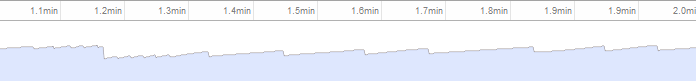

{"title":"How to write low garbage real-time Javascript を読んだメモ","date":"2012-03-17T17:42:11+09:00","tags":["javascript"]}

[How to write low garbage real-time Javascript - Scirra.com](http://www.scirra.com/blog/76/how-to-write-low-garbage-real-time-javascript) を読んだメモ.

60fps とかで動くブラウザゲームでは, GC のせいで js が一時停止してしまうのが問題になる. そこで GC を極力減らすための tips を紹介.

### GC

特に意識せずコードを書くとあるタイミングでブラウザが GC をはしらせる. その際 js の実行が一時的に止まってメモリを解放する. developer tool 出見るとジグザグのグラフになる.

### シンプルテクニック

ポイントは *allocate したメモリは極力使いまわす* こと

- `new` したオブジェクトは使いまわす. 一番わかり易い
- `{}`, `[]`, `function() {}` も新しい領域を確保している
  - 例えば関数の返り値で同じ構造のオブジェクトを返す場合, 毎回新しく作るんじゃなくてグローバルのオブジェクトを使いまわしたほうがいい
  - オブジェクトをクリアする `wipe()` 関数の例. `obj = {}` とクリアするよりもループの分時間はかかるけど, それよりも GC でかかるポーズのほうが遅い

            // remove all own properties on obj, effectively reverting it to a new object
            cr.wipe = function (obj)
            {
                for (var p in obj)
                {
                    if (obj.hasOwnProperty(p))
                        delete obj[p];
                }
            };

  - `arr = []` とクリアするのも同様に新しいメモリを確保しているからダメで, `arr.length = 0` とすべき
  - 関数も, 関数の引数として無名関数を渡すような書き方をすると関数を呼び出すたびにメモリ確保が走る. 予め定義しておくべき

            // 16ms ごとにメモリ確保される
            setTimeout((function (self) { return function () { self.tick(); }; })(this), 16);
            
            // 以下のように修正
            // at startup
            this.tickFunc = (function (self) { return function () {
            self.tick(); }; })(this);
            
            // in the tick() function
            setTimeout(this.tickFunc, 16);

### 応用テクニック

- `slice()` とか `substr()` とか非破壊関数は新しく配列・文字列を作って返すので注意
- 再帰で配列をスタックとして使うようなケース. `push`, `pop` するんじゃなくて配列のインデックスを増減させたほうが良い
- box2d は毎フレームオブジェクトを大量生成して GC nightmare. [そのへんを直したもの](https://github.com/illandril/box2dweb-closure/blob/master/src/common/math/b2Vec2.js) を書いた.

### 感想

- GC の効率は気にしたことなかった
- 一定時間ごとに大量にオブジェクトが作られるようなアプリでは考慮の必要が有りそう
  - ゲーム以外になにがあるだろう
- コードがストレートでなくなるので, 問題になってから気にしたほうが良さげなトピック
