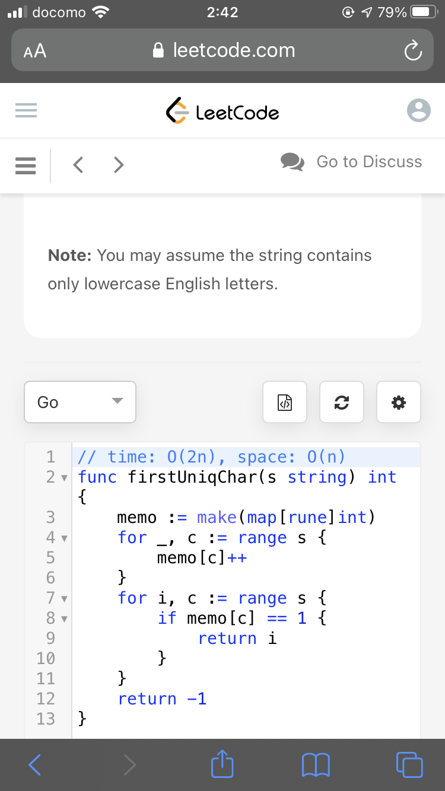
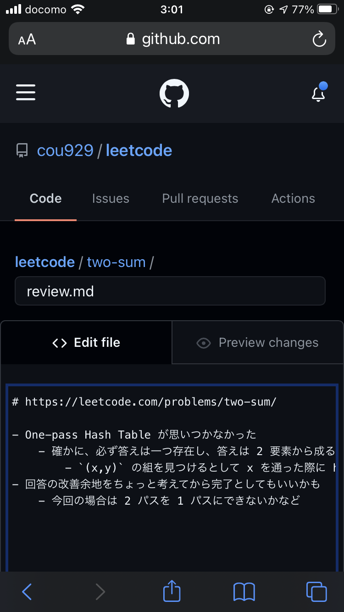

{"title":"スマホで leetcode が意外とできた","date":"2021-01-09T03:18:54+09:00","tags":["etc"]}

Easy の問題くらいなら、意外にもスマホだけでそこそこやれることがわかったので、空き時間にちょこちょこ解いている。

[Kosei Moriyama - LeetCode Profile](https://leetcode.com/cou929/)

特に特別なことはしていなくて、leetcode がスマホ対応をしているので普通に safari でやっている。

Easy だとコード量も少なめに収まるのと、leetcode の環境だと import 文を書かなくて良かったりして、なんとかなっている。Go を使っているので比較的記述量が少なめなのも良いかもしれない。面倒なのは記号の入力なので、それが少ない構文の言語だともっと楽かも。

問題を解いた後は解説を読みつつ、かんたんな振り返りを github にログとして貯めていっている。

[cou929/leetcode](https://github.com/cou929/leetcode)

解法ごとに必ず計算量と空間効率はメモしているのと、余裕があれば複数の解法を書くようにしている。

GitHub のモバイル対応もしっかりしていて、ディレクトリを作ってマークダウンを記載するくらいは全く問題なくできた。

もちろん PC でやるより断然効率はわるいし、これでコンテストなんてとてもじゃないけど出られない。ただ育児などで仕事以外ではまとまった時間 PC に向かうのが難しい状況なので、細切れ時間でスマホでやれるのはかなりありがたい。

正直 Easy くらいしかスマホではきつそうで、それだとそれほど学習効果は高くないかもしれない。それでも隙間時間で短期にフィードバックが返り自己肯定感が上がりやすいので、なかなか気に入っている。

そういうモチベーションなのでコンテストに出る予定は全くないし、競プロ、アルゴリズムマッチ的なことをするのはほぼ十年ぶりだけど、やっぱり楽しいですね。

<a href="http://www.amazon.co.jp/exec/obidos/ASIN/4065128447/pleasesleep-22/ref=nosim/" name="amazletlink" target="_blank">問題解決力を鍛える!アルゴリズムとデータ構造 (KS情報科学専門書)</a>

大槻 兼資  (著), 秋葉 拓哉 (監修) 

<a href="http://www.amazon.co.jp/exec/obidos/ASIN/4065128447/pleasesleep-22/ref=nosim/" name="amazletlink" target="_blank">Amazon.co.jpで詳細を見る</a>

