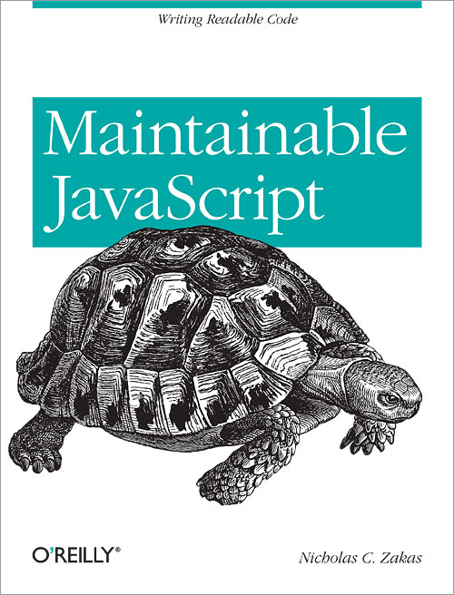

{"title":"maintainable javascript 個人的メモ","date":"2012-05-10T22:44:56+09:00","tags":["javascript"]}

[Maintainable JavaScript - O'Reilly Media](http://shop.oreilly.com/product/0636920025245.do)

感想文はこちら

[Maintainable JavaScript を読んだ - フリーフォーム フリークアウト](http://d.hatena.ne.jp/cou929_la/20120510/1336657216)

- クライアントサイドテンプレートを使って js と html を分離する. これ絶対
- イベントハンドラは event オブジェクトをとりまわすところまで. ロジックは別関数に分離
- 例外は Error オブジェクトを使う. これ絶対
- ザカス氏は pollyfill はあまり好きじゃないらしい. いいと思うんだけどなあ

  
  

    
<a href="http://www.amazon.co.jp/exec/obidos/ASIN/1449327680/pleasesleep-22/ref=nosim/">Maintainable Javascript</a>

    <ul>
      
      <li>作者: <a href="http://d.hatena.ne.jp/keyword/Nicholas%20C%2E%20Zakas" class="keyword">Nicholas C. Zakas</a></li>
      
      <li>出版社/メーカー: <a href="http://d.hatena.ne.jp/keyword/Oreilly%20%26%20Associates%20Inc" class="keyword">Oreilly & Associates Inc</a></li>
      
      <li>発売日: 2012/05/31</li>
                                                      <li>メディア: ペーパーバック</li>
      <li>購入: 2人 クリック: 162回</li>
      <li><a href="http://d.hatena.ne.jp/asin/1449327680" target="_blank">この商品を含むブログを見る</a></li>
    </ul>
  

  

