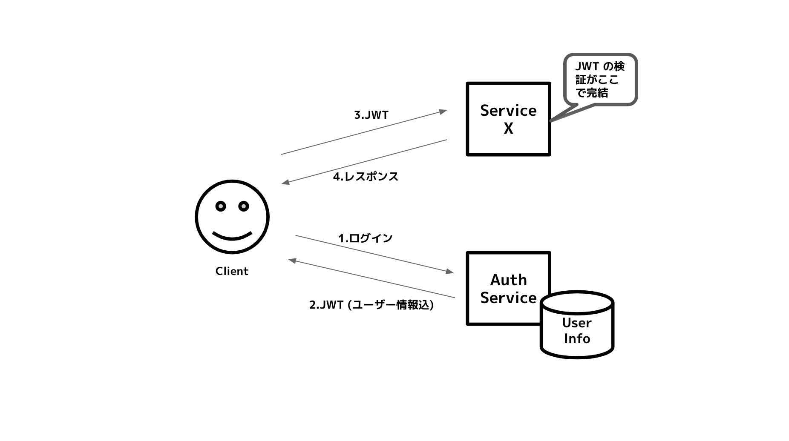

{"title":"Microservices における認証と認可の設計パターン","date":"2020-05-28T01:35:58+09:00","tags":["microservices"]}

マイクロサービスにおける認証と認可の、一般論としての設計パターンを調べたところ、Web 上の複数の記事で似たようなパターンが登場していた。ここでは、まず認証と認可が実現したい一般的な要件と、そのマイクロサービスでの難しさを整理し、認証と認可に分けて調査したパターンをまとめた。

- あくまで “一般論” なので、実際には個々のドメインにあわせてアレンジが必要
	- 往々にしてこの “アレンジ” に価値が宿るものだが、まずはセオリーを知っておきたいというモチベーションで調査した
- Web 上の記事を読んでまとめただけなので、手を動かしての確認はしておらず、理解が甘い部分はご容赦ください
- 具体的な通信方式やサービス間通信のセキュリティといった具体論までは踏み込めていない。このへんはサービスメッシュやゼロトラストネットワークといったトピックが登場すると思われる
    - これらは次回以降の Todo としています

## その前に、認証と認可

いつもどっちがどっちだっけとなるのでおさらい。

- 認証 (Authentication, AuthN)
	- 通信の相手が誰（何）であるかを確認すること
- 認可 (Authorization, AuthZ)
	- とある特定の条件に対して、リソースアクセスの権限を与えること

[よくわかる認証と認可 | Developers.IO](https://dev.classmethod.jp/articles/authentication-and-authorization/) より引用。

## 満たすべき要件とマイクロサービスでの難しさ

一般的な要件として、おおまかにこれらがあると思う。

- ステートレスなプロトコル (http) 上でのユーザーのログイン状態の管理
	- いわゆるセッション管理
	- クッキーにセッション ID を保存しサーバ側のストレージにユーザー情報をする方式が伝統的だが、jwt などのクライアントサイドを活用する方式も生まれてきている
- 一貫したログイン、ログアウト体験
	- 内部的にサービスが分かれていても、ログイン、ログアウトの状態は全体で一貫させたい
- アカウントの権限管理
	- アカウントによって取得、操作できるリソースが異なる
- セキュリティ、信頼性
	- サービス間で一貫したセキュリティポリシーを適用したいが、そのために機能を中央化しすぎて SPOF となるのは避けたい
	- 負荷の分散など、信頼性を担保した設計をしたい

いずれも、モノリスな環境では比較的素直な実装ができる。

一方でマイクロサービスのような分散したシステム間でこれらを満たすには、工夫が必要になる。

- サービス間で一貫した体験を提供するためには、セッション情報を共有する必要がある
	- セッション情報がバラバラだと、サービスをまたいだログイン状態に齟齬が出る
	- 一クライアントサイドを活用するようになると、ログアウトの実装がトリッキーになりうる（詳細後述）
- アカウントの権限をサービスごとに分散するのか、中央管理するのかという判断
	- 全てを中央管理するのはシステム間の結合度を考えると疑問が残る
	- どこまでを分散するのかのデザインが難しい
- これらをセキュリティと信頼性を損ねずに実現する必要がある

## 認証の設計パターン

認証の設計について、ここでは “セッション (ログイン状態) を分散されたシステム間でどう共有するか” という問題に注目する。

いろいろな記事で類似のパターンが言及されていたが、それらの元ネタは以下の論文のようだ。

[Authentication and Authorization of End User in Microservice Architecture \- IOPscience](https://iopscience.iop.org/article/10.1088/1742-6596/910/1/012060)

前提として、従来的なセッションストア方式と、トークン方式の認証についておさらいする。

- セッションストア方式
    - ユーザー情報 (セッション情報) はサーバ側でストレージに保存
    - セッション ID をクライアント側のクッキーなどで保持
    - アプリケーションサーバを水平にスケールさせるには、セッションストアを共有する、スティッキーセッションを使うと言った方法が必要になる
- トークン方式
    - 認証後にトークンが発行され、以降のクライアントとリソースサーバのやりとりはそのトークンが使われる
    - トークンにはユーザー情報そのものが埋め込まれている
        - セッションストア方式でセッションストレージに入っている情報がトークンにそのまま入っている
    - 従来的なセッションストア方式に比べある程度複雑化するが、以下のメリットがある
        - クライアントがモバイルでも扱いやすい
        - サーバ側を水平にスケールさせやすい
    - 

その上で、マイクロサービスでの設計パターンを4つ紹介している。記事によって少しずつ違う名前だったりするが、概ね内容は同じだった。

### 分散セッションパターン

従来的なセッションストア方式の考え方を、そのままマイクロサービスに展開したもの。

- 各マイクロサービスからセッションストレージにアクセスできるようにする
- 分散ストレージの可用性 / スケーリングに注意が必要
- マイクロサービスの原則 (各システムが単一責任でセルフサービスであること) の観点では微妙かもしれない
- 一方である意味シンプルで従来的なシステムから自然に拡張できるメリットがあると思う
    - ストレージの運用知見がある場合や、段階的な以降のためのステップとしての場合など、活用できる場面はありそう

このパターンはセッションストア方式だが、以降の 3 パターンはいずれもトークン方式になる。

### SSO パターン

前提として、従来的なセッション ID 文字列のような、利用者がその内容を読まないトークンのことを [Opaque トークン](https://stackoverflow.com/questions/59158410/what-is-an-opaque-token) と呼ぶらしい。反対は JWT のようなそれ自体に情報を埋め込めるトークン。以降は、情報を含むトークンは "JWT"、そうでないトークンは "Opaque トークン" と表記するようにした。

SSO パターンは認証サービスが Opaque トークンを使うパターン。

- サービス全体の認証を行うマイクロサービスを作る
    - 認証に成功すると Opaque トークンを発行
    - サービスはクライアントから Opaque トークンを受け取り、認証サービスに対して検証リクエストをなげ、ユーザー情報を取得する
        - Opaque トークンを使うため認証サービスへの検証リクエストが発生してしまう
- 図では処理はシンプルだが、認証サービスへの負荷集中 / SPOF となるデメリットがある
    - サービスが増えるほど認証サービスの負荷が増加
    - セッションストアをスケールさせるのは大変そう

## JWT 利用パターン

SSO パターンと比べ、JWT を使うことでスケール・SPOF の問題を緩和する方式。

- 認証後に発行するトークンはユーザー情報が埋め込まれた JWT とする
- トークンの検証・ユーザー情報取得が各サービス内で完結する
    - 認証サービスの負荷が分散でき、サービス間の結合度も下げられる
- 前 2 案の課題をよく克服しているが、ログアウトの実装が難しいことがデメリット
    - ログアウトにはクライアントサイドのデータ削除が必要だが、それを素直に実現するのが難しそう
        - 定期的に認証サービスに問い合わせる...
        - 各マイクロサービスに revoke したトークンを push して知らせる...
        - トークンの TTL を短くする...

### JWT 利用 + API Gateway パターン

JWT 利用パターンに加え、API Gateway でのトークン変換を行う方式。

- API Gateway で JWT と Opaque トークンを変換する
    - クライアントと API GW 間は Opaque トークンを利用する
    - API GW より後ろのマイクロサービス内の通信には JWT を使う
- API GW で一元的にトークンを管理できるので、ログアウトの問題がすっきりと解消できる
- 一方で API GW が新たな SPOF になりうるのと、全体として複雑な仕組みになるのがデメリット
    - API GW は Opaque トークンと JWT の変換を行うため、ストレージも必要になり、その運用も考えないといけない

## 認可の設計パターン

認可については、あるアカウントの権限を誰がどう管理するのかという問題にほぼ言い換えられそうだ。

正直なところ、権限管理についてはこれといって定石となるパターンは調べた限りではなさそうだった。マイクロサービスかどうかとは関係なく、権限管理は難しいテーマだし、ドメインによって正解が変わる度合いが認証よりも大きそうだ。

そんな中だが、権限情報を分散管理をするか、中央管理にするか、大きく二つのパターンには分けられると思う。そして中央管理する場合は、データをどこまで一元化するかはかなりバリエーションがあり、それこそドメインによるとなってしまいそうだ。ただ RBAC (Role Based Access Cntrol) というコンセプトを何度か目にしたので、簡単に言及しておく。

### 分散管理するパターン

- サービスごとに認可を行う
- サービスごとに自律し細かく権限を制御できる一方で、以下の問題が考えられる
    - 各サービスで共通で使われる権限については実装が重複する
    - 各開発者が権限の関連を理解して実装する必要があり、仕様が複雑になる

### 中央管理するパターン

- 権限を管理するサービスにデータを集約し、各サービスはビジネスロジックに集中する
- どこまでのデータを誰が持つかの設計によって事情が変わる
    - 例えば、本当にすべての権限情報を中央管理すると、サービスごとの細かな権限管理ができない (あるいはそれを権限サービスに依頼する必要がある) 状況となり、サービス間の結合度が増してしまう

その上で、ロールベースの権限管理 (RBAC) に言及した記事がいくつかあり、この部分を考えるヒントになりそうだった。

### ロールとパーミッション

- パーミッションはあるリソースへのアクセス権限
    - 例えば、決済リソースを新規作成できる、在庫リソースを更新できるなど
    - リソースベースの考え方
- ロールは、例えば Admin, Fulfillment manager, Accounting admin などといった "役職"
    - ロールごとにできることが違い、ロールはパーミンションをグループ化したものと言える
    - パーミッションがリソースベースなのに対して、ロールはユースケースベースだと言える

### RBAC (Role Based Access Cntrol) と API GW

[RBAC (Role Based Access Control)](https://en.wikipedia.org/wiki/Role-based_access_control) はロールをもとにしたアクセス制御のモデル。柔軟性高くロールの管理ができる。

前述のようにロールはパーミションのグループ。ユーザーにはロールを紐付ける。またロールとロールを関連付けることまできる（つまりロールの階層を定義できる）。柔軟性高く権限管理ができるようになる。

*([Role\-based access control \- Wikipedia](https://en.wikipedia.org/wiki/Role-based_access_control) より引用)*

マイクロサービスの文脈では、RBAC サービスを設置するパターンが紹介されていた。API GW がトークンを検証する際に、RBAC サービスにも問い合わせ、そのアカウントのロールとパーミッションを取得、それを内部用トークンに埋め込む。

*([Authentication and Authorization in Microservices \- DZone Microservices](https://dzone.com/articles/authentication-and-authorization-in-microservices) より引用)*

この部分をどう設計するかはかなりのバリエーションがありそうだ。前述のように、一元管理と分散管理のバランスが難しい。

## さいごに

一般論としての設計パターンのまとめた。繰り返しになるが、万能な解決策はなく、ドメインにあわせたアレンジが必要になるはず。

理解が甘く、またこの分野は詳細こそ重要な気がしている。次は手を動かしながら詳細を詰めていければと思う。

## 参考

- [Authentication and Authorization of End User in Microservice Architecture \- IOPscience](https://iopscience.iop.org/article/10.1088/1742-6596/910/1/012060)
- [muCon 2016: Authentication in Microservice Systems By David Borsos](https://www.slideshare.net/opencredo/authentication-in-microservice-systems-david-borsos)
    - [マイクロサービスシステムにおける認証ストラテジ](https://www.infoq.com/jp/news/2017/01/microservices-authentication/)
- [Microservices Authentication and Authorization Solutions](https://medium.com/tech-tajawal/microservice-authentication-and-authorization-solutions-e0e5e74b248a)
- [Authentication and Authorization in Microservices \- DZone Microservices](https://dzone.com/articles/authentication-and-authorization-in-microservices)
- [Microservices Authentication & Authorization Best Practice](https://codeburst.io/i-believe-it-really-depends-on-your-environment-and-how-well-protected-the-different-pieces-are-7919bfa6bc86)
- [Role\-Based Access Control \(RBAC\): Permissions vs\. Roles](https://medium.com/@adriennedomingus/role-based-access-control-rbac-permissions-vs-roles-55f1f0051468)
- [Role\-based access control \- Wikipedia](https://en.wikipedia.org/wiki/Role-based_access_control)
- [マイクロサービスにおける内部通信の認証について \- Speaker Deck](https://speakerdeck.com/pospome/maikurosabisuniokerunei-bu-tong-xin-falseren-zheng-nituite)
- [マイクロサービス時代の認証と認可 \- AWS Dev Day Tokyo 2018 \#AWSDevDay](https://www.slideshare.net/daisuke_m/ss-121478137)
- [よくわかる認証と認可 \| Developers\.IO](https://dev.classmethod.jp/articles/authentication-and-authorization/)
- [oauth \- What is an opaque token? \- Stack Overflow](https://stackoverflow.com/questions/59158410/what-is-an-opaque-token)

<a href="http://www.amazon.co.jp/exec/obidos/ASIN/4873118158/pleasesleep-22/ref=nosim/" name="amazletlink" target="_blank">プロダクションレディマイクロサービス ―運用に強い本番対応システムの実装と標準化</a>

Susan J. Fowler (著), 佐藤 直生 (監修), 長尾 高弘  (翻訳) 

<a href="http://www.amazon.co.jp/exec/obidos/ASIN/4873118158/pleasesleep-22/ref=nosim/" name="amazletlink" target="_blank">Amazon.co.jpで詳細を見る</a>

