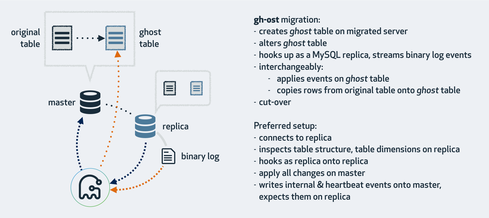

{"title":"MySQL オンラインスキーマ変更ツールの spirit と gh-ost","date":"2024-01-23T20:30:00+09:00","tags":["mysql"]}

MySQL のスキーマ変更は、データ量が大きくなると一般的に時間がかかり、その間の DML の実行にも影響が出る。このような状況でサービスを止めずにスキーマ変更をするためのツールとして [github/gh-ost](https://github.com/github/gh-ost) が有名だが、[cashapp/spirit](https://github.com/cashapp/spirit) は gh-ost をベースにして [Cash App](https://cash.app/) チーム (旧 Square、現 [Block, Inc.](https://block.xyz/)) のニーズに合わせて作られた新しい [1] オンラインスキーマ変更ツールだ。

[1] 紹介ブログ [Introducing Spirit \| Cash App Code Blog](https://code.cash.app/introducing-spirit) が書かれたのが 2023 年 9 月。

# spirit の特徴

基本的なアプローチは gh-ost も spirit も同じだが、より大きなデータサイズ [2] のユースケースに対応した機能が追加されている

- データコピーを並列に行う
    - gh-ost は一並列のため、この規模のデータコピーには数週間という水準の時間がかかる
- 処理途中からの resume に対応
    - 現代的なインフラはおおよそ k8s 上に構築されており、disposable な作りになっていた方が扱いやすい
    - 前述のように数日程度では済まない長い時間がかかる。この規模になると中断後、最初から処理を再開するのはかなり運用負荷が高い
    - この機能によりマイグレーション中だけ DB インスタンスをスケールアップしておき、一時中断して戻すなど柔軟な対応も可能になる

README にはベンチマークも記載されている。

- Aurora v3 上の 10TB の [finch.xfers](https://square.github.io/finch/benchmark/examples/#xfer) テーブルのマイグレーションが 2.7 日で完了
    - gh-ost だと 10 日でも完了せずキャンセルした
- テーブルはアイドル状態だったので、実際のワークロードではより差が開くと予想される
    - m1 mac 上でのマイクロベンチで比較
    - `finch.balances (800MB/1M rows), idle load` では spirit は gh-ost の約 2 倍高速
    - 同じテーブルでベンチマークツールでクエリを発行しながらマイグレーションしたところ、差は 8.5 倍まで広がった

[2] spirit は [10 TiB 規模のテーブルのマイグレーションを 5 日以内に完了させる](https://github.com/cashapp/spirit/blob/fdbfa0baf31e9406227ae7fa9403c977189d715c/README.md#performance) のが性能の目安になっている。対して [gh-ost や pt-ost は ~1TiB 程度の規模が想定されていて、かつそれでも 1 週間以上かかることもある](https://hackmysql.com/post/future-of-mysql-schema-change-spirit/) という水準らしい。

# gh-ost の実装

gh-ost はおおまかに次の戦略でオンラインスキーマ変更を実現している。

<figure>
<figcaption><a href="https://github.blog/2016-08-01-gh-ost-github-s-online-migration-tool-for-mysql/">gh-ost: GitHub's online schema migration tool for MySQL - The GitHub Blog</a>から引用</figcaption>
</figure>

- セットアップ
    - 対象のテーブルと同じ定義のテーブルを [CREATE TABLE ... LIKE ...](https://github.com/github/gh-ost/blob/59fd18dc90967c2540d7652b42fbd19fbe5bcb47/go/logic/applier.go#L223) 文で作成し、後者に [ALTER を適用する](https://github.com/github/gh-ost/blob/59fd18dc90967c2540d7652b42fbd19fbe5bcb47/go/logic/applier.go#L263)
    - gh-ost では後者を ghost table と呼んでいる
- データコピー
    - 元テーブルのデータを ghost デーブルにコピーする
    - この時 gh-ost は binlog を購読し、ghost テーブルが最新の状態に常に（極力小さいラグで）追従するようにしている
- カットオーバー
    - ghost テーブルと元テーブルを RENAME TABLE 文で入れ替える

主要な処理はコントローラー的役割の [logic.Migrator.Migrate](https://github.com/github/gh-ost/blob/59fd18dc90967c2540d7652b42fbd19fbe5bcb47/go/logic/migrator.go#L327) から順に呼び出されている。コードリーディングはここから始めると良い。

## データコピー

- データコピーは logic.Migrator と [logic.Applyer](https://github.com/github/gh-ost/blob/59fd18dc90967c2540d7652b42fbd19fbe5bcb47/go/logic/applier.go#L56) クラスが主に担当する
- [`INSERT IGNORE INTO … SELECT …` 文で](https://github.com/github/gh-ost/blob/59fd18dc90967c2540d7652b42fbd19fbe5bcb47/go/sql/builder.go#L224-L237) 元テーブルから ghost テーブルへデータを移していく
    - コピーはチャンクという単位で処理されていくが、チャンクの大きさは [固定値](https://github.com/github/gh-ost/blob/59fd18dc90967c2540d7652b42fbd19fbe5bcb47/go/base/context.go#L274)
- 同時に自身をレプリカとして登録し binlog を購読する
    - binlog を購読するのは [logic.EventStreamer](https://github.com/github/gh-ost/blob/59fd18dc90967c2540d7652b42fbd19fbe5bcb47/go/logic/streamer.go#L36)
    - EventStreamer に [イベントリスナーを登録](https://github.com/github/gh-ost/blob/59fd18dc90967c2540d7652b42fbd19fbe5bcb47/go/logic/migrator.go#L1092) する。リスナーは binlog の DML イベントを `applyEventsQueue` に登録する
    - 定期的にキューから [イベントを取り出し](https://github.com/github/gh-ost/blob/59fd18dc90967c2540d7652b42fbd19fbe5bcb47/go/logic/migrator.go#L1297)、変更を [ghost テーブルに適用](https://github.com/github/gh-ost/blob/59fd18dc90967c2540d7652b42fbd19fbe5bcb47/go/logic/applier.go#L1140) していく

EventStreamer が実際に binlog を読み込む部分は [go-mysql-org/go-mysql](https://github.com/go-mysql-org/go-mysql) の [replication](https://github.com/go-mysql-org/go-mysql/tree/master/replication) パッケージを利用している。

- レプリケーション、binlog の購読、MySQL のクライアント、サーバーのプロトコル解釈など、MySQL 周辺ツールを作るのに便利でコアなツールが揃っている
- いずれも Pure Go 実装
- もともとは [現 PingCap VPoE のエンジニア](https://twitter.com/siddontang) によって開発されたライブラリの模様
- gh-ost は replication を使っているが、spirit はこれよりもさらにハイレベルのインタフェースを提供する canal を利用している
    - それぞれのツールは別言語に参考元と思われるものがある
        - [alibaba/canal: 阿里巴巴 MySQL binlog 增量订阅&消费组件](https://github.com/alibaba/canal)
        - [julien\-duponchelle/python\-mysql\-replication: Pure Python Implementation of MySQL replication protocol build on top of PyMYSQL](https://github.com/julien-duponchelle/python-mysql-replication)

## カットオーバー

ghost テーブルが元テーブルに追いついたら、両テーブルの切り替えを行う。この作業をカットオーバーと呼ぶ。

gh-ost がそれ以前のツールよりも優れているのは、binlog 購読によるキャッチアップがトリガーなどによる実装に比べて高速低コストにできることで、そのおかげでカットオーバー時のロック取得が短時間で済むことだと思われる。

gh-ost のカットオーバーは次のように少々複雑な手順を踏む。

- 元テーブルと swap 用の一時テーブル (名前は `元テーブル_old`) にロックをかける
    - [LOCK TABLE 元テーブル WRITE, 元テーブル_old WRITE](https://github.com/github/gh-ost/blob/59fd18dc90967c2540d7652b42fbd19fbe5bcb47/go/logic/applier.go#L982)
- binlog 購読バッファをフラッシュし、ghost テーブルが元テーブルに追いついたことを確認する
- テーブルのリネームを行う
    - [RENAME TABLE 元テーブル TO 元テーブル_old, ghost テーブル TO 元テーブル](https://github.com/github/gh-ost/blob/59fd18dc90967c2540d7652b42fbd19fbe5bcb47/go/logic/applier.go#L1063)
    - この時点では RENAME 処理はロックでブロックされている。ただしロック中に発行された INSERT などの DML よりも高い優先度になっている
- [processlist に RENAME TABLE が出てくることを確認する](https://github.com/github/gh-ost/blob/59fd18dc90967c2540d7652b42fbd19fbe5bcb47/go/logic/applier.go#L868)
- `元テーブル_old` を [DROP する](https://github.com/github/gh-ost/blob/59fd18dc90967c2540d7652b42fbd19fbe5bcb47/go/logic/applier.go#L1013)
    - この時点ではロックでブロッキングされている
- 最後に [ロックを開放する](https://github.com/github/gh-ost/blob/59fd18dc90967c2540d7652b42fbd19fbe5bcb47/go/logic/applier.go#L1030)
    - まず RENAME が実行される。ロック中に発行され待たされていた DML はその後リネーム後のテーブルに対して実行される

詳細は次の issue にドキュメント化されている。[Describing safe, blocking, atomic, pure\-mysql cut\-over phase · Issue \#82 · github/gh\-ost](https://github.com/github/gh-ost/issues/82)

これは MySQL 8.0.13 以前はテーブルロック中にリネームができなかったことに起因している。MySQL 8.0.13 以降はこの制約がないので、ロック・リネーム・アンロックというシンプルなフローで良くなるが、gh-ost は古い MySQL バージョンをサポートしているのでまだ実装されていない。

> [MySQL :: MySQL 8\.0 Reference Manual :: 13\.1\.36 RENAME TABLE Statement](https://dev.mysql.com/doc/refman/8.0/en/rename-table.html)
>
> As of MySQL 8.0.13, you can rename tables locked with a LOCK TABLES statement, provided that they are locked with a WRITE lock or are the product of renaming WRITE-locked tables from earlier steps in a multiple-table rename operation.

なお以前はリネームのステップが (1) 元テーブルを一時テーブルにリネーム (2) ghostテーブルを元テーブルにリネームと 2 ステップに分かれていたらしい [3]。(1) と (2) の間に何らかの理由でロックを取っていたセッションが死ぬと、元テーブルがなくなった状態になってしまい事故となる。現行アルゴリズムはリネームがアトミックに行われるのでこの懸念はない。またこの点に限らず、フローのどの時点でクラッシュしても、データ一貫性が壊れる事故は起きなくなっている。

[3] [Describing safe, blocking, pure\-mysql cut\-over phase · Issue \#65 · github/gh\-ost](https://github.com/github/gh-ost/issues/65)

# spirit の実装

基本的なアプローチは gh-ost と同じで、実装もセットアップ、データコピー、カットオーバーの流れでされている。ただし以下のアイデアがデータコピーの実装に追加されている。

- 並列化によるデータコピーの短縮
- データコピーの途中再開

また MySQL 8 以降を原則サポート対象としていたり、gh-ost にある細かなオプションの対応が省かれていることで、コア部分以外のコード量が少なくすっきりしている。全体的にドキュメントも充実している。もしスキーマ変更ツールの実装を読んでみたい人がいれば、先に spirit から読むと理解しやすいと思う。

[migration.Runner.Run](https://github.com/cashapp/spirit/blob/fdbfa0baf31e9406227ae7fa9403c977189d715c/pkg/migration/runner.go#L153) がコントローラー的なメソッドで、ここから順に追っていくと良い。また ghost テーブルは spirit では New Table と呼ばれている。

## データコピー

spirit では [row.Copier](https://github.com/cashapp/spirit/blob/fdbfa0baf31e9406227ae7fa9403c977189d715c/pkg/row/copier.go#L33) クラスが担当する。

- Chunker が元テーブル全体をいくつかのチャンクに分割する
    - チャンクサイズは [処理時間に応じて動的に変更している](https://github.com/cashapp/spirit/blob/fdbfa0baf31e9406227ae7fa9403c977189d715c/pkg/table/chunker_optimistic.go#L208)
- Copier が [複数のスレッドを起動](https://github.com/cashapp/spirit/blob/fdbfa0baf31e9406227ae7fa9403c977189d715c/pkg/row/copier.go#L186) し、それぞれに [担当するチャンクを割り当てる](https://github.com/cashapp/spirit/blob/fdbfa0baf31e9406227ae7fa9403c977189d715c/pkg/row/copier.go#L188)
    - [INSERT IGNORE INTO ... SELECT ... FORCE INDEX (PRIMARY) WHERE ...](https://github.com/cashapp/spirit/blob/fdbfa0baf31e9406227ae7fa9403c977189d715c/pkg/row/copier.go#L124) で元テーブルから New テーブルにコピーする
    - このときの WHERE 句は Chunker ([Chunk オブジェクト](https://github.com/cashapp/spirit/blob/fdbfa0baf31e9406227ae7fa9403c977189d715c/pkg/table/chunk.go#L37)) が生成する
    - コピー完了後は [watermark を更新する](https://github.com/cashapp/spirit/blob/fdbfa0baf31e9406227ae7fa9403c977189d715c/pkg/table/chunker_optimistic.go#L280)
        - どこまでのコピーが済んだのかの記録
- 同時に binlog の購読も開始する
    - [repl.Client](https://github.com/cashapp/spirit/blob/fdbfa0baf31e9406227ae7fa9403c977189d715c/pkg/repl/client.go#L45) が担当するが、後述のようにコアな実装は `go-mysql/canal` に移譲している
        - `repl.Client` 自体を canal に [イベントハンドラの実装として登録](https://github.com/cashapp/spirit/blob/fdbfa0baf31e9406227ae7fa9403c977189d715c/pkg/repl/client.go#L266)、binlog イベントが [バッファ](https://github.com/cashapp/spirit/blob/fdbfa0baf31e9406227ae7fa9403c977189d715c/pkg/repl/client.go#L52) に貯められ、[定期的にフラッシュ](https://github.com/cashapp/spirit/blob/fdbfa0baf31e9406227ae7fa9403c977189d715c/pkg/repl/client.go#L575) される
    - 以下の最適化を行っている
        - binlog イベント到着時、[watermark を確認](https://github.com/cashapp/spirit/blob/fdbfa0baf31e9406227ae7fa9403c977189d715c/pkg/table/chunker_optimistic.go#L411) し、[コピー済みのレコードのみ更新する](https://github.com/cashapp/spirit/blob/fdbfa0baf31e9406227ae7fa9403c977189d715c/pkg/repl/client.go#L136-L139)
            - 未コピーのレコードは今後 copier スレッドがその時の最新状態をコピーしてくれるので、binlog のイベントは無視して良い
        - binlog イベントを PK ごとのバッファにまとめ、重複排除をしている
            - [binlogChangeset](https://github.com/cashapp/spirit/blob/fdbfa0baf31e9406227ae7fa9403c977189d715c/pkg/repl/client.go#L52) という `map[string]bool` という型の map で `string` が PK に、bool が `delete か否か` を表している
                - 更新内容は保持しておらず、あくまで更新や削除があった PK のみを記録している
            - binlog イベント受信時、INSERT, UPDATE なら false で、DELETE なら true で [その PK のエントリを map に追加している](https://github.com/cashapp/spirit/blob/fdbfa0baf31e9406227ae7fa9403c977189d715c/pkg/repl/client.go#L655)
            - [フラッシュ時](https://github.com/cashapp/spirit/blob/fdbfa0baf31e9406227ae7fa9403c977189d715c/pkg/repl/client.go#L440) には delete の場合は [DELETE 文](https://github.com/cashapp/spirit/blob/fdbfa0baf31e9406227ae7fa9403c977189d715c/pkg/repl/client.go#L515) を、そうでなければ [REPLACE 文で、元テーブルのデータで新テーブルの該当レコードを置き換え](https://github.com/cashapp/spirit/blob/fdbfa0baf31e9406227ae7fa9403c977189d715c/pkg/repl/client.go#L527) している
                - その時の最新情報を元テーブルから取得しているので、そのため個別の binlog イベント内容は無視できる
            - 加えて [反映クエリを並列実行し](https://github.com/cashapp/spirit/blob/fdbfa0baf31e9406227ae7fa9403c977189d715c/pkg/repl/client.go#L496-L499) 高速化を図っている
- 進捗状況は checkpoint テーブルに保存される
    - watermark や binlog の読み取り位置を [定期的にこのテーブルに記録](https://github.com/cashapp/spirit/blob/fdbfa0baf31e9406227ae7fa9403c977189d715c/pkg/migration/runner.go#L901) している
    - resume する場合は [セットアップ時にこのテーブルをチェック](https://github.com/cashapp/spirit/blob/fdbfa0baf31e9406227ae7fa9403c977189d715c/pkg/migration/runner.go#L428) し、存在すれば [進捗状況を読み取って](https://github.com/cashapp/spirit/blob/fdbfa0baf31e9406227ae7fa9403c977189d715c/pkg/migration/runner.go#L761) 処理を再開する
- [replication lag を監視](https://github.com/cashapp/spirit/blob/fdbfa0baf31e9406227ae7fa9403c977189d715c/pkg/throttler/mysql80replica.go#L56) し、大きくなった場合はデータコピー処理をスロットリングする
    - [performance_schema.replication_applier_status_by_worker](https://github.com/cashapp/spirit/blob/fdbfa0baf31e9406227ae7fa9403c977189d715c/pkg/throttler/mysql80replica.go#L14-L18) を見ている
    - 似た機構は gh-ost にもある

binlog の購読は gh-ost 同様 [go-mysql-org/go-mysql](https://github.com/go-mysql-org/go-mysql) を利用している。ただし replication ではなく [canal](https://github.com/go-mysql-org/go-mysql/blob/b9563f7d56687408e9b2f8b2fe5f64687f6a3340/README.md#canal) というよりハイレベルなライブラリを使っている。

- canal はある MySQL サーバーの変更を別のデータスストアに反映させるために使うことができる、汎用的なツール
    - 例えば [MySQL から elasticsearch へのデータ同期といったユースケース](https://github.com/go-mysql-org/go-mysql-elasticsearch) の実装に有用
    - binlog イベントを受け取った際にやりたい処理をイベントハンドラとして登録するだけで、簡単に使える

## カットオーバー

デフォルトでは MySQL 8 をサポート対象としているので、gh-ost に比べ [シンプルでストレートな実装](https://github.com/cashapp/spirit/blob/fdbfa0baf31e9406227ae7fa9403c977189d715c/pkg/migration/cutover.go#L117) になっている。

- [migration.Cutover](https://github.com/cashapp/spirit/blob/fdbfa0baf31e9406227ae7fa9403c977189d715c/pkg/migration/cutover.go#L36) が担当する
- [元テーブルのロック](https://github.com/cashapp/spirit/blob/fdbfa0baf31e9406227ae7fa9403c977189d715c/pkg/migration/cutover.go#L120)、[binlog バッファのフラッシュ](https://github.com/cashapp/spirit/blob/fdbfa0baf31e9406227ae7fa9403c977189d715c/pkg/migration/cutover.go#L125) をしたあと、[RENAME TABLE 元テーブル TO _元テーブル_old, 新テーブル TO 元テーブル](https://github.com/cashapp/spirit/blob/fdbfa0baf31e9406227ae7fa9403c977189d715c/pkg/migration/cutover.go#L133) で入れ替える

フォールバックとして [gh-ost と同様のアルゴリズム](https://github.com/cashapp/spirit/blob/fdbfa0baf31e9406227ae7fa9403c977189d715c/pkg/migration/cutover.go#L142) も実装されている。

# ALGORITHM=INSTANT の試行

[spirit](https://github.com/cashapp/spirit/blob/fdbfa0baf31e9406227ae7fa9403c977189d715c/pkg/migration/runner.go#L382) にも [gh-ost](https://github.com/github/gh-ost/blob/59fd18dc90967c2540d7652b42fbd19fbe5bcb47/go/logic/applier.go#L213) にも、処理に入る前にまずは `ALGORITHM=INSTANT` でのスキーマ変更ができないかチェックする仕組みが入っている。

MySQL 8 から導入された `ALGORITHM=INSTANT` は、メタデータの更新だけで ALTER 文が完了するため、非常に高速。ただし全てのスキーマ変更操作で可能なわけではなく制約がある。

spirit も gh-ost も、重くリスクの高い作業を開始する前に `ALGORITHM=INSTANT` を試みるのは理にかなっている。またこの機能は spirit 側から gh-ost に [提案・移植](https://github.com/github/gh-ost/pull/1201) してくれたらしい。

# PR

<a href="http://www.amazon.co.jp/exec/obidos/ASIN/B09N5NWKR1/pleasesleep-22/ref=nosim/" name="amazletlink" target="_blank">Efficient MySQL Performance (English Edition)</a>

英語版  Daniel Nichter (著)  形式: Kindle版 

<a href="http://www.amazon.co.jp/exec/obidos/ASIN/B09N5NWKR1/pleasesleep-22/ref=nosim/" name="amazletlink" target="_blank">Amazon.co.jpで詳細を見る</a>

