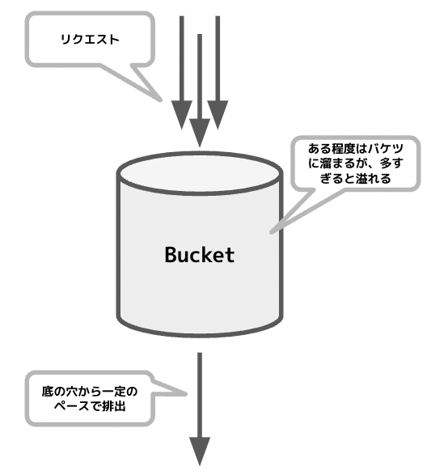
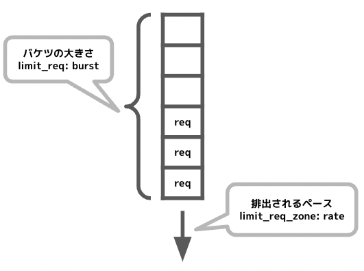

{"title":"Nginx の Rate Limit 設定と Leaky Bucket Algorithm","date":"2022-08-18T23:30:00+09:00","tags":["nginx"]}

nginx の [ngx_http_limit_req_module](http://nginx.org/en/docs/http/ngx_http_limit_req_module.html) で rate limit の設定ができる。がパラメータの理解が難しく、当初は設定値の調整に難儀した。背後にある Leaky Bucket というアルゴリズムとその実装を確認することでパラメータもすんなり理解できた。以下調べたことのログを残しておく。

## ngx_http_limit_req_module

[ngx_http_limit_req_module](http://nginx.org/en/docs/http/ngx_http_limit_req_module.html) は指定した key ごとに Rate Limit を設定できるというモジュール。key とは例えばリクエスト元の remote_ip で、それごとに「`1r/s` まで」といった制限を指定できる。

設定はこんな感じ。

```
http {
    limit_req_zone $binary_remote_addr zone=myzone rate=1r/s;

    ...

    server {

        ...

        location /search/ {
            limit_req zone=myzone burst=5 nodelay;
        }
```

- limit_req_zone
    - key はどの単位で制限をかけるか。この例では remote_ip
    - zone はこの設定の名称
    - rate は制限値で、`r/s` や `r/m` といった単位で指定可能
- limit_req
    - zone は limit_req_zone でつけた名称
    - burst はリクエストの最大バーストサイズ
    - nodelay は制限を超えたリクエストを即座に処理するというフラグ

制限が発動するとこのようなログが出力される。

```
[error] 9#9: *234 limiting requests, excess: 0.972 by zone "myzone", client: 172.21.0.1, server: localhost, request: "GET /search HTTP/1.1", host: "localhost:3000"
```

## わからなかったこと

上記の設定例を見て、当初は burst と nodelay の意味がよくわからなかった。

とりあえず burst, delay 無しで rate のみ設定したところ、想定とは違う挙動で混乱した。

- イメージしていたのは、例えば `rate=10r/s` と設定した場合、ある 1 秒間に 10 リクエスト以上来た際に 11 リクエスト目から弾かれるというもの
- 実際には、全くリクエストがない状態からある瞬間に同時に 2 リクエスト来た際、片方が弾かれた。この理由がわからなかった

## Leaky Bucket Algorithm

[ドキュメントにも書いてある](http://nginx.org/en/docs/http/ngx_http_limit_req_module.html) 通り、ngx_http_limit_req_module は `Leaky Bucket` というアルゴリズムに基づいて実装されている。Leaky Bucket は [Traffic shaping](https://en.wikipedia.org/wiki/Traffic_shaping) などに使われるアルゴリズムで、いわゆるリクエストの「バースト」を平準化する動きをする。

その名の通り、穴の空いたバケツに水が注がれるというメタファーで説明される。



- 注がれる水がリクエスト
- 空いた穴が許可する rps (request per second)
- 水が多く注がれると、ある程度はバケツに溜まり、一定のペースで穴から排出される
- バケツにも収まらなくなると外に溢れる
    - 新規リクエストを受け付けなくなる

よって変数としては「許可する rps (バケツの穴の大きさ)」と「リクエストのキューの長さ (バケツの容積)」の二つということになる。



- 許可する rps は底の穴の大きさに例えられる。nginx の背後のサービスはこの水準以上のリクエストから保護される
    - limit_req_zone の `rate` にあたる
- キューの長さはバケツの容積に例えられる。許可した rps 以上のペースでリクエストが届いた場合、それをどれだけ保持しておくかを表す
    - limit_req の `burst` にあたる

また limit_req_zone の key ごとにバケツが用意されると理解すれば良い。

## nodelay は?

[limit_req の nodelay パラメータ](http://nginx.org/en/docs/http/ngx_http_limit_req_module.html#limit_req) は Leaky Bucket の中には出てこない ngx_http_limit_req_module 独自の概念のようだった。簡単のためにここでは nodelay のケースだけ説明する。delay はこれがさらに一般化されて可変になったケース。

- nodelay 指定がない場合は、rate を超えたリクエストはキューに溜められ、rate のペースで処理される
- nodelay 指定をした場合、rate を超えたリクエストはキューには溜められるが、一方でそのリクエストはすぐに処理される
    - すぐに処理してもキューには溜められているので、キューに溜まっているリクエストは rate のペースでしか減らない

つまり nginx 背後のサービスから見ると、一時的に rate 以上のリクエストが届くが、長期で見ると rate 以下のペースに収束するという見え方になる。

## burst と nodelay の指定が推奨される

[Nginx blog](https://www.nginx.com/blog/rate-limiting-nginx/) では burst と nodelay の両方を指定することを推奨している。

- いずれも指定がない場合、瞬間的な同時リクエストが全て弾かれてしまう
    - Web システムの場合、リクエストが一定のペースでコンスタントに届くのではなく、固まって届くタイミングとそうでないタイミングがある方が普通
    - 例えば `rate=1r/s` で `burst=0` の場合、ある瞬間に 2 リクエスト同時に来て、その後 2 秒間全くリクエストがなくても、片方のリクエストは弾かれてしまう
        - 平均すると 1 r/s のペースなのだが、リクエストと次のリクエストの間が 1 秒空かないと弾かれる
        - burst=0 はバケツの容積が 0 ということなのでこのような挙動になる
- また burst だけ指定して nodelay が無い場合、一時的にリクエストが急増した際に、キューに入ったリクエストが実際に処理されるまで時間がかかることになる
    - Web システムの場合後からそのリクエストを処理してもほぼ意味がないことが多い

よって burst、nodelayを指定して瞬間的な同時リクエストは許容しつつ、平均的な rps が指定した水準に収まるように設定するのが、Web システムには適しているということになる。

## ngx_http_limit_req_module の実装

[src/http/modules/ngx\_http\_limit\_req\_module\.c](https://github.com/nginx/nginx/blob/f7ea8c76b55f730daa3b63f5511feb564b44d901/src/http/modules/ngx_http_limit_req_module.c) に実装がある。不慣れなコードベースだが思ったよりシンプルに実装されていて、ある程度はなんとか読み解けたと思う。

大まかな流れとして、処理は [ngx_http_limit_req_handler](https://github.com/nginx/nginx/blob/f7ea8c76b55f730daa3b63f5511feb564b44d901/src/http/modules/ngx_http_limit_req_module.c#L195) から始まる。設定値の読み取りなど諸々の前処理後 [ngx_http_limit_req_lookup](https://github.com/nginx/nginx/blob/f7ea8c76b55f730daa3b63f5511feb564b44d901/src/http/modules/ngx_http_limit_req_module.c#L248-L249) を呼び出して Rate Limit の判定を行う。その結果に応じてリクエストを処理するか弾くか、nodelay (delay) の処理などの後処理を行う。

[ngx_http_limit_req_lookup](https://github.com/nginx/nginx/blob/f7ea8c76b55f730daa3b63f5511feb564b44d901/src/http/modules/ngx_http_limit_req_module.c#L405) では key (i.e. remote_ip など) ごとに統計情報を保持していて、リクエストごとにそれを使った判定と統計情報の更新をしている。

特にポイントになるのが [以下の式](https://github.com/nginx/nginx/blob/f7ea8c76b55f730daa3b63f5511feb564b44d901/src/http/modules/ngx_http_limit_req_module.c#L454)。

```c
excess = lr->excess - ctx->rate * ms / 1000 + 1000;
```

- 左辺の `excess` はこの key で保持している (キューに入っている) リクエストの量という意味
    - つまり「バケツ」の現在溜まっている水の量
    - これが burst (= バケツの容積) 以内ならそのリクエストは受け入れ可能、burst を超えると「バケツが溢れた」状態となりリクエストは弾かれる
    - 単位は「リクエスト数 * 1000」。ngx_http_limite_req_module 全体的に ms 単位で各種計算が行われている
- `lr-excess` はこの式の前回までの値が保存されているもの
- `ctx->rate` は limit_req_zone で指定した rate の値を ms 単位にしたもの
- `ms` は前回受け付けたリクエストからの経過時間を ms 単位で表したもの
- よって `ctx->rate * ms / 1000` は、「前回のリクエストから現在までの間にバケツから流れた量」ということになる
- そして `lr->excess - ctx->rate * ms / 1000` は前回のバケツの残量から、時間経過分の量が減った状態という意味になる
- 最後の `+ 1000` は今回の 1 リクエスト分を足したという意味

再度まとめると `excess = 前回のバケツ内の量 - 流れた量 + 今回追加された量` という意味になっている。excess と burst を比較しリクエストを弾くかどうか判定し、また excess の計算結果は統計情報として保存して次回以降利用する。

なおここで特徴的なのは、統計情報を [赤黒木](https://github.com/nginx/nginx/blob/f7ea8c76b55f730daa3b63f5511feb564b44d901/src/http/modules/ngx_http_limit_req_module.c#L420) で保持していて、効率的に参照できるよう工夫されていること。また赤黒木のノードを [LRU なキューに入れて](https://github.com/nginx/nginx/blob/f7ea8c76b55f730daa3b63f5511feb564b44d901/src/http/modules/ngx_http_limit_req_module.c#L443) メモリが溢れた場合は古いものを捨てる実装になっている。

ngx_http_limit_req_handler に戻ると、ngx_http_limit_req_lookup の判定結果をうけて各種対応を行う。

特徴的なのはリクエストを保持する実際のキュー (バケツ) がこのモジュール内にあるわけではないこと。Nginx のイベントベースのアーキテクチャの仕組みに乗り、必要な時間後にそのリクエストが処理されるよう遅延して登録されているだけのようだった (ここは nginx 全体のアーキテクチャに詳しくないので勘違いがあるかもしれない)。

- ngx_http_limit_req_lookup が NGX_BUSY を返した場合、[そのリクエストは弾かれる](https://github.com/nginx/nginx/blob/f7ea8c76b55f730daa3b63f5511feb564b44d901/src/http/modules/ngx_http_limit_req_module.c#L268-L274)
    - 前述のような `limitting requests ...` というログを残している
- そうでない場合、そのリクエストをいつ処理するかを決める。nodelay の場合はすぐに処理される
    - nodelay の場合 [delay 変数に INT の最大値が入る](https://github.com/nginx/nginx/blob/f7ea8c76b55f730daa3b63f5511feb564b44d901/src/http/modules/ngx_http_limit_req_module.c#L1020-L1023)
        - この delay 変数は [limit_req の delay](http://nginx.org/en/docs/http/ngx_http_limit_req_module.html#limit_req) と同じ。デフォルトは 0 (nodelay 指定されていない状態) で、その場合はすべて rate のペースに合わせて遅延して処理される
    - [ngx_http_limit_req_account](https://github.com/nginx/nginx/blob/f7ea8c76b55f730daa3b63f5511feb564b44d901/src/http/modules/ngx_http_limit_req_module.c#L536) がいつ処理するかの計算をしている
    - nodelay の場合 0 が返され ([1](https://github.com/nginx/nginx/blob/f7ea8c76b55f730daa3b63f5511feb564b44d901/src/http/modules/ngx_http_limit_req_module.c#L547-L548), [2](https://github.com/nginx/nginx/blob/f7ea8c76b55f730daa3b63f5511feb564b44d901/src/http/modules/ngx_http_limit_req_module.c#L592-L594), [3](https://github.com/nginx/nginx/blob/f7ea8c76b55f730daa3b63f5511feb564b44d901/src/http/modules/ngx_http_limit_req_module.c#L605))、[呼び出し側で NGX_DECLINED を返している](https://github.com/nginx/nginx/blob/f7ea8c76b55f730daa3b63f5511feb564b44d901/src/http/modules/ngx_http_limit_req_module.c#L296-L299)
- NGX_DECLINED は [Proceed to the next handler of the current phase. If the current handler is the last in the current phase, move to the next phase.](http://nginx.org/en/docs/dev/development_guide.html#http_phases) とのことで、処理をすすめるという意味になっていると思う

このように nodelay のとき遅延なくすぐにリクエストが処理されているが、一方で `ngx_http_limit_req_lookup` で見た `excess` にはこのリクエストも含まれた値が赤黒木に保存されている。こうして「キューに溜まっているが処理自体は即座にされている」という挙動が実現されている。

## 具体的な設定値の決め方

今回 Rate Limit を導入した経緯は、外部システムからのリクエストを受けているエンドポイントに、外部システムの不具合で急激なリクエストが発生し、他のエンドポイントにまで影響が及ぶ障害に発展したというものだった。リクエストの急増は何度か発生していた。

そこで以下の手順で具体的な設定値を決めた。

- リクエストログをサンプルする期間をいくつか決める
    - 平常時のピーク時間帯を 3 期間ほど
    - 障害時の 3 期間ほど
    - Critical な状況には至らなかったが、平常時のピークよりは多くリクエストが届いた期間 (あれば)
- まずは `rate` を決める
    - それぞれの期間で同じ条件で最大の rps を集計
    - 障害時よりも小さく、ピーク時よりも大きい rps の値を決め、rate 値とした
- 次に `burst` を決める
    - 秒単位では粗いので、同じくそれぞれの期間で先ほどよりも細かい単位でリクエスト数を見ていく (例えば 100ms や 10ms ごと)
    - 平常時と障害時を比較して burst 値を決めた
    - 例えば `rate=50r/s` で平常時 100ms ごとに 5 リクエスト来ていた場合。ワーストケースはその 5 リクエストがその 100 ms 内のある時点で同時に届く状況となる。この場合最低 burst=5 あればリクエストをひとつも取りこぼさない
    - あとは障害時の同じ集計結果と見比べながら、どのくらい余裕を持たせるかを任意に決めた

## 参考

- [Module ngx\_http\_limit\_req\_module](http://nginx.org/en/docs/http/ngx_http_limit_req_module.html)
- [NGINX Rate Limiting](https://www.nginx.com/blog/rate-limiting-nginx/)
- [A Preliminary Study of Nginx Speed Limiting Module \- actorsfit](https://blog.actorsfit.com/a?ID=00001-643cb283-0215-40e0-bc0a-c187747c928d)
- [nginx/ngx\_http\_limit\_req\_module\.c at master · nginx/nginx](https://github.com/nginx/nginx/blob/f7ea8c76b55f730daa3b63f5511feb564b44d901/src/http/modules/ngx_http_limit_req_module.c)
- [Development guide](http://nginx.org/en/docs/dev/development_guide.html#http_phases)
- [Leaky bucket \- Wikipedia](https://en.wikipedia.org/wiki/Leaky_bucket)

## PR

<div class="amazlet-box" style="margin-bottom:0px;"><div class="amazlet-image" style="float:left;margin:0px 12px 1px 0px;"><a href="http://www.amazon.co.jp/exec/obidos/ASIN/4873116457/pleasesleep-22/ref=nosim/" name="amazletlink" target="_blank"></a></div><div class="amazlet-info" style="line-height:120%; margin-bottom: 10px"><div class="amazlet-name" style="margin-bottom:10px;line-height:120%"><a href="http://www.amazon.co.jp/exec/obidos/ASIN/4873116457/pleasesleep-22/ref=nosim/" name="amazletlink" target="_blank">マスタリングNginx</a></div><div class="amazlet-detail">by Dimitri Aivaliotis (著), 高橋 基信  (翻訳)<br/></div><div class="amazlet-sub-info" style="float: left;"><div class="amazlet-link" style="margin-top: 5px"><a href="http://www.amazon.co.jp/exec/obidos/ASIN/4873116457/pleasesleep-22/ref=nosim/" name="amazletlink" target="_blank">Amazon.co.jpで詳細を見る</a></div></div></div><div class="amazlet-footer" style="clear: left"></div></div>
