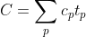
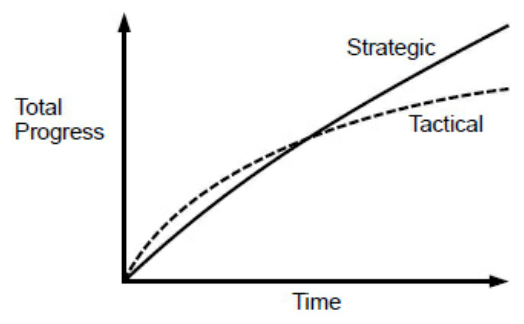
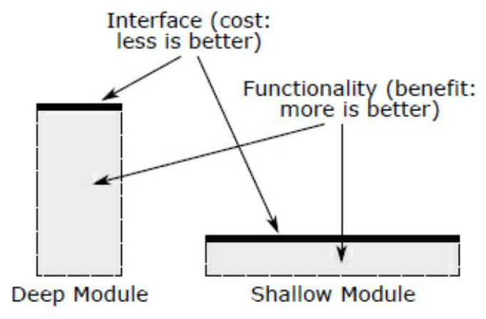

{"title":"読書メモ: Philosophy of Software Design","date":"2023-11-16T23:00:00+09:00","tags":["book"]}

<div class="amazlet-box" style="margin-bottom:0px;"><div class="amazlet-image" style="float:left;margin:0px 12px 1px 0px;"><a href="http://www.amazon.co.jp/exec/obidos/ASIN/B09B8LFKQL/pleasesleep-22/ref=nosim/" name="amazletlink" target="_blank"></a></div><div class="amazlet-info" style="line-height:120%; margin-bottom: 10px"><div class="amazlet-name" style="margin-bottom:10px;line-height:120%"><a href="http://www.amazon.co.jp/exec/obidos/ASIN/B09B8LFKQL/pleasesleep-22/ref=nosim/" name="amazletlink" target="_blank">A Philosophy of Software Design, 2nd Edition (English Edition)</a></div><div class="amazlet-detail">英語版  John K. Ousterhout (著)  形式: Kindle版<br/></div><div class="amazlet-sub-info" style="float: left;"><div class="amazlet-link" style="margin-top: 5px"><a href="http://www.amazon.co.jp/exec/obidos/ASIN/B09B8LFKQL/pleasesleep-22/ref=nosim/" name="amazletlink" target="_blank">Amazon.co.jpで詳細を見る</a></div></div></div><div class="amazlet-footer" style="clear: left"></div></div>

良い設計をするためのコンセプトを解説した本。類書はいろいろとあるが、自分が読んだものの中では一番良かった。ソフトウェアエンジニアリングを行う人には広くおすすめできる。コンパクトですぐに読み切れるのも良い。

- 複雑さをいかに削減するかという観点と、その対策としての深いモジュールというコンセプトを導入し、この軸ですべての章を論じている。筋が通っていて読みやすいし、納得感も高い
- これらのコンセプトを通して、従来は良しとされているプラクティスの再検討も行っていて、こちらも面白く納得しながら読めた。例えばできるだけメソッドは小さくするという慣習や、Clean Code でのコメントの不要論など。同意する部分は認めつつ、それがマッチしない、むしろシステム全体の複雑さを増やしてしまうケースを示している
- ソフトウェアを書いて終わりではなく時間をかけて保守開発していくものという観点に立っているのも良い
    - <a href="http://www.amazon.co.jp/exec/obidos/ASIN/4873119650/pleasesleep-22/ref=nosim/" name="amazletlink" target="_blank">Googleのソフトウェアエンジニアリング</a> もそのような視点で書かれていたのが思い出された。単純なプログラミングとソフトウェアエンジニアリングの違いは、この時間経過の概念があるかどうかと定義していた記憶がある
- 目から鱗が落ちる、すぐに普段の開発に取り入れたい知見がいろいろとあった
    - 印象に残っているのは `somewhat general-purpose` にモジュールを設計しようというアイデア
    - 先が見通せない状態で汎用的に作りすぎるのはリスクがあるので、まずは要件を最短で満たす実装をし、そこから必要に応じてリファクタリングするという、インクリメンタルな進め方は良いものだと考えていた
    - それはそうなのだが、最初からある程度 (この塩梅も重要) 汎用性のあるつくりにしたほうが、シンプルさも実装量も減るという知見が目新しく、取り入れていきたいと思った
- 先にコメントを書いてから実装に入るというコメントファーストという設計手法は、生成 AI 時代にもマッチしている方法論だと思った
    - まずはできるだけ Copilot に書いてもらい、それを手で修正するやり方を、普段から取るようにしている
        - ref. [サイバーエージェントのGitHub Copilot導入と 開発生産性 \- Speaker Deck](https://speakerdeck.com/kurochan/saihaesientonogithub-copilotdao-ru-to-kai-fa-sheng-chan-xing?slide=41)
    - コメントファーストの方針はこうしたプログラミングスタイルともマッチしている気がする
    - もちろん第一義は実装に入る前に設計をブラッシュアップできるという、設計ツールとしての側面だが

以降は読書メモだが、本文のコード例も合わせて読んだほうが理解が深まる。

## 1 - Introduction (It’s All About Complexity)

この本では、デザインの良し悪しの判断基準を複雑さ complexity に置いている。

- 物理的な制約がないソフトウェアエンジニアリングでは「複雑さ」、いかにシステムを容易に理解でき変更できるか、が生産性のボトルネックになる
- 複雑さは時間を経るごとに増し、反比例して開発生産性は減るので、なおさら重要
- 良いデザインは複雑さをなくしたり、モジュールに押し込めることで、トータルの複雑さを減らす

## 2 - The Nature of Complexity

ここでは複雑さを「システムの理解と変更を難しくする、ソフトウェアの構造に関するすべてのもの」と定義している。

- 簡単に理解でき変更できるソフトウェアは複雑さが少ない。また複雑なシステムは小さな変更に労力がかかるので、費やしたコストに対して便益が少ないとも言える
    - コードベースの大きさとは独立した概念。大きいコードは理解するのが大変なので複雑な傾向にはあるが、小さくても複雑なソフトウェアは存在し得る

次のように定式化できる。



- 定義
    - `C` はシステム全体の複雑さ
    - `p` はそのシステムを構成するサブシステムやコンポーネント
    - `c_p` はサブシステムの複雑さ
    - `t_p` はそのサブシステムに開発者が費やす時間
- つまり以下のアプローチがある
    - 複雑さそのもの `c_p` を減らしたり無くす
    - 複雑さをモジュールに切り出す。サブシステムに費やす時間 `t_p` が小さければ、その複雑さ `c_p` が大きくても全体はシンプルになる

複雑なソフトウェアには以下の症状が現れる。

- 変更箇所の増幅 Change amplification
    - 簡単な変更でも多くの作業箇所が発生する
- 認知負荷の増加 Cognitive load
    - 作業するために把握すべきことが多い・把握が難しい
- 知らない知らないこと Unknown unknowns
    - 把握すべきことがコードからもドキュメントからも知りようがない状況
- この中で Unknown unknowns がワーストケース。開発時には問題にすら気づくことができず、リリース後のバグ報告で把握するしかなくなる

こうした複雑さの原因は依存関係 Dependency と不明瞭さ Obscurity によって引き起こされる。

- 依存関係はある変更をする際に特定の箇所以外の変更も必要になる場合と定義している
    - 依存関係は本質的に必要なものだが、その数を減らし、関係を明確にすることで複雑さを下げることができる
- 重要な情報が分かりづらい場合不明瞭さが現れる
    - 設計とドキュメントで解決すべき問題。また良い設計は必要なドキュメントを減らす
- 依存関係は Change amplificationと Cognitive loadを増やし、不明瞭さは Cognitive loadと Unknown unknownsを増やす関係にある

また複雑さは一つの大きな原因があるのではなく、小さな問題が累積して全体の大きな複雑さになる。

- 素早く仕事をこなすために追加した小さな複雑さが、時間を経て incrementalに全体の複雑さを増加させていく

## 3 - Working Code Isn’t Enough

日々の開発では、戦略的目線で少しずつ投資をしていくマインドセットが求められる。

- 機能開発やバグ修正を最短で行う方針を戦術的プログラミングと呼ぶ
    - 最速で動くことが最優先される
    - 複雑さは追加、蓄積される。多くの場合技術的負債が全て返済されることはなく、複雑さは常に増える
    - 一般的な組織では高速に実装する人は高く評価されがちで、その時どれだけ複雑さが追加されたかが評価に加味されることは少ない。また負債を残さない開発をしている人、負債を返している人が高く評価されることは少ない
- 反対に良い設計を目指して進める方針を戦略的プログラミングと呼ぶ
    - 「動くこと」は当然満たしながら、あるべき設計への投資も行う
    - 良い設計のためにはこちらのマインドセットを持つ必要がある
- 開発期間の 10-20 % を、この戦略的目線での投資にあてることを推奨
    - 一度に大きなリファクタリングは失敗しやすい。インクリメンタルな進め方を推奨している
    - 複雑さは個々の小さなものの累積なので、それを出さない、減らす活動にも大きな意味がある
    - この水準の時間投資ならば比較的早く回収できる
        - 客観的ではないが、筆者の見込みでは 6-18 ヶ月で投資が回収できるとのこと

<figure>

<figcaption>Philosophy of software design (p. 16) Figure 3.1 より</figcaption>
</figure>

- スタートアップなど速度が重視される環境でも例外ではない
    - 戦術的プログラミングを行う組織の代表例として Facebook が挙げられる
        - 彼らの `Move fast and break things` というモットーはそれを象徴しているが、後日 `Move fast and solid infrastructure` に変更されている
    - 戦略的アプローチをとる代表例は Googleや VMWare
    - これらを見ると戦略的・戦術的プログラミングどちらでも事業が大きく成功することがあるとわかる。そうであればエンジニアとしてより満足度が高い後者のアプローチをとってもいいのではないか

## 4 - Modules Should Be Deep

モジュール化は代表的な複雑さへの対応方法で、その良し悪しは「深さ」で測る。

以下の議論はメソッドやクラスからサブシステム、サービスまで、あらゆる粒度に適用できる。わかりやすさのためモジュールと呼んでいる。

- モジュールはインタフェースと実装に分けて考えることができる
- インタフェースは広義にそのモジュールを使うために利用者が把握しなければいけないことで、以下の二つに分類できる
    - フォーマルなインタフェース
        - プログラミング言語により検証されるもの
        - メソッドのシグネチャが例。メソッド名や引数、戻り値の型にミスがあればコンパイラが指摘してくれる
    - インフォーマルなインタフェース
        - フォーマルなもの以外で、利用者が把握しなければ、そのモジュールを正しく使えないような情報
        - 例えば「別のメソッドを事前に呼び出さなければならない」といった情報や、どんな例外が投げられるかなど
        - 基本的にはドキュメントに記載するしかない

「深い」モジュールとは、シンプルなインタフェースに対して多くの仕事をするもの。

<figure>

<figcaption>Philosophy of software design (p. 23) Figure 4.1 より</figcaption>
</figure>

- 四角形の縦軸がそのメソッドのこなせる仕事の量、上辺の太線がインタフェースで、短いほどシンプル
- 深いモジュールは縦に長い
- 例えば Unix の File IO の仕組みが挙げられる。５つのシステムコールで単純なファイルからネットワーク通信まであらゆる入出力に対応している

反対に浅いモジュールは相対的に複雑なインタフェースに対して仕事が少ないもの。

- 例えば別のメソッドに値を受け渡しているだけのメソッドが極端な例
- 浅いメソッドは悪い設計のレッドフラグ（兆候）
- メソッドやクラスを小さく保つというプラクティスがあるが、それはこの議論の文脈では浅いモジュールを引き起こす悪いものということになる
    - 実装を理解しやすくするのは重要だが、単に行数で複雑さを判断するのは間違っている

インタフェースの設計は、その対象をどう抽象化するかと言い換えることができる。

- あるエンティティから不要な詳細を省き、シンプルな見方を提供するのが抽象化の定義
- 「不必要なものをインタフェースに含めてしまう」「必要なものがインタフェースから漏れてしまう」とインタフェースの複雑さが増し、浅いモジュールに近づいてしまう
- 不必要なものをインタフェースに含めてしまった場合、利用者の認知負荷が高まる
    - 標準的な使い方では不要なケースへの対応のために必要な引数がが必須になっているなど
- 必要なものがインタフェースから漏れてしまった場合、Unknown unknownsを引き起こす
    - インフォーマルなインタフェースがドキュメント化されていないなどが例になる

## 5 - Information Hiding (and Leakage)

情報をモジュールに隠す（漏らさない）ことは、深いモジュールを作るための方法論のひとつ。

- Information hidingはある情報を実装の中だけにとどめてインタフェースには出さないこと
    - 例えばデータを B-tree に格納するとか、スレッドをどうスケジューリングするかといったデータ構造・アルゴリズムの詳細はインタフェースには現れるべきではない
- Information leakageはその反対で、これが起こるとインタフェースが複雑化し浅いモジュールに近づく
    - 例えば順序によるモジュール分割
        - ファイルを読み込み、編集して保存する機能を考える。この順序に着目し読み込み、編集、保存の 3 クラスを作ったとする。読み込みと保存を担うクラスはファイルフォーマットの知識を暗黙に共有していることになり、フォーマットに変更があるとこの2クラスを両方修正しなくてはいけない
        - 設計の際にはタスクの順序ではなく、各タスクが必要とする知識に着目したほうが良い。この例の場合は読み書きを両方行う汎用的なクラスを作り、ファイルに関する知識を一箇所にまとめたほうが良い
    - 他にも特定のケースのチューニングに必要なパラメータという例もある。理想的には設定値をユーザーに指定させるのではなく、最適な数値を自動計算できたほうが良い
- Information leakageに気づくことができる能力は、設計スキルにおいて重要

## 6 - General-Purpose Modules are Deeper

モジュールを汎用的に (General-Purpose) に作ることで深いモジュールを実現できる。始めから適度に汎用的に設計したほうが良いことが経験からわかった。ロジックの特殊な部分を汎用的な部分から分離する方針には、上方向・下方向の二種類がある。

- 汎用的なモジュールをつくり、色々な用途で共通して利用できれば、そのモジュールは深く、複雑さも少なくなる
- ただし始めから汎用的な設計をすることは簡単ではなく、世の中にはそれを推奨しない方針もある
    - まずは要件にあわせて最低限の（特殊な Special-purpose）実装をして、後から別の要件が出た際に汎用的にリファクタリングする
    - 完全に未来を見通すことは不可能だし、インクリメンタルな進め方という見方でも好ましい
- 筆者ももともとこの方針を支持していたが、経験を通じて始めから適度に汎用的な設計をしたほうが良いことに気がついた
    - 最低限の特殊な実装は、ほとんどのケースで、汎用的に作るよりもインタフェースの複雑さ、コード量で劣った。つまり仮に将来の再利用がされなくてもメリットがあると言える
    - もちろん過度な汎用化は非推奨。目安として、インタフェースの設計は汎用性を目指し、実装はそこまではやらないという塩梅
- テキストエディタの設計という課題での例
    - テキストをファイルから読み込み、変更し、保存するテキストクラスを基盤として、その上に UI のクラスを作る方針
    - ここで削除操作について考える。バックスペースを押すとカーソルの前、デリートを押すとカーソルの後、範囲選択中ならその範囲を削除する
    - ここで操作ごとの専用メソッドをテキストクラスに作るとする

```java
void backspace(Cursor cursor);
void delete(Cursor cursor);
void deleteSelection(Selection selection);

// Ousterhout, John K. . A Philosophy of Software Design, 2nd Edition (p. 41). Yaknyam Press. Kindle Edition.
```

- この方針には次の問題がある
    - 大量の浅いメソッドが生まれる。UI の操作ごとにメソッドが必要で、それぞれは簡単なロジックしか持たない。利用者は多くのメソッドを把握しないと UI を実装できないし、各メソッドのドキュメントやコードを把握しないと実際の挙動がわからない
    - UI の要件の変更ごとに基盤のはずのテキストクラスに変更が必要になる
- 代わりにテキストクラスには次のシンプルなメソッドだけを持たせる方針を考える

```java
void insert(Position position, String newText);
void delete(Position start, Position end);

// Ousterhout, John K. . A Philosophy of Software Design, 2nd Edition (p. 42). Yaknyam Press. Kindle Edition. 
```

- シンプルで汎用的な少数のメソッドだけを覚えれば、UI 側はほとんどの要件を実装できる
- UI ごとの特殊な処理は UI 側に切り出されており、基盤側の変更が不要になる

- 設計時のチェックポイント
    - 全ての要件を満たす最もシンプルなインタフェースは何か
        - もしメソッドとして一つでも多くの引数が必要な場合、うまくシンプルにできていないと言える
    - このメソッドがカバーするユースケースはどれだけあるか
    - この API は現在の要件を満たすのにシンプルに使えるか
        - 例えたくさんのユースケースをカバーするインタフェースでも、利用に複雑な手続きが必要ならそれはシンプルではない。汎用的かつシンプルなものを目指す
- 汎用的な部分から特殊な部分を切り出す際、上への切り出し、下への切り出しの2種類がある
    - テキストエディタの例は上への切り出し。基盤となるテキストクラスは汎用性を保ち、UI に紐づく特殊な処理は上側（UI 側）に寄せられた
    - 下への切り出しの例は Linux のデバイスドライバ。共通のインタフェースが定義され、各デバイスの特殊な部分は下側（ドライバ側）に切り出されている

## 7 - Different Layer, Different Abstraction

レイヤー分けはソフトウェアには必須の抽象化技法。レイヤーごとに違う抽象化を提供するのが原則（それがレイヤーを分ける意味）だが、そうなっていなければ、つまり別のレイヤーに同じような API が重複しているのは、危険な兆候。

- そのひとつが Pass-through methodというパターン。ほぼ別レイヤーの関数を呼び出しているだけのメソッドで、シグネチャも重複している。
    - クラス間（レイヤー間）の役割の切り分けに失敗している可能性が高い
    - シグネチャが同じだけでは Pass-though methodとは限らない。それぞれのレイヤーでなにか役に立つ機能が提供されているかどうかが問題（別の関数を呼び出すだけの一行メソッドは価値を追加しておらず、層が増え複雑さを増しているだけなので問題）
- デコレーターも浅いモジュールになりがちで、濫用注意
- Peas-through variableというパターンもある。レイヤー間で引数を引き回しているもの。変更箇所が増えてしまうので避けたほうがよいが、解消は簡単ではない
    - グローバル変数を使うか（それはそれで別問題をはらむ）、コンテキストオブジェクトを導入するといった対策

## 8 - Pull Complexity Downwards

避けることのできない複雑さが存在することはままある。通常、モジュールの制作者より利用者の方が多い。そのため複雑さはモジュールの中に押し込めたほうが、全体がシンプルになる場合が多い。

- 例えば TCP の下位レイヤーの仕事、パケロスの検出や再送など、が上位レイヤーに漏れていると、利用者の認知負荷が高まる
- モジュール制作者はいくらか追加の工数を払うことになるが、長期目線、全体目線では効率的
- ただ通常は制作者はモジュールの実装をシンプルに保つため利用者に知識や実装を求める方に短期的なインセンティブがあるので、注意しなければいけない
- 例えばチューニングパラメータを提供することも、できるだけ避けたほうが良い。そのモジュールが最適なパラメータを自動で算出するなど、追加で実装して済むならそのほうが良い
- 常に複雑さを下に押し込めればいいわけではない。以下を満たしている場合に下に切り出すのがよい
    - その複雑さが、下位レイヤーのクラスの役割と関係が深い
    - そうすることで利用方法がシンプルになる
    - そうすることでインタフェースがシンプルになる

## 9 - Better Together or Better Apart?

ロジックを分割するか、統合するかの判断基準。内容が近いものは近くに置くのが原則。メソッドやクラスを細かく分割すると、ひとつひとつの量は小さくなり一見理解しやすいかもしれないが、インタフェースの数が増えること（浅いモジュールが増えること）そのものが全体の複雑さを増加させるので注意。

- 同じデータ、情報、知識を共有しているものは統合する
    - 前述のテキストエディタの例だと、ファイルの読み込みと書き込みクラスはいずれもファイルフォーマットの知識を共有している
- 統合することでインタフェースがシンプルになるのならそうする
    - ある一連の処理のステップごとにクラスが分かれているような場合。統合すると中間生成物の受け渡しが不要になる
- 同じコードが繰り返し登場したら赤信号。統合を検討する
- 汎用処理と特殊処理はわける

これらの考え方はクラスだけでなくメソッドの設計にも適用できる。ただしメソッドの場合は（も）細かく分けすぎないように注意する

- ある単体のメソッドだけをみて実装が理解できないようなら赤信号。本来一箇所にあるべきものが分けられている可能性がある
    - Clean Code ではメソッドを細かく分割することを推奨しているが、単に行数だけで判断するのは浅いモジュールを増やすためよくない

## 10 - Define Errors Out of Existence

- 例外の難しさ
    - 正常系より実装が複雑になりがち
        - 例外発生時に、それでも処理を前に進めるにしてもその処理は複雑になりがちだし、abort する場合でも不整合が起こらないよう状態を巻き戻す作業が煩雑になりがち
    - 例外状態が別の問題を引き起こすこともある
    - 例外ハンドリングのコードは読みづらくなりがち
    - 例外をテスト環境で実際に起こすのは難しく、長い間気づかれないバグが入り込みやすい
        - 分散データ指向システムのバグの 90% はエラーハンドリングが原因という報告もある
- 例外もインタフェースの一種
    - 利用者はそれを把握していないといけないので
    - さらに、呼び出し元だけでなく、その上のレイヤーにまで例外は波及することもある。例外は複雑さの増加に大きく影響する
    - 無駄な例外を可能な限り無くすほうがよい
    - しかし意識しないとなかなか難しい
        - 予期しない状態が起こった時、例外を出してしまうのが簡単。それを内部でハンドリングするほうが難しい。ただそうしないとシンプルなインタフェースが実現できない
- 可能なら例外そのものをなくしてしまえると良い。異常な状態を内部でケアして、正常系の範疇に収める
    - 例えば Unix のファイル削除。削除時に別のプロセスがそのファイルを開いていても、削除は成功する。OS がファイルに削除マークをつけておき、実際の削除は全プロセスがアクセスを辞めた後に行う。一方で Windows では削除時にエラーを出すため、呼び出しごとに毎回、他に開いているプロセスが居ないかのチェックを書かなければいけない
    - Java の substring 関数は、指定した範囲が境界を超えていたら例外を出す。これをエラーとせず単に空文字列を返したり最大長へ切り詰めて返すことで例外を無くせる。関数の定義を「何であれ指定した範囲の部分文字列を返す」とすることで、エラーをエラーでは無くしている
        - この例外で気づけていたバグもあったかもしれない。しかし全ての substring 呼び出し箇所に指定範囲チェックのコードを入れるほうがバグの確率を高めている
- 例外のマスク
    - 下位のレイヤーで例外をハンドリングしてしまう
    - 例えば TCP では下位のレイヤーが問題時に自動的にパケットを再送する
- 例外の集約
    - 例外を各所でハンドリングするのではなく、一箇所で行う
    - 例えば Web サーバを考える。リクエストに応じてディスパッチャーがハンドラを呼び出す。リクエストパラメータのパースで例外が起こった場合、各ハンドラで例外を捕捉するよりも、上位のディスパッチャーがまとめて対応したほうがよい
    - ディスパッチャーはエラーに応じてどのようなレスポンスをクライアントに返すかを知っている。また例外の raise 元はどのような場合にどの例外を出すか、また例外のヒューマンリーダブルな表現は何かを知っている
    - マスクと集約はそれぞれ別方向で同じことをしている
        - 色々なところから呼び出されるモジュールの場合、マスクで補足箇所をまとめられる。色々な箇所から発せられる例外の場合、集約で補足箇所をまとめられる
- プログラムの Abort
    - エラーをハンドリングしようが無く、また頻度も低い場合、エラー時にプログラムを即座に Abort する
    - 例えばメモリ不足で malloc に失敗した場合、それ以上できることが無ければ Abort してしまった方がシンプルになる

ここで、必要なエラー情報まで隠してしまうのは問題であることを再確認すること。何が重要で何が重要でないかを見極め、後者だけを取り除く。

## 11 - Design it Twice

「二度設計する」というスローガン。

- 設計をする際に、最初に思いついたアプローチだけだなく、他のアプローチも比較検討する
- その際にあえて極端なものを考えると長所短所や問題がわかりやすい
- あきらかに一案目が正しいと確信していても、別アプローチとの比較はした方がよい。隠れた問題点がないかの確認や長所短所の明確化につながる
- 検討したどちらの案も適当ではない場合。比較するプロセスで問題点が明らかになっているはずなので、それを解消する別のアプローチを検討する
- 検討にかかる時間はそれほど多くない。クラスレベルの設計なら 1, 2 時間程度で、まずい設計が将来与える生産性低下に比べるとすぐに元がとれる。より大きなコンポーネントの設計の場合さらに時間がかかるが、その際は実装にもさらに時間がかかるはず

## 12 - Why Write Comments? The Four Excuses

ドキュメントは開発者の理解を効率化するため、良い抽象化のために必須で、設計において重要な位置を占める。コード中のコメントも同様。しかしコメントに対するネガティブな印象やポリシーは業界内に多い。ここではコメントを書かない理由を検討しながら、必要性を確認する。

- 良いコードを書けばコメントは不要である
    - 確かに命名などを適切に行うと可読性は劇的に良くなる
    - ただコードで説明できることとコメントが説明できることは別である。メソッドのシグネチャをだけを見て、例えば引数の単位といったインフォーマルな情報を読み取ることはできない（または説明のために名前が長くなる）
    - コードを読めばわかるが、そもそもコードを読まなければ利用できないモジュールは抽象化が不完全といえる
- コメントを書く時間がない
    - 前述の投資するマインドセットを持つ。少ない時間の投資で長期のリターンが得られる
    - 後述するコメントファーストのデザイン技法であればコメントを書くストレスはさらに下がる
- コメントは古くなり、ミスリードを誘いがちになる。コメントを最新に保つのは工数がかかる
    - 後述するコメントを書く技術で低減できる
    - キーポイントは「重複をなくし、関連するドキュメントとコードを近くに置く」こと
- 役に立つコメントを見たことがない
    - コメントには悪い書き方と良い書き方があり、技術で解決できる部分
    - 後述の章で解説している

コメントの意義はコードでは表現できない情報を記載できること。

- 複雑なシステムの問題である Cognitive load、Unknown unknowns に有効
- 複雑さは依存関係と不明瞭さから産まれるが、良いコメントは依存関係を明確にし不明瞭さを減らす

Clean Code はコメントに対して強く否定的な議論をしている。確かに悪い書き方をすると、何の情報も伝えない、ミスリードを誘うコメントになる。一方で繰り返しになるがコメントはコードで表現できない情報を伝達するという重要な役割がある。一律にコメントを否定すべきではない。

## 13 - Comments Should Describe Things That Arent Obvious from the Code

コードだけでは全ての情報を伝えることができないので、コメントにはコードからは明確にわからないことを記載すべき。全てのコードを読むのは時間がかかるし、詳細すぎるため、コメントも通じて抽象化（必要な情報だけを伝えること）を実現する。

悪いコメントの例として、コードをリピートしているだけのものが挙げられる。次のようなコメントはほとんど何の情報も伝えられていない。よくある兆候として、変数名やメソッド名にある単語がそのまま使われているだけのコメントは不要なことが多い。

```python
ptr_copy = get_copy(obj)              # Get pointer copy
if is_unlocked(ptr_copy):             # Is obj free?
    return obj                        # return current obj
if is_copy(ptr_copy):                 # Already a copy?
    return obj                        # return obj
thread_id = get_thread_id(ptr_copy)
if thread_id == ctx.thread_id:        # Locked by current ctx
    return ptr_copy                   # Return copy

# Ousterhout, John K. . A Philosophy of Software Design, 2nd Edition (p. 103). Yaknyam Press. Kindle Edition. 
```

大切なのはコードとは違う抽象レベルの情報を記載すること。

- 抽象レベルを下げたコメント: より正確な情報
    - 変数のコメントを書く際は、例えば変数の単位は何か、範囲の場合境界は含むか、nullを受けいる場合何が起こるか、誰がメモリ解放に責任を持つか、普遍条件はあるかといった、変数についてのより詳細な情報を提供する
- 抽象レベルを上げたコメント: より直感的理解を助ける情報
    - 詳細は省き、全体感を素早く把握するための情報を提供する

コメントは次の 4 つに分類できる。

- インタフェースコメント
    - クラスやメソッドの冒頭に記載する。概要とそれを使うために必要な知識（引数や返り値の説明など）を伝える
    - 実装に関するコメントとインタフェースに関するコメントとを分けて考え、後者を記載すること。後者はこの機能を利用するために必要な情報を提供し、実装には立ち入らない
- データ構造のメンバー
    - インスタンス変数の説明など
    - 動詞ではなく名詞で考えるのがコツ。その変数がどう扱われるのではなく、何を表しているのかにフォーカスする
- 実装コメント
    - 実装コード中に記載されるコメント
    - 理想的には、一つのことをするメソッドでインタフェースコメントがあれば、全く不要なことも多い
    - what と why を記載する。howは記載しない
- クロスモジュールコメント
    - 複数のモジュールにわたる依存関係を説明するコメント
    - 理想的には全ての重要な知識はそれぞれのモジュール内に隠蔽されるが、現実的には難しい。ひとつの知識に対して複数のモジュールがどうしても関連してしまうことがある
    - そのような情報をどこに記載するかが最大の問題
    - ひとつの解決法としては、中央の Wiki などにまとまった情報を記載し、コードの各所にはそこへの参照を記載する方法

このうち重要なのは最初の 2 つ。実装コメントは適切な命名や分割によってはほぼ必要なくなる。クロスモジュールコメントが必要になることは稀だが、必要になった先には非常に重要な情報となる。

## 14 - Choosing Names

命名ほど重要性が過小評価されているものはない。良い名前は理解を助け、ドキュメントの必要性を減らし、ミスに気づきやすくする。反対に悪い名前は認知負荷を高め、バグの温床になる。

良い名前はそれだけで多くの情報を伝える。命名する際には、それだけで（定義やドキュメントや実装をの読まなくても）どれだけ多くそのエンティティを推測できるかと、自分に問いかけてみると良い。

良い命名に必要とされるのは正確さと一貫性。

- 正確さについて。よくあるミスは一般的で曖昧な名前をつけてしまうこと
    - 例えば `getCount`よりも `numActiveIndexlets`、`blinkStatus (bool)` よりも `cursorVisible (book)` のほうが好ましい
- 一貫性について。同じ概念には同じ単語を使う
    - 違う概念には違う単語を使うことも重要

また良い名前が思いつかない時は、ひとつのエンティティで複数の概念を表そうとしているなど、そのエンティティ自体が適切でない可能性がある。

File クラスのプロパティに FileBlock と名付けるなど、重複した単語は避けると良い。

Go のコーディングスタイルで、`b []byte` といった非常に短い変数名を推奨するものがある。筆者の考えではわざわざこんなに短くしなくても、`buffer` といった普通の名前をつけても可読性は落ちないと述べている。ただ定義場所と利用場所が離れている場合は短い名前をつけないという方針には賛同している。

## 15 - Write the Comment First

一般的にコメントは開発フェーズの最後に書かれることが多いが、ここではコメントファーストの開発プロセスを推奨している。コメントを先に書くことで、ドキュメントの質はもとより、設計の質も上げることができる。

一般的なコメントを後に書くアプローチには次のデメリットがある。

- コメントがそもそも書かれない
    - 実装完了後には次の新しい開発に早く取り掛かることにインセンティブがある
- 設計時から時間が経っており、良いドキュメントを書くのが難しい

一方コメントファーストの場合、次のような流れで設計実装は進む。

- 新しいクラスを作る際、そのインタフェースコメントをまず書く
- 次に重要な公開メソッドのシグネチャとインタフェースコメントを書く。この時中身は実装はまだ空
- 全体の大まかな構造ができるまでこれを繰り返す
- 重要なインスタンス変数があればそのコメントを記載する
- 最後にロジックを実装する。必要があれば実装コメントも記載する
- 実装中にメソッドの不足や設計の不備が見つかることもある。既存のコメントを更新しながら修正する

このアプローチには以下のメリットがある。

- ドキュメントの質が上がる
    - 記憶がフレッシュなうちにコメントが書かれるし、実装に応じて最新に保たれる
- 設計の質が上がる
    - コメントを先に書くことが、初期設計に対するレビュー効果を生み出す。実装に入る前に設計を改善できる
    - コメントが長くなったり書きづらかったりしたら、それは設計が悪い兆候
- コメントを書く作業が楽しくなる
    - 設計はソフトウェアエンジニアリング全体の中でも楽しいフェーズ。その時にコメントを設計ツールとして使い、質を高めるのは楽しい作業

実装に入る前に設計を改善できるので、コメントファーストは投資対効率も良い。

## 16 - Modifying Existing Code

これまでは主に初期設計を念頭に置いた議論をしてきたが、既存のシステムに手を入れる際の注意点も考察する。

- 投資マインドセットを改修時にも持つ
    - 機能追加やバグ修正はいかに小さい変更で完了させるかにインセンティブが働くので、戦術的プログラミングになりがち
    - 戦略的にすることでシンプルな設計を保てるようにする
    - 理想的には「はじめからこの要件だっとして、最初から設計し直すとしたらこうなっている」という状態にすること
    - ただ既存の仕組みのままコードを追加するだけだと、複雑さは維持ではなく悪化していると考える
- 改修にあわせてコメントも追従する
    - これはコードの位置とコメントの位置を近づけておくとそれほど大変ではなくなる
        - 例えば実装コメントは、メソッドの先頭に全文記載するのではなく、そのコードの位置にそれぞれのコメントを記載するなど
- コミットログに詳細な情報を載せるのではなく、コメントに載せる
    - コミットログに比べるとコメントの方が開発者の目につきやすい
- コメントの重複を省く
    - 複数の影響箇所がある場合、どこに書くのが一番適切かを考える
    - 適切な一箇所がない場合は別の文章に記載し、コードからはそれをリファレンスする
- PR を作る前に差分全体を見返す習慣をつけるのも良い
- 抽象度の高いコメントは書き換え頻度は低くなる
    - 不要な箇所で詳細なコメントを避ける

## 17 - Consistency

一貫性は知識にレバレッジをかけ認知負荷を減らし、ミスも防ぐ。

一貫性を持たせる対象は多岐にわたる。

- 名前
- コーディングスタイル
    - 小さな組織では既存のスタイルを取り入れるところから始めると良い
- インタフェース
- デザインパターン
- invariants

複数人のチームで一貫性を保つのには相応の努力が必要になる。新メンバーがそれと気付かず一貫性違反を犯してしまうことはままある。

- ドキュメントに記載する
    - コーディングスタイルのような重要で対象範囲のひろい規約は目につきやすい場所に置いておく
- ツールで強制する
    - 違反がある場合コミット、マージできないようにし担保する
- コードレビューで共有する
- （個人のマインドセットとして）郷に従う
    - 開発時には既存のコードベースをよく観察する

既存の規約を安易に変更しない。新しい方針のほうが優れている確かな証拠と、時間をかけて変更するメリットが確実にあることを確認してから行う。

## 18 - Code Should Be Obvious

前述のように明確さはシステムの複雑さに影響する重要な要素。コードが不明確だと認知負荷が高まりバグの温床にもなる。

明確さはあくまで読み手にとってのもの。書き手にとっては明確でもレビュアーがわかりづらいと感じたらそれは分かりづらい。

明確なコードのために気をつけるポイント。

- 良い名前をつける
- 一貫性を保つ
- 空白を使ってわかりやすくコードを整える
- コメントの活用
    - どうしてもコードにわかりづらい箇所は残る。そうした箇所はコメントで補う
- Event-driven programmingは可読性が落ちる
    - 処理の流れが追いづらいので
    - その処理がいつ呼び出されるのかをコメントで補足する
- Java の pair のような generic containerは別々のものを一つの変数に曖昧な名前でまとめてしまうので、避ける
    - ソフトウェアは書き手よりも読み手が楽できるようにするべき
- 読み手の予想を裏切る実装にはコメントで補足する

## 19 - Software Trends

- オブジェクト指向と継承
    - 継承にはインタフェースの継承と実装の継承の2種類があり、後者は複雑さを増やしかねない
    - インタフェースの継承: シグネチャだけが定義されていて、サブクラスはそれを実装する
        - 様々な用途に同じインタフェースを使い回せるので、知識のレバレッジが効く。利用者は別の問題を同じやり方で解くことがてきるので、認知負荷が下がる
    - 実装の継承: ベースとなる実装がされていて、サブクラスはそれを使うかオーバーライドする
        - 実装に関する知識がサブクラス（継承ヒエラルキーの各所）に漏れることになる
        - そのため最悪のケースでは、変更のために継承ヒエラルキー全体を影響確認しないといけない。変更にかかるコストが非常に高くなる
        - できるだけ使用せずコンポジションでの代替などを検討する
- アジャイル開発
    - ソフトウェアの開発をインクリメンタルな取り組みと捉えている点が良いところ
    - リスクがあるのは、アジャイルの開発プロセスは動くものを短期間に作ることにフォーカスしているため、戦術的プログラミングをしがちになること
    - 機能に対してではなく、抽象化に対してインクリメンタルにアプローチする、戦略的な進め方が理想
- ユニットテスト
    - リファクタリングをするためにはユニットテストは必須。非常に重要な役割を担っている
- テスト駆動開発
    - ユニットテストが大切なことに対して、テスト駆動開発にはリスクがある
    - テスト駆動開発はある機能が動作することにフォーカスを置いており、これは戦術的なアプローチ
    - ただしバグ修正には有効。まずバグを再現するテストを追加、失敗を確認してから修正し成功を確認する
- デザインパターン
    - 過剰適用のリスクに注意する。フィットしない問題に無理やりパターンを適用しない
- Getter, Setter
    - Java ではポピュラーなパターン
    - こちらも過剰適用に注意。盲目的に全ケースで必要なものでは無いはず

## 20 - Designing for performance

シンプルでパフォーマンスも良いプログラムはチャレンジングな面がある。遅いがシンプルなコードと、速いが複雑なコードの両極端の間を取る必要がある。ただ原則的には、シンプルなコードはやることが少ない分複雑なものよりも速いはずなので、シンプルかつ速いプログラムを目指す。

まずは処理の速度に対する一般的な常識を身につけて普段の開発時には発揮する。

- 常識とは例えば DC 内のネットワーク通信はローカルと比べて 10-100 倍オーダーで時間がかかるといったもの
- 二つの同じようなアプローチがある場合、こうした常識に照らし合わせて、要件を満たしつつ速い方を選ぶ
- 例えばマップ構造のデータを保持したいケースで、Hash Table と Ordered Map （インタフェースはほぼ同じ）の選択肢がある場合、順序が不要ならば前者を選ぶ

速い方のアプローチが複雑さを増やす場合、

- あまり複雑にはならず、インタフェースも変わらない場合は、悩まずに実施する
- かなり複雑になりそうな場合、まずはシンプルなアプローチから始めて、実際にパフォーマンスの問題が発生してから対処する

変更の前後では必ず計測をすること。現状を計測し、影響が大きいボトルネックを特定し、計測値をベースラインに改善する。改善効果は同じ計測で評価する。

ボトルネックを特定した後、まずは根本的な変更（キャッシュ導入、別アルゴリズムの導入など）が可能かを検討する。

それができない場合はコードの再設計が必要になる。その際は Critical-path から始めると良い。

- 一般的なケースだけに対応していて最低限のコードからまず始める
- 特殊ケースのハンドリングが入っていないので、無駄な分岐がなくシンプルで最速になっているはず
- この状態を理想として、特殊ケースのハンドリングを加えていく。できるだけ理想状態から乖離させないことを目指す

## 21 - Decide What Matters

良い設計の重要な要素のひとつに、何が重要で何がそうで無いかを決めるということがある。重要なことを中心に設計し、重要じゃないことの影響を可能な限り下げる。

- 重要なことは、時にはパフォーマンス要件といった外部要因に起因する
- レバレッジに着目する。汎用化で議論したような、多くの場所から使われたり影響したりするものに着目する
- 特定が難しい場合、あるオプションが最重要と一度仮定して設計をすすめ、評価するのが良い

要素数を最小化する。引数を減らす、例外のハンドリング箇所を減らすなど。

重要なことが特定できたらそれを強調する。

- ドキュメントや変数、引数名に使い目立たせる
- 何度も繰り返し利用する
- その概念を中心にして設計する
- 重要で無い概念にはこれらの反対をする

よくある失敗。

- 重要な要素が多すぎる
- 重要性を見誤る

<div class="amazlet-box" style="margin-bottom:0px;"><div class="amazlet-image" style="float:left;margin:0px 12px 1px 0px;"><a href="http://www.amazon.co.jp/exec/obidos/ASIN/B09B8LFKQL/pleasesleep-22/ref=nosim/" name="amazletlink" target="_blank"></a></div><div class="amazlet-info" style="line-height:120%; margin-bottom: 10px"><div class="amazlet-name" style="margin-bottom:10px;line-height:120%"><a href="http://www.amazon.co.jp/exec/obidos/ASIN/B09B8LFKQL/pleasesleep-22/ref=nosim/" name="amazletlink" target="_blank">A Philosophy of Software Design, 2nd Edition (English Edition)</a></div><div class="amazlet-detail">英語版  John K. Ousterhout (著)  形式: Kindle版<br/></div><div class="amazlet-sub-info" style="float: left;"><div class="amazlet-link" style="margin-top: 5px"><a href="http://www.amazon.co.jp/exec/obidos/ASIN/B09B8LFKQL/pleasesleep-22/ref=nosim/" name="amazletlink" target="_blank">Amazon.co.jpで詳細を見る</a></div></div></div><div class="amazlet-footer" style="clear: left"></div></div>

<div class="amazlet-box" style="margin-bottom:0px;"><div class="amazlet-image" style="float:left;margin:0px 12px 1px 0px;"><a href="http://www.amazon.co.jp/exec/obidos/ASIN/4873119650/pleasesleep-22/ref=nosim/" name="amazletlink" target="_blank"></a></div><div class="amazlet-info" style="line-height:120%; margin-bottom: 10px"><div class="amazlet-name" style="margin-bottom:10px;line-height:120%"><a href="http://www.amazon.co.jp/exec/obidos/ASIN/4873119650/pleasesleep-22/ref=nosim/" name="amazletlink" target="_blank">Googleのソフトウェアエンジニアリング ―持続可能なプログラミングを支える技術、文化、プロセス</a></div><div class="amazlet-detail">竹辺 靖昭 (監修), Titus Winters (編集), Tom Manshreck (編集), Hyrum Wright (編集), 久富木 隆一 (翻訳)<br/></div><div class="amazlet-sub-info" style="float: left;"><div class="amazlet-link" style="margin-top: 5px"><a href="http://www.amazon.co.jp/exec/obidos/ASIN/4873119650/pleasesleep-22/ref=nosim/" name="amazletlink" target="_blank">Amazon.co.jpで詳細を見る</a></div></div></div><div class="amazlet-footer" style="clear: left"></div></div>
