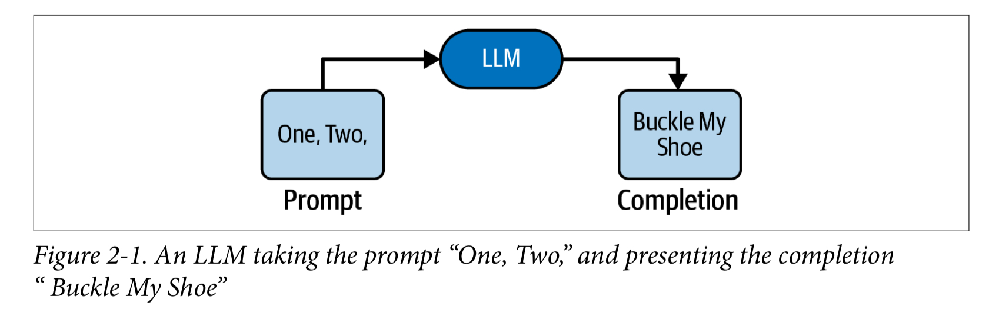
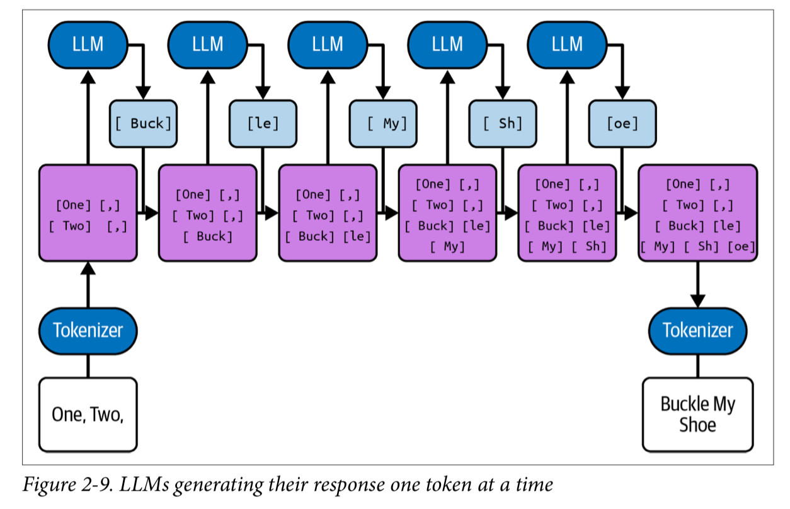
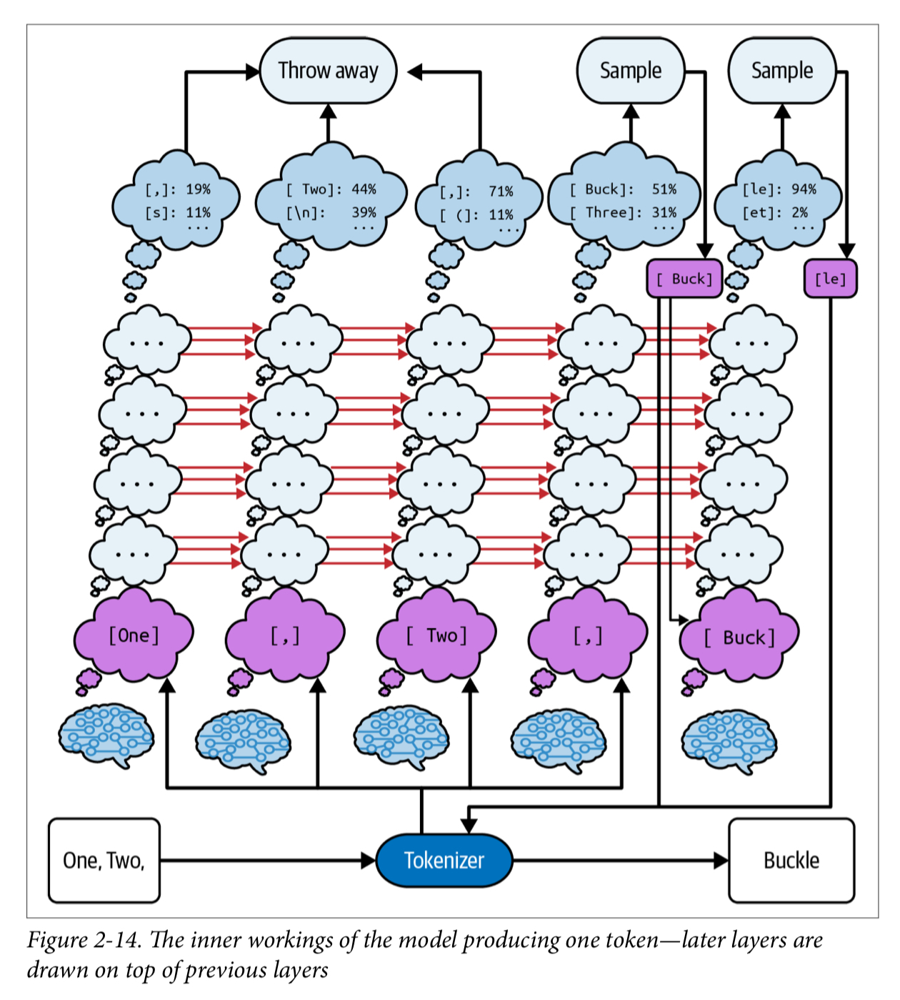
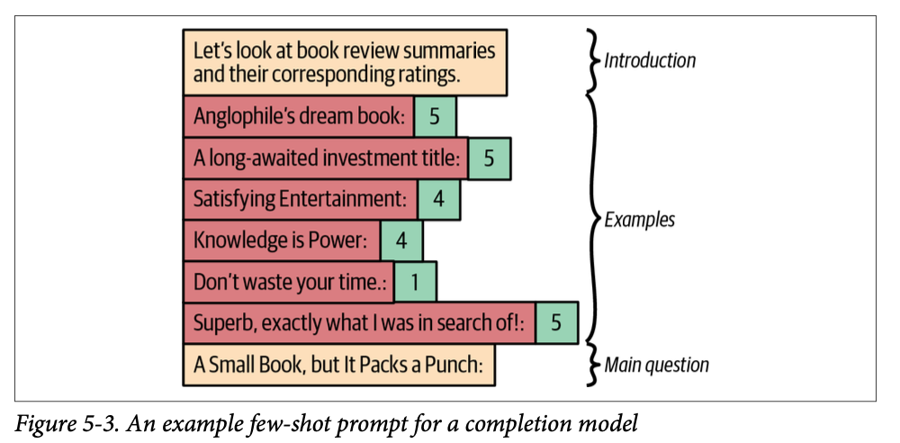
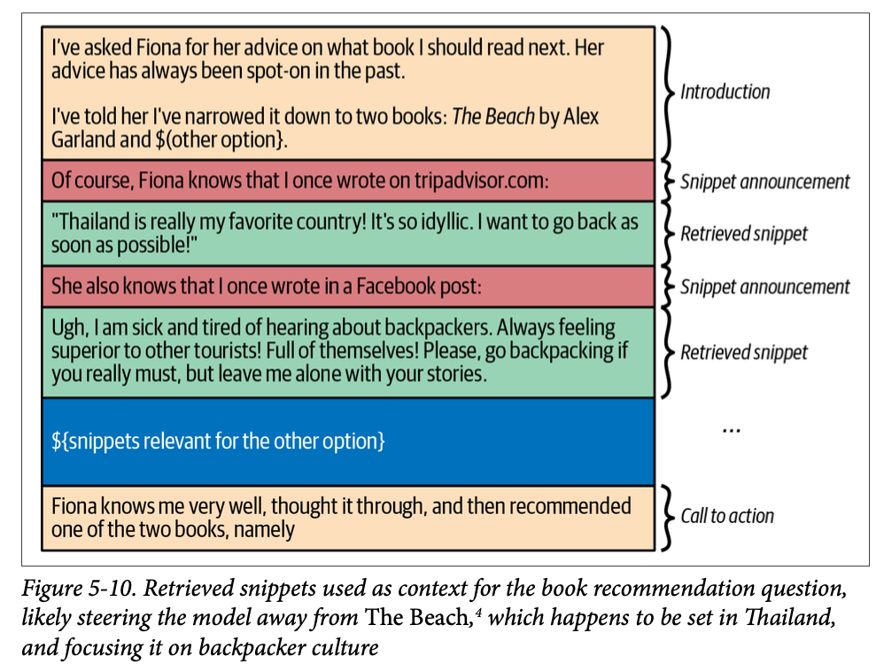
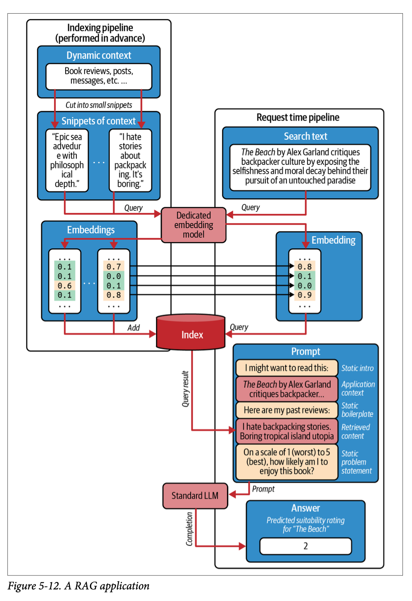
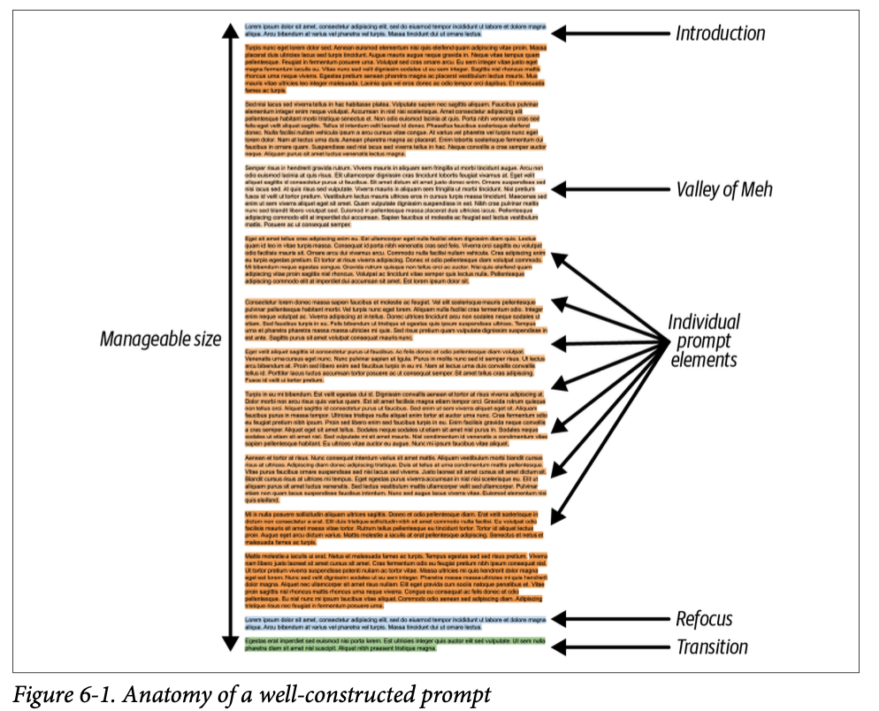
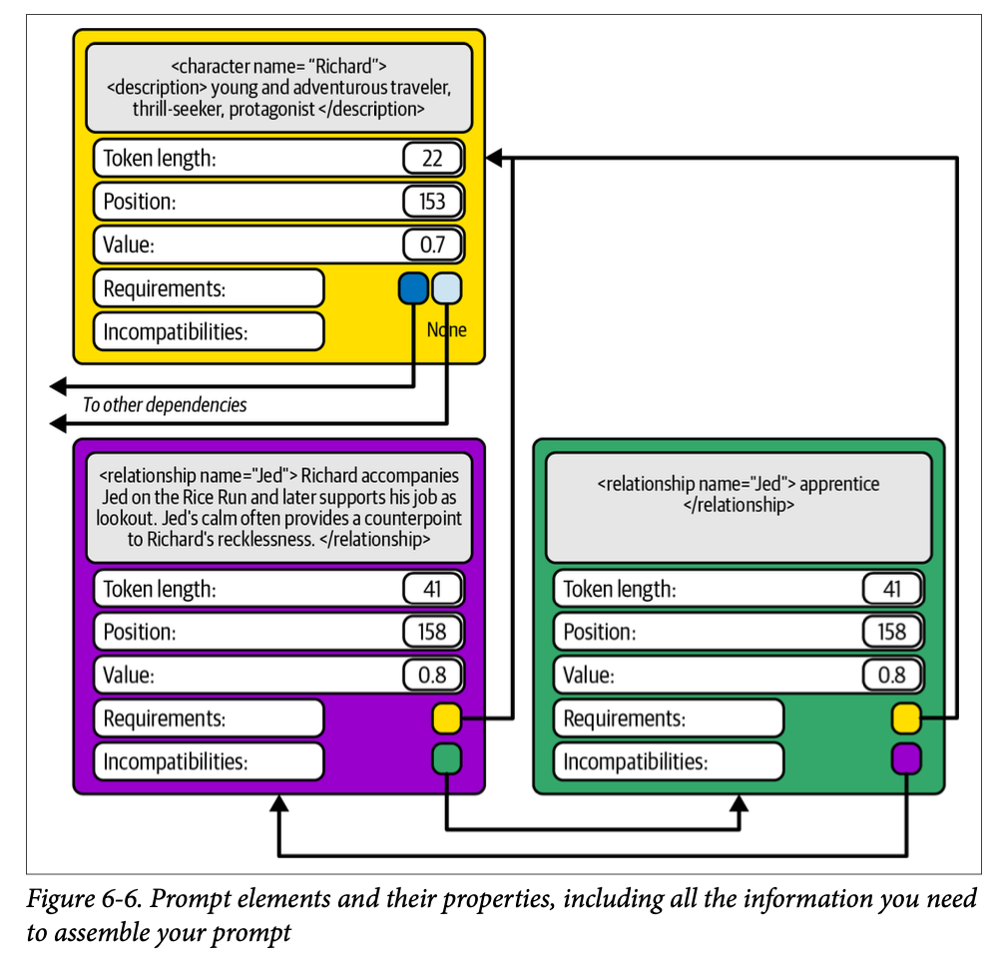

{"title":"読書メモ: Prompt Engineering for LLMs","date":"2025-04-21T19:30:00+09:00","tags":["book"]}

<div class="amazlet-box" style="margin-bottom:0px;"><div class="amazlet-image" style="float:left;margin:0px 12px 1px 0px;"><a href="http://www.amazon.co.jp/exec/obidos/ASIN/B0DM3VLNSK/pleasesleep-22/ref=nosim/" name="amazletlink" target="_blank"></a></div><div class="amazlet-info" style="line-height:120%; margin-bottom: 10px"><div class="amazlet-name" style="margin-bottom:10px;line-height:120%"><a href="http://www.amazon.co.jp/exec/obidos/ASIN/B0DM3VLNSK/pleasesleep-22/ref=nosim/" name="amazletlink" target="_blank">Prompt Engineering for LLMs: The Art and Science of Building Large Language Model–Based Applications (English Edition)</a></div><div class="amazlet-detail">英語版  John Berryman (著), Albert Ziegler (著)  形式: Kindle版<br/></div><div class="amazlet-sub-info" style="float: left;"><div class="amazlet-link" style="margin-top: 5px"><a href="http://www.amazon.co.jp/exec/obidos/ASIN/B0DM3VLNSK/pleasesleep-22/ref=nosim/" name="amazletlink" target="_blank">Amazon.co.jpで詳細を見る</a></div></div></div><div class="amazlet-footer" style="clear: left"></div></div>

GitHub Copilot 開発者らによる、プロンプトエンジニアリングの本。プロンプトエンジニアリングと言うと、ChatGPT に投げる文言を工夫するテクニックのようなイメージだったが、そうではなく LLM をベースとしたアプリケーション開発全般を指している。LLM がどのような仕組みで動作しているのかをアプリケーション開発者の視点から概説したあとは、アプリケーションの実装方法について背景となる理論を踏まえて解説してくれる。

Cline や Cursor を始めコーディングエージェントが台頭し、実際の普段の業務で利用されるようになってきた。ただその内部構造がブラックボックスで、課題感を感じていた。LLM アプリケーションに対するメンタルモデルが出来上がっていないので、Cline のソースコードや各 LLM プラットフォームの API ドキュメントを見ても、いまいち掴みどころを持てていいなかった。

新しいツールや概念がどんどん出てくる中で、それらの情報に踊らされる、ただ表面を追うだけで時間を浪費させられてしまうことに危機感を持った。特に AI 関連は第一印象でどうしても「驚いて」しまうので、今までの新技術より「踊らされる」リスクが高い。

こうした背景の上で、いわゆる機械学習等のバックグラウンドがないソフトウェアエンジニアの立場から、こうした LLM アプリケーションの内部のメンタルモデルを構築するのに、この本はうってつけだった。現状ある製品をあくまでツールとして、あくまでブラックボックスとして使うだけなら不要だが、内部構造をある程度理解したい場合は非常に良い本だと思う。

なおもうすぐ和訳も出るようなので、そちらを待っても良いかもしれない。

<div class="amazlet-box" style="margin-bottom:0px;"><div class="amazlet-image" style="float:left;margin:0px 12px 1px 0px;"><a href="http://www.amazon.co.jp/exec/obidos/ASIN/4814401132/pleasesleep-22/ref=nosim/" name="amazletlink" target="_blank"></a></div><div class="amazlet-info" style="line-height:120%; margin-bottom: 10px"><div class="amazlet-name" style="margin-bottom:10px;line-height:120%"><a href="http://www.amazon.co.jp/exec/obidos/ASIN/4814401132/pleasesleep-22/ref=nosim/" name="amazletlink" target="_blank">LLMのプロンプトエンジニアリング —GitHub Copilotを生んだ開発者が教える生成AIアプリケーション開発</a></div><div class="amazlet-detail">John Berryman (著), Albert Ziegler (著)<br/></div><div class="amazlet-sub-info" style="float: left;"><div class="amazlet-link" style="margin-top: 5px"><a href="http://www.amazon.co.jp/exec/obidos/ASIN/4814401132/pleasesleep-22/ref=nosim/" name="amazletlink" target="_blank">Amazon.co.jpで詳細を見る</a></div></div></div><div class="amazlet-footer" style="clear: left"></div></div>

以下読書メモ:

## I. Foundations

### 1. Introduction to Prompt Engineering

プロンプトエンジニアリングというと、チャット型の LLM に投げる文言を工夫するテクニックという先入観があった。一方でこの本では、LLM をベースにしたアプリケーション全般を対象にしている。アプリケーションはプロンプトの構築や解釈をプログラマティックに行い、今まででは難しかった高度なタスクを遂行できるようになる。

- > at the core, LLMs are simply models that predict the next word in a block of  text—that’s it and nothing more!
    - 本質的には、LLM は単にテキスト内の次の単語を予測するモデルで、それ以上でも以下でもない
    - 抽象化すればスマホ IME の予測変換と変わらない
- LLM に至る道のり
    - 自然言語処理のマルコフモデル (1984) まで遡ることができる
    - 2014 年: Google より [seq2seq アーキテクチャ](https://arxiv.org/abs/1409.3215) の言語モデル
    - 2015 年: [Soft search](https://arxiv.org/abs/1409.0473)
    - 2017 年: [Transformer アーキテクチャ](https://arxiv.org/abs/1706.03762)
    - 2018 年: [GPT](https://cdn.openai.com/research-covers/language-unsupervised/language_understanding_paper.pdf)
    - 2019 年: GPT-2
        - GPT と比較し、[トレーニングセットのサイズを桁違いに増やすだけで性能が大幅に上昇](https://cdn.openai.com/better-language-models/language_models_are_unsupervised_multitask_learners.pdf)。特定のタスク専用に fine-tuning したものよりも、トレーニングセットを大きくした汎用モデルのほうが性能で勝った
        - この時点で既に悪意のある利用が懸念されているのも興味深い。
            - > Due to our concerns about malicious applications of  the technology, we are not releasing the trained model.
            - ref. https://openai.com/index/better-language-models/
    - 2020 年: [GPT-3](https://arxiv.org/abs/2005.14165)
        - プロンプトによって出力を調整できることが発見され、prompt engineering という概念が生まれた
- Prompt Engineering
    - 前述のように LLM はあるテキストから残りを補完するモデルである。達成したい課題に対処するために入力テキストを工夫するのが、最もシンプルな形態のプロンプトエンジニアリング
    - 一方で単一のプロンプトにとどまらず、プロンプトの構築と解釈をプログラムから行う、LLM ベースのアプリケーションの構築もプロンプトエンジニアリングの範疇
        - 最もシンプルなものは、入力に微細な変更を加えただけでほぼそのままモデルに渡すもの。一般的な Chat UI は ChatML のような形式への変換は行うがそれは薄いもので、Copilot の簡単な補完もほぼそのまま入力を受け渡している
        - 次のレベルでは、ユーザーの入力を変換・補強したうえでモデルに渡すもの。例えば Copilot で関連するコードを添えて LLM に渡し、補完の精度を上げるようなもの
        - 更に進むと、モデルとのやりとりがステートフルに、つまりこれまでのやりとりを保持しながら行うものになる。モデルが処理できるコンテキストにはサイズの限界があるので、コンテキストの管理が必要になる
        - 最終的には LLM アプリケーションがエージェントとして、外界とやりとりしながらタスクを実行するものを見ていく

### 2. Understanding LLMs

LLM の基本的な仕組み。LLM は学習セットにあるテキストを模倣する。一度に一つのトークンを処理している。以前のトークンを編集するような事はできない。
LLM の仕組みを概観し、LLM の利用時にどのような特性があるかを知る。

- LLM とは何か。上段から見ていく
- 最もハイレベルでは、LLM はテキストをプロンプトとして受け取り、出力として入力を確率的に補完しテキストを完成させる
    - 
    - 事前に大量のドキュメント (換言するとただのテキスト) で学習している。本、フォーラムの書き込み、論文、ソースコード、etc。そこから模倣した、新しいテキストを返すことができる
    - トレーニングセットにあるテキストから確率的に補完をしているだけなので、事実ではない補完 (ハルシネーション) が起こる
- LLM はテキストをトークンに分割して扱う
    - トークンは 3, 4 文字程度のチャンク
        - 例: [Tokenizer \- OpenAI API](https://platform.openai.com/tokenizer)
    - 人間は単語単位で認識するが、LLM はトークン単位。この間にはいくつか違いがある
        - Tokenizer は決定的
        - トークンより細かい単位での操作が難しい。例えば `one example` を `eno elpmaxe` に変換してといってもうまくできない事が多い。あるいは `Sw から始まるヨーロッパの国は?` と聞いても、`Sweden` のトークンが `Sw` で切られていなければうまく答えられない。トークンを最小単位とした操作なら可能
        - 文字の表記を認識できない。例えばあるテキストを全て大文字にするタスクに失敗する。LLM にとって小文字のトークンと大文字のトークンは大きな違いで、人間のように `a` は `A` の別形式であると認識しているわけではない
    - トークン数はモデルの利用にかかる金額や、扱えるトークン数上限などに関わるため、プロンプトエンジニアリングとしてはよく意識する必要がある
        - 多くのモデルは英語に最適化されているので、英語のほうがトークン長が効率的。反対にランダムな文字列などは効率が悪い
- LLM は複数のトークンから、次の 1 トークンを補完している
    - 最も可能性が高い 1 トークンを補完し、それを入力として次のトークンを補完する (自己回帰)
        - 
    - 一度補完したトークンに遡って訂正したりはできない。一定の補完をしたあとに間違いに気づいた場合、それをリカバーするのはアプリケーション側の役割になる
    - 補完は複数の候補から確からしいものを選択している
    - 多くのモデルは logprobs と temperature というパラメータを持っている。logprobs は次のトークンの確率分布を返す。temperature は確率分布の平坦さを調整するパラメータで、0 は最も確からしいトークンを選択する。1 はトレーニングセットの確率分布と同じ選択をする。1 以上の場合、よりランダムな選択になる
        - 正確さを重視する場合は小さく、出力のバリエーションを増やしたい場合は大きくするなど、それぞれのユースケースがある
- LLM はトランスフォーマーアーキテクチャをベースにしている
    - 複数の `小さな脳` が集まって全体を構成している
    - 各 `小さな脳` はそれぞれ、テキストの中のひとつのトークンを処理する。またテキスト中の自分の位置も知っている。それぞれの `小さな脳` はレイヤーと呼ばれる複数のステップで計算をしている
    - `小さな脳` は左 (ここまでのテキスト) の情報から予測し、それ (中間状態) を右 (これからのテキスト) に伝える
        - 計算は常に左から右へ行われており、これ以外の経路はない
    - そのため、プロンプトエンジニアリングの観点では、プロンプトに記載する情報の順序が非常に重要になる。
    - 

### 3. Moving to Chat

ここまでは最もベースとなる、テキストの補完を行う LLM を見てきたが、ここではそれをチャット形式で利用する方法を見ていく。RLHF という方式でベースのモデルに fine tuning していき、ChatGPT などで見慣れたチャットができる能力を施していく。

- [RLHF](http://arxiv.org/pdf/2203.02155) (Reinforcement Learning from Human Feedback, 人間のフィードバックによる強化学習)
    - ベースモデル (テキスト補完だけしかできない) に RLHF を適用し、チャット形式でのやりとりを可能にする
        - あわせて、[役に立ち・正直で・無害 (Helpful, Honest, Harmless - HHH)](https://arxiv.org/abs/2203.02155) という 3 つの基準を満たすようにする
    - 順序
        - まずはベースモデルに fine-tuning を行い、SFT (supervised Fine-Tuning) model と呼ばれる中間モデルを作成する
            - ユーザーとアシスタント間のチャット形式の (HHH な) やりとりをトレーニングセットとして与える
                - GPT-3 の場合 13,000 件のやり取りを与えた
        - SFT を高い temperature で呼び出し、生成された複数パターンのテキストを人間が評価しランク付けする
        - SFT の生成とその評価結果を評価関数として、強化学習を行う
            - 報酬モデルを作成しそれで強化学習を繰り返すことで、人手で評価したものではカバーしきれない量の学習を行う
- Instruction model
    - RLHF が施されたこの時点のモデルは instruction modelと呼ばれる。ベースモデルが入力からの補完だけを行うのに対して、人間とアシスタントとのやりとりを学習した instruction modelは質問に対して回答を行うことができるようになった
        - 例えば `What is a good indoor activity for a family of four? ` というプロンプトに対して、ベースモデルは続きの文章を生成する。instruction modelは質問とみなして回答を生成する
    - ここで、ユーザーがこのプロンプトに対して補完を求めているのか、解答を求めているのか確実に判断できないという問題が残る
- ChatML
    - ここでは OpenAI が開発したフォーマットを扱う。後述例のように簡単なタグで明示できるようになっている
    - トランスクリプトとしてプロンプトを定義できるようになる。またシステムプロンプトでロールを定義できる
    - ChatML フォーマットを RLHF fine tuningしたものが chart model となる
    - 実際にプロンプトエンジニアが直接 ChatML を記述することはない。例えば OpenAI API では、ロールでシステムやユーザーを明示して呼び出す。裏側で内部的に ChatML が利用されている

```
<|im_start|>system  You are a sarcastic software assistant. You provide humorous answers to  software questions. You use lots of emojis.<|im_end|>
<|im_start|>user  I was told that my computer would show me a funny joke if I typed :(){ :|:&};:  in the terminal. Why is everything so slow now?<|im_end|>
<|im_start|>assistant  I personally find the joke amusing. I tell you what, restart your computer  and then come back in 20 minutes and ask me about fork bombs. |im_end|>
<|im_start|>user  Oh man.<|im_end|>
<|im_start|>assistant  Jokes on you, eh?  <|im_end|>
```

- Chat model であることで、ベースの補完モデルに劣後する部分もある
    - HHH なレスポンスにチューニングされているので、その分解答の質が下がる可能性がある
    - 丁寧なレスポンスのため前置きなどが入り、解答そのものを取り出す手間が増える
    - オリジナルのトレーニングセットには、丁寧なものであれ無礼なものであれ、あらゆる文章が含まれている。HHH に従うようチューニングされたモデルでは、後者が出づらくなる
    - ChatML であれ、あくまでも (このフォーマットに fine tuning された) モデルが、テキストを補完しているだけだ、という視点は改めて忘れないようにすると良い

### 4. Designing LLM Applications

LLM アプリケーションの全体像。LLM アプリケーションはユーザーのタスクを変換し、モデルからの解答を変換して返すループを繰り返す。特に前者には情報の収集や優先度付けも必要になる。

- LLM Application はユーザーの問題領域と LLM のドメインとの変換レイヤー
- ループ構造
    - 
    - アプリケーションはユーザーの課題を変換し LLM に入力する。LLM からの出力を変換しユーザーに返す。このフローを問題解決まで繰り返す
    - ループはまずユーザーの問題から始まり、次にアプリケーションはそれをモデルのドメインに変換する。このときアプリケーションは次の要件を満たすプロンプトを作成する必要がある
        - トレーニングセットのコンテンツによく似ている (赤ずきんの原理) 
        - 問題解決に必要なすべての情報が含まれている (情報の収集、選別) 
        - 問題を解決する補完をするようモデルを導く
        - 補完が自然なところで終了する
    - 次は作成したプロンプトを LLM に渡し結果を受け取る。ここではモデルの選択 (品質、コスト、レイテンシ) や fine tuningの有無が検討事項になる
    - 最後に受け取った結果を変換しユーザーに返す
- ユーザーの課題をモデルのドメインに変換するステップ feed forward pass を詳しく見る
    - 
        - 必要な情報 (コンテキスト) を収集する
        - 収集したコンテキストをスニペットに分割する
        - スニペットにスコアを付け、選別する
        - 最終的なプロンプトを成形する
    - 次のような難しさ、複雑さが発生する
        - 状態管理 (コンテキスト管理) 。”記憶” を引き継ぐ
        - 外部の情報の取得
        - 深い推論をさせる (chain of thoughtsを促すなど) 
        - ツールの利用を通した外界とのインタラクション
- 性能の評価
    - オフライン評価
        - 事前に性能を評価する。アプリケーションによっては簡単ではない。例えば Copilot のようなコード補完エージェントの場合は、生成されたコードをテストして評価できる
    - オンライン評価
        - ユーザーからの評価 (自動収集されるテレメトリも含む) 
        - ChatGPT のサムズアップ、ダウンボタンがわかりやすい例。Copilot の場合候補が選択されたかどうかなど、より暗黙的な指標の方が良い

## II. Core Techniques

### 5. Prompt Content

Feed forward pass の第一段階である、プロンプトへの情報追加について。プロンプトのボイラープレートのような静的なコンテンツと、外部情報を取得するような動的なコンテンツに大別できる。

- 静的コンテンツ
    - プロンプトの定型テンプレートに、モデルが従うべきルールなどを記載する。プロンプトの明確化のためのもの
        - 例えば [Bing chat はこのようなものを使っていると解析された](https://arstechnica.com/information-technology/2023/02/ai-powered-bing-chat-spills-its-secrets-via-prompt-injection-attack/)
        - 指示のコツは、否定形ではなく肯定形で、理由を付与する、絶対的な言い方を避ける
        - ただモデルが常にこれに従ってくれるとは限らない
    - [Few-shot prompting](https://arxiv.org/abs/2005.14165)
        - いくつかの例を与えることで、モデルに期待する出力の形式を示す
            - 
        - 以下の欠点がある
            - 多くのコンテキストを含めるには、例の羅列という方法では長くなりすぎる。回答フォーマットの例示としての用途が良い
            - 例の内容によって補完内容にバイアスがかかる。
                - 例えば本のレビューをしたい場合、few shot として「本A: 1, 本B: 2, 本C: 1」と与えると、モデルは「本D: 1」(実際は 5 だったとしても) といったように、与えた例に従った補完をする
                - このようなケースでは、できるだけ実際の確率分布に従った例を与える必要がある (簡単ではないが)
                - 一方でエッジケースの明示には効果的
            - 意図しないパターンに LLM が従ってしまう。
                - 例えば「本A: 1, 本B: 2, 本C: 3」と与えた場合、モデルは単に昇順にしたスコアで「本D: 4」と補完してしまう可能性がある。また例の最初に典型例、後に例外や特殊例を与えると、モデルは直近の例を強く評価し、悲観的な補完をする傾向がある
                - バイアスを避けるために、例として何をどんな順で乗せるかは簡単ではない。[DSPy](https://github.com/stanfordnlp/dspy) という手法も考案されている
- 動的コンテンツ
    - 関連のある情報を収集する。静的コンテツとは違い、レイテンシ、準備のしやすさ (preparability, その情報の取得が簡単か・困難か)、比較可能性 (情報は多く収集しあとからトリアージするが、その際に他の情報と比較できなければいけない)
    - どのような情報を集めるべきかは、開発者による発想が求められる部分。考えの助けになるフレームワークは、マインドマップ、あるいは「ユーザーとの近さ」x「変化の多さ」の 2 次元にマッピングするなど
    - [RAG (Retrieval-Augmented Generation)](https://arxiv.org/abs/2005.11401)
        - トレーニングセットには存在しない情報を付与するためのパターン
        - 無関係な情報を含めないように注意しないといけない (チェーホフの銃の誤謬)。コンテキストサイズが大きくても、無関係な情報を含めてしまうと、モデルはそれを考慮して補完を行い、精度が下がる
            - 
        - Lexical retrieval
            - チェーホフの銃の誤謬を避ける軽量な方法。検索クエリと取得結果に登場する単語の出現率に基づく類似度でスコアを付ける。スコアの低いものを除く
                - Stopword (一般的な単語) を除外し、Stemming (語幹を抽出) し、ジャッカード係数でスコアを付ける。TF-IDF や BM25 などを利用する発展系もある
            - NLP で昔から使われている手法なので、一般的な NLP のライブラリには実装されている
        - Neural retrieval
            - 単に単語の出現頻度による類似度ではなく、より意味を考慮した類似度の計算を行う。embedding model を用いてテキストをベクトルに変換し、その距離で類似度を計算する。距離の計算はユークリッド距離やコサイン類似度などでよい
            - 検索対象は事前に embedding model でベクトル化しておく必要がある (簡単には OpenAI のツールを用いても可能)。計算結果は一般的に Vector Storage と呼ばれる DB に格納される。検索クエリも同様にベクトル化し、Vector Storage に問い合わせる
            - 
        - Neural retrieval が必ずしも常にベストチョイスなわけではない。Lexcical retrieval は枯れた技術で、Elasticsearch などの成熟したツールがすでにあり、問題時のデバッグや手動でのチューニングはしやすい。一方で意味的なマッチをしたい場合 (別言語間の類似度や、画像の類似度など) は Neural retrieval でないと実現できない
    - 要約
        - 長いコンテキストは要約する必要がある。テキストの要約は LLM が得意なタスク
        - 例えば本全体を要約する必要がある場合、段落 => 章 => 全体のように、段階的に要約していくと良い。ソースコードの場合は個別のファイル => ディレクトリ => プロジェクト全体、など

### 6. Assembling the Prompt

前章で集めたコンテンツをどのように構成し、どのようにトリアージし、最終的なプロンプトに仕上げるのかを見ていく。プロンプトの最終形は導入・本文・リフォーカス・移行からなる。ドキュメントには会話形式、分析レポート、構造化ドキュメントの 3 種類がある。本文にどう情報を組み込むかは、各構成要素の依存関係や重要性などを基にした最適化問題になる。

- Anatomy of the Ideal Prompt (理想的なプロンプトの構成)
    - 
    - 導入 (Introduction)
        - プロンプトの目的、文脈を明確化する
    - 本文 (プロンプト要素の列)
        - 紹介文にプロンプトの各要素が続く。ここで LLM には以下の傾向があることに注意する
        - [In-context learning](https://arxiv.org/abs/2302.11042)
            - プロンプトの最後に近いほど、モデルへの影響が高くなる
        - [The lost middle phenomenon](https://arxiv.org/abs/2307.03172)
            - モデルはプロンプトの最初と最後を簡単に思い出せるが、真ん中の部分はそうではない
        - これらの特徴から、プロンプトの特に前半中間にある内容が効果的に使われないという、The Valley of Meh と呼ばれる現象が起こる。これを防ぐ方法はない
    - リフォーカス (Refocusing)
        - LLM に本題を思い出させるためのもの。プロンプト全体が長いときほど効果的
    - 移行 (Transition)
        - これまでのコンテキストの説明を終え、問題解決を行うよう促すもの。プロンプトの最後に加える
- ドキュメントの形式
    - 赤ずきんの原理に基づき、プロンプトはトレーニングセットにある文章に似ている方がよい。それを踏まえ、ここでは典型的なドキュメントの形式を見ていく
    - 会話形式
        - 2 人の会話形式。1 人 (ユーザー) は何らかの助けを求め、もう 1 人 (モデル) はそれ助ける。
        - 自然で、複数回のやり取りも扱うことができ、実世界との統合もしやすい
    - 分析レポート
        - 大学や企業で報告されるようなレポート形式。
        - 通常は Markdown 形式が推奨される。トレーニングセットに最も多く含まれており、必要な機能がシンプルに備わっている
        - 目次をつけるのも効果的。モデルの注意を適切に引き、Chain of Thoughts を促す
    - 構造化ドキュメント (The Structured Document)
        - Python スクリプト、小さな React アプリ、マーメイド記法で作図された図式、SVG など、構造を持つもの
        - 特定の形式を強制し、モデルの出力を扱いやすくする
- スニペットのフォーマッティング
    - 動的に得られた情報をプロンプトに組み込む際、上記の形式に沿った自然なものにする

        ```
        # 会話形式の場合の例
        User: What's the weather like?
        Assistant: It's going to be {{ weather["description"] }} with a temperature of {{ weather["temperature"] }} degrees.
        ```

    - Elastic Snippets
        - ひとつの情報をスニペットにするとき、長さが違う複数のバージョンを用意しておく。コンテキストウィンドウのサイズにあわせて、その中のどれを使うかを決定する
- プロンプト要素の関係
    - 各プロンプト要素をどう配置するか。位置、重要性、依存関係をもとに決定する
    - 位置
        - 時系列や因果関係などが壊れないように配置する
    - 重要性
        - 重要な要素に多くのトークンを割り当てるのか、そうでないものを多く割り当てるのかのトレードオフ
        - 前提として、すべての要素が同じ尺度でスコアリングされている必要がある
    - 依存関係
        - Requirement (必要条件。ある要素が他の要素に依存している) と Incompatibility (非互換性。ある要素が他の要素と同時に存在できない) の 2 つの関係がある
    - 
- ここまで来ると、最終的なプロンプトの作成は、最適化問題になる
    - 依存関係とプロンプトのの長さの制約の中で、価値を最大化するようなプロンプトを作成する
    - 線形プログラミングや 0-1ナップサック問題などに似ているが、独自のソリューションが必要になることが多い
    - 最初はナイーブな方法から始めて発展させていく

### 7. Taming the Model

ここまででプロンプトの作成ができるようになったので、次はモデル自体に関わるトピックを扱う。logprobs を用いてアプリケーションを工夫することができる。モデル選択の判断軸。Fine tuning をするかどうか、する場合でも、より軽量な手法もある。

- 理想的な補完の構造
    - 
    - 前文 (preamble)
        - RLHF が丁寧なやりとりをする場合の前置きや免責事項など。結果をアプリケーションが解釈する際に邪魔にもなりやすい (システムプロンプトである程度は抑制できる) 
        - 一方で Chain of thoughts で推論を行う場合、前文が長い方がより良い出力になることが多い
    - 認識できる開始と終了
        - モデルのアウトプットをプログラムで解釈するためには、モデルの補完結果部分の開始と終了が認識できないといけない。例えばマークダウンの場合はセクション記法など、ドキュメントの形式によって異なる
    - 追記 (postscript)
        - 前文同様にこちらも不要なのでなくしたいことが多い。プロンプトで抑制するのも良いが、モデルによっては stop sequence に対応しているものもある。streaming で接続している場合は、必要なアウトプットの終了を認識できた時点で生成をストップさせると良い
- logprobs を活用する
    - 出力の確信度に基づいたアクションを行う。例えば、一定の確度以上の場合にだけユーザーに提示する、一定の確度以下の場合リトライしたり、別のモデルに切り替えるなど
    - モデルに何らかの分類、例えば「この文面はプロフェッショナルに書かれていますか」、をさせる場合、その度合いを logprobs を用いて定量的に判定する
    - プロンプト (入力側) のエラー検知。モデルによっては `echo` という、プロンプトを含めてレスポンスしてくれるものもある。この場合プロンプトの logprobs も確認できる。例えばタイプミスがあった場合、そのトークンだけ logprobs が非常に低くなったりする
- モデルの選択
    - 以下の軸で検討すると良い
        - 性能 (intelligence) 
        - レイテンシ
        - コスト
        - 使いやすさ
            - GPU 配置の可変性、モデルのデプロイ、クラッシュ時のリスタート、キャッシュ機能などの有無
        - 機能
            - ツール機能があるか、logprobs を返すかなど
        - その他
            - OSS でなければならない。特定のデータ所在地でなければならないといった、特殊な要件
    - 小さく始めるには商用の LLM-as-a-service から始めるのが速い。発展に応じて OSS モデルに切り替えることもあり得る
    - 十分な性能のモデルよりも、良いモデルで開発を進めると良い。新しいモデルが出ると、過去のものは値下げされる
- Fine tuning
    - fine tuning を行うべきかどうかは、まずはそのトレーニングセットがどれだけ入手しやすいかを考えるべき
        - 
    - また fine timing の手法にも段階がある
        - Full fine tuning
            - モデルのすべてのパラメータを継続的にチューニングする
        - Parameter efficient  fine-tuning (PeFT)
            - パラメータの一部をチューニングする。LoRA のような手法が例。Full よりも計算が短い。
            - Full はモデルに新しい知識を教えることができる。LoRA はそうではなく、モデルの前提を調整するイメージ。例えば日本を起点にした旅行アプリの場合、日本をベースにした旅行先を提案するように調整するといった使い方になる
        - Soft prompt
            - Fine tuning をするのではなく soft-prompt, つまりプロンプト側を学習し embedding (ベクトル) を入力として渡す
        - Fine tuning を施した場合でも、赤ずきんの原理に注意する。プロンプトが Fine tuning のデータセットに近いものにしないと、チューニング前の汎用な方のパスに入ることもある

## III. An Expert of the Craft

### 8. Conversational Agency

エージェント型という、現実世界とインタラクションするものについて。

- Tool usage
    - チャットモデルはナレッジカットオフ以降の情報は持っておらず、重要な情報を見逃したり、不得意なタスク (特に数学) がある。また実際に現実世界に作用  (メールを送る、など) をすることもできない。こうした限界を克服するために、ツールを利用する
    - 2023 年 6 月に OpenAI はツール呼び出し用に fine tuning された新しいモデルを導入。その後、他の競合もそれに追随した
    - OpenAI を例にした実装例
        - function の定義をする

            ```python
            # get_room_temp, set_room_temp の実装は既にあるとする
            tools = [
                {
                    "type": "function",
                    "function": {
                        "name": "get_room_temp",
                        "description": "Get the ambient room temperature in Fahrenheit",
                    },
                },
                {
                    "type": "function",
                    "function": {
                        "name": "set_room_temp",
                        "description": "Set the ambient room temperature in Fahrenheit",
                        "parameters": {
                            "type": "object",
                            "properties": {
                            "temp": {
                                "type": "integer",
                                "description": "The desired room temperature in ºF",
                                },
                            },
                            "required": ["temp"],
                        },
                    },
                }
            ]

            available_functions = {
                "get_room_temp": get_room_temp,
                "set_room_temp": set_room_temp,
            }
            ```

        - これを利用し処理する process_message 関数の例

            ```python
            def process_messages(client, messages):
                # Step 1: send the messages to the model along with the tool definitions
                response = client.chat.completions.create(
                    model="gpt-4o",
                    messages=messages,
                    tools=tools,
                )
                response_message = response.choices[0].message

                # Step 2: append the model's response to the conversation
                # (it may be a function call or a normal message)
                messages.append(response_message)

                # Step 3: check if the model wanted to use a tool
                if response_message.tool_calls:
                    # Step 4: extract tool invocation and make evaluation
                    for tool_call in response_message.tool_calls:
                        function_name = tool_call.function.name
                        function_to_call = available_functions[function_name]
                        function_args = json.loads(tool_call.function.arguments)
                        function_response = function_to_call(
                            # note: in python the ** operator unpacks a
                            # dictionary into keyword arguments
                            **function_args
                        )
                        # Step 5: extend conversation with function response
                        # so that the model can see it in future turns
                        messages.append(
                            {
                                "tool_call_id": tool_call.id,
                                "role": "tool",
                                "name": function_name,
                                "content": function_response,
                            }
                        )
            ```

        - 呼び出しとその結果の例

            ```python
            # 呼び出し
            messages = [
                {
                    "role": "system",
                    "content": "You are HomeBoy, a happy, helpful home assistant.",
                },
                {
                    "role": "user",
                    "content": "Can you make it a couple of degrees warmer in here?",
                }
            ]
            client = OpenAI()
            process_messages(client, messages)

            # 結果1。モデルはツールを呼び出し、現在の温度を取得しようとしている。
            [
                {
                    "role": "assistant",
                    "content": None,
                    "tool_calls": [{
                        "id": "call_t7vNPjRlFJ3nKAhdGAz256cZ",
                        "function": {
                            "arguments": "{}",
                            "name": "get_room_temp"
                        },
                        "type": "function",
                    }],
                },
                {
                    "tool_call_id": "call_t7vNPjRlFJ3nKAhdGAz256cZ",
                    "role": "tool",
                    "name": "get_room_temp",
                    "content": "74",
                }
            ]

            # process_message を再度呼んで 1 ステップ進める。
            process_messages(client, messages)

            # 現在温度に応じて温度を変更しようとしている。
            [
                {
                    "role": "assistant",
                    "tool_calls": [{
                        "function": {
                            "name": "set_room_temp"
                            "arguments": "{\"temp\":76}",
                        },
                        "type": "function"
                        "id": "call_X2prAODMHGOmgt523Ob9BIij",
                    }],
                },
                {
                    "role": "tool",
                    "name": "set_room_temp",
                    "content": "DONE"
                    "tool_call_id": "call_X2prAODMHGOmgt523Ob9BIij",
                }
            ]
            ```

    - モデルの内部ではツールは次のように、システムプロンプトでマークダウンと Typescript で定義されている。いずれもトレーニングセットで頻出の形式。また静的型付けもモデルへのよいヒントになる。(ただし OpenAI は内部表現を公開しておらず、著者らの独自調査による内容)。

        ```
        <|im_start|>system
        You are HomeBoy, a happy, helpful home assistant.

        # Tools

        ## functions

        namespace functions {

        // Set the ambient room temperature in Fahrenheit
        type set_room_temp = (_: {
        // The desired room temperature in ºF
        temp: number,
        }) => any;

        } // namespace functions
        <|im_end|>

        // 利用例
        <|im_start|>user
        I'm a bit cold. Can you make it a couple of degrees warmer in here?<|im_end|>
        <|im_start|>assistant to=functions.get_room_temp
        {}<|im_end|>
        <|im_start|>tool
        74<|im_end|>
        <|im_start|>assistant to=functions.set_room_temp
        {"temp": 76}<|im_end|>
        <|im_start|>tool
        DONE<|im_end|>
        <|im_start|>assistant
        The room temperature was 74ºF and has been increased to 76°F.<|im_end|>
        ```

    - ツール定義のガイドライン
        - 適切なツールを選択できるよう、必要なものだけにする。複数のツールがあるとモデルは混乱する。
        - 関数名・変数名などは、名前自体がドキュメントにもなっているような、適切な命名をする
        - ツールの説明文は必要十分に
        - 引数は極力シンプルにする。不要なものは省く。JSON Schema は利用できるが、高度な定義 (min
Items, uniqueItems, minimum, maximum, pattern, format 等) に頼らないほうが良い
        - ツールの返り値には不要なものは含まない。あったら便利かもしれないものを含めるとモデルが混乱する
        - エラーはそのまま帰すのではなく、モデルの視点で活用できるように注意する。バリデーションエラーであれば、その理由と修正してリトライする旨を伝える。
        - 危険な操作には人間の承認を必要とする
- Reasoning
    - モデルの推論能力は、一度に結果を出すのではなく、内部のモノローグを促すことによって強化することができる
    - [Chain of thought](https://arxiv.org/abs/2201.11903)
        - 2022 年の論文 [Chain\-of\-Thought Prompting Elicits Reasoning in Large Language Models](https://arxiv.org/abs/2201.11903) では、モデルに先に理由を述べてから回答を出力するように促すと精度が上がることを実証した。一般的な質問では 69.4% から 75.6%、数学ドメインでは 20 から 60% の改善がみられた
            - 次のような few-shot プロンプトでそれを実現した

            ```
            Q: Do hamsters provide food for any animals?
            A: Hamsters are prey animals. Prey are food for predators. Thus, hamsters
            provide food for some animals. So the answer is yes.

            Q: Yes or no: would a pear sink in water?
            A: The density of a pear is about 0.6g/cm3, which is less than water. Objects
            less dense than water float. Thus, a pear would float. So the answer is no.
            ```

        - その後 [Large Language Models are Zero\-Shot Reasoners](https://arxiv.org/abs/2205.11916) では単に `Let’s think step-by-step,` と付け加えるだけで同様の効果が得られることが示された
        - [Think before you speak: Training Language Models With Pause Tokens](https://arxiv.org/abs/2310.02226) では `pause` トークンを認識できるようモデルを fine tuning し、`pause` トークンを適当に挟むことで、モデルが立ち止まって考えられるようになり、精度が上がることを示した
        - いずれにしても、一度に答えを出すのではなく、内部で考えるように促すことで、推論の精度を上げることができる
    - [ReAct: Iterative Reasoning and Action](https://arxiv.org/abs/2210.03629)
        - モデルに Think-Act-Observe のサイクルを繰り返させることで、より複雑なタスクをこなせるようにする
        - 例えば「雑誌 A と 雑誌 B のどちらが古いか」というタスクを解かせる。ここで以下の Search, Lookup, Finish の 3 つのアクションを定義する

            ```
            Solve a question-answering task with interleaving Thought, Action, and Observation steps.
            Thought can reason about the current situation, and Action can be three types:
            (1) Search[entity], which searches the exact entity on Wikipedia and returns the first paragraph if it exists. If not, it will return some similar entities to search
            (2) Lookup[keyword], which returns the next sentence containing a keyword in the current passage
            (3) Finish[answer], which returns the answer and finishes the task
            Here are some examples.
            ```

        - そのうえで 3,000 程度のサンプルでモデルを fine tuningu すると精度が向上した
            - Search, Lookup ツールで検索するだけでも精度は良かったが、Reasoning を加えることでさらに向上した
            - 上記のプロンプトの下に few-shot を追加するだけではうまくいかず、fine tuning が必要だった
            - 
        - [Plan\-and\-Solve Prompting: Improving Zero\-Shot Chain\-of\-Thought Reasoning by Large Language Models](https://arxiv.org/abs/2305.04091) では次のようなプロンプトを追加し、最初に計画をたててから実行するよう促すだけで、精度が向上することを示した。この手法はツール利用を伴わないシチュエーションでも有効

            ```
            Let’s first understand the problem and devise a plan to solve the problem. Then, let’s carry out the plan and solve the problem step-by-step.
            ```

        - [Reflexion: Language Agents with Verbal Reinforcement Learning](https://arxiv.org/abs/2303.11366) は反対に実行後に結果を振り返るというアプローチをとっている
        - [Branch\-Solve\-Merge Improves Large Language Model Evaluation and Generation](https://arxiv.org/abs/2310.15123) は複数のソルバーに問題を解かせてからマージする
- コンテキスト管理
    - 前までの章の議論に加えて、エージェント型のアプリケーションでのコンテキスト管理について、さらに必要な要件がある
    - コンテキストの収集元が追加される。これまでの会話の履歴、開いているファイルなどの (ユーザーがコピー&ペーストするのではなくエージェントがツールを通じて取得する)、その他ツールを利用して取得した外部の情報など
    - コンテキストのトリアージには、万能な方法はない。
        - 不要なツールは候補から外す
        - 必要なアーティファクトだけを含める
        - アーティファクトのフォーマット (XML, JSON, Markdown など)
        - アーティファクトをどのように提供するか。単に全てを含めても収まるのか、Elastic snippet のような要約が必要か、RAG のような検索システムが必要か
        - 以前の会話をどこまで含めるか

### 9. LLM Workflows

現在の LLM の性能では、汎用性を維持しながら特定の複雑なタスクを確実にこなすことはできない。この章では LLM Workflows という、特定のドメインに特化させて複雑なタスクを遂行できるアプリケーションを見る。タスクをサブタスクに分解し、それをスーパーバイズする。スーパーバイザーは LLM でもそうでないパターンもある。なおここでは Lang‐ Chain, Semantic Kernel, AutoGen, DSPy といった特定のフレームワークの詳細には立ち入らず、概念的な説明を行う。

- このような問題を考える。現在の LLM の性能ではこれを直接遂行するのは難しい
    - 1.人気のあるShopifyストアフロントのリストを生成し、ウェブサイトのHTMLを取得。2.各ストアフロントについて、製品の提供、ブランディング、スタイル、価値などの詳細を抽出。3.各ストアフロントを確認し、そのビジネスに役立つプラグインを考案。4.各ストアフロントオーナーにプラグインコンセプトを宣伝するマーケティングメールを生成。5.メールを送る
    - 必要な web 検索やメール送信といったツールを用意しても、例えば網羅的に `1` のリストアップタスクができる可能性は低い
    - ツール側に要件を満たせるような特殊な実装を多く入れても、コンテキストが大きくなりすぎる、単一の LLM とのやり取りではうまくいかない
- 基本的なワークフロー
    - 全体をサブタスクに分割する。各タスクの入出力を特定する
    - タスクは LLM を使っても使わなくても良い。不必要なのであれば、従来の技術を使って実装した方が安定する。また人間による作業を伴うタスクがあっても良い
    - LLM を使う場合のアプローチ
        - プロンプトのテンプレート。タスクの入力値で埋めてプロンプトが完成する。Lang-Chain はこのアプローチを採用している
        - ツールベースのアプローチ。例えば取得した html から店舗情報や商品情報を抽出するようなタスクは LLM が得意とする。特に入力として html をとるようなツールとして定義すると簡単
        - 複雑な推論では chain of thoughts を促してやる必要がある。OpenAI API であれば、ツール利用をオフにして試行させた上で、ツール利用をオンにして実施させる
        - 出力が正しくないと判定できる場合 (コードが出力ならテストを通すとか、LLM に出力を判断させるとか) 、それを入力にし再度修正を試みる実装もできる。ただし複雑さは大きくなる。
        - ワークフロー全体を構築する前に、個々のタスクの動作が適切か確認評価しておくと良い
    - ここまででタスクの集合が定義できた。各タスクはDAG として表現できる。そしてDAG を管理するのは、従来からの Airflow や Luigi といったツールを利用することができる
        - LLM ベースのタスクの場合、失敗時の再試行が発生することがある。可能ならばこのリトライをタスク内で処理できると、DAG がシンプルになって良い
- 発展系では、タスクのスーパーバイザーを LLM に任せる構成
    - 柔軟性が増える一方、開発の難しさが増える
    - なかでも最もシンプルなものは、各タスクをツールとして、スーパーバイザーのモデルに依頼する形式
    - これを発展させると、各タスクもそれぞれ会話型のエージェントとし、エージェント間のやり取りとしてワークフロー全体が構成される形式
    - さらに進めると、スーパーバイザーのモデルが必要に応じてタスクを生成するという構成もありえる
    - いずれにしてもこの分野はまだまだ安定しておらず、フロンティア

### 10. Evaluating LLM Applications

アプリケーションをどう評価するか。Copilot の開発では最初に評価システムを構築したことでうまくいった。評価方法にはオフライン評価とオンライン評価がある。

- テスト対象
    - 4章の LLM アプリケーションのループ全体のテスト、またはループの各要素の個別のテスト
    - 例えばモデルを切り替えたい場合などは前者で、モデルのパラメータをチューニングしたい場合は後者で評価できると便利
    - 最初に始める際にどちらかだけを選ぶのであれば前者のほうが良い
- オフライン評価
    - Example Suites
        - 実際に使われそうなプロンプトを5-20個ほど準備、それらを自動でアプリケーションに読み込ませ結果を保存、以前のバージョンとの diff をとる
        - いわゆるソフトウエアテストと異なり自動で結果が評価されるのではなく、人間がチェックしやすいだけの仕組み。ただ、全くアプリケーションがない状態でも始められる・結果を確認しながらアプリケーションを作り込めるという大きなメリットがある
        - 複雑なアプリケーションの場合、個別の LLM とのやり取り部分だけに適用しても良い
    - サンプルの収集方法
        - そのタスクがすでに AI に頼らず実施されている (これからそれを AI アプリケーション化する) 場合、それを利用できる可能性がある。ただし現実のサンプルの分布とは離れている可能性はある
        - アプリケーションのリリース後の場合は実際の利用ログが使える場合がある。ただしリリース前には不可能、アプデ後には古いサンプルが無意味化、収集するためのプライバシーなどの整理が必要、生成結果が理想的とは限らないといった注意点がある
        - 自分で、あるいは LLM にサンプルの生成を依頼することもできる。LLM を使う場合は、まずサンプルのカテゴリを洗い出させ、それぞれのカテゴリごとに N 個のサンプルを生成するよう段階を踏むと良い。依然実際のサンプルの分布とはずれる可能性はあ？ことは留意する
    - 生成結果の評価
        - Gold standard
            - Yes/No を回答するものや、複数の選択肢から選ぶようなものなど、理想の回答が確定的に定義できるケース
            - 自由に文章を生成するケースでは、重要な部分文字列を定義してその一致度を測るアプローチをとる
            - あるいはツール利用のエージェントの場合、適切な fiction call ができているかを測る方法もある
        - Functional testing
            - 生成結果が機能するかをテストする。コンパイルが通るか、単体テストをパスするかなど
        - LLM assessment
            - 上記のいずれもが難しい場合、LLM に判断を任せる方法もある
    - SOMA assessment
        - 次の例のように、評価軸とそれぞれの度合いを定義し、LLM に評価させる方法

```
I need your help with evaluating a smart home assistant. I'm going to give you some interactions of that assistant, which you are to grade on a scale of 1 to 5. Grade each interaction for effectiveness: whether the assistant's attempted action would have remedied the user's problem.

Please rate effectiveness on a scale of 1 to 5, where the values mean the

following:
1. This action would do nothing to address the user's problem or might even make it worse.
2. This action might address a small part of the problem but leave the main part unaddressed.
3. This action has a good chance of addressing a substantial part of the problem.
4. This action is not guaranteed to work completely, but it should solve most of the problem.
5. This action will definitely solve the problem completely.

The conversation was as follows:

User: I'm a bit chilly.
Assistant: to functions.set_room_temp {“temp”: 77}

Please provide a thorough analysis and then conclude your answer with "Effectiveness: X," where X is your chosen effectiveness rating from 1 to 5.
```

- オンライン評価
    - A/B テスト
        - スタンダードな方法。評価指標をどのように選ぶかが肝になる
        - いずれにせよオンライン評価はオフライン評価に比べコストも時間がかかるので、オフライン評価も駆使しながらなにを オフライン評価にするかよく検討したほうが良い
        - スタンダード方法なので、既存のソリューションが多くある
    - Metrics
        - 以下に大別できる
            - 直接フィードバック：ユーザーからの直接フィードバック
            - 機能的正確性：アウトプットは機能するか。コンパイルやテストが通るかなど
            - ユーザーの受け入れ：ユーザーは提案に従ったか
            - 達成された影響：ユーザーはどのくらい恩恵を受けるか
        - 例えば ChatGPT のサムズアップ・ダウンボタンは直接フィードバックにあたる。ただしこれはサムズアップされるのは特に優れた提案がされたときが多く、サムズダウンは不満があるときに多く押されるなど、バイアスはある
        - ユーザーの受け入れは、例えば旅行アプリの場合、提案した旅行プランを実際に予約したかどうかなど。可能ならこのような指標を開発できると良い

### 11. Looking Ahead

今後の発展。

- Multimodality
    - テキストだけでなく、画像や音声などのマルチモーダルな情報を扱うことができるようになる
    - 方法の一つは、畳み込みネットワークを使い、画像等を embedding vector に変換。移行はテキストと同様に扱うことができる
    - UIUX の幅が広がる他、LLM のトレーニングセットを大幅に増やせるというメリットもある。テキストだけではトレーニングセットが枯渇すると予想されている
- User Experience and User Interface
    - 現在は会話形式が一般的
    - その発展形としては、例えばペアプログラミングの対象のコードのように、会話の対象物をステートフルなものとして提示しながらやり取りする形式がある
    - Anthropic の Artifact などはこの例になる
- Intelligence
    - 現在のベンチマークでは主要なモデルはほぼ上位スコアに飽和しており、LLM コミュニティはベンチマークのアップデートも積極的に行っている
    - 知識蒸留という、大きなモデルから迅速に小さなモデルの学習を進める手法も考えられている
    - トレーニング方法の改善だけではなく、例えば量子化など、アーキテクチャレベルの改善も発展として存在する

<div class="amazlet-box" style="margin-bottom:0px;"><div class="amazlet-image" style="float:left;margin:0px 12px 1px 0px;"><a href="http://www.amazon.co.jp/exec/obidos/ASIN/B0DM3VLNSK/pleasesleep-22/ref=nosim/" name="amazletlink" target="_blank"></a></div><div class="amazlet-info" style="line-height:120%; margin-bottom: 10px"><div class="amazlet-name" style="margin-bottom:10px;line-height:120%"><a href="http://www.amazon.co.jp/exec/obidos/ASIN/B0DM3VLNSK/pleasesleep-22/ref=nosim/" name="amazletlink" target="_blank">Prompt Engineering for LLMs: The Art and Science of Building Large Language Model–Based Applications (English Edition)</a></div><div class="amazlet-detail">英語版  John Berryman (著), Albert Ziegler (著)  形式: Kindle版<br/></div><div class="amazlet-sub-info" style="float: left;"><div class="amazlet-link" style="margin-top: 5px"><a href="http://www.amazon.co.jp/exec/obidos/ASIN/B0DM3VLNSK/pleasesleep-22/ref=nosim/" name="amazletlink" target="_blank">Amazon.co.jpで詳細を見る</a></div></div></div><div class="amazlet-footer" style="clear: left"></div></div>

<div class="amazlet-box" style="margin-bottom:0px;"><div class="amazlet-image" style="float:left;margin:0px 12px 1px 0px;"><a href="http://www.amazon.co.jp/exec/obidos/ASIN/4814401132/pleasesleep-22/ref=nosim/" name="amazletlink" target="_blank"></a></div><div class="amazlet-info" style="line-height:120%; margin-bottom: 10px"><div class="amazlet-name" style="margin-bottom:10px;line-height:120%"><a href="http://www.amazon.co.jp/exec/obidos/ASIN/4814401132/pleasesleep-22/ref=nosim/" name="amazletlink" target="_blank">LLMのプロンプトエンジニアリング —GitHub Copilotを生んだ開発者が教える生成AIアプリケーション開発</a></div><div class="amazlet-detail">John Berryman (著), Albert Ziegler (著)<br/></div><div class="amazlet-sub-info" style="float: left;"><div class="amazlet-link" style="margin-top: 5px"><a href="http://www.amazon.co.jp/exec/obidos/ASIN/4814401132/pleasesleep-22/ref=nosim/" name="amazletlink" target="_blank">Amazon.co.jpで詳細を見る</a></div></div></div><div class="amazlet-footer" style="clear: left"></div></div>
