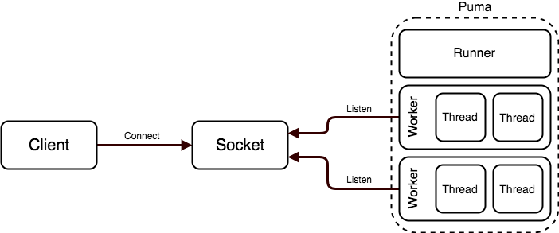

{"title":"ActiveRecord の Schema Cache と運用 Tips","date":"2022-04-11T22:30:00+09:00","tags":["rails"]}

Rails を使っているプロジェクトを運用していて、ActiveRecord の Schem Cache まわりでいくつかつまずいた部分があった。コードを置いながら挙動の確認したのと、踏んだ問題それぞれとの関係を整理したので個人的な覚書としてメモ。

## Schema Cache

ActiveRecord はモデル (= テーブル) の定義を知っていてそれを元に ORM のいろいろな機能を提供している。例えば次のようにテーブルのカラムの情報を取得できる。

```ruby
[1] pry(main)> User.columns_hash.keys
=> ["id",
 "name",
 ...]
[2] pry(main)> User.columns_hash["id"]
=> #<ActiveRecord::ConnectionAdapters::MySQL::Column:0x000055c1ef6ec420 @collation=nil, @comment=nil, @default=nil, @default_function=nil, @name="id", @null=false, @sql_type_metadata=#<ActiveRecord::ConnectionAdapters::SqlTypeMetadata:0x000055c1ef6ec9e8 @limit=8, @precision=nil, @scale=nil, @sql_type="bigint(20)", @type=:integer>>
[3] pry(main)> User.columns_hash["created_at"]
=> #<ActiveRecord::ConnectionAdapters::MySQL::Column:0x000055c1ef6ff728 @collation=nil, @comment=nil, @default=nil, @default_function=nil, @name="created_at", @null=false, @sql_type_metadata=#<ActiveRecord::ConnectionAdapters::SqlTypeMetadata:0x000055c1ef710280 @limit=nil, @precision=0, @scale=nil, @sql_type="datetime", @type=:datetime>>
```

ActiveRecord はデータベースを正として扱う設計思想になっていて、定義情報が必要になった際にデータベースに問い合わせている。例えば MySQL の場合 [SHOW FULL COLUMNS (FIELDS)](https://dev.mysql.com/doc/refman/8.0/en/show-columns.html) クエリを [発行する](https://github.com/rails/rails/blob/main/activerecord/lib/active_record/connection_adapters/abstract_mysql_adapter.rb#L840)。

もちろん SHOW COLUMNS を毎回投げているわけではなく、適当な粒度で取得した結果をメモリにキャッシュしている。この仕組みはざっくり二段階に分かれている。

- [ActiveRecord::ModelSchema](https://github.com/rails/rails/blob/main/activerecord/lib/active_record/model_schema.rb)
    - モデルごとにカラム定義情報などを管理しているクラスで、上記の `columns_hash` などのメソッドも提供している
    - はじめてそのモデルを利用した際に定義情報がなければ取得しさらにキャッシュもしている
    - 実際の定義情報の取得は後述の SchemaCache クラスに移譲している
    - SchemaCache から取得したデータは [@columns_hash](https://github.com/rails/rails/blob/8f39fbe18a57ae74513edc8561c00a369fe10f08/activerecord/lib/active_record/model_schema.rb#L570) にキャッシュしている
- [ActiveRecord::ConnectionAdapters::SchemaCache](https://github.com/rails/rails/blob/8f39fbe18a57ae74513edc8561c00a369fe10f08/activerecord/lib/active_record/connection_adapters/schema_cache.rb#L7)
    - 定義情報を実際にデータベースに問い合わせて管理しているクラス
    - [コネクションプールに紐付いて](https://github.com/rails/rails/blob/8f39fbe18a57ae74513edc8561c00a369fe10f08/activerecord/lib/active_record/connection_adapters/abstract/connection_pool.rb#L14) いて [connection.schema_cache](https://github.com/rails/rails/blob/8f39fbe18a57ae74513edc8561c00a369fe10f08/activerecord/lib/active_record/model_schema.rb#L568) などというふうにアクセスできる
    - 実際のクエリは各データベースアダプターに移譲されて、例えば MySQL の場合は `AbstractMysqlAdapter` が [SHOW FULL FIELDS 文を発行](https://github.com/rails/rails/blob/8f39fbe18a57ae74513edc8561c00a369fe10f08/activerecord/lib/active_record/connection_adapters/abstract_mysql_adapter.rb#L839) している
    - 取得した情報は [`@columns_hash`、`@columns`、`@primary_keys`](https://github.com/rails/rails/blob/8f39fbe18a57ae74513edc8561c00a369fe10f08/activerecord/lib/active_record/connection_adapters/schema_cache.rb#L41-L45) といったハッシュにキャッシュしている
        - ModelSchema とは異なりこのハッシュに全テーブルのデータをキャッシュしている

ModelSchema が `@columns_hash` を取得する処理は Mutex で保護されている。複数のスレッドが同時並行でひとつのモデルにアクセスした際に `SHOW COLUMNS` が複数飛んでしまうのを防いでいるのだと思われる。

- ModelSchema の columns_hash はまず [Mutex#synchronize](https://github.com/rails/rails/blob/8f39fbe18a57ae74513edc8561c00a369fe10f08/activerecord/lib/active_record/model_schema.rb#L551) でロックを獲得してからスキーマ情報の取得を開始する
- mutex はクラス内の [@load_schema_monitor](https://github.com/rails/rails/blob/39b7bf7a00fd7abc339573a9f5b62cf0db7a8a9b/activerecord/lib/active_record/model_schema.rb#L535-L537) という単位で共有されているので、この変数を使うプロセス単位でロックがとられることになる
- `@columns_hash` にキャッシュした後は [@schema_loaded フラグが立てられ](https://github.com/rails/rails/blob/8f39fbe18a57ae74513edc8561c00a369fe10f08/activerecord/lib/active_record/model_schema.rb#L556)、次回からは [ロックを取らずに](https://github.com/rails/rails/blob/8f39fbe18a57ae74513edc8561c00a369fe10f08/activerecord/lib/active_record/model_schema.rb#L550) すぐに [@columns_hash](https://github.com/rails/rails/blob/8f39fbe18a57ae74513edc8561c00a369fe10f08/activerecord/lib/active_record/model_schema.rb#L408) が返されるようになる

ここまでで、「モデル x プロセス」の単位でキャッシュやロックを行っていることがわかる。ただそれでも、一般的なWebサーバは複数プロセス x 複数スレッドの構成なのでサーバプロセスの再起動時にクエリが集中しがちになったり、また [このクエリ自体のコストも高い](https://kirshatrov.com/posts/schema-cache/) ので、事前にスキーマ情報をファイルに dump しておきデータベースへの動的なアクセスを防ぐ仕組みも準備されている。

- [rails schema:cache:dump](https://github.com/rails/rails/blob/39b7bf7a00fd7abc339573a9f5b62cf0db7a8a9b/activerecord/lib/active_record/railties/databases.rake#L500-L514) コマンドで [スキーマ情報をファイルに保存](https://github.com/rails/rails/blob/39b7bf7a00fd7abc339573a9f5b62cf0db7a8a9b/activerecord/lib/active_record/connection_adapters/schema_cache.rb#L172-L182) する
- [config.active_record.use_schema_cache_dump](https://edgeguides.rubyonrails.org/configuring.html#config-active-record-use-schema-cache-dump) が true の場合 (デフォルトは true)、Rails 起動時にファイルから読み込んで [connection.schema_cache にそれをセット](https://github.com/rails/rails/blob/39b7bf7a00fd7abc339573a9f5b62cf0db7a8a9b/activerecord/lib/active_record/railtie.rb#L170) している

まとめると、運用上大事になってくるのが以下のポイントだと思う。

- ActiveRecord はモデルの定義をデータベースに問い合わせる設計思想
- Mutex やキャッシュで不要なクエリを削減しているが、これは「モデル」x「プロセス」の単位で共有されている
- データベースには問い合わせずファイルから読み込む仕組みも提供されている

以上をふまえて、ここからは運用時につまづいたケースを記載する。

## カラム削除時の ignored_columns

カラムを DROP した際にスキーマキャッシュにその情報が残っていると、ActiveRecord はそのカラムがある前提のクエリをデータベースに投げてしまいエラーになることがある。もしかすると Rails あるあるだったかもしれないが、知らずにつまづいてしまった。

例えば次のようなケース。

- あるテーブル X のカラム A をテーブルから削除する
- 事前にアプリケーションコードから `A` を利用している箇所を削除しデプロイ
- その後カラムを DROP したところ `Mysql2::Error: Unknown column 'A' in 'field list'` のようなエラーが発生した

明示的にカラム `A` を使用していなくても、例えば eager_load などがスキーマキャッシュの情報をもとに暗黙的に `SELECT X.A AS t0_r0, ...` のようなクエリを発行することがある。自分の場合はプロジェクトで使用している [activerecord-import](https://github.com/zdennis/activerecord-import) が INSERT 文を組み立てる際に [そのテーブルの全カラムを列挙していた](https://github.com/zdennis/activerecord-import/blob/59dcc29a6205a22579956b98fad8fd131937e315/lib/activerecord-import/import.rb#L139) のでこのエラーを踏んでしまった。

対策としては [ignored_columns](https://api.rubyonrails.org/classes/ActiveRecord/ModelSchema/ClassMethods.html#method-i-ignored_columns) に削除予定のカラムを先に指定しておけばよい。データベースから取得した絡む情報から [指定したカラムを除いて @columns_hash を組み立てて](https://github.com/rails/rails/blob/39b7bf7a00fd7abc339573a9f5b62cf0db7a8a9b/activerecord/lib/active_record/model_schema.rb#L569) くれる。その後に ALTER をすることで安全にカラムを削除できる。

## Replication lag

primary - replica 構成を取っている場合、レプリケーションラグで古いスキーマ情報を replica から取得してしまい、アプリケーションがエラーになってしまうケース。自分が直接踏んだわけではないが、チームでシェアされていたものが参考になったので記載しておく。

- サイズが大きいテーブルにカラム追加を行う ALTER を発行し、その後新カラム X を参照するコードをデプロイした
- ALTER の時点で大きめのレプリケーションラグが発生していた
- その間に SHOW FULL FIELDS を replica へ発行したプロセスのスキーマキャッシュには新カラム X は含まれておらず、参照しようとした際に `NoMethodError (undefined method X=...` といったエラーが発生した

前述のように ModelSchema は `connection` に `SHOW FULL FIELDS` クエリの実行を移譲するが、その際にどの connection を使うかは特に指定していない。今回の場合 [database_selector](https://guides.rubyonrails.org/active_record_multiple_databases.html#activating-automatic-role-switching) を有効化していたので、例えば GET リクエストの場合は replica (reading role) が選択され、`SHOW FULL FIELDS` もそちらに飛んでいた。

対策としては、短期的には DDL の変更中は primary だけを参照するようなオペレーション手順にすることがまず思いつく。ただ手順が複雑に、リリース時間が長期化してしまうので、より中長期的な踏み込んだ対策をするのであれば、`schema:cache:dump` を利用する方式に変更する、アプリケーションとデータベースの間にプロキシレイヤーを挟む構成に変更すると言った方法も考えられる。

## DB インスタンス不調時のロック待ちタイムアウト

複数の replica DB がある構成で、ひとつの replica インスタンス X が不調になりフェイルオーバーした。アプリケーションから見ると、データベースへの操作が即座に失敗はしないが非常に遅いという状態が数分間続いていた。このとき遅延の影響が X だけに閉じず、それ以外のレプリカや primary へクエリしている api でもタイムアウトが頻発した。

他の DB インスタンスへの接続にまで影響が広がってしまったのが想定外だったが、原因は ModelSchema の Mutex だった。前述のように ModelSchema がスキーマ情報を参照する際に、「モデル x プロセス」単位でロックを取る。障害期間中は SHOW FULL FIELDS のレスポンスが非常に遅くなっており、あるスレッドがとったロックを他のスレッドが長期間待つことになり、多くタイムアウトしてしまっていた。

前提として自分のプロジェクトでは Web サーバとして puma を利用している。puma は複数のプロセス (worker) とその配下に複数のスレッド (worker thread) を持つ [構成](https://github.com/puma/puma/blob/master/docs/architecture.md) だが、同じプロセス内のスレッド間で Mutex を共有するので、同じ worker でのまだキャッシュされていない同じモデルへの操作がすべてタイムアウトする状況だった。

<figure>

<figcaption>puma の architecture.md より引用</figcaption>
</figure>

対策としては、データベースの接続設定を点検したところタイムアウトの設定が甘い部分があったので、まずはこれらをしっかり設定しておく対応を進めている。例えば [connect, read, write timeout](https://github.com/ankane/the-ultimate-guide-to-ruby-timeouts#activerecord) や [max_execution_time](https://github.com/ankane/the-ultimate-guide-to-ruby-timeouts#mysql) がしっかり効くことで、障害時にクエリがより速く失敗し、影響範囲の広がりを抑えられる。

また [semian](https://github.com/Shopify/semian) のようなサーキットブレイカーを導入することで、より「速く失敗する」ことができるようになる。他の DB インスタンスでのタイムアウトを減らす効果が期待できる。今回のような「すぐに失敗せず遅くなる」といった事象はまさにサーキットブレイカーのユースケースだと思う。タイムアウト見直しとこのサーキットブレイカー導入は、今回の事象に限らず汎用的に有用なものなので、基本的な対策としてやっておくと良さそうに思っている。

その上で今回の事象に特価した対策になるが、もちろん `schema:cache:dump` を導入することで、少なくとも今回のような Mutex でのロック待ちは回避できる。またアプリケーションとデータベースとの間の Proxy などのレイヤーで不調なインスタンスを外すような構成変更も有効だと思う。

## PR

<div class="amazlet-box" style="margin-bottom:0px;"><div class="amazlet-image" style="float:left;margin:0px 12px 1px 0px;"><a href="http://www.amazon.co.jp/exec/obidos/ASIN/4297114623/pleasesleep-22/ref=nosim/" name="amazletlink" target="_blank"></a></div><div class="amazlet-info" style="line-height:120%; margin-bottom: 10px"><div class="amazlet-name" style="margin-bottom:10px;line-height:120%"><a href="http://www.amazon.co.jp/exec/obidos/ASIN/4297114623/pleasesleep-22/ref=nosim/" name="amazletlink" target="_blank">パーフェクト Ruby on Rails 【増補改訂版】 (Perfect series)</a></div><div class="amazlet-detail">すがわらまさのり  (著), 前島真一  (著), 橋立友宏 (著), 五十嵐邦明  (著), 後藤優一 (著)<br/></div><div class="amazlet-sub-info" style="float: left;"><div class="amazlet-link" style="margin-top: 5px"><a href="http://www.amazon.co.jp/exec/obidos/ASIN/4297114623/pleasesleep-22/ref=nosim/" name="amazletlink" target="_blank">Amazon.co.jpで詳細を見る</a></div></div></div><div class="amazlet-footer" style="clear: left"></div></div>
