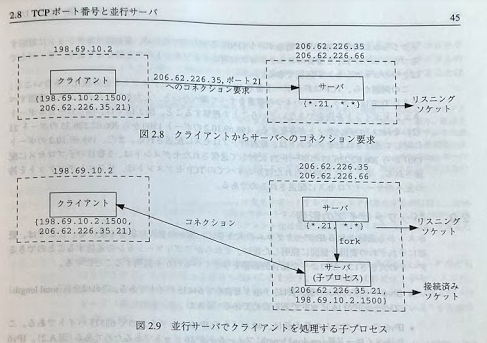

{"title":"開発環境の rails server はデフォルトで localhost を bind している","date":"2021-03-12T00:01:00+09:00","tags":["nix"]}

VirtualBox (Vagrant 経由) 上で Rails アプリを立ち上げたところ (`$ rails server`)、ホスト側から通信できなかった。
development 環境で `rails server` コマンドを実行すると、デフォルトで localhost に bind して接続を待ち受けるらしく、これが原因だった。
`-b` オプションで `0.0.0.0` などにバインドしてサーバを起動すれば解決する。

```
$ rails server -h
...
  -b, [--binding=IP]                           # Binds Rails to the specified IP - defaults to 'localhost' in development and '0.0.0.0' in other environments'.
```

自分の場合は VirtualBox だったが、例えば Docker コンテナ上などでも同じことは起こる。現象からまずはゲスト OS やコンテナ側の設定 (ポートフォワードの設定など) を先に疑いがちなので、ちょっとハマってしまった。たぶん "あるある" なハマりどころな気はする。

以下は、せっかくなのでこのへんをもうちょっと深堀りしたメモ。

## 今回のケースの再確認

- VirtualBox (Vagrant 経由) 上の Ubuntu 20.04 環境で rails のサーバを開発用に立ち上げた

```
# こんな感じ。オプションは何もなし

$ rails s
=> Booting Puma
=> Rails 6.1.3 application starting in development
=> Run `bin/rails server --help` for more startup options
Puma starting in single mode...
* Puma version: 5.2.2 (ruby 3.0.0-p0) ("Fettisdagsbulle")
*  Min threads: 5
*  Max threads: 5
*  Environment: development
*          PID: 815476
* Listening on http://127.0.0.1:3000
* Listening on http://[::1]:3000
Use Ctrl-C to stop
```

- ホスト側からのリクエストが到達しなかった

```
$ curl 'http://127.0.0.1:5000'
curl: (56) Recv failure: Connection reset by peerp

# なおゲスト側からのリクエストは当然通る
$ curl -v http://127.0.0.1:3000
...
< HTTP/1.1 200 OK
```

- Vagrantfile のポートフォワード設定などを疑ったが、開発サーバが 127.0.0.1 を待ち受けているのが問題だった
- `rails s -b 0.0.0.0` などと `0.0.0.0` をバインドすることで解決

## ソケットプログラミングレベルでの再確認

<figure>

<figcaption><a href="https://www.amazon.co.jp/exec/obidos/ASIN/4894712059/pleasesleep-22/ref=nosim/">UNIXネットワークプログラミング〈Vol.1〉</a>の p45 から引用</figcaption>
</figure>

- ここでの `{*.21, *.*}` という記法はソケットペアを表している
    - 第一要素が自ホスト側、第二要素が相手側で、それぞれドット区切りで ip とポート番号。`*` はワイルドカード
- サーバは 2 つの IP アドレスを持っている
    - 箱の上に書いてある `206.62.226.35` `206.62.226.66` がそれを表現している
- サーバ側のリスニングソケットが指定した 21 番ポートで接続を待ち受けている
    - この例ではサーバ側のポートだけを指定し、あとはワイルドカード指定になっている
        - `{*.21, *.*}`
    - サーバはどのインタフェースから来た 21 番ポートへの接続でもうけつけるし、クライアントの ip, ポート を制限しない
    - 具体的には bind 呼び出し時、ip アドレス指定部分に `INADDR_ANY` を指定するとワイルドカード扱いになる
        - [ip\(7\) \- Linux manual page](https://man7.org/linux/man-pages/man7/ip.7.html)
- 接続要求を受け付けると接続済みソケットを生成する
    - サーバ側のソケットペアは、`{206.62.226.35.21, 198.69.10.2.1500}` となっている

今回の Rails のケースでは、リスニングソケットの自ホスト側の ip (この例では `*` になっている部分) が localhost だったため、ゲスト側からの接続を受け付けなかった。

## 127.0.0.1 (localhost) と 0.0.0.0

man にはこのように記載されていた。

[ip\(7\) \- Linux manual page](https://man7.org/linux/man-pages/man7/ip.7.html)

> There are several special addresses: INADDR_LOOPBACK (127.0.0.1) always refers to the local host via the loopback device; INADDR_ANY (0.0.0.0) means any address for binding;

- `0.0.0.0` は前述の INADDR_ANY 用の特別なアドレス
    - bind でのワイルドカード用
    - `any address for binding`
- なおこちらは言うまでもないが `127.0.0.1` `INADDR_LOOPBACK` はローカルホスト用ということもここに記載があった

wikipedia にも同様の記載。

[0\.0\.0\.0 \- Wikipedia](https://en.wikipedia.org/wiki/0.0.0.0)

> A way to specify "any IPv4 address at all". It is used in this way when configuring servers (i.e. when binding listening sockets). This is known to TCP programmers as INADDR_ANY. (bind(2) binds to addresses, not interfaces.)

## 試してみる

### デフォルトでの `rails server`

- わかりやすいように puma のワーカー、スレッド数を 1 にして、オプションなしで起動
    - そもそもこの時点で明確に `Listening on http://127.0.0.1:3000` というログが出ている

```sh
$ RAILS_MAX_THREADS=1 WEB_CONCURRENCY=1 rails s
=> Booting Puma
=> Rails 6.1.3 application starting in development
=> Run `bin/rails server --help` for more startup options
[170796] Puma starting in cluster mode...
[170796] * Puma version: 5.2.2 (ruby 3.0.0-p0) ("Fettisdagsbulle")
[170796] *  Min threads: 1
[170796] *  Max threads: 1
[170796] *  Environment: development
[170796] *   Master PID: 170796
[170796] *      Workers: 1
[170796] *     Restarts: (✔) hot (✔) phased
[170796] * Listening on http://127.0.0.1:3000
[170796] * Listening on http://[::1]:3000
[170796] Use Ctrl-C to stop
[170796] - Worker 0 (PID: 170832) booted, phase: 0
```

- strace してみる
    - 127.0.0.1 で bind している様子がみえた

```sh
$ sudo RAILS_MAX_THREADS=1 WEB_CONCURRENCY=1 strace -t -f -e trace=network /home/vagrant/.rbenv/shims/rails s
...
[pid 170917] 07:25:01 socket(AF_INET, SOCK_STREAM|SOCK_CLOEXEC|SOCK_NONBLOCK, IPPROTO_TCP) = 13
[pid 170917] 07:25:01 setsockopt(13, SOL_SOCKET, SO_REUSEADDR, [1], 4) = 0

# 127.0.0.1 で bind して、それを listen している (fd 13 番)
[pid 170917] 07:25:01 bind(13, {sa_family=AF_INET, sin_port=htons(3000), sin_addr=inet_addr("127.0.0.1")}, 16) = 0
[pid 170917] 07:25:01 listen(13, 4096)  = 0
```

- `ss`
    - `127.0.0.1:3000` で `LISTEN` 状態な様子が確認できた

```sh
$ ss -na | grep 3000
tcp                LISTEN              0                    1024                                                                           127.0.0.1:3000                              0.0.0.0:*
tcp                LISTEN              0                    1024                                                                               [::1]:3000                                 [::]:*
```

### `-b 0.0.0.0`

- `rails s -b 0.0.0.0` で起動して見る
    - `Listening on http://0.0.0.0:3000` というログが出る

```sh
$ RAILS_MAX_THREADS=1 WEB_CONCURRENCY=1 rails s -b 0.0.0.0
=> Booting Puma
=> Rails 6.1.3 application starting in development
=> Run `bin/rails server --help` for more startup options
[169815] Puma starting in cluster mode...
[169815] * Puma version: 5.2.2 (ruby 3.0.0-p0) ("Fettisdagsbulle")
[169815] *  Min threads: 1
[169815] *  Max threads: 1
[169815] *  Environment: development
[169815] *   Master PID: 169815
[169815] *      Workers: 1
[169815] *     Restarts: (✔) hot (✔) phased
[169815] * Listening on http://0.0.0.0:3000
[169815] Use Ctrl-C to stop
[169815] - Worker 0 (PID: 169849) booted, phase: 0
```

- 今度は `0.0.0.0` で bind している様子が見える

```sh
$ sudo RAILS_MAX_THREADS=1 WEB_CONCURRENCY=1 strace -t -f -e trace=network /home/vagrant/.rbenv/shims/rails s -b 0.0.0.0
...
[pid 170457] 07:22:35 socket(AF_INET, SOCK_STREAM|SOCK_CLOEXEC|SOCK_NONBLOCK, IPPROTO_TCP) = 13
[pid 170457] 07:22:35 setsockopt(13, SOL_SOCKET, SO_REUSEADDR, [1], 4) = 0
[pid 170457] 07:22:35 bind(13, {sa_family=AF_INET, sin_port=htons(3000), sin_addr=inet_addr("0.0.0.0")}, 16) = 0
[pid 170457] 07:22:35 listen(13, 4096)  = 0
```

- `ss` でも確認

```sh
2021-03-08 07:26 vagrant@ubuntu-focal workspace main$ ss -na | grep 3000
tcp                LISTEN              0                    1024                                                                             0.0.0.0:3000                              0.0.0.0:*
```

### ホスト OS 側からの通信を受け持つインタフェースを指定してみる

そんなことをして意味があるかわからないけど、ワイルドカードではなく、具体的なインタフェースを指定しても通信できるか試してみた。

- `ip` コマンドで `enp0s3` というインタフェース、ip は `10.0.2.15` ということを調べる

```
$ ip -4 a
1: lo: <LOOPBACK,UP,LOWER_UP> mtu 65536 qdisc noqueue state UNKNOWN group default qlen 1000
    inet 127.0.0.1/8 scope host lo
       valid_lft forever preferred_lft forever
2: enp0s3: <BROADCAST,MULTICAST,UP,LOWER_UP> mtu 1500 qdisc fq_codel state UP group default qlen 1000
    inet 10.0.2.15/24 brd 10.0.2.255 scope global dynamic enp0s3
       valid_lft 86260sec preferred_lft 86260sec
3: docker0: <NO-CARRIER,BROADCAST,MULTICAST,UP> mtu 1500 qdisc noqueue state DOWN group default
    inet 172.17.0.1/16 brd 172.17.255.255 scope global docker0
       valid_lft forever preferred_lft forever
```

- `10.0.2.15` をバインドして起動

```
$ rails s -b 10.0.2.15
=> Booting Puma
=> Rails 6.1.3 application starting in development
=> Run `bin/rails server --help` for more startup options
Puma starting in single mode...
* Puma version: 5.2.2 (ruby 3.0.0-p0) ("Fettisdagsbulle")
*  Min threads: 5
*  Max threads: 5
*  Environment: development
*          PID: 171868
* Listening on http://10.0.2.15:3000
Use Ctrl-C to stop
```

- ホスト側からのリクエストが通った

```
Started GET "/" for 10.0.2.2 at 2021-03-08 07:30:12 +0000
...
```

## Docker のチュートリアルでも `-b 0.0.0.0` を案内していた

[Quickstart: Compose and Rails \| Docker Documentation](https://docs.docker.com/compose/rails/) に `CMD ["rails", "server", "-b", "0.0.0.0"]` という記載があった。

## Cannot render console from x.x.x.x! Allowed networks: 127.0.0.0/127.255.255.255, ::1

今回とは別件だが、サーバ側でリクエストを受けた際にこういうログが出ている。

```
Started GET "/" for 10.0.2.2 at 2021-03-11 14:18:38 +0000
Cannot render console from x.x.x.x! Allowed networks: 127.0.0.0/127.255.255.255, ::1
```

これは [web console](https://github.com/rails/web-console) という機能がデフォルトでは 127.0.0.1 しか許可していないせいらしい。

`config/environments/development.rb` などで `config.web_console.permissions = '192.168.0.0/16'` などと指定すれば解決する。

- [rails/web\-console: Rails Console on the Browser\.](https://github.com/rails/web-console#configweb_consolepermissions)

経緯はよくわからないが、`allowed_ips` `whitelisted_ips` という設定名でもよいらしい。

- もともと `whitelisted_ips` => `permissions` に変更しつつ、後方互換性のため `whitelisted_ips` も維持 => 昨今の運動もあり `whiltelisted_ips` を `allowed_ips` に変更 (でも古い方もまだ維持してる)、という感じなんだろうか。
    - [Use config\.web\_console\.allowed\_ips by JuanitoFatas · Pull Request \#291 · rails/web\-console](https://github.com/rails/web-console/pull/291)
    - [web\-console/railtie\.rb at 167c2402aed90f4b4934b04a3ef2ed14034e9f1c · rails/web\-console](https://github.com/rails/web-console/blob/167c2402aed90f4b4934b04a3ef2ed14034e9f1c/lib/web_console/railtie.rb#L66-L69)

## 参考

- [ip\(7\) \- Linux manual page](https://man7.org/linux/man-pages/man7/ip.7.html)
- [rails/web\-console: Rails Console on the Browser\.](https://github.com/rails/web-console)

<div class="amazlet-box" style="margin-bottom:0px;"><div class="amazlet-image" style="float:left;margin:0px 12px 1px 0px;"><a href="http://www.amazon.co.jp/exec/obidos/ASIN/4894712059/pleasesleep-22/ref=nosim/" name="amazletlink" target="_blank"></a></div><div class="amazlet-info" style="line-height:120%; margin-bottom: 10px"><div class="amazlet-name" style="margin-bottom:10px;line-height:120%"><a href="http://www.amazon.co.jp/exec/obidos/ASIN/4894712059/pleasesleep-22/ref=nosim/" name="amazletlink" target="_blank">UNIXネットワークプログラミング〈Vol.1〉ネットワークAPI:ソケットとXTI</a></div><div class="amazlet-detail">W.リチャード スティーヴンス (著), W.Richard Stevens (原著), 篠田 陽一 (翻訳)<br/></div><div class="amazlet-sub-info" style="float: left;"><div class="amazlet-link" style="margin-top: 5px"><a href="http://www.amazon.co.jp/exec/obidos/ASIN/4894712059/pleasesleep-22/ref=nosim/" name="amazletlink" target="_blank">Amazon.co.jpで詳細を見る</a></div></div></div><div class="amazlet-footer" style="clear: left"></div></div>
