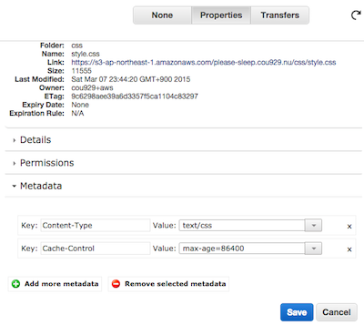

{"title":"S3 のオブジェクトごとに Cache-Control を設定する","date":"2015-03-08T00:39:45+09:00","tags":["nix"]}

S3 上のオブジェクトはオブジェクトごとに Cache-Control ヘッダの設定ができる。

やり方は簡単で、S3 の Web UI から対象のオブジェクトを選び、`Properties` の `Metadata` から `Cache-Control` のキーを追加すれば良い。

キャッシュさせたくない場合は `no-cache, no-store`、させたい場合は `max-age=86400` などと指定すれば良い。

もちろん API や aws-cli からも設定できる。[こちら](http://dev.classmethod.jp/cloud/aws/edit-s3-cache-control-onliner/) ではバケットのすべてのオブジェクトの `Cache-Control` を設定するワンライナーが紹介されていて便利だ。

その他には、[Bucket Explorer]() というサードパーティの S3 クライアントは [バケットごとの `Metadata` のデフォルト値が設定できるよう](http://www.bucketexplorer.com/documentation/amazon-s3--metadata-http-header-bucket-default-metadata.html) で、こちらも便利そうだ。

travis-ci の `deploy` 経由で S3 に上げる場合は、`.travis.yml` の `deploy` ディレクティブに `cache_control` というキーを指定すれば設定できる。

    deploy:
      provider: s3
      ..
      cache_control: "max-age=31536000"

[Travis CI: S3 Deployment](http://docs.travis-ci.com/user/deployment/s3/#HTTP-cache-control)

### 関連

- [ブラウザキャッシュのまとめ - Please Sleep](http://please-sleep.cou929.nu/browser-caching-tutorial-memo.html)
