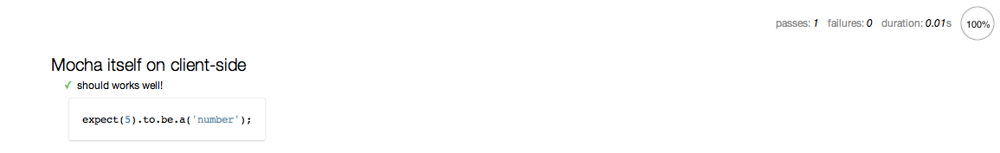

{"title":"tddjs 12 章を mocha で写経","date":"2012-02-25T00:18:00+09:00","tags":["javascript"]}

表題のとおり.

<iframe src="http://rcm-fe.amazon-adsystem.com/e/cm?lt1=_blank&bc1=000000&IS2=1&bg1=FFFFFF&fc1=000000&lc1=0000FF&t=pleasesleep-22&o=9&p=8&l=as4&m=amazon&f=ifr&ref=ss_til&asins=B004519O02" style="width:120px;height:240px;" scrolling="no" marginwidth="0" marginheight="0" frameborder="0"></iframe>
<iframe src="http://rcm-fe.amazon-adsystem.com/e/cm?lt1=_blank&bc1=000000&IS2=1&bg1=FFFFFF&fc1=000000&lc1=0000FF&t=pleasesleep-22&o=9&p=8&l=as4&m=amazon&f=ifr&ref=ss_til&asins=4048707868" style="width:120px;height:240px;" scrolling="no" marginwidth="0" marginheight="0" frameborder="0"></iframe>

[Test-Driven JavaScript Development](http://tddjs.com/)

最終的なコード

- [test.html](https://gist.github.com/1892766)
  - テストのエントリポイントとなる html
- [test.js](https://gist.github.com/1892770)
  - テストコード本体
- [ajax.js](https://gist.github.com/1892773)
  - 今回の開発対象の ajax リクエストを抽象化するライブラリ
- [integration.html](https://gist.github.com/1892779)
  - 結合テスト用の html. 実際に get リクエストを飛ばす
- [successful_get_test.js](https://gist.github.com/1892784)
  - 結合テスト用の js.
- [fragment.html](https://gist.github.com/1892785)
  - 結合テスト用. この html を xhr で取得する.

### 準備

xhr のテストなのでクライアントサイドで動かさないといけない.

html を準備. 公式にサンプルがある.

    <html>
      <head>
        <meta charset="utf-8">
        <title>Mocha Tests</title>
        <link rel="stylesheet" href="https://raw.github.com/visionmedia/mocha/master/mocha.css" />
        
        
        
        
        
        
      </head>
      <body>
        

      </body>
    </html>

必要なスクリプトはリモートのを指してくれている. github 上の js もどうぞ使ってくださいとのことだったので, まずはこのままはじめさせてもらおう.
mocha はテストの外枠 (テストケースをまとめたりいろんなフォーマットで結果を出力したり) を主に扱うフレームワークなので, アサーションなどのローレベルな API は mocha 自体には含まれていない. そのため expect.js もロードしている.
テストコードを呼び出す前に `mocha.setup('bdd')` して, 実行は onload 時に行なっている.

とりあえずうまく動くかだけテストする. test.js を以下にして,

    describe('Mocha itself on client-side', function() {
        it('should works well!', function() {
            expect(5).to.be.a('number');
        });
    });

test.html をブラウザで開くとうまくいった

スタイルがきれいだなー

### XMLHttpRequest オブジェクトを作る (12.3)

本文中にある tddjs オブジェクトの機能については適宜対応することにする. まず本では tddjs というオブジェクトで namespace を切っているが, 今回ははそれにならって tddjs というグローバルオブジェクトのしたに機能をつけていくことにする.

`tddjs.isHostMethod()` は無いので expect の `.to.be.a('function')` で代用する. ajax.js 側で xhr オブジェクトをチェックする際も `tddjs.isHostMethod` を使っているが, ここも簡易に `typeof foo === 'function'` で代用した.

### 要求の発行 (12.4)

ここでのハイライトは xhr obj をスタブでテストしていることだろう. テスト時に動的に関数を書き換えて, API をテストしている. tdd のテストではライブラリの中身まではテストしないのが良いプラクティスらしいので, 同じ API を提供するクラスなりオブジェクトにテストを走らせるときに動的に差し替えてチェックするだけで要件を満たしている. また動的に上書きすることでプロダクションのコードに手を入れずにテストできる. js だとこのへん簡単だけど, かっちりした言語だと, クラスを設計するときもテストしやすさを考慮しないといけなくて大変そうだ.

スタブの基本的な役割として, スタブが提供する擬似 API が呼ばれたかどうかのフラグを持っていて, テストではそれが立っているかどうかをチェックする, というものがあるようだ. また setup で上書き前の関数を退避させておいて, teardown でもとに戻すのも定石っぽい.

setup, teardown は mocha の bdd インタフェースでは `before()`, `after()` という関数で行う. いずれも `done` という関数を引数で受け取るので, 処理が before/after の処理が終了した時点で `done()` をコールしてあげる.

今回は before で `this.ajaxCreate` にもともとの `ajax.create` を逃して, after で復元する. before/after での `this` の実態はよくわからないけど (`context` というオブジェクト?) 少なくとも before と after で同じものが見えているようなのでこのまま使わせてもらう.

またスタブをいちいち手で作るのが面倒なので, 共通処理を抽象化する. ここではまずコールされるとフラグが立つ関数を作成する処理をヘルパー関数 `stabFn()` として定義する.

    function stabFn(return_value) {
        var fn = function() {
            fn.called = true;
            fn.args = arguments;
            return return_value;
        }

        fn.called = false;

        return fn;
    }

ある API 使った戻り値が何らかのオブジェクトで, そのオブジェクトの使い方が正しいかもテストする必要がる. そのため `stabFn()` にそのようなオブジェクトを渡すと, フラグをセットしてそのオブジェクトを返す関数を作ってくれる. `arguments` を `fn.args` に入れているのは, テストしたい関数内部で API を正しい引数でコールできているかチェックするため.

o	実際にテストする際は, 書くテストスイート共通で参照できるコンテキスト (setup や it の中での `this`) に `fake_xhr` オブジェクトを入れておき, 各テストでは `this` の中の偽 xhr オブジェクトを参照することで引数のチェックなどを行なっている.

`this.xhr = Object.create(fake_xhr)` とわざわざ `Object.create()` で偽 xhr オブジェクトをコンテキストに代入しているのは, そうしないと同じオブジェクトの参照を setup (before) 毎に入れてしまうので, 独立してテストを実行できなくなるためかなと予想する.

onreadystatechange のコールバックはスタブでは難しいので, `get()` を読んだあとに手動で `onreadystatechange()` を呼び出すようにしている

### Ajax API の使い方 (12.5)

ここではまず結合テストとして実際に xhr で get リクエストを送ってみている. テストコードは適当な http サーバをローカルに立てて動かしてみる必要あり.

onreadystatechange のところの循環参照を解消するところがよく理解できなかった (TODO)

`file:` スキーマになるようなローカルファイルの読み込みの場合は staus code が 0 になるため, それに対応させる. `requestComplete()` で url スキーマを見てローカルファイルかどうかを判定すれば良い. テストは `isLocal()` という関数のスタブで行う.

気になったのはローカル対応のテストを url に `file:*` な引数を与えずにスタブで行った点だ. `isLocal()` 関数の実装は次のようになっていが

        function isLocal() {
            return !!(window.location &&
                     window.location.protocol.indexOf('file:') === 0);
        }

今回は xhr オブジェクトをスタブですげ替えているので, テスト時に `window.location` がセットされていることはない. よってスタブが必要だったと考えられる.

どこまでをスタブでやるかという線引きを決めるのには経験が必要そうだ. この本から読み取れるポリシーとしては tdd/test first で行う段階ではテストはミニマルに・他のコンポーネントとの結合は最小になるようにしておく, ということが読み取れる. ユニットテストレベルでのテストはできるだけミニマルにし (そのぶん開発を効率良く行える), あとはインテグレーションテストなど外側からのテストを行うのが, コストとリターンのバランスが良いのかもしれない.

紙面では実装は途中までだが, 実用上はさらにヘッダの設定や abort のためのメソッドを追加する必要がある.

### POST 要求を発行する (12.6)

テストは常にメンテナンス剃る必要がある. その際にヘルパー関数をテストコードの中に導入し, 疎結合を保つようにすると, テストコードを変更する際のコストが下がる. しかしこれをやりすぎると一見して何をやっているのかわかりづらくなり, テストのドキュメント側面が損なわれる.

### まとめ

tddjs の 12 章を mocha + expect.js で写経してきた.

本文でも触れられているが, リクエストヘッダの追加や各種バリデーションの昨日は未実装だし, テストも重複が多く見直しが必要な状態だ. しかしテストファーストでコーディングしていくことで, きちんとした単体テストを書く際の出発点としてはかなりいいものができあがる. 細部は足りていないがカバレッジはほぼ 100 % のものができあがるはずなので.

モックとスタブについては後の章でさらに詳しく触れられるそうなので期待. 興味の対象はどこまでをモック・スタブでやるのか と モック・スタブを書くためのテクニックの 2 点. 前者については極端なひとだと今回の `urlParams()` という簡単なユーティリティレベルでもスタブにしてしまうそうだ ("単体" テスト であるということを徹底するため). このへんはやりながら自分にあっているスタイルを確立していく必要がある.

今回やってみて収穫だったのは,

- とにかく単体テストでは外部との依存は疎にして, そこはスタブなどで簡単に済ませる
- 網羅的なテストは tdd でのテストコードを叩きにしてあとでやればよい (し, やる必要がある)

という 2 点が認識できたことだ. ふだんコードを書くときは必ずコンソールなり repl で試行錯誤しながら書くが, テストファーストではその試行錯誤を再現可能なように記録しながらコードを書いていく, くらいの感覚でよさそうだという実感がつかめた. 次のステップは習慣化していくことができるか, と引き続き tddjs を読み進めていく.

### Refs

- [Mocha - the fun, simple, flexible JavaScript test framework](http://visionmedia.github.com/mocha/)
- [テストフレームワーク mocha - hokaccha.hamalog v2](http://d.hatena.ne.jp/hokaccha/20111202/1322840375)
- [LearnBoost/expect.js - GitHub](https://github.com/LearnBoost/expect.js)
