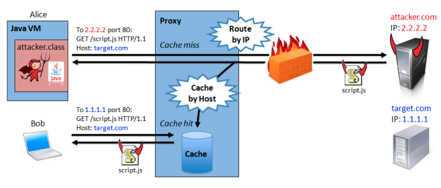

{"title":"簡単なサーバを実装しながら WebSocket のキャッチアップ","date":"2021-02-10T23:00:00+09:00","tags":["web"]}

実用ではなく学習目的で WebSocket の簡単なサーバを書きつつ、その後 RFC で仕様の背景を理解する流れがいい感じだった。

先日読んだ [ハイパフォーマンスブラウザネットワーキング](https://please-sleep.cou929.nu/high-performance-browser-networking.html) で取り上げられていたプロトコルについて深堀りしていこうと思い、一番仕様が薄そうな WebSocket をとっかかりとして選んだ。詳細の理解と、この本の刊行後にあった動きをキャッチアップすること、そして周辺の技術や仕様にも yak shaving 的に枝を広げていきたいなと言う意図。

キリが良いところまで来たので、整理のため一度まとめる。

## 進め方

WebSocket は [仕様がまとまってからもう 10 年くらい経っている](https://datatracker.ietf.org/doc/rfc6455/) ので、いきなり RFC から入るのではなく [MDN](https://developer.mozilla.org/en-US/docs/Web/API/WebSockets_API) でざっと概要と API を知るところから始めた。中でも [Writing WebSocket servers \- Web APIs \| MDN](https://developer.mozilla.org/en-US/docs/Web/API/WebSockets_API/Writing_WebSocket_servers) がすごく良くて、最低限の WebSocket サーバの動作の仕組みを簡潔に説明してくれていた。今回はほぼこのページをもとに手を動かした。

なんとなく動くものができた後に RFC を読み始めた。先に概要がつかめているので理解しやすかったのと、実装を通じてなんでこんな仕様になっているんだろうという疑問点が明確になっていたので、ポイントを絞って読めたので良かった。まず挙動を見てから、次に RFC で Why を補完する流れがかなり良かった。

## minws

手を動かしたもののリポジトリがこちら。

[cou929/minws: Small server implementation of WebSocket for learning and fun\.](https://github.com/cou929/minws)

[Writing WebSocket servers \- Web APIs \| MDN](https://developer.mozilla.org/en-US/docs/Web/API/WebSockets_API/Writing_WebSocket_servers) の内容を Go で書いてみたもの。

機能面だけでも以下は実装されておらず、実用レベルではない。(コードの保守性や CICD など運用面はなおさら何もしていない)

- `Sec-WebSocket-Version` チェック
- Fragment したメッセージの対応
- Subprotocols, Extensions 対応
- Origin ヘッダの検証
- Ping / Pong を並行して待つなどの対応
- 全体的に Timeout やエラー処理
- etc

振り返りとしては、

- 既存の実装を横目に参考にしながらやった
    - 特に [nhooyr/websocket](https://github.com/nhooyr/websocket) は参考になった
- なんとなく HTTP 部分も実装したが、かなり中途半端になってしまった
    - 本質的でなかったので普通に net/http を使えばよかった
- Go 言語側について理解が甘かった部分がわかって良かった
    - 以下に整理した
    - [net\.Conn, net/http と io, bufio の整理 \- Please Sleep](https://please-sleep.cou929.nu/golang-net-http-conn-io-bufio.html)
    - [Go の Slice の内部構造 \- Please Sleep](https://please-sleep.cou929.nu/golang-array-and-slice-note.html)
- [crossbario/autobahn\-testsuite: Autobahn WebSocket protocol testsuite](https://github.com/crossbario/autobahn-testsuite) というテストケースがあることを知った
    - [メンテが滞っている感](https://github.com/crossbario/autobahn-testsuite/issues/104) があり手はだしていないが、真面目に実装する際にこういうものがあると便利そうだと思った

## RFC 6455

次に RFC を読み始めた。

[RFC 6455 \- The WebSocket Protocol](https://tools.ietf.org/html/rfc6455)

実装していて不思議だったのが、例えば次のような点。

- なぜハンドシェイクを HTTP で行うのか
- `Sec-WebSocket-Key` `Sec-WebSocket-Accept` での検証は何のためか
- クライアントからの送信データだけマスクしているのはなぜか

RFC とそこから参照している論文を読んで納得できた。面白かったのですこし細かくまとめる。

### WebSocket の目的とセキュリティモデル

[1.1.  Background](https://tools.ietf.org/html/rfc6455#section-1.1)、[1.5.  Design Philosophy](https://tools.ietf.org/html/rfc6455#section-1.5)、[1.6.  Security Model](https://tools.ietf.org/html/rfc6455#section-1.6) あたりにはこんなことが書かれていた。

- サーバクライアント間の双方向通信は、これまでは XHR でのポーリングなど、既存の仕組みの中でなんとか実現していた
- WebSocket はこの代替を狙ったプロトコルなので、既存のインフラで動作することを特に意図している
    - 80, 443 port を使い、プロキシなどの中間装置があっても問題ないようにする必要がある
- これを実現するため、ストリーム指向の tcp の上に frame ベースな WebSocket を、必要最小限の追加分で乗せるよう設計している

安全にこれらの要求を満たすためには以下の点を満たす必要がある。

- WebSocket に対応していない既存サーバではコネクション確立が失敗すること
    - かつ、http サーバに websocket 対応をオプトインできないといけない
    - そのため handshake の仕組みと、handshake 成功後にしか WebSocket 通信ができないことの 2 点の要件が必要
- WebSocket に対応していないクライアントが別のプロトコルを使ってリクエストしても、それは失敗すること
    - 例えば html form や xhr で WebSocket っぽいデータをサーバに送っても失敗させないといけない
    - handshake 時にクライアント側も WebSocket に対応していることを確認する要件が必要
        - この RFC 発行時点では html や xhr では `Sec-*` ヘッダは送ることができない

以上より、疑問には次のように回答できたと思う。

- なぜハンドシェイクを HTTP で行うのか
    - プロキシ等を含めた既存の Web のインフラで動くことを意図しているため
- `Sec-WebSocket-Key` `Sec-WebSocket-Accept` での検証は何のためか
    - サーバとクライアントがそれぞれ WebSocket を話せることを確認してから WebSocket 通信を開始するため

### 透過プロキシの Cache Poisoning とその対策

3 つ目のマスキングの疑問については、RFC から参照されている以下の論文で理解できた。

[\[PDF\] Talking to Yourself for Fun and Profit \| Semantic Scholar](https://www.semanticscholar.org/paper/Talking-to-Yourself-for-Fun-and-Profit-Huang-Chen/2bea7e98087e04b5d153d29f44b7b82db63ca7c0)

- Cache Poisoning Attack
    - 透過プロキシのキャッシュを汚染する攻撃
    - `Host` ヘッダベースでキャッシュする透過プロキシがあるとする
    - 以下の手順でキャッシュに悪意のあるコンテンツを送り込むことができる
        - Java アプレットや Flash などで攻撃者の ip へリクエスト
            - このとき `Host` ヘッダを違うものに偽装する (`target.com` に偽装したとする)
        - 透過プロキシのキャッシュには `target.com` として攻撃者のレスポンス内容がキャッシュされる
        - 以降、そのプロキシを利用するクライアントが `target.com` にアクセスしようとすると、攻撃者が送り込んだコンテンツを読んでしまうことになる
    - 例えば Google アナリティクスのホスト名、スクリプト名で悪意のあるスクリプトをキャッシュさせると、かなり被害が大きくなりそう
- WebSocket と Cache Poisoning
    - handshake 成功後、WebSocket のデータフレーム上に HTTP を偽装したデータを流したとする
    - 透過プロキシなどの中間装置はその通信を HTTP だと勘違いし、解釈してしまう可能性がある
    - `Host` ヘッダも自由に偽装できるので、Cache Poisoning Attack が可能になってしまう
- この論文 (2011年) の実験では 1 割弱のリクエストでこの攻撃が可能だと確認されたらしい

> Huang, Lin-Shung et al. “Talking to Yourself for Fun and Profit.” (2011) Fig.2 より引用

- 対策として、透過プロキシが WebSocket のデータフレームの内容を HTTP と誤認しないようにしないといけない
- このためにクライアントからのリクエストを XOR [ストリーム暗号](https://ja.wikipedia.org/wiki/%E3%82%B9%E3%83%88%E3%83%AA%E3%83%BC%E3%83%A0%E6%9A%97%E5%8F%B7) でマスクしている
    - 処理の軽さのため XOR が利用されている (論文中にはベンチマークもある)
- Masking-key (= 共通鍵) も同じデータフレームに乗っているが、透過プロキシさえ騙せればよいので問題ない
- データフレームごとに Masking-key を推測不可能なものに変えなければいけない
    - Masking-key が推測できてしまうと、それを見越した変換をかけたデータを送って攻撃が実現できてしまうので

実際にこの脆弱性をワーキンググループに報告し、[各ブラウザは一時的に WebSocket を無効化するなどの対策がとられたらしい](https://ja.wikipedia.org/wiki/WebSocket#%E6%AD%B4%E5%8F%B2%E7%9A%84%E7%B5%8C%E7%B7%AF)。

感想としては、興味深いけど大変だなという印象が強い。この論文で出てきただけでも、クライアント側処理系のバリエーション (js, flash, java applet) と通信経路上の中間装置のバリエーション (プロキシなど) が多様で、このパターン数が多い環境ですべてを考慮してセキュアな仕様と実装をしていくのは相当な労力が必要になる。ブラウザベンダが flash を廃止したり、http/2 が tls 必須になっていく流れのモチベーションが理解できた気がした。

## 今後

このまま実装を洗練させるのではなく、他のプロトコルに広げていきたい。

- WebSocket over HTTP/2 から Web Transport という流れがあるそうなので、そこをキャッチアップしていく
    - [RFC 8441 \- Bootstrapping WebSockets with HTTP/2](https://tools.ietf.org/html/rfc8441)
    - [Experimenting with WebTransport](https://web.dev/webtransport/)
- Go で並行処理を書くエクササイズとして、タイムアウトの導入や ping/pong をちゃんと実装するというのも無くはないかも

## 参考

- [Writing WebSocket servers \- Web APIs \| MDN](https://developer.mozilla.org/en-US/docs/Web/API/WebSockets_API/Writing_WebSocket_servers)
- [RFC 6455 \- The WebSocket Protocol](https://tools.ietf.org/html/rfc6455)
- [\[PDF\] Talking to Yourself for Fun and Profit \| Semantic Scholar](https://www.semanticscholar.org/paper/Talking-to-Yourself-for-Fun-and-Profit-Huang-Chen/2bea7e98087e04b5d153d29f44b7b82db63ca7c0)
- [nhooyr/websocket: Minimal and idiomatic WebSocket library for Go](https://github.com/nhooyr/websocket)

<a href="http://www.amazon.co.jp/exec/obidos/ASIN/4873116767/pleasesleep-22/ref=nosim/" name="amazletlink" target="_blank">ハイパフォーマンス ブラウザネットワーキング ―ネットワークアプリケーションのためのパフォーマンス最適化</a>

Ilya Grigorik (著), 和田 祐一郎  (翻訳), 株式会社プログラミングシステム社 (翻訳) 

<a href="http://www.amazon.co.jp/exec/obidos/ASIN/4873116767/pleasesleep-22/ref=nosim/" name="amazletlink" target="_blank">Amazon.co.jpで詳細を見る</a>

