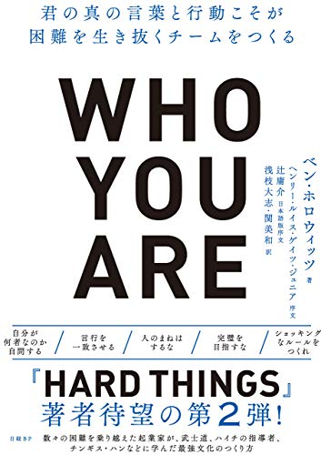

{"title":"Who You Are - 君の真の言葉と行動こそが困難を生き抜くチームをつくる","date":"2020-04-26T16:40:00+09:00","tags":["book"]}

[What You Do Is Who You Are \- Andreessen Horowitz](https://a16z.com/book/whatyoudo/)

a16z のベン・ホロウィッツによる組織文化についての本。

前著の HARD THINGS から、著者はかなり実践の人だなと言う印象だった。ちゃんと自分で考えて、自分で一番やる人。なので信頼ができる。今回はその彼の哲学がより客観的に明文化されていた。

実践タイプの人の本は経験則に偏りがちで、一般化・相対化が弱いことがあるが、本書はそんなことはない。歴史上の事実を集めてそこから論を展開しているのは、素直に興味深かった。

この本で一番大事なことは原題で端的に言い表されていると思う。

> What You Do Is Who You Are

つまり、自分は何を大事にしているか、そしてその通りに行動しているか。読みながら過去を省みて、できていなくて落ち込んでしまう。自分の今いる会社もだし、何より自分ができていない。

それはなぜか。

- 自分は何を大事にしているか（who you are）をしっかりと定義したことがなかった
	- なんとなく自分の中にあるものを、よりシャープにするためのプラクティスが解説されている
	- 個人的には武士道からひいたという、信条ではなく行動規範で定めるという発想の転換が新鮮だった
	- `Who you are` とあるように、自分で考えて自分の身になっていないと意味がない。ここが一番難しいと思う
- その通りに行動する（what you do）をこんなに重く考えたことがなかった
	- こちらもプラクティスが紹介されていたが、何より本書読みながら考えを巡らせられたのが良かったと思う
	- HARD THINGS から続く著者の熱量高め・真剣なムードによって、言行一致の難しさを多少なりとも感じられたと思う

[クレイトン・クリステンセンの本](https://amzn.to/2S9orwN) でも一部近い話があったが、論のアプローチもムードも全然違う。この本を読んでいると、ベン・ホロウィッツに、彼のあのムードで説かれながら、自分の過去を振り返ることになる。その体験の価値が高い気がする。（なので論点のまとめ記事を読むのではなく、通読するのが個人的にはおすすめ）

邦訳に関しては、邦題から `What You Do Is` が省かれているのが不満。それ以外は、訳も非常に読みやすく、満足です。

<a href="http://www.amazon.co.jp/exec/obidos/ASIN/B086KX8LHZ/pleasesleep-22/ref=nosim/" name="amazletlink" target="_blank">Who You Are（フーユーアー）君の真の言葉と行動こそが困難を生き抜くチームをつくる</a>

ベン・ホロウィッツ (著), 浅枝 大志 (翻訳), 関 美和 (翻訳)  形式: Kindle版 

<a href="http://www.amazon.co.jp/exec/obidos/ASIN/B086KX8LHZ/pleasesleep-22/ref=nosim/" name="amazletlink" target="_blank">Amazon.co.jpで詳細を見る</a>

